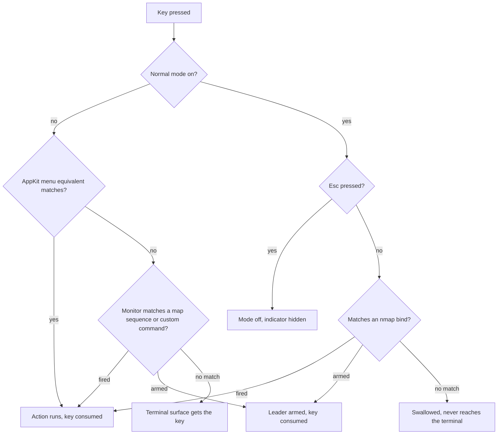

# Leader sequences for built-in actions, and a chrome normal mode

## Contents

1. [Context](#context)
2. [What ships](#what-ships)
3. [The grammar](#the-grammar)
4. [How a key is routed](#how-a-key-is-routed)
5. [Data model](#data-model)
6. [Piece one — sequences for built-in actions](#piece-one--sequences-for-built-in-actions)
7. [Piece two — normal mode and nmap](#piece-two--normal-mode-and-nmap)
8. [Rules and edge cases](#rules-and-edge-cases)
9. [Cross-surface work](#cross-surface-work)
10. [Testing](#testing)
11. [Out of scope](#out-of-scope)

## Context

agterm has no vim-style keys. A user who wants tmux-like or vim-like navigation cannot express it,
for one specific reason: built-in actions dispatch as AppKit menu key equivalents, so each takes
exactly one chord. `parseMapLine` rejects a leader sequence outright. Custom shell commands already
support leaders through `KeybindMatcher` and the `CustomCommandRunner` monitor, so the machinery
exists — it just is not reachable from `map`.

The goal is a keymap a vim user can write. That needs two things: sequences on built-in actions, and
a mode in which bare keys are safe to bind. Bare keys cannot be bound globally, because the monitor
has to consume a key to arm a leader and the terminal would lose it — `hello world` would lose its
space. A mode is what makes bare keys, and therefore a bare `space` leader, possible.

Both parts must be opt-in and small. agterm is umputun's project; this work is developed on the
`p4elkin/agterm` fork with the intent of offering piece one upstream on its own. With an untouched
`keymap.conf` the key path must behave exactly as it does today.

## What ships

Two pieces, committed separately, in this order.

- **Piece one — sequences for built-in actions.** `map` accepts a leader sequence. Self-contained,
  fully opt-in, and the candidate for an upstream pull request.
- **Piece two — normal mode and `nmap`.** A mode in which keys stop reaching the terminal, bare-key
  binds become legal, and `space` works as a leader. Stays on the fork unless piece one is welcomed.

## The grammar

Two verbs. `map` is the existing one, widened; `nmap` is new and mirrors vim's naming.

```
# global, works everywhere. first chord must carry a modifier.
map ctrl+space>s   toggle_split
map cmd+shift+e    rename_session

# normal mode only. bare keys allowed, because nothing reaches the terminal there.
map ctrl+space     normal_mode
nmap h             focus_left_pane
nmap j             next_session
nmap space>s       toggle_split
nmap space>n       new_session
```

`normal_mode` is a new `BuiltinAction` whose `defaultChord` is `nil`, so it ships unbound and the
mode is unreachable until the user binds it.

## How a key is routed



The swallow-everything branch is not new. `DashboardView`'s AppKit key catcher already owns first
responder, handles arrows / Enter / Esc, swallows everything else, and still lets ⌘Q through because
`performKeyEquivalent` runs before `keyDown`. Normal mode copies that design.

## Data model

All host-free, in `agtermCore`.

- `Keymap.builtinOverrides: [BuiltinAction: Chord]` — **unchanged**, still single-chord, still what
  the menu reads.
- `Keymap.builtinSequences: [BuiltinAction: Keybind]` — new, holds bindings of two or more chords.
- `Keymap.normalModeBinds: [(Keybind, BuiltinAction)]` — new, the `nmap` table (piece two).
- `Keymap.equivalent(for:)` returns `nil` when the action has a sequence. That one line is what
  clears the menu key equivalent, and every existing caller inherits it.
- `Keymap.binding(for:) -> Keybind?` — new, the full binding: the sequence when present, else the
  single chord wrapped in a one-element array.
- `Keybind.glyphString` — new, the chord glyphs joined by a space (`⌃␣ S`).
- `Keymap.glyphHint(for:)` switches to `binding(for:)?.glyphString`, so the action palette and the
  ten toolbar/sidebar tooltips show the sequence. The macOS menu bar cannot show one; `NSMenuItem`
  holds a single key-equivalent character plus a modifier mask, and that is an AppKit limit with no
  workaround.
- `KeybindTarget` — new enum, `.command(UUID)` / `.builtin(BuiltinAction)`. `KeybindMatcher` and
  `MatchResult.fired` carry this instead of a bare `UUID`, which is what lets one matcher hold both
  kinds of bind and detect prefix conflicts across them.

## Piece one — sequences for built-in actions

**Parser.** `parseMapLine` stops rejecting `keybind.count > 1`. A sequence takes a different set of
checks from a single chord:

- the first chord must carry a modifier, the same rule `parseCommandLine` already applies, and for
  the same reason — a bare first key would be swallowed in the terminal;
- no chord anywhere in the sequence may be a reserved monitor chord (`isReservedMonitorChord`),
  matching the existing custom-command rule;
- a bare arrow is **allowed** in any position after the first. The rule that bans bare arrows exists
  because an always-on menu equivalent swallows them, and a sequence installs no menu equivalent.

**Resolution.** Sequences do not join the menu-chord collision fixpoint in
`resolveBuiltinOverrides`, because they own no chord. They need their own checks:

- a sequence whose first chord equals an active built-in menu chord is rejected — the menu would
  consume the key and the monitor would never see it;
- sequences are prefix-checked against each other and against custom-command keybinds, reusing the
  `isPrefix` logic behind `keybindConflicts`;
- mapping the same action twice stays last-wins, and a later single-chord `map` replaces an earlier
  sequence and vice versa.

**Dispatch.** `CustomCommandRunner.rebuild()` feeds the matcher both custom commands and built-in
sequences. On `.fired(.builtin(action))` it calls a new `AppActions.perform(_:)`, which reuses the
existing central dispatcher rather than adding a second one: `PaletteCommand.builtinAction` already
maps most cases, so `perform` inverts that to reach `runPaletteCommand`, and calls the window
methods directly for the few actions the palette handles separately (`new_window`, `rename_window`,
`delete_window`). Going through `runPaletteCommand` also inherits its `uiActionsEnabled` gate for
free, so a sequence cannot fire an action the menu would have had disabled.

**Files.** `Keymap.swift`, `Keybind.swift`, `KeybindMatcher.swift`, `CustomCommandEngine.swift`,
`ControlKeymap.swift` in `agtermCore`; `CustomCommandRunner.swift` and a new `AppActions.perform(_:)`
in the app target.

## Piece two — normal mode and nmap

**New action.** `BuiltinAction.normalMode`, raw value `normal_mode`, `defaultChord` nil.

**Parser.** A third verb case, `nmap`, taking `<key|sequence> <action>`. No modifier requirement —
that is the whole point. Reserved monitor chords stay rejected. Binds go to `normalModeBinds` and
are prefix-checked among themselves only, since the mode has its own namespace and cannot collide
with global binds.

**Mode state.** Host-free `NormalModeState` in `agtermCore` holding on/off plus the matcher over
`normalModeBinds`, so entering, matching, Esc and the armed-leader timeout are all unit-testable
without AppKit.

**Key catcher.** An AppKit view modelled on `DashboardView`'s, installed while the mode is on. It
takes first responder, routes every `keyDown` to the mode state, and swallows anything unmatched.
Esc exits. Menu key equivalents still reach the menu bar through `performKeyEquivalent`, so ⌘Q is
never trapped.

**Indicator.** ⚠️ Required, not polish. Without it the mode silently eats keystrokes the user
believes went to the shell. A pill in the custom titlebar (`WindowContentView+Titlebar.swift`),
showing the mode is on and the armed leader when one is pending.

## Rules and edge cases

- A sequence replaces the action's default chord. `map ctrl+space>s toggle_split` means ⌘D no longer
  toggles the split, the View menu item shows no shortcut, and the palette shows `⌃␣ S`.
- Built-in sequence hints render as joined glyphs because these are built-in rows and built-ins read
  as glyphs everywhere else. Custom-command hints keep raw kitty syntax, so the palette will show two
  spellings of a sequence. That is deliberate.
- The leader timeout stays 1.5 seconds and stays owned by `CustomCommandRunner`, shared by both kinds
  of bind. Normal mode's own armed leader uses the same timeout.
- Esc keeps its existing meaning of abandoning a half-typed leader, and gains the meaning of leaving
  normal mode. It stays unbindable.
- `map` and `nmap` are independent namespaces. The same action may appear in both.
- Every existing diagnostic message stays; new failure modes add their own, each naming the line.

## Cross-surface work

Piece one adds no user-visible state, only a wider grammar, so it owes:

- `keymap list` read-back — `ControlKeymapAction.chord` is already a string, so `ctrl+space>s` needs
  no schema change. A sequence-bound action reports its sequence in `actions` and is absent from
  `menu`, which is exactly the disagreement that listing exists to expose.
- `keymap.conf` starter-file comment, README, `site/docs.html`, and
  `plugins/agterm/skills/agterm/`.

Piece two adds real state and owes the full contract from `.claude/rules/control-api.md`: a protocol
command to enter and leave the mode, dispatcher entry, `agtermctl` subcommand, read-back on the tree,
protocol and end-to-end tests, plus the same doc set. The palette and tooltip hint text is recorded
as keep-in-sync exempt in `.claude/rules/menu-actions.md`, so it needs no doc update.

⚠️ On the fork, skip the README and `site/` edits. They churn hardest upstream — 174 and 83 commits
in three months against 6 to 20 for the code files — and touching them makes every rebase a conflict.
Add them only when piece one is prepared as an upstream pull request.

## Testing

Host-free first, since almost all of the logic is host-free.

- `KeymapTests` — sequence parsing, the modifier-on-first-chord rule, bare arrows allowed after the
  first position, reserved chords rejected anywhere, first-chord-equals-menu-chord rejected, prefix
  conflicts against custom commands and other sequences, last-wins across the two `map` forms.
- `KeybindTests` — `Keybind.glyphString`, and `KeybindMatcher` over a mixed `KeybindTarget` set.
- `BuiltinActionTests` — pin the new `normal_mode` case and its nil default; the existing test pins
  the case list, so it must be updated deliberately.
- `ControlKeymapTests` — a sequence-bound action projects its sequence into `actions` and drops out
  of `menu`.
- New `NormalModeStateTests` — enter, match, arm, timeout, Esc, swallow-unmatched.
- Hosted `KeymapUITests` — one test that a `map` sequence fires, and one that the menu item lost its
  shortcut. Run scoped with `-only-testing:`, never the whole suite.

⚠️ Opt-in regression check, and it is the one that matters most for upstream: with an untouched
`keymap.conf`, `agtermctl keymap list` must report exactly the same `actions` and `menu` chords as
before the change.

⚠️ The gates cannot run yet. This checkout has never built the app — `zig` and `xcodegen` are both
absent and `GhosttyKit.xcframework` does not exist, so `scripts/setup.sh` has to run first and it
builds ghostty from source. `cd agtermCore && swift test` works today and covers most of this plan;
`make lint`, `make test-app` and any hosted test do not.

## Out of scope

- In-grid copy mode. Ruled out separately: the pinned libghostty exposes no way to set a selection,
  no scrollback cursor, and no viewport offset.
- A `keymap.conf` include or import directive. The vim preset ships as a `cookbook/` file the user
  copies.
- Any change to `BuiltinAction.defaultChord`. No shipped chord moves.
