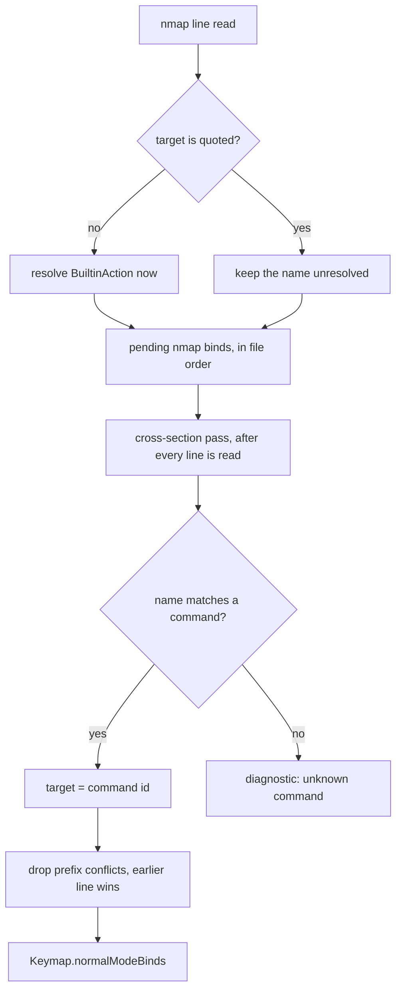

# nmap custom commands

## Contents

1. [Overview](#overview)
2. [Context (from discovery)](#context-from-discovery)
3. [Development Approach](#development-approach)
4. [Testing Strategy](#testing-strategy)
5. [Progress Tracking](#progress-tracking)
6. [Solution Overview](#solution-overview)
7. [Technical Details](#technical-details)
8. [What Goes Where](#what-goes-where)
9. [Implementation Steps](#implementation-steps)
10. [Post-Completion](#post-completion)

## Overview

Normal mode can only fire built-in actions today. `nmap j next_session` works; there is no way to bind
a custom shell command to a bare key. That is where most of a real keymap lives — the user's own file
has 19 `command` lines against 25 `map` lines, so the mode reaches a minority of what they use.

This plan lets an `nmap` line name a custom command:

```
nmap e "Annotate last response"    # quoted -> custom command
nmap j next_session                # bare token -> built-in action
```

The seam for it already exists and is deliberately unfinished. `KeybindMatcher` is generic over
`KeybindTarget` (`.command(UUID)` / `.builtin(BuiltinAction)`), and `NormalModeState.advance` already
has a `.fired(.command)` branch that returns `.swallowed`. This work makes that branch real and widens
the parser and the model to feed it.

Backward compatible. A keymap with no quoted `nmap` target parses and behaves exactly as it does now.

## Context (from discovery)

Files and the exact places inside them:

- `agtermCore/Sources/agtermCore/Keymap.swift` — `NormalModeBind` (line 49), `parseNormalModeLine`
  (line 520), `resolveNormalModeBinds` (line 559, conflict message reads `action.rawValue` at 566),
  and the parse entry that calls them around line 163.
- `agtermCore/Sources/agtermCore/NormalModeState.swift` — `Outcome` (line 11), `init` wrapping every
  bind as `.builtin` (line 25), and the dead `.fired(.command)` branch (lines 61-62).
- `agtermCore/Sources/agtermCore/KeybindTarget.swift` — the two-case enum, already correct, unchanged.
- `agtermCore/Sources/agtermCore/ControlKeymap.swift` — `ControlKeymapNormalBind` (line 44) and the
  mapping that builds it (line 148).
- `agtermCore/Sources/agtermctlKit/SocketClient.swift` — the human `normal mode:` section (line 250).
- `agterm/Commands/CustomCommandRunner.swift` — `handleKeyDown` (line 122), the repeat guard (line
  156), the global fire paths (lines 169-191), and `handleNormalModeKey` (line 204).

Patterns this follows rather than invents:

- Custom commands are declared with a quoted name (`command "<name>" <chord> <shell...>`), so quoting
  is already the marker for "this is a command name" in the file format.
- Cross-section validation runs after all lines are parsed. `resolveBuiltinOverrides` is deliberately
  order-independent for the same reason this resolution must be.
- The global monitor already distinguishes `.fired(command)` from `.firedBuiltin(action)` in
  `CustomCommandEngine`; normal mode gains the matching pair.

## Development Approach

- **parallel waves**: none — tasks 1 and 2 are a type change and the parser that depends on it, and
  tasks 3 and 4 both consume the widened `NormalModeBind`. The deletion test fails for every pair.
  Tasks 3 and 4 do touch disjoint files and could in principle run together, but there are only two of
  them, task 4 is the one with real behavioral risk, and a merge conflict here costs more than the
  parallelism buys.
- **testing approach**: TDD — write the failing test first, then the code that satisfies it.
- complete each task fully before moving to the next
- make small, focused changes
- **CRITICAL: every task MUST include new/updated tests** for code changes in that task
- **CRITICAL: all tests must pass before starting next task**
- **CRITICAL: update this plan file when scope changes during implementation**
- run the narrow per-task command after each change; the full gates run once in the verify task
- maintain backward compatibility: an untouched keymap must parse and report byte-identically

## Testing Strategy

- **unit tests** (`agtermCore/Tests/agtermCoreTests/`, swift-testing): the parser, the state machine,
  and the control read-back. These carry the bulk of the coverage because they are host-free.
- **hosted tests** (`agtermTests/`, XCTest): the monitor wiring in `CustomCommandRunner` — which
  outcome consumes the key, and the repeat behavior. `make test-app`.
- **XCUITest works.** The old `Timed out while enabling automation mode` was an Authorization Services
  prompt ("XCTest is trying to Enable UI Automation") going unanswered in a non-interactive run — not a
  broken toolchain, and nothing to do with code signing or TCC. `sudo DevToolsSecurity -enable` grants
  the right permanently for the `_developer` group. `ControlNormalModeUITests/testModeRejectsUnknownToken`
  was verified passing on 2026-08-09.
  ⚠️ If developer mode has not been enabled yet, a UI test still blocks on a password dialog. Check
  `DevToolsSecurity -status` before running one unattended; a block there is a permission state, never a
  code defect.
- **mutation check on the repeat guard.** The held-key test must fail when the guard line is removed.
  Verify that by hand once, in task 4, and say so in the task's report.

## Progress Tracking

- mark completed items with `[x]` immediately when done
- add newly discovered tasks with ➕ prefix
- document issues/blockers with ⚠️ prefix
- update the plan if implementation deviates from the original scope
- keep the plan in sync with the actual work done

## Solution Overview

`NormalModeBind` stops holding a `BuiltinAction` and holds a `KeybindTarget` instead, the same type the
matcher already carries. Everything else follows from that one change.

Resolution is the part worth getting right. A command name can only become a `UUID` once every
`command` line in the file has been read, so `parseNormalModeLine` cannot resolve it inline the way it
resolves a built-in action name. It records the name unresolved, and the existing cross-section pass
turns it into a target or a diagnostic.



Two properties this shape buys:

- An `nmap` line may sit anywhere in the file, above or below the `command` it names.
- A typo or a renamed command is a loud parse diagnostic, on the `nmap` line's own line number, not a
  key that silently does nothing.

## Technical Details

**The model.** `NormalModeBind.action: BuiltinAction` becomes `NormalModeBind.target: KeybindTarget`.
`NormalModeState.init` stops wrapping in `.builtin` and passes the target through.

**The outcome.** `NormalModeState.Outcome` gains `case firedCommand(UUID)`, matching how
`CustomCommandEngine` already spells the pair (`.fired(command)` / `.firedBuiltin(action)`). The dead
`.fired(.command)` branch returns it instead of `.swallowed`.

**The grammar.** In `parseNormalModeLine`, the remainder after the chord is a command name when it
starts with `"` and has a closing `"`; otherwise it is a built-in action name as today. An unterminated
quote is a diagnostic, not a fallthrough to action parsing.

**The read-back.** `ControlKeymapNormalBind.action` becomes optional and a sibling `command: String?`
is added; exactly one is non-nil. `Codable` omits nil, so a built-in bind's JSON is unchanged and
`untouchedKeymapProjectsExactlyTheShippedDefaultForEveryAction` stays green.

**The monitor.** `handleNormalModeKey` needs the focused surface to build command context, so it takes
`focusedSurface: GhosttySurfaceView?` as `handleKeyDown` already computed it, and reuses
`runFromKeybind` / `runNoSurface` exactly as the global path does.

⚠️ **The repeat seam.** `handleNormalModeKey` is called at line 151, before the `guard !event.isARepeat`
at line 156 — the mode takes repeats on purpose, so holding `k` skims sessions. A command target must
not inherit that: holding `e` would spawn one annotate process per OS repeat. The guard goes inside the
`.firedCommand` case only, and it still CONSUMES the key. Built-in targets keep honoring repeats.

## What Goes Where

- **Implementation Steps** (`[ ]` checkboxes): the parser, model, state machine, control read-back,
  monitor wiring, tests, and the doc surfaces this repo owns.
- **Post-Completion** (no checkboxes): the user's own keymap rebinding, and manual verification that
  needs a running app.

## Implementation Steps

### Task 1: Widen the normal-mode bind and state machine to hold any keybind target

**Files:**
- Modify: `agtermCore/Sources/agtermCore/Keymap.swift` (`NormalModeBind`, the struct at line 49 — swap
  the `action: BuiltinAction` property for `target: KeybindTarget`, and update its doc comment which
  currently says "firing a built-in")
- Modify: `agtermCore/Sources/agtermCore/Keymap.swift` (`resolveNormalModeBinds` — its conflict
  diagnostic at line 566 reads `clash.action.rawValue` and needs a target description instead)
- Modify: `agtermCore/Sources/agtermCore/NormalModeState.swift` (`Outcome` at line 11, `init` at line
  25, and the `.fired(.command)` branch at lines 61-62)
- Modify: `agtermCore/Tests/agtermCoreTests/NormalModeStateTests.swift`

- [ ] add `case firedCommand(UUID)` to `NormalModeState.Outcome`
- [ ] change `NormalModeBind.action` to `target: KeybindTarget` and stop wrapping in
      `NormalModeState.init`
- [ ] return `.firedCommand(id)` from the branch that currently returns `.swallowed`
- [ ] give `resolveNormalModeBinds` a target description for its conflict message, so a clash names the
      command as readably as it names an action
- [ ] update every existing construction site of `NormalModeBind` in tests and sources to the new
      property
- [ ] write a test: a bind whose target is `.command(id)` fires `.firedCommand(id)`
- [ ] write a test: a sequence ending in a command target arms then fires, and the exit key still leaves
      the mode ahead of it
- [ ] write a test: a prefix conflict between a command bind and a built-in bind keeps the earlier line
      and names the later one's target in the diagnostic
- [ ] run `cd agtermCore && swift test --filter NormalModeStateTests` - must pass before task 2

### Task 2: Parse a quoted command name on an nmap line and resolve it after the file is read

**Files:**
- Modify: `agtermCore/Sources/agtermCore/Keymap.swift` (`parseNormalModeLine` at line 520 — the
  `BuiltinAction(rawValue:)` guard at line 545 is the branch that splits)
- Modify: `agtermCore/Sources/agtermCore/Keymap.swift` (`ParsedNormalBind`, the private struct near line
  189 — it must carry an unresolved command name as well as a finished bind)
- Modify: `agtermCore/Sources/agtermCore/Keymap.swift` (the parse entry near line 163 where
  `resolveNormalModeBinds` is called, so resolution happens after `commands` is complete)
- Modify: `agtermCore/Sources/agtermCore/Keymap.swift` (the `nmap` grammar doc comment at line 116)
- Modify: `agtermCore/Tests/agtermCoreTests/KeymapTests.swift`

- [ ] detect a quoted target in `parseNormalModeLine` and record the name unresolved; keep bare tokens
      on the existing `BuiltinAction` path
- [ ] diagnose an unterminated quote on its own line rather than falling through to action parsing
- [ ] resolve recorded names against the parsed `commands` in the cross-section pass, emitting
      `unknown command '<name>'` on the `nmap` line when no command matches
- [ ] confirm the chord rules still apply to command binds: reserved monitor chords rejected anywhere,
      the exit key rejected as a leading chord
- [ ] write a test: `nmap e "Some command"` resolves when the `command` line is ABOVE it
- [ ] write a test: the same resolves when the `command` line is BELOW it — the order-independence this
      design exists for
- [ ] write a test: an `nmap` naming no existing command yields a diagnostic on the right line and drops
      only that bind
- [ ] write a test: an unterminated quote yields a diagnostic and is not read as an action name
- [ ] write a test: a keymap with no quoted nmap target parses identically to before
- [ ] run `cd agtermCore && swift test --filter KeymapTests` - must pass before task 3

### Task 3: Report command binds through keymap list

**Files:**
- Modify: `agtermCore/Sources/agtermCore/ControlKeymap.swift` (`ControlKeymapNormalBind` at line 44 —
  make `action` optional and add `command`)
- Modify: `agtermCore/Sources/agtermCore/ControlKeymap.swift` (the `keymap.normalModeBinds.map` at line
  148 that reads `$0.action.rawValue`)
- Modify: `agtermCore/Sources/agtermctlKit/SocketClient.swift` (the `normal mode:` section at line 250)
- Modify: `agtermCore/Tests/agtermCoreTests/ControlKeymapTests.swift`

- [ ] make `ControlKeymapNormalBind.action` optional and add `command: String?`, with a doc comment
      saying exactly one is set
- [ ] map a `.command` target to the command's name and a `.builtin` target to the action name
- [ ] render a command bind in the human `normal mode:` section so it is distinguishable from an action
      bind at a glance
- [ ] write a test: a command bind reports its name under `command` and omits `action`
- [ ] write a test: a built-in bind's JSON is unchanged, and
      `untouchedKeymapProjectsExactlyTheShippedDefaultForEveryAction` still passes
- [ ] run `cd agtermCore && swift test --filter ControlKeymapTests` - must pass before task 4

### Task 4: Fire the custom command from the normal-mode monitor

**Files:**
- Modify: `agterm/Commands/CustomCommandRunner.swift` (`handleNormalModeKey` at line 204 — add the
  `.firedCommand` case and take the focused surface as a parameter)
- Modify: `agterm/Commands/CustomCommandRunner.swift` (the call site at line 151, which already has
  `focusedSurface` in scope from line 133)
- Modify: `agtermTests/` (the existing `CustomCommandRunner` / normal-mode hosted test class)

- [ ] pass `focusedSurface` into `handleNormalModeKey` and reuse `runFromKeybind` / `runNoSurface`
      exactly as the global `.fired` path at lines 170-178 does
- [ ] look the command up by the id the outcome carries, from the same settings keymap the monitor
      rebuilds from
- [ ] ⚠️ skip the spawn when `event.isARepeat` in the `.firedCommand` case ONLY, and still return true so
      the key stays consumed; built-in targets keep taking repeats
- [ ] confirm the existing exits are untouched: a Command chord and a reserved monitor chord still pass
      through, a focused `NSText` still ends the mode
- [ ] write a hosted test: a bare key bound to a command spawns it once and consumes the key
- [ ] write a hosted test: holding that key spawns exactly one process, while a held built-in bind still
      fires per repeat
- [ ] verify by hand that the held-key test FAILS with the repeat guard removed, and report that
- [ ] run `make test-app` filtered to the touched class with `-only-testing:` - must pass before task 5

### Task 5: Verify acceptance criteria

- [ ] verify a quoted `nmap` target fires the command, in either file order, per the Overview
- [ ] verify an unknown command name surfaces in Settings > Key Mapping and in `keymap list`
      diagnostics
- [ ] verify a keymap with no quoted nmap target is unchanged end to end
- [ ] run `cd agtermCore && swift test`
- [ ] run `make test-app`
- [ ] run `make lint` — zero findings required
- [ ] run `agtermUITests/ControlNormalModeUITests` to confirm the mode still behaves end to end
      ⚠️ only after `DevToolsSecurity -status` reports developer mode enabled; otherwise it blocks on a
      password dialog that looks like a failure and is not one

### Task 6: [Final] Update documentation

**Files:**
- Modify: `.claude/rules/keymap.md` (the normal-mode bullets — the one starting "Normal mode (`nmap`) is
  a FILTER", and the key-repeat bullet, which now has an exception)
- Modify: `FORK-NOTES.md` (section "2. A modal normal mode")
- Modify: `cookbook/vim-keys/` (the preset, to show a command bind)
- Modify: `plugins/agterm/skills/agterm/` (the keymap grammar the installed Claude/Codex copies read)

- [ ] document the quoted-name grammar and that resolution is order-independent
- [ ] document the repeat exception: the mode takes repeats, a command target does not
- [ ] document `unknown command '<name>'` as a parse diagnostic
- [ ] update the `keymap list` read-back fields in the control docs
- [ ] move this plan to `docs/plans/completed/`

## Post-Completion

*Items requiring manual intervention or external systems — no checkboxes, informational only*

**Manual verification** (needs a running app, done by the user or in an isolated Debug instance):

- bind `nmap e "Annotate last response"` and confirm it fires with the mode on
- hold `e` and confirm one annotate overlay, not a stack of them
- confirm `⌘⌃E` still works from inside the mode, since Command chords pass through

**The user's own rebinding pass** (config only, no code):

- `~/.config/agterm/keymap.conf` currently has bare `t` on `quick_terminal` and bare `s` on
  `toggle_scratch`, which collide with the natural bare keys for the "FZF Files" and "Edit keymap"
  commands. Those two need different bare keys once command binds are available.
- The remaining 17 custom commands are candidates for bare keys; which ones get them is the user's call.

**Upstream** (not part of this plan):

- This widens the normal-mode half of the fork, which was already the larger of the two features. If the
  leader-sequence half is ever split onto its own branch for an upstream PR, this work stays behind with
  the mode.
