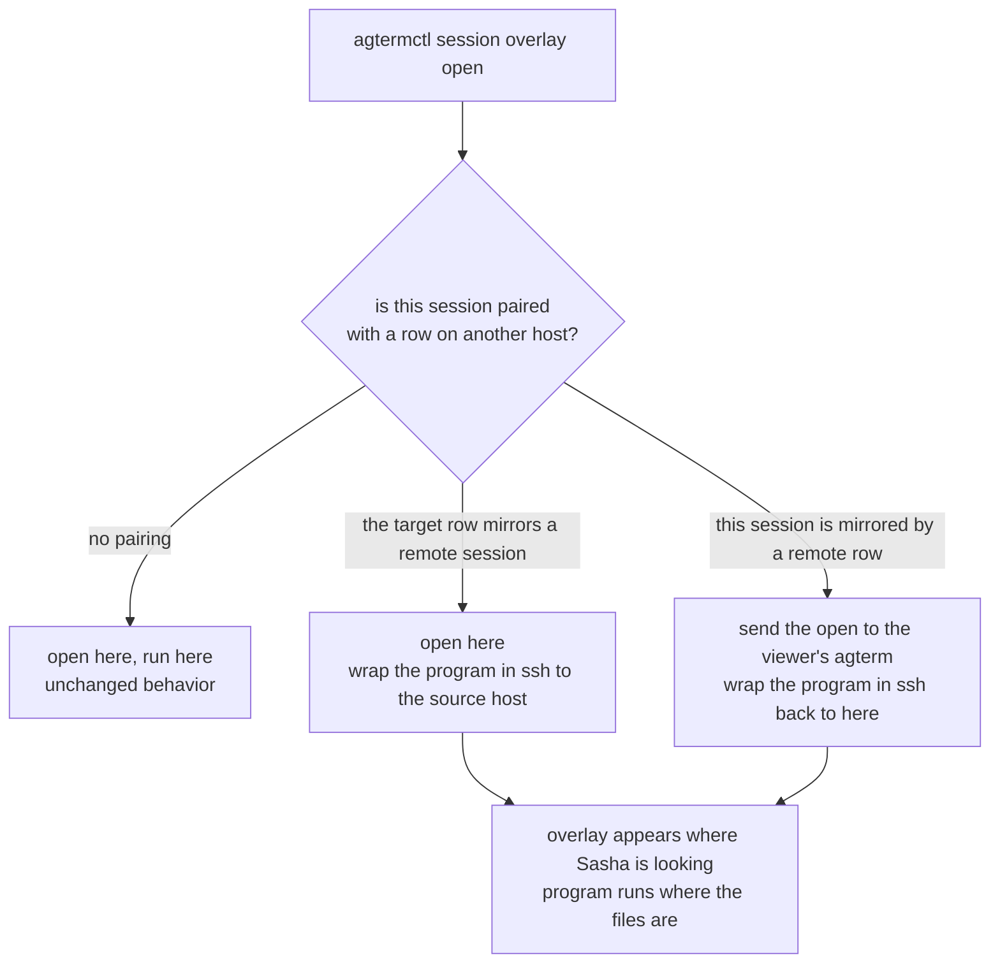

# Design: what working from the laptop should feel like

## Contents

1. [What this is for](#what-this-is-for)
2. [The setup as it stands](#the-setup-as-it-stands)
3. [Sitting down at the laptop, end to end](#sitting-down-at-the-laptop-end-to-end)
4. [There are two overlay cases, not one](#there-are-two-overlay-cases-not-one)
5. [Case one: a chord pressed at the laptop](#case-one-a-chord-pressed-at-the-laptop)
6. [Case two: a command from inside the session](#case-two-a-command-from-inside-the-session)
7. [The pairing both cases need already exists](#the-pairing-both-cases-need-already-exists)
8. [The design: one redirect rule at one choke point](#the-design-one-redirect-rule-at-one-choke-point)
9. [The two cases under this design](#the-two-cases-under-this-design)
10. [What the wrapping changes for the laptop](#what-the-wrapping-changes-for-the-laptop)
11. [What this does not fix](#what-this-does-not-fix)
12. [Order of work](#order-of-work)
13. [Decisions to make before building](#decisions-to-make-before-building)
14. [Pointers](#pointers)

## What this is for

Sasha sometimes leaves the workstation and picks up the same work from the laptop.
The agent session keeps running on the workstation.
The laptop shows it through a mirrored agterm row, attached over mosh and zmx.

The text of the session already travels well.
The goal of this document is the rest of the experience: the overlays.
An overlay is where revdiff, lazygit, vifm, the fzf pickers, the session pickers and the cheat sheet all live.
If those keep appearing on the workstation while Sasha sits at the laptop, the laptop is a read-only window rather than a place to work.

This document describes the wanted experience and the mechanism to reach it.
It does not contain a task breakdown.

## The setup as it stands

Every fact in this section was read from the code and the config, not assumed.
None of it was run end to end from the laptop, so treat it as verified design rather than observed behavior.

- A mirrored row on the laptop is an ordinary local agterm row.
  Its pinned restore command is a mosh call that ends in `zmx attach <workstation key>`.
  `agterm-zmx-mirror` creates it and pins that command with `session restore`.
- The row carries a `☁` name prefix, because agterm has no nested workspaces.
- Every overlay Sasha uses is opened by `agtermctl session overlay open`, from a keymap custom command.
  There are sixteen such lines in `~/.config/agterm/keymap.conf`.
  Only two overlays in the whole app are opened internally instead, both for editing a config file
  (`AppActions.swift:351` and `:378`).
- A keymap command receives `{AGT_SOCKET}`, `{AGT_SESSION_ID}` and `{AGT_PANE}` from the surface the chord fired on.
  So a chord pressed on the laptop resolves to the laptop's own socket and the laptop's own row.

That last point is the one that changes the picture.

## Sitting down at the laptop, end to end

This is the flow as it works today, with the numbers read from the config and the job definitions.
The short version: connecting is already close to zero effort for the sessions Sasha chose in advance,
and one chord for anything else.

1. **Open the lid.** The laptop's mirror job is a launch agent with `KeepAlive`, so it is already running.
   It reconciles every 20 seconds.
2. **The chosen workspaces are already there.** The job reads
   `~/.config/agterm-zmx-mirror.conf` for a list of workstation workspaces.
   For each remote session in them it makes a real agterm row, attached over mosh, and pins the attach
   command so the row rebuilds itself. Mirrored workspaces carry the `☁` prefix, because agterm has no
   workspace nesting and a mirrored `lae` would otherwise be indistinguishable from a local one.
3. **Nothing is attached by hand.** The row is live when Sasha looks at it. This is the whole point of the
   job: the alternative is running the mosh and zmx incantation, which needs the far side's socket
   directory passed in explicitly or zmx silently creates a new empty session instead of attaching.
4. **A session that is not in the mirrored set** is one chord: `cmd+ctrl+shift+p` runs
   `agterm-zmx pick --host`, which lists the workstation's zmx sessions and binds the current row to the
   chosen one. The row it builds is the same shape the job builds.
5. **Changing the set** is `agterm-zmx-mirror --select`, an fzf picker that rewrites the config.
   `--status` says what is configured and what is mirrored right now.
6. **Work in the row.** Text flows both ways. The overlays are where it stops, which is the rest of this document.
7. **Close the lid.** mosh survives the sleep and the network change. The session on the workstation never
   knew anything happened.

Two limits worth knowing, both deliberate:

- **The mirrored set is a list, not everything.** Each mirrored session costs one mosh connection here and
  two mosh-server processes there. The workstation runs about 40 panes, so mirroring all of them is not a
  sensible default.
- **A failed read of the workstation does nothing at all.** The job closes rows, so a broken ssh must never
  look like "every session ended". If any part of the remote read fails, the whole pass is skipped. It also
  only ever closes rows it created, recognised by the host name and remote key in the pinned restore command.

## There are two overlay cases, not one

I had been treating this as a single problem. It is two, with different faults and different fixes.

| what triggers the overlay | where it appears today | what is actually wrong |
|---|---|---|
| a chord pressed at the laptop | the laptop, which is correct | its program runs on the laptop, so it looks at the wrong machine's files |
| a command run inside the session, on the workstation | the workstation | the person watching from the laptop never sees it |

Neither case is hopeless. One is half solved already, and the other has a working script behind it.

## Case one: a chord pressed at the laptop

Press `cmd+ctrl+t` at the laptop. The chord fires on the laptop's agterm.
The tokens resolve to the laptop's socket and the laptop's mirrored row.
`agtermctl` talks to the laptop's agterm, and the overlay opens on the laptop, over the mirrored row.

So the rendering is already right. What is wrong is the content.

The overlay is a new pty on the laptop, so `fzf` searches the laptop's disk.
`vifm` shows laptop directories. `lazygit` opens whatever repository happens to sit at that path on the laptop.
The work is on the workstation, so all three are looking at the wrong machine.

One part of this case already works by accident and is worth keeping.
`fzf-insert.zsh` types its result back into the row with `session type`.
That row's pty is the mosh client, so the typed text arrives in the workstation shell.
The answer lands in the right place even though the search did not.

The fix for this case is to run the overlay's program on the workstation and let its bytes travel back.
That is an ssh call inside the overlay, nothing more.

## Case two: a command from inside the session

revdiff is the clear example. The claude session runs on the workstation.
Its launcher calls `agtermctl session overlay open`.
Inside that pane, `agtermctl` resolves to the workstation's socket, so the overlay opens on the workstation.
Sasha, at the laptop, sees nothing. The same holds for the status HUD and for anything a hook fires.

This is the case `bin/agterm-remote-overlay` was written for.
It computes the pane's zmx key, searches the laptop for the row bound to that key, and sends the
overlay command there instead, wrapped in an ssh call back to the workstation.

That script exists and is 293 lines.
Its escaping chain and its row search are verified in isolation.
Its local fallback is verified against a live socket.
The cross-machine leg has never run, because the laptop was asleep when it was written.

## The pairing both cases need already exists

Both fixes need the same one fact: which workstation session a laptop row mirrors, and on which host.

That pairing is already recorded, in the mirrored row's pinned restore command.
It holds the host name and the exact remote zmx key.
`agterm-zmx-mirror` relies on this itself to decide which rows it owns: it selects rows whose restore
command contains both `mosh` and the configured host name.

So nothing new has to be invented to find the pairing.
It can be read from `restoreCommand` in `tree --json` today, from either side.

Reading it means parsing a shell command string, which is the fragile part.
In a fork the same pairing can be two ordinary session fields instead, set by the mirror job when it
creates the row, and reported in `tree --json` like any other field.
That is the only model change this design wants.

## The design: one redirect rule at one choke point

Every overlay Sasha opens passes through `agtermctl session overlay open`.
So one rule, applied there, covers every chord, every script, every hook and every recipe at once.
No tool needs to know anything about remote work.

The rule, in plain words: before opening an overlay, ask whether this session is paired with a row on
another machine. If it is, open the overlay on whichever side the person is watching, and run the
program on whichever side the files are.

The two middle branches are the two cases. The rule is symmetric, which is why one place can hold both.

## The two cases under this design

**A chord at the laptop.** `cmd+ctrl+shift+m` for lazygit.
The chord fires on the laptop and targets the laptop's mirrored row.
The redirect rule sees that this row mirrors a session on the workstation.
It keeps the overlay local, because local is already where Sasha is looking, and wraps the command:
lazygit runs on the workstation, in the mirrored session's own directory, and draws into the laptop's
overlay through ssh. Sasha sees his real repository.

**revdiff from inside the session.** The launcher calls `agtermctl` on the workstation.
The redirect rule sees that this session is mirrored by a row on the laptop.
It sends the open to the laptop's agterm, targeting that row, and wraps revdiff in an ssh call back to
the workstation. revdiff runs where the plan file and the repository are.
Its annotations file is written on the workstation, where the caller will read it.
The overlay appears on the laptop, where Sasha is.

**Nobody is watching remotely.** No pairing is found, so nothing changes.
This is the path that runs every day at the workstation, and it must stay exactly as it is now.

## What the wrapping changes for the laptop

The native zmx work is aimed at the workstation, but the laptop runs agterm too, so the rule has to say
what happens to a mirrored row.

**The rule: wrap only a row that would otherwise get a plain login shell. Never wrap a row that already
carries a pinned command.**

This reproduces today's behavior exactly, and the reason is worth writing down.
The zprofile hook can only fire inside an interactive login shell.
A row created with a command has that command in place of its shell, so the hook never runs there.
`agterm-zmx-mirror` creates every row with `--command`, and pins the same command with `session restore`
afterwards. So a mirrored row is a command row, and today it carries exactly one zmx layer: the remote one,
on the workstation.

Without this rule the wrapping would put a second, local zmx session around that command, and a mirrored row
would read `zmx attach <laptop key> mosh … zmx attach <workstation key>`. That nesting is not something the
setup has today and it should not be introduced. It would buy one thing only: skipping the mosh handshake
when agterm restarts on the laptop, worth about a second, since the session's own scrollback comes back from
the workstation's daemon either way. Against that it costs an ambiguous detach chord, a foreground field that
stops at `mosh`, and one extra daemon per mirrored row.

**What this rule gives up.** Upstream's plan folds a user command into the wrapper, so a row running
`npm run dev` would survive a restart. Skipping command rows drops that. Nothing regresses, because such a
row has no persistence today either, for the same reason: its command replaced the login shell.

A command row that wants persistence asks for it in one line, and two already do.
`agterm-zmx new` and `pick` pin their own `zmx attach`, and the offload script does the same:
`~/.claude/skills/offload-session/offload.sh:58` execs
`zmx attach "${AGTERM_SESSION_ID}-${AGTERM_PANE:-left}" claude …`, on the same key convention as everything
else. So offloaded peer sessions are zmx-backed today, and under this rule they are correctly left alone.

Making it automatic instead would mean testing whether the command already carries zmx or mosh, rather than
testing whether a command exists at all. That is deferred on purpose, because it changes visible behavior:
a command row exec-replaces the shell today, so the row closes when the command exits, while a wrapped
command becomes a child of zmx's shell and leaves the row open at a prompt. Every recipe that relies on
close-on-exit would change. Worth doing deliberately later, not as a side effect now.

**What retires on the laptop.** `agterm-zmx-sync` runs on both machines, so retiring it retires it here too.
Mirrored rows are unwrapped, so the laptop has no local zmx sessions to end, and the chain is simply: the
mirror job closes a row it owns, and the mosh client dies with the pane. One fewer daemon on both machines.

**Row ownership stays intact.** The mirror job recognises its own rows from the stored `restoreCommand`
field. Under this rule those rows are not touched by the wrapping at all, so the test cannot drift.

**What the reap must not do.** The launch-time orphan sweep on the workstation kills sessions with zero
clients. A session Sasha is watching from the laptop has a client, so it is not a candidate. That is the
property the sweep depends on, and it belongs in the implementation plan rather than being discovered later.

## What this does not fix

- **The two internal overlays.** `AppActions.swift:351` and `:378` open an editor on a config file
  without going through the CLI. They stay local. Both edit machine-specific files, so local is arguably right.
- **Which machine has focus.** The design puts the overlay where the row is. It does not decide whether
  to pull the laptop's attention to that row. That is the `--follow` question, still open from the earlier
  relay document.
- **Two people, or two viewers.** The design assumes one viewer at a time. Two attached mirrors would need
  a choice of which one wins, and this document does not make it.
- **Overlays that are not programs.** The overlay slot can hold a HUD as well as a caller's program.
  The status HUD is a script, so it forwards like anything else. Any future overlay drawn by the app
  itself could not.
- **Latency.** Every forwarded overlay adds one ssh hop for its keystrokes. fzf over a big tree will feel
  it. This is the same cost as sshing anywhere to run a terminal program, and no design here removes it.

## Order of work

**Decided: the native zmx wrapping first, the overlays second.**

The two are separate jobs. The wrapping makes agterm own the zmx session instead of the shell wrapping
itself, which buys a correct `foreground` field, kill on close, and the retirement of the sync daemon on
both machines. It moves no overlays at all.

Doing it first has two concrete benefits for the overlay work that follows:

- The pairing between a workstation session and its laptop row can land as real session fields while the
  model is already being touched, rather than as a second pass over the same files. The overlay redirect
  then reads a field instead of parsing a shell command string.
- The nesting questions above get answered on a working setup before any overlay logic depends on them.

The cost of this order is that the laptop keeps its overlay problem for one more cycle. Overlays fired from
inside a session keep appearing on the workstation, and `bin/agterm-remote-overlay` stays the manual escape
hatch for revdiff, still unverified across machines.

## Decisions to make before building

1. **Where the redirect lives.** In `agtermctl` in the fork, or in a wrapper script on PATH.
   The fork covers keymap chords cleanly and needs no per-tool change.
   A wrapper needs every caller to use it, which is the thing this design is trying to avoid.
2. **How the pairing is recorded.** Parse `restoreCommand`, which works today and needs no fork, or add
   two session fields, which is small and removes the parsing.
3. **`--follow` or not** when an overlay opens on the far side. Following pulls attention to the row.
   Not following means Sasha has to notice.
4. **What happens when the far side cannot be reached.** Fall back to a local overlay silently, fall back
   with a notice, or refuse. Silent fallback is what the current script does.

## Pointers

- `bin/agterm-remote-overlay` in `~/dev/agterm-agents` — the case two implementation, unverified across machines
- `bin/agterm-zmx-mirror:33,185` — the pairing, and the existing ownership test that reads it
- `launchagents/dev.sasha.agterm-zmx-mirror.plist` — laptop only, `KeepAlive`, 20 second reconcile loop
- `~/.config/agterm-zmx-mirror.conf` — the mirrored workspace list, rewritten by `--select`
- `~/.config/agterm/keymap.conf` — the sixteen overlay chords this design covers
- `agterm/AppActions.swift:351,378` — the two overlays it does not
- `.claude/rules/keymap.md:40-52` — token resolution from the firing surface
- `~/.claude/plans/2026-08-05-revdiff-remote-overlay-relay.md` — the earlier, revdiff-only version of case two
- `docs/plans/ideas/20260706-persistent-sessions.md` in the agterm checkout — the shelved native zmx plan
