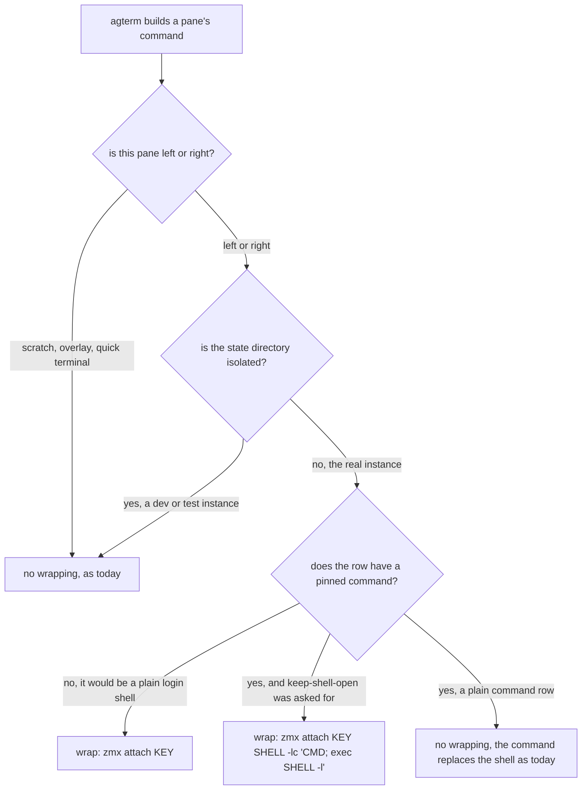

# Native zmx wrapping (fork only)

## Contents

1. [Overview](#overview)
2. [Context (from discovery)](#context-from-discovery)
3. [Development Approach](#development-approach)
4. [Testing Strategy](#testing-strategy)
5. [Progress Tracking](#progress-tracking)
6. [Solution Overview](#solution-overview)
7. [Technical Details](#technical-details)
8. [What Goes Where](#what-goes-where)
9. [Implementation Steps](#implementation-steps)
10. [Post-Completion](#post-completion)

## Overview

Today every interactive agterm pane becomes zmx-backed from outside the app.
A hook at the end of `~/.zprofile` runs `zmx attach "<session id>-<pane>"` in each pane's login shell.
A launch agent, `agterm-zmx-sync`, ends the zmx session when the pane really goes away and keeps its label current.

This moves that inside agterm, in Sasha's fork only.
agterm sets the pane's command to `zmx attach <key>` itself, so it knows which zmx session each pane owns.

Three benefits follow from agterm knowing that, and they are the reason to do the work:

- `agtermctl tree` reports the real running program instead of `zmx attach`.
- Ending a zmx session becomes correct by construction, because agterm is the thing that decided the row closed.
  It no longer infers that from outside, which is what the sync daemon spends most of its 378 lines doing.
- An agent row stops vanishing when claude exits.

**Not in scope:** bundling zmx into the app, an opt-in persistence flag, a sidebar indicator, a menu item,
overlays, and anything on the laptop. The companion design document
`docs/plans/20260811-laptop-mirror-overlays.md` covers the laptop experience and the overlay redirect,
which come after this.

## Context (from discovery)

Files and components involved, with the line numbers the tasks anchor on:

- **Surface factories:** `agterm/agtermApp.swift` — `makeSurface` at :216, `makeSplitSurface` at :375.
- **Command handoff to libghostty:** `agterm/Ghostty/GhosttySurfaceView.swift:522-530`. A set `command`
  replaces the login shell; `config.wait_after_command` is the existing hold-at-exit switch.
- **Foreground:** `agterm/Ghostty/ForegroundProcess.swift` — `command(for:shellBasename:)` at :22,
  `running(for:shellBasename:)` at :40. Consumed by `ControlServer.buildTree` at :506, `foreground:` at :515,
  and by the quit-time capture in `agterm/AppDelegate.swift:345,350`.
- **Model:** `agtermCore/Sources/agtermCore/Session.swift` (`initialCommand` :173, `restoreCommand` :198),
  `Snapshot.swift` (`foregroundCommand` :157, `CodingKeys` :202, custom decoder :223).
- **Close and rename seams:** `AppStore.swift` — `closeSession` at :443; `AppStore+Naming.swift` —
  `renameSession` at :7.
- **Control:** `ControlModes.swift` — `ControlSessionCreateOptions` at :126; `ControlDispatcher.swift` —
  `.sessionNew` arm at :249; `ControlProtocol.swift` — `ControlSessionNode` at :475;
  `agtermCore/Sources/agtermctlKit/SessionCommands.swift` — the `--wait requires --command` check at :56.
- **Quoting helper:** `CommandRestore.shellQuotedLine` at `CommandRestore.swift:175`.
- **Tests:** 94 files in `agtermCore/Tests/agtermCoreTests/`, one per source file, plus
  `agtermCore/Tests/agtermctlKitTests/`.

Related patterns found:

- `SessionSnapshot` fields are all optional for forward compatibility, decoded with `decodeIfPresent` in a
  custom decoder, and no `Snapshot.currentVersion` bump. The new field follows this exactly.
- `ControlSessionCreateOptions.wait` already exists and already solves part of the vanishing problem:
  it holds the surface after `--command` exits. ⚠️ It holds with a press-any-key prompt and then closes,
  so it is a near neighbour of the new flag rather than the same thing. See Technical Details.
- Every state-setting command must be readable back on `ControlSessionNode`, so the new flag is reported there.

Dependencies identified: none new. zmx is already installed at `/opt/homebrew/bin/zmx`; nothing is bundled
or code-signed.

## Development Approach

- **parallel waves**: `pure (tasks 1-3)` — three independent new files with no shared wiring. Everything
  after task 3 is sequential, because the remaining tasks edit the model spine or the two surface factories.
- **testing approach**: Regular (code first, then tests), with tests a required deliverable of the same task.
  This matches the repository's existing plans and its gate rules.
- complete each task fully before moving to the next
- make small, focused changes
- **CRITICAL: every task MUST include new/updated tests** for code changes in that task
- **CRITICAL: all tests must pass before starting next task**
- **CRITICAL: update this plan file when scope changes during implementation**
- run the narrow per-task test command after each change; the full suite runs once, in the verify task
- maintain backward compatibility: an existing on-disk snapshot must still decode, and a pane that is not
  wrapped must behave exactly as it does today

## Testing Strategy

- **unit tests**: required for every task. All decision logic lives in `agtermCore` and is host-free, so
  every branch is unit-testable without spawning a process or a surface.
- **hosted tests** (`make test-app`): the control round-trip only — `session new --keep-shell-open`, then the
  flag read back through `tree`. Wrapping is bypassed under an isolated state directory, so a hosted run can
  never leave a zmx daemon behind.
- **no e2e suite applies**: real reattach behavior needs an app quit and relaunch, which is a manual check
  under Post-Completion.
- ⚠️ **Never run a mutating `agtermctl` command against the default socket during this work.** Every manual
  check uses a separate `open -n` instance with an isolated `AGTERM_STATE_DIR` and a short socket path.

## Progress Tracking

- mark completed items with `[x]` immediately when done
- add newly discovered tasks with ➕ prefix
- document issues/blockers with ⚠️ prefix
- update the plan if implementation deviates from the original scope

## Solution Overview

One rule decides whether a pane is wrapped, and it reproduces today's behavior exactly.



Why the pinned-command test is the right one: the zprofile hook can only fire inside an interactive login
shell, and a pinned command takes the place of that shell. So a command row is not zmx-backed today, and
leaving it alone keeps it that way. This also keeps the laptop's mirrored rows out of the wrapping, because
`agterm-zmx-mirror` creates every row with `--command`. Wrapping those would nest zmx inside zmx for no gain.

Key design decisions:

- **Keys stay `<session uuid>-<pane role>`**, Sasha's existing convention, not upstream's `agterm-<hex12>`.
  Those ids surface in `zmx list`, in the pick list, in the mosh incantation and in `agterm-remote-overlay`,
  and all of them parse this shape. Keeping it also means existing daemons are adopted rather than abandoned.
- **No bundled zmx**, no build step, no nested code signing, no notarization surface.
- **No pinned `ZMX_DIR`.** Sasha's tooling and the mosh incantation both assume zmx's own default directory,
  and pinning an agterm-specific one would make `zmx list` look in the wrong place on both machines.
- **Isolated instances wrap nothing and reap nothing.** This one condition removes the cross-instance danger
  that a per-instance socket directory was going to solve, and it keeps test runs from orphaning daemons.

## Technical Details

**The wrapper string.** Always built through `CommandRestore.shellQuotedLine`, so a path containing a space
cannot split into two arguments.

⚠️ The wrapper is always a bare `zmx attach <key>`, never `zmx attach <key> <command>`.
`zmx --help` states that a provided command is used **instead of** creating a shell. Folding a command in
would make that command the session's entire process, which is exactly the vanishing bug below. The shelved
upstream plan (`docs/plans/ideas/20260706-persistent-sessions.md`) claims a folded command runs as a child of
zmx's shell. That claim is wrong and must not be copied.

**The vanishing agent row.** `agterm-zmx new` (`~/dev/agterm-agents/bin/agterm-zmx:242`) and the offload
script (`~/.claude/skills/offload-session/offload.sh:58`) both pin a command of this shape:

```
zsh -lc 'zmx attach "<key>" claude'
```

claude is the zmx session's process, not a program inside its shell. So claude exits, the session ends, the
client exits, `zsh -lc` has nothing left to run, and the pane has no process at all. agterm closes the row
because there is genuinely nothing in it.

`keepShellOpen` fixes this in the app. The wrapped form becomes:

```
zmx attach <key> <shell> -lc '<command>; exec <shell> -l'
```

claude exits, the shell continues, and the pane lands at a prompt inside the same persistent session.

**Relationship to the existing `--wait`.** `--wait` sets `config.wait_after_command`, which holds the surface
with a press-any-key prompt and then closes it. `--keep-shell-open` leaves a live persistent shell instead.
They are different answers to the same annoyance, they cannot both apply to one row, and the dispatcher
rejects the combination rather than silently picking one.

**New model field.** `Session.keepShellOpen: Bool` (default false) and `SessionSnapshot.keepShellOpen: Bool?`
(optional, no version bump), emitted only when true so an existing tree serialises byte for byte as before.

**The reap.** Kills only zmx sessions that are owned by name shape, have zero clients, and are absent from the
claimed set. The claimed set is built from every window's persisted snapshot across the whole library, not
from live restored sessions, because window restoration is asynchronous and a restored session is zero-client
until it attaches. An unknown client count is never an orphan. The whole reap is skipped when
`AGTERM_STATE_DIR` is set.

## What Goes Where

- **Implementation Steps** (`[ ]`): all code, tests, and in-repo documentation.
- **Post-Completion** (no checkboxes): the manual reattach checks, and retiring the outside tooling.
  ⚠️ Retiring the tooling edits `~/.zprofile`, unloads a launch agent on two machines, and edits an installed
  skill. None of that is repository work, none of it is covered by `AGTERM_STATE_DIR` isolation, and a
  delegated agent must not touch the live setup. It stays manual on purpose.

## Implementation Steps

### Task 1: zmx session key derivation and ownership

**Files:**
- Create: `agtermCore/Sources/agtermCore/ZmxSessionKey.swift`
- Create: `agtermCore/Tests/agtermCoreTests/ZmxSessionKeyTests.swift`

**Wave:** pure

- [x] add `ZmxSessionKey.key(sessionID:isSplit:)` returning `<uuid>-left` or `<uuid>-right`, in the exact
      letter case the zprofile hook produces today, so existing daemons are recognised rather than duplicated
- [x] add `isOwned(_:)` matching that shape, and `parse(_:)` returning the id and role for the reaper
- [x] add `maxByteCount` for the budget probe in task 2 to use
- [x] write tests for both roles, a foreign name rejected, and a round trip through `parse`
- [x] write a stability test: the key is identical for the same session id regardless of workspace name, so a
      rename or a move never orphans a daemon
- [x] run `cd agtermCore && swift test --filter ZmxSessionKeyTests` — must pass before the next task

### Task 2: zmx socket path budget probe

**Files:**
- Create: `agtermCore/Sources/agtermCore/ZmxSocketBudget.swift`
- Create: `agtermCore/Tests/agtermCoreTests/ZmxSocketBudgetTests.swift`

**Wave:** pure

- [x] add `socketDir(env:)` resolving the directory the way zmx itself does, honouring `ZMX_DIR` then the
      temporary directory, and deliberately **not** pinning an agterm-specific directory; say why in the doc comment
- [x] add `probe(env:)` returning a non-nil reason when directory plus worst-case key would exceed the
      104-byte `sun_path` limit minus a small margin, else nil
- [x] write tests for under budget, over budget through a long `ZMX_DIR`, and a trailing slash trimmed
- [x] run `cd agtermCore && swift test --filter ZmxSocketBudgetTests` — must pass before the next task

### Task 3: zmx ls output parser

**Files:**
- Create: `agtermCore/Sources/agtermCore/ZmxListParser.swift`
- Create: `agtermCore/Tests/agtermCoreTests/ZmxListParserTests.swift`

**Wave:** pure

- [x] add `parse(_:)` returning entries of name, client count and session leader pid
- [x] a malformed or error line yields a nil client count, meaning unknown, never zero — the reaper depends on
      this distinction
- [x] write tests for healthy lines, an error line, a line with no leader pid, and an empty listing
- [x] run `cd agtermCore && swift test --filter ZmxListParserTests` — must pass before the next task

### Task 4: the wrap decision and the command it produces

**Files:**
- Create: `agtermCore/Sources/agtermCore/ZmxWrap.swift`
- Create: `agtermCore/Tests/agtermCoreTests/ZmxWrapTests.swift`

**Model:** opus

- [x] add one pure function taking the pane role, whether a pinned command exists and what it is, the
      `keepShellOpen` flag, the resolved zmx path, the budget probe result and whether the state directory is
      isolated, returning either no wrapping or the exact command string
- [x] build every string through `CommandRestore.shellQuotedLine` (`CommandRestore.swift:175`)
- [x] the plain form is `zmx attach <key>`; the keep-shell-open form is
      `zmx attach <key> <shell> -lc '<command>; exec <shell> -l'`
- [x] write tests for every branch of the diagram in Solution Overview, including scratch and overlay roles
      and the isolated-state-directory bypass
- [x] write tests for a keep-shell-open command containing a double quote, a dollar sign and a backtick,
      asserting the command survives exactly one level of shell evaluation and no more
- [x] run `cd agtermCore && swift test --filter ZmxWrapTests` — must pass before the next task

### Task 5: keepShellOpen in the model and the snapshot

**Files:**
- Modify: `agtermCore/Sources/agtermCore/Session.swift` (add next to `initialCommand` at :173)
- Modify: `agtermCore/Sources/agtermCore/Snapshot.swift` (add beside `foregroundCommand` :157, plus `CodingKeys` :202 and the custom decoder :223)
- Modify: `agtermCore/Sources/agtermCore/AppStore.swift` (the `snapshot()` and restore mapping)
- Modify: `agtermCore/Tests/agtermCoreTests/PersistenceTests.swift` (the existing round-trip cases)

- [x] add `Session.keepShellOpen: Bool = false`, `@ObservationIgnored`, matching the neighbouring command fields
- [x] add `SessionSnapshot.keepShellOpen: Bool?` threaded through the memberwise init, `CodingKeys`, and the
      custom decoder with `decodeIfPresent`; no `Snapshot.currentVersion` bump
- [x] map it in `snapshot()` emitting only when true, and in restore treating missing as false
- [x] write tests for a round trip with the flag set and unset
- [x] write a forward-compatibility test: a legacy snapshot without the field decodes to false, and a tree
      with the flag unset serialises byte for byte as it did before
- [x] run `cd agtermCore && swift test --filter PersistenceTests` — must pass before the next task

### Task 6: keepShellOpen through the control protocol and the CLI

**Files:**
- Modify: `agtermCore/Sources/agtermCore/ControlModes.swift` (`ControlSessionCreateOptions` at :126)
- Modify: `agtermCore/Sources/agtermCore/ControlProtocol.swift` (`ControlSessionNode` at :475)
- Modify: `agtermCore/Sources/agtermCore/ControlDispatcher.swift` (the `.sessionNew` arm at :249)
- Modify: `agtermCore/Sources/agtermctlKit/SessionCommands.swift` (beside the `--wait requires --command` check at :56)
- Modify: `agterm/Control/ControlServer.swift` (`buildTree` at :506, the node construction)
- Modify: `agtermCore/Tests/agtermCoreTests/ControlDispatcherTests.swift`
- Modify: `agtermCore/Tests/agtermctlKitTests/CommandsTests.swift`

- [x] add `keepShellOpen: Bool?` to the create options, and report `keepShellOpen` on `ControlSessionNode`
- [x] add `--keep-shell-open` to `agtermctl session new`, and reject it without a `--command` the same way
      `--wait` is rejected
- [x] ⚠️ reject `--keep-shell-open` combined with `--wait` — they are two different answers to the same
      problem and one row cannot have both
- [x] wire the flag through session creation in the dispatcher and populate the tree field from the live session
- [x] write dispatcher tests for the Codable round trip, the two rejections, and the tree field
- [x] write CLI tests for argument parsing and both error messages
- [x] run `cd agtermCore && swift test --filter "ControlDispatcherTests|CommandsTests"` — must pass before the next task

### Task 7: ZmxClient and applying the wrapper in both surface factories

**Files:**
- Create: `agterm/Ghostty/ZmxClient.swift`
- Modify: `agterm/agtermApp.swift` (`makeSurface` at :216 and `makeSplitSurface` at :375, where the command is chosen)

- [x] add `ZmxClient` as a struct of `@Sendable` closures — locate the installed binary, list sessions with
      client counts and leader pids, set a label, kill a session — plus a `.noop` for tests, so the decision
      logic stays in `agtermCore` and only the effects live here
- [x] implement the subprocess runner with a bounded timeout and drained pipes, parsing through
      `ZmxListParser` from task 3
- [x] both factories consult `ZmxWrap` from task 4 and set the surface command when it says to wrap;
      `makeSplitSurface` passes the `right` role
- [x] over budget, no binary found, or an isolated state directory all mean a plain shell — never a broken pane
- [x] scrub an inherited `ZMX_SESSION` at startup so an agterm launched from inside a wrapped pane does not
      adopt its parent's session identity
- [x] run `cd agtermCore && swift test --filter ZmxWrapTests && make build` — must pass before the next task

### Task 8: foreground resolution past the wrapper

**Files:**
- Create: `agterm/Ghostty/ZmxForegroundResolver.swift`
- Modify: `agterm/Ghostty/ForegroundProcess.swift` (`command(for:shellBasename:)` at :22 and `running(for:shellBasename:)` at :40)
- Create: `agtermCore/Sources/agtermCore/ZmxForegroundSelection.swift`
- Create: `agtermCore/Tests/agtermCoreTests/ZmxForegroundSelectionTests.swift`

- [x] add the pure selection logic in `agtermCore`: given a pane's immediate child argv and a parsed `zmx ls`
      listing, decide whether this is a wrapper and which leader pid to inspect instead
- [x] in `ForegroundProcess`, route through the resolver so a wrapped pane reports the real running program
      rather than `zmx attach`
- [x] cache the listing for the duration of one tree build, so a single `tree --json` does not spawn one
      subprocess per session
- [x] write tests for the selection logic: a wrapper is detected, a plain shell is untouched, a foreign
      `zmx attach` for an unowned key is untouched, and a missing listing falls back to today's answer
- [x] run `cd agtermCore && swift test --filter ZmxForegroundSelectionTests` — must pass before the next task

### Task 9: end the zmx session when a row really closes, and keep its label current

**Files:**
- Create: `agtermCore/Sources/agtermCore/ZmxLifecycle.swift`
- Create: `agtermCore/Tests/agtermCoreTests/ZmxLifecycleTests.swift`
- Modify: `agtermCore/Sources/agtermCore/AppStore.swift` (`closeSession` at :443)
- Modify: `agtermCore/Sources/agtermCore/AppStore+Naming.swift` (`renameSession` at :7)

- [ ] add the pure predicate in `ZmxLifecycle`: which keys a close should end, given the session, whether its
      split is closing too, and whether this is a row close or a window close
- [ ] ⚠️ a closed window must NOT end anything. A closed window keeps its session ids under
      `~/Library/Application Support/agterm/windows/` and reopens with them. This is the mistake recorded in
      `agterm-zmx-sync`'s own header, where the first version would have killed every agent in a window on `cmd+W`
- [ ] closing a row, or closing just its split, ends that pane's session through `ZmxClient`
- [ ] renaming a row sets the `agterm_name` label on its session, which is what keeps a rename harmless given
      zmx has no rename command
- [ ] write tests for the predicate: row close ends one key, split close ends only the split's key, window
      close ends nothing, an unwrapped session ends nothing
- [ ] run `cd agtermCore && swift test --filter ZmxLifecycleTests` — must pass before the next task

### Task 10: reap orphaned daemons at launch

**Files:**
- Create: `agtermCore/Sources/agtermCore/ZmxReaper.swift`
- Create: `agtermCore/Tests/agtermCoreTests/ZmxReaperTests.swift`
- Modify: `agterm/AppDelegate.swift` (`applicationDidFinishLaunching` at :51)

**Model:** opus

- [ ] add `claimedKeys(from:)` building the claimed set from every window's persisted snapshot across the whole
      library, both panes of every session
- [ ] add `orphans(in:claimed:)` selecting only owned names with a client count of exactly zero that are absent
      from the claimed set; an unknown count is never an orphan
- [ ] ⚠️ run the reap only after the complete claimed set is assembled, never per window. Window restoration is
      asynchronous and a restored session is zero-client until it attaches, so reaping early kills live agents
      belonging to windows that have not restored yet
- [ ] ⚠️ skip the reap entirely when `AGTERM_STATE_DIR` is set, so an isolated instance can never reap the
      deployed app's detached daemons
- [ ] write tests: the claimed set across a multi-window snapshot including splits; orphan selection spares
      unknown counts, attached sessions, claimed names and foreign names; an empty listing yields no orphans
- [ ] run `cd agtermCore && swift test --filter ZmxReaperTests` — must pass before the next task

### Task 11: Verify acceptance criteria

- [ ] verify every Overview requirement: a plain row is wrapped, `tree` reports the real program, a row close
      ends its session, a window close does not, a keep-shell-open row survives its command exiting
- [ ] verify the edge cases: split panes get the `right` key, scratch and overlay are never wrapped, an
      isolated instance wraps nothing and reaps nothing, an over-budget socket path falls back to a plain shell
- [ ] verify backward compatibility: a legacy snapshot decodes, and a tree with no keep-shell-open session
      serialises exactly as before
- [ ] run the full host-free suite: `cd agtermCore && swift test`
- [ ] run the hosted control round-trip: `make test-app`
- [ ] run `make lint` — zero findings required

### Task 12: [Final] Update documentation

**Model:** haiku

**Files:**
- Modify: `CLAUDE.md` (the module and callback boundaries section, adding the wrapping boundary)
- Create: `.claude/rules/zmx.md`
- Modify: `docs/plans/20260811-native-zmx-wrapping.md` (this file, on move)

- [ ] add `.claude/rules/zmx.md` describing the key convention, the wrap rule, the isolated-instance bypass,
      and the two lifecycle traps, in the semantic-line style the other rules files use
- [ ] reference the new rules file from `CLAUDE.md`'s path-scoped rules list
- [ ] note in `CLAUDE.md` that this is fork-only work and is not to be offered upstream
- [ ] do NOT touch `CHANGELOG.md` — it is release-only
- [ ] move this plan to `docs/plans/completed/`

## Post-Completion
*Items requiring manual intervention or external systems — no checkboxes, informational only*

**Manual verification**, on a separate `open -n` instance with an isolated `AGTERM_STATE_DIR` and a short
socket path, never against the deployed app. Note that wrapping is bypassed under an isolated state directory,
so these checks need the bypass temporarily disabled or a build that keys it differently — decide which when
you get there, and never point a Debug instance at the default socket.

- create a row, run something long lived, quit the instance by pid, relaunch, confirm the process and the
  scrollback came back
- repeat with a split, confirming the `right` key is separate
- create a keep-shell-open row running claude, exit claude, confirm the row lands at a prompt inside the same
  session rather than vanishing
- force a long `ZMX_DIR` and confirm the pane falls back to a plain shell instead of failing to spawn
- confirm an existing daemon created by the old zprofile hook is adopted by a wrapped pane rather than
  duplicated, since both use the same key shape

**Retiring the outside tooling** — manual, because none of it is repository work and a delegated agent must
not touch the live setup:

- unload and delete `dev.sasha.agterm-zmx-sync` on both machines, and delete `bin/agterm-zmx-sync`
- remove the zprofile hook block from `~/.zprofile` on both machines
- change `agterm-zmx new` to create a keep-shell-open row instead of building a `zmx attach` string by hand,
  and do the same in `~/.claude/skills/offload-session/offload.sh`; leave `pick` alone, since binding a row to
  an arbitrary or remote session is exactly what the wrapping does not do
- turn `restoreRunningCommand` off, so a captured `zmx attach` line is never re-run against a name the app
  would generate itself
- update `~/dev/agterm-agents/README.md` and the `agent-sessions` skill to say where the mapping now lives

**Follow-on work:** `docs/plans/20260811-laptop-mirror-overlays.md`, the overlay redirect. It needs the
session-to-mirror pairing as real fields, which is not part of this plan.
