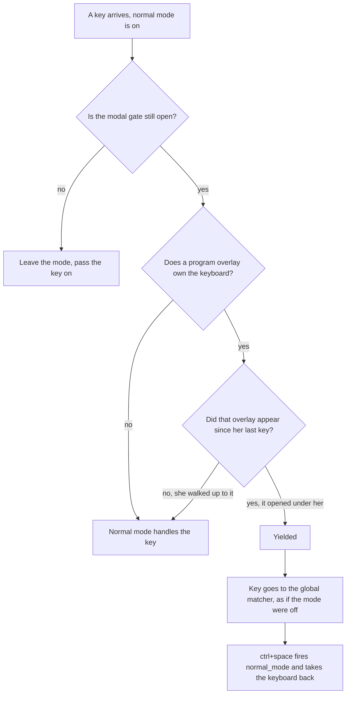

# Normal mode on a session whose overlay owns the keyboard — decision

## Contents

1. [The trap today](#1-the-trap-today)
2. [Why the suspension exists](#2-why-the-suspension-exists)
3. [The one thing the current rule gets wrong](#3-the-one-thing-the-current-rule-gets-wrong)
4. [The options](#4-the-options)
5. [Recommendation and the two questions](#5-recommendation-and-the-two-questions)
6. [What the recommended change touches](#6-what-the-recommended-change-touches)
7. [Edges I did not resolve](#7-edges-i-did-not-resolve)
8. [Pointers](#8-pointers)

---

## 1. The trap today

Derived from reading the code, not reproduced. I did not build or run anything in the worktree.

**Anna walks onto a session with vifm open and normal mode stops answering her.**

Anna has `nmap m "vifm"` and `map ctrl+space normal_mode` in `keymap.conf`. On session `rebase` she
pressed `m` a minute ago, so a 95% overlay there runs `zsh -lc vifm`. She is now on session `docs`,
mode on, pill up in the titlebar.

1. She presses `k` (`nmap k previous_session`). Selection moves to `rebase`. `focusActiveSession`
   targets `Session.topmostSurface`, which prefers the overlay, so first responder is now the
   overlay's surface.
2. She presses `k` again to keep walking. `CustomCommandRunner.handleKeyDown` sees
   `normalMode.isActive == true`, then `activeSession.programOverlayOwnsKeyboard == true`, calls
   `abandonLeader()` and returns `false` (`CustomCommandRunner.swift:162-165`). The `k` reaches vifm,
   which moves its cursor down one row.
3. She presses `Esc` to leave the mode. Same branch, same `return false`. vifm gets the Escape. The
   mode is still on.
4. She presses `ctrl+space`. Same branch again. The key never reaches the global matcher below, which
   is the only thing that dispatches `normal_mode`. vifm gets a space.
5. The pill still says normal mode is on. Every bare key she types goes into vifm.

Today the only ways out are a ⌘-chord carried by a menu item, or the mouse. ⌘⌃F is not one of them:
its hand dispatch at `CustomCommandRunner.swift:172-176` sits *below* the branch that already
returned, so full screen is dead for as long as she stands there. Nothing is lost or corrupted — the
cost is that she cannot navigate, cannot leave the mode, and cannot tell from the pill why.

The predicate is `Session.programOverlayOwnsKeyboard` (`Session.swift:475`): the session-wide
overlay, or the focused pane's own overlay. A sibling pane's overlay does not count and a HUD does
not count.

## 2. Why the suspension exists

Anna's other flow, and the one commit `6e2c0c7` was written for:

- Mode on, on session `docs`. She presses `m`. The custom command runs
  `agtermctl session overlay open 'zsh -lc vifm' --size-percent 95`, and vifm appears **under her**.
- She types `j`, `k`, `/`, `Enter` into vifm and quits. The overlay closes, the mode is still on, and
  her next key is the mode's again.

This flow is not rare in her keymap. `nmap m` (vifm), `nmap f` ("FZF Files"), `nmap o`
("Switch session"), `nmap y` ("FZF Copy Path") and `nmap space>k` ("Edit keymap") all open an overlay
program from inside the mode, and every one of them expects to be typed into straight away. Any
answer that costs an extra keystroke here is paying in the common flow to fix the rare one.

## 3. The one thing the current rule gets wrong

The rule asks a question about the state of the world — *is there an overlay right now?* — where the
honest question is about an event: *did this program just take the keyboard from me, or did I walk up
to it?*

Those two cases are indistinguishable to a state test, and they want opposite answers:

- The overlay appeared under her: the program should get the keys.
- She arrived at an overlay that was already running: the mode should keep the keys, so `j`/`k` can
  carry her past it.

The same distinction settles the question the brief left open — what should happen when the mode is
entered while an overlay is already up. Pressing `ctrl+space` is Anna asking for agterm's keys. It is
an arrival, not an appearance, so the mode takes the keyboard and `i` gives it back.

## 4. The options

Cheapest first. Each one replays the run in section 1.

### Exit on arrival

Change the branch to `normalMode.exit(); abandonLeader(); return false`. The overlay becomes a fifth
way out of the mode, beside the text field, the modal gate, the pane click and the window resigning key.

- **The run:** Anna's second `k` turns the mode off and lands in vifm. She is not trapped. She is also
  not walking any further: to reach the session after `rebase` she presses `ctrl+space` — and the very
  next key exits the mode again, because the overlay is still there. Normal mode is dead on that
  session.
- **Cost:** one line. It also destroys section 2's flow — quitting vifm leaves the mode off, so every
  `nmap m` round trip now ends with an extra `ctrl+space`.
- Removes the trap. Does not remove the cause.

### Escape hatch only

Keep the suspension, but route `Esc` and the bare exit key `i` into `handleNormalModeKey` before the
branch returns.

- **The run:** Anna's second `k` still goes to vifm. Her `Esc` now leaves the mode and hands an Escape
  down to vifm, which is the right thing for vim-like programs. She is not trapped. She still cannot
  walk past `rebase`, and re-entering the mode there is pointless because the next key suspends again.
- **Cost:** small, no new state. Section 2's flow is kept.
- Removes the trap. Does not remove the cause.

### Yield only to an overlay that opens under you

Make the suspension an event, not a state. Normal mode remembers the keyboard target it saw at the
previous keystroke — the active session's id plus its focused pane — and whether that target was
already overlaid. Per key, with the mode on:

- No overlay owns the keyboard: the mode handles the key. Not yielded.
- The target changed since the last key: she arrived. The mode handles the key. Not yielded.
- Same target, and it was not overlaid at the last key: the overlay appeared under her. Yield.
- Same target, already overlaid at the last key: carry the previous answer.

Entering the mode forgets the remembered target, so the first key after entry has nothing to compare
against and reads as an arrival. Entering over an existing overlay therefore keeps the keyboard, with
no baseline to record and no change to `AppActions.enterNormalMode()`.

While yielded, the key falls through to the global matcher instead of returning `false` — that is,
yielded behaves exactly as the mode being off, which is already what happens over an overlay with the
mode off. `ctrl+space` therefore reaches the global matcher, fires `normal_mode`, re-records the
baseline and takes the keyboard back. ⌘⌃F starts working again through the dispatch at
`CustomCommandRunner.swift:199`.

- **The run:** Anna's second `k` moves her to the session after `rebase`, because the target changed
  and the overlay was not hers to give away. She never sees the trap. Her `Esc` leaves the mode and
  reaches vifm. If she wants vifm instead, she presses `i` and the mode is off, exactly as on a plain
  pane.
- **Section 2's flow:** `m` opens vifm under her, the target has not changed, the overlay was not
  there at the last key, so the mode yields and she types into vifm immediately. On quit the yield
  clears and the mode is live again. Unchanged from today.
- **Cost:** a small host-free type holding two remembered values plus a flag, one call from the
  monitor, one call from `AppActions.enterNormalMode()`, and a restructure of the branch so it can
  fall through instead of always returning.
- Removes the cause.

### Hand over only on `i`

The mode never yields by itself. It keeps the keyboard on every overlay, and `i` is the only way a
program gets the keys.

- **The run:** identical to the option above — Anna walks past `rebase` freely.
- **Section 2's flow:** `m` opens vifm and vifm gets nothing. She must press `i` first, every time,
  for all five of her overlay binds. To keep the round trip back into the mode, `i` would also have to
  mean "yield but stay on" rather than "leave", so `i` gains a second meaning and the pill claims the
  mode owns keys that a program is eating.
- The most principled statement of the invariant, and the worst to live with.

### Skip overlay sessions while walking — rejected

Recorded as rejected on sight in the brief, and the reason still holds: `j`/`k` would silently hide
sessions from navigation, which is worse than the trap.

- The left arm out of the last decision is the whole fix. Everything else already exists.
- What the picture cannot say: the answer to "did it appear since her last key" is sampled per
  keystroke, so it is only ever computed at the moment it is needed.

## 5. Recommendation and the two questions

Both decided on 2026-08-11, as recommended. The design below is settled; the questions are kept as
they were asked, so the reasoning stays readable next to the answer.

**Decision: should the mode yield to any overlay, or only to one that opens under her?**
**Decided: only to one that opens under her** — it removes the cause instead of guarding against
it, it keeps section 2's flow keystroke-for-keystroke identical, and `i` and `Esc` keep exactly one
meaning each. Scope: the change lives inside `if normalMode.isActive` in
`CustomCommandRunner.handleKeyDown` plus one new host-free type. With an untouched `keymap.conf` the
mode can never be on, so the key path stays byte-for-byte what it is today.

**Second decision: when Anna presses `i` on a session she walked onto, should the mode leave, or yield
and stay on?** **Decided: leave**, the same as everywhere else. Yielding would keep the round trip
back into the mode after she quits vifm, but it gives `i` a second meaning and leaves the pill up
while a program eats her keys — the same silent lie that makes the current trap hard to diagnose. She
gets back with `ctrl+space`.

That makes "Yield only to an overlay that opens under you" the design to build, with the `i` case
falling through to the mode's existing exit.

## 6. What the recommended change touches

- `agtermCore` — a new value type, roughly: the remembered session id, the remembered focused pane,
  whether that target was overlaid, and the yielded flag. Two methods: record a baseline (on entering
  the mode), and step one keystroke returning whether to yield. All four rules from section 4 are
  host-free and covered by `swift test`.
- `agterm/Commands/CustomCommandRunner.swift` — the branch at `:159-165` calls the step method and,
  when it yields, drops the half-typed leader and falls through to the global matcher instead of
  returning `false`. The in-branch `toggle_fullscreen` dispatch at `:172-176` stays where it is for
  the non-yielded path; the yielded path picks up the copy at `:199` for free.
- `agterm/Commands/NormalModeController.swift` — holds the handover value, forgets it in `enter()`,
  `exit()` and `rebuild()`, and exposes the per-key step to the monitor. `enter()` keeps its empty
  signature, so `AppActions.enterNormalMode()`, the control command `mode on`, and the seven existing
  test call sites are untouched.
- `agtermCore/.../NormalModeState.swift` — unchanged. The binds and the handover are separate
  concerns; keeping them apart avoids threading a session id through `advance`.
- `.claude/rules/keymap.md` — the suspension paragraph at lines 52-57 states the state-based rule and
  must be rewritten to the event-based one. `FORK-NOTES.md` says the same thing in the "How it owns
  the keyboard" list and needs the same edit.

Tests:

- `agtermTests/NormalModeKeyRoutingTests.testAProgramOverlaySuspendsTheModeAndReleasesItsKeysWithoutEndingIt`
  fails as written, and it is the test setup that is wrong, not the behavior. `setUp` calls
  `NormalModeController.shared.enter()` before any session exists, so the baseline is empty and the
  first key after `openOverlay` reads as an arrival. Create and select the session before entering the
  mode, so the test walks section 2's real flow.
- `testAnOverlayAbandonsAHalfTypedLeader` passes unchanged: it presses `g` before opening the overlay,
  which records the target, so the overlay open is an appearance and still yields.
- `testAHudDoesNotSuspendTheMode` is unaffected.
- New cases worth pinning: arrival by `next_session` keeps the mode; arrival by `focus_left_pane` onto
  an overlaid pane keeps the mode (this is why the remembered target carries the focused pane, not
  only the session); entering the mode over an existing overlay keeps the mode; an overlay closing
  clears the yield; `ctrl+space` while yielded takes the keyboard back.

⚠️ `CustomCommandRunner.handleKeyDown` is the file `.claude/rules/fork-rebase.md` names as the
highest-risk one in the fork, for exactly the failure this change creates the chance of: anything
below the normal-mode branch is dead while the branch returns early. Read the whole function top to
bottom after the edit and ask, per dispatch below the branch, whether it still runs in both the
yielded and the non-yielded case. The fall-through makes more of the function reachable than today,
which is the direction that helps, but it is still a restructure of the exact lines upstream keeps
rewriting.

Gates, all four, per the brief: `cd agtermCore && swift test`, `make lint`, `make release`, and
`scripts/test-app.sh -skip-testing:agtermTests/SystemWakeObserverTests`. Only the last one compiles
`agtermTests`, which is where three of the affected tests live.

## 7. Edges I did not resolve

- **The pill cannot show the yield honestly.** The yield is computed when a key arrives, so between
  the overlay opening and the next keystroke there is no event to publish. A dimmed or "paused" pill
  would lag by one key. I would not add one. The alternative is observing
  `Session.programOverlayOwnsKeyboard` from the app side to drive the state eagerly, which couples the
  deck view or an observation tracker to the mode for a cosmetic gain.
- **A `--follow` overlay opened on another session.** A script running
  `session overlay open ... --follow` on a session Anna is not on changes the active session and opens
  an overlay in one step. Under the recommendation that reads as an arrival, so the mode keeps the
  keyboard and the program waits for `i`. I think that is right — she did not ask for that program —
  but it is a real behavior choice hiding inside the rule, and it differs from the same command
  targeting her current session.
- **Two overlays back to back between two keystrokes.** If one overlay closes and another opens on the
  same target with no key pressed in between, the sampling sees no change and carries the yield. It
  cannot happen in a keyboard-driven flow. An overlay generation counter would close it and is not
  worth the field.
- **`window.list` read-back.** It reports `normalMode` on the window holding the mode, true-only. The
  yield is derived per keystroke rather than set by a command, so the cross-surface contract in
  `CLAUDE.md` does not demand a field for it, and one would carry the same lag as the pill. Leaving it
  out is a deliberate choice, not an oversight.

## 8. Pointers

`agterm/Commands/CustomCommandRunner.swift:130-226` (the branch at `:159-165`, the full-screen copies
at `:172-176` and `:199`), `agterm/Commands/CustomCommandRunner.swift:238-284`
(`handleNormalModeKey`), `agtermCore/Sources/agtermCore/Session.swift:461-477`
(`focusedPane`, `programOverlayOwnsKeyboard`), `agtermCore/Sources/agtermCore/NormalModeState.swift`,
`agterm/AppActions+Palette.swift:112-123` (`enterNormalMode`),
`agterm/AppActions+Focus.swift:116-138` (`focusActiveSession` targeting `topmostSurface`),
`agtermTests/NormalModeKeyRoutingTests.swift:268-323`, `.claude/rules/keymap.md:46-59`,
`.claude/rules/fork-rebase.md`, `FORK-NOTES.md`, `~/.config/agterm/keymap.conf:265-333`, commits
`6e2c0c7`, `9d28c88`, `35551ff`.
