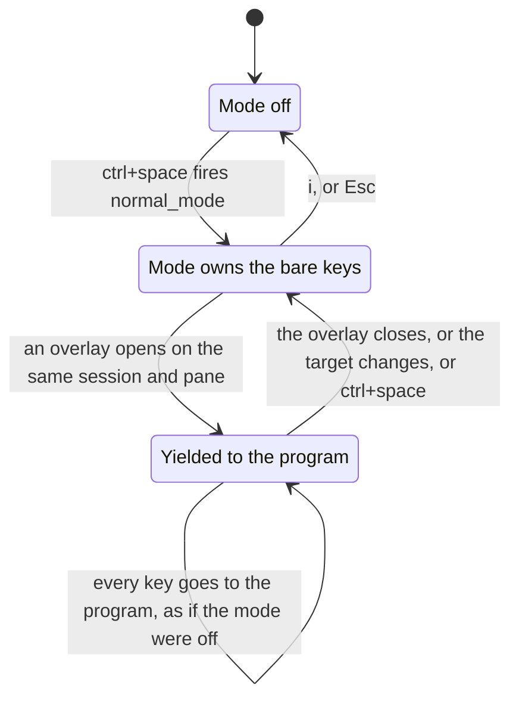

# Normal mode yields only to an overlay that opens under you

## Overview

Normal mode currently suspends itself whenever the active session's overlay owns the keyboard. That is
a question about the state of the world, and it cannot tell two opposite cases apart: an overlay that
just opened under the user, and an overlay she walked up to with `j`/`k`. The second case traps her —
bare keys, `Esc` and the enter chord all go to the program, so she can neither navigate away nor leave
the mode, and ⌘⌃F dies with them.

This plan replaces the state test with an event test. Normal mode remembers the keyboard target it saw
at the previous keystroke and yields only when an overlay appeared on that same target since. Walking
onto a running overlay keeps the mode live, so `j`/`k` carry straight past it. Opening an editor from
an `nmap` bind still hands the keys over immediately and still returns to the mode on quit, which is
the flow the suspension was written for and the flow five of the user's own binds depend on.

While yielded, the key falls through to the global matcher instead of being dropped, so yielded means
exactly what the mode being off means: `map` binds fire, ⌘⌃F works, and `ctrl+space` takes the
keyboard back.

The decision behind this plan, with the failure run and the options that lost, is
`docs/plans/20260811-normal-mode-overlay-decision.md`. Both questions there were settled on
2026-08-11.

## Context (from discovery)

- Files involved: `agterm/Commands/CustomCommandRunner.swift` (the branch at `:159-165`),
  `agterm/Commands/NormalModeController.swift`, `agtermCore/Sources/agtermCore/Session.swift`
  (`focusedPane`, `programOverlayOwnsKeyboard`, `OverlayPane`),
  `agtermTests/NormalModeKeyRoutingTests.swift`.
- Patterns found: the mode is a filter inside the app-wide `.keyDown` monitor and owns no first
  responder; pure logic lives in `agtermCore` and is covered by `swift test`; the app target is the
  side-effect adapter.
- Dependencies: `OverlayPane` is already `CaseIterable, Codable, Sendable` and lives in
  `Session.swift`, so the new type can key on it with no extra work.
- Untouched: `NormalModeState`, `AppActions+Palette.swift`, the control API, and the read-back on
  `window.list`. The yield is derived per keystroke, not set by a command.

## Development Approach

- **parallel waves**: `none - task 2 cannot compile without task 1's type, and tasks 2 and 3 both write agtermTests/NormalModeKeyRoutingTests.swift`
- **testing approach**: Regular (code first, then tests in the same task)
- complete each task fully before moving to the next
- make small, focused changes
- every task includes new or updated tests for the code it changes
- all tests must pass before starting the next task
- update this plan file when scope changes during implementation
- run the narrow per-task command after each change; the four gates run once, in the verify task
- maintain backward compatibility: with an untouched `keymap.conf` the mode can never be on, so the
  key path stays byte-for-byte what it is today

## Testing Strategy

- **unit tests**: host-free tests in `agtermCore/Tests/agtermCoreTests` cover all four handover rules.
  This is where the real logic lives and where it is cheapest to pin.
- **hosted tests**: `agtermTests/NormalModeKeyRoutingTests` covers what the monitor consumes and what
  it hands back, which is the whole of the mode's key ownership. Only `make test-app` compiles this
  target, so a broken hosted test passes `swift test`, `make lint` and `make release` unnoticed.
- **e2e tests**: none. `agtermUITests` drives the keymap through the menu bar and is not involved.

## Progress Tracking

- mark completed items with `[x]` immediately when done
- add newly discovered tasks with ➕ prefix
- document issues and blockers with ⚠️ prefix
- keep this plan in sync with the actual work

## Solution Overview

One new host-free value type remembers two things across keystrokes: the keyboard target (the active
session's id plus its focused pane) and whether that target was already overlaid. Per key, with the
mode on:

| what the step sees | answer |
| --- | --- |
| no overlay owns the keyboard | not yielded, and forget any yield |
| the target changed since the last key | not yielded — she arrived |
| same target, and it was not overlaid last key | yielded — the overlay appeared under her |
| same target, already overlaid last key | carry the previous answer |

The target carries the focused pane, not only the session, so `focus_left_pane` onto a pane with its
own overlay reads as an arrival exactly like `next_session` does.

Entering the mode forgets the remembered target. The first key after entry then has nothing to compare
against and reads as an arrival, which is the wanted rule stated for free: **when the mode turns on,
the keyboard is the mode's**. Entering over a running overlay therefore takes the keyboard, and `i`
gives it back. The consequence, accepted deliberately: if a script opens an overlay in the gap between
`ctrl+space` and her first keystroke, the mode keeps the keyboard and she presses `i` to hand it over.



- There is no arrow from "Yielded to the program" to "Mode off": while yielded, `i` and `Esc` belong to
  the program, so the only ways out are the three on the arrow back to "Mode owns the bare keys".
- What the picture cannot say: "an overlay opens on the same session and pane" is sampled when a key
  arrives, never on the overlay's own timeline. That is why the pill cannot show the yield honestly,
  and why this plan does not try.

## Technical Details

The new type, `NormalModeOverlayHandover` in `agtermCore`:

- private `last`: the remembered target, an optional `(session: UUID?, pane: OverlayPane)` pair
- private `lastOwned`: whether that target was overlaid at the previous key
- `isYielded`: the published answer, `private(set)`
- `reset()`: forget everything, not yielded. Called when the mode is entered, left, or rebuilt.
- `step(session:pane:ownsKeyboard:) -> Bool`: apply the four rules above, record the new target and
  ownership, return `isYielded`

`step` must be called exactly once per key event, because it advances the memory. In
`CustomCommandRunner.handleKeyDown` it sits inside `if normalMode.isActive`, after the
`AppActions.uiActionsEnabled` re-check (which leaves the mode and returns before any step) and before
the `toggle_fullscreen` dispatch:

```swift
let session = library.activeStore?.activeSession
if normalMode.stepOverlayHandover(session: session?.id,
                                  pane: session?.focusedPane ?? .left,
                                  ownsKeyboard: session?.programOverlayOwnsKeyboard == true) {
    abandonLeader()
    // fall through to the global matcher below: yielded means what the mode being off means, so
    // `map` binds still fire, ⌘⌃F reaches its dispatch, and ctrl+space takes the keyboard back.
} else {
    // the existing Command-chord `toggle_fullscreen` copy, then
    return handleNormalModeKey(event, focusedSurface: focusedSurface)
}
```

The in-branch `toggle_fullscreen` copy stays where it is for the non-yielded path. The yielded path
reaches the global copy further down and needs no second one.

## What Goes Where

- **Implementation Steps**: the new type, the monitor wiring, the tests, the doc surfaces.
- **Post-Completion**: manual check on a separate Debug instance, and the rebase re-read.

## Implementation Steps

### Task 1: Add the host-free overlay handover type

**Files:**
- Create: `agtermCore/Sources/agtermCore/NormalModeOverlayHandover.swift`
- Create: `agtermCore/Tests/agtermCoreTests/NormalModeOverlayHandoverTests.swift`

- [x] create `NormalModeOverlayHandover` as a `public struct ... Sendable` with `isYielded`
      `private(set)`, `reset()`, and `step(session:pane:ownsKeyboard:) -> Bool`
- [x] implement the four rules from Solution Overview, recording the target and ownership on every
      step, including the first one where the remembered target is nil (that is an arrival)
- [x] write tests: an overlay opening on an unchanged target yields; the yield holds while she stays;
      the overlay closing clears it
- [x] write tests for the arrival cases: a changed session id does not yield, a changed focused pane
      on the same session does not yield, and a step with nothing remembered does not yield
- [x] write a test that `reset()` forgets a live yield, so re-entering the mode owns the keyboard
- [x] run `cd agtermCore && swift test --filter NormalModeOverlayHandover` - must pass before task 2

### Task 2: Route the key monitor through the handover

**Files:**
- Modify: `agterm/Commands/NormalModeController.swift` (add the handover beside `state`; reset it in `enter`, `exit` and `rebuild`; add `stepOverlayHandover`)
- Modify: `agterm/Commands/CustomCommandRunner.swift` (replace the `programOverlayOwnsKeyboard` branch at `:159-165` inside `handleKeyDown`)
- Modify: `agtermTests/NormalModeKeyRoutingTests.swift` (`testAProgramOverlaySuspendsTheModeAndReleasesItsKeysWithoutEndingIt`)

**Model:** opus

- [x] hold a `NormalModeOverlayHandover` in `NormalModeController` as `@ObservationIgnored`, reset it
      in `enter()`, `exit()` and `rebuild(binds:)`, and expose `stepOverlayHandover(session:pane:ownsKeyboard:)`
- [x] keep `enter()` argument-free, so `AppActions.enterNormalMode()` and the seven existing test call
      sites stay untouched
- [x] replace the branch in `handleKeyDown` with the shape in Technical Details: step once, and on a
      yield drop the half-typed leader and fall through to the global matcher instead of returning
      `false`
- [x] rewrite the comment at `:159-161` to state the event rule, not the state rule, and to say why
      the yielded path falls through
- [x] fix `testAProgramOverlaySuspendsTheModeAndReleasesItsKeysWithoutEndingIt`: it enters the mode in
      `setUp` before any session exists, so the overlay open is not an appearance to anything. Press
      one unbound key (`q`, swallowed and consumed, leaves `fired` empty) after `selectedSession()` and
      before `openOverlay`, so the target is remembered and the test walks the real flow
- [x] run `scripts/test-app.sh -only-testing:agtermTests/NormalModeKeyRoutingTests` - must pass before
      task 3

### Task 3: Pin arrival, entry over an overlay, and the keyboard coming back

**Files:**
- Modify: `agtermTests/NormalModeKeyRoutingTests.swift` (add cases beside the three existing overlay tests, after `testAnOverlayAbandonsAHalfTypedLeader`)

- [x] write a test that walking onto a session whose overlay is already open keeps the mode: open the
      overlay on a second session, select it, then assert the next key is consumed and fires its bind
- [x] write a test that entering the mode while an overlay already owns the keyboard keeps the mode,
      so `exit()` then `enter()` over a live overlay leaves the keys the mode's
- [x] write a test that `ctrl+space` while yielded reaches the global matcher and re-enters the mode,
      and that the key after it is the mode's again
- [x] write a test that a Command chord carrying the `toggle_fullscreen` equivalent still toggles full
      screen while yielded, which is dead today
- [x] run `scripts/test-app.sh -only-testing:agtermTests/NormalModeKeyRoutingTests` - must pass before
      task 4

### Task 4: Verify acceptance criteria

- [x] re-read `CustomCommandRunner.handleKeyDown` top to bottom and confirm, per dispatch below the
      normal-mode branch, that it runs in both the yielded and the non-yielded case
- [x] confirm an untouched `keymap.conf` still reaches no new code, and that
      `ControlKeymapTests.untouchedKeymapProjectsExactlyTheShippedDefaultForEveryAction` passes
- [x] run `cd agtermCore && swift test`
- [x] run `make lint` - zero findings required
- [x] run `make release`
- [x] run `scripts/test-app.sh -skip-testing:agtermTests/SystemWakeObserverTests` (that suite crashes
      the hosted host on this machine and is upstream's, not the fork's)

### Task 5: [Final] Update documentation

**Files:**
- Modify: `.claude/rules/keymap.md` (the suspension paragraph at lines 52-57, inside the normal mode bullet)
- Modify: `FORK-NOTES.md` (the "A program overlay ... SUSPENDS the mode" line in "How it owns the keyboard")
- Modify: `plugins/agterm/skills/agterm/SKILL.md` (the `**mode**` entry, around line 433)

- [x] rewrite the `keymap.md` paragraph: the mode yields only to an overlay that appears on an
      unchanged target, arriving by navigation or entering the mode keeps the keyboard, and the
      yielded path falls through to the global matcher rather than dropping the key
- [x] update the `FORK-NOTES.md` line to the same rule, in one sentence
- [x] add one sentence to the bundled skill's `mode` entry, which today does not mention overlays at
      all, so an agent driving the app knows a program overlay can hold the keys
- [x] check `cookbook/vim-keys/README.md` — it does not mention the suspension today, so leave it
      alone unless the rewrite makes a claim it contradicts (checked: no overlay claim, left untouched)
- [x] move this plan and `20260811-normal-mode-overlay-decision.md` to `docs/plans/completed/`
      (deferred to the harness — moving mid-run breaks the later review and finalize phases)

## Post-Completion

*Items requiring manual intervention or external systems - no checkboxes, informational only*

**Manual verification** (a separate `open -n` Debug instance with an isolated `AGTERM_STATE_DIR` and a
short socket path, never the live terminal):

- open vifm in an overlay on one session, walk onto it with `k`, and confirm `j`/`k` carry past it and
  `Esc` leaves the mode and reaches vifm
- press `m` on a plain session and confirm vifm takes the keys with no `i`, and that quitting it lands
  back in the mode
- with the mode on and an overlay open under you, press `ctrl+space` and confirm the keyboard comes
  back, then ⌘⌃F and confirm full screen toggles

**Rebase**:

- `.claude/rules/fork-rebase.md` names `CustomCommandRunner.handleKeyDown` as the highest-risk file in
  the fork. This change restructures the exact lines upstream keeps rewriting. The next rebase must
  re-read the whole function, not only the conflict hunks, and the zero-conflict case needs the same
  read.
