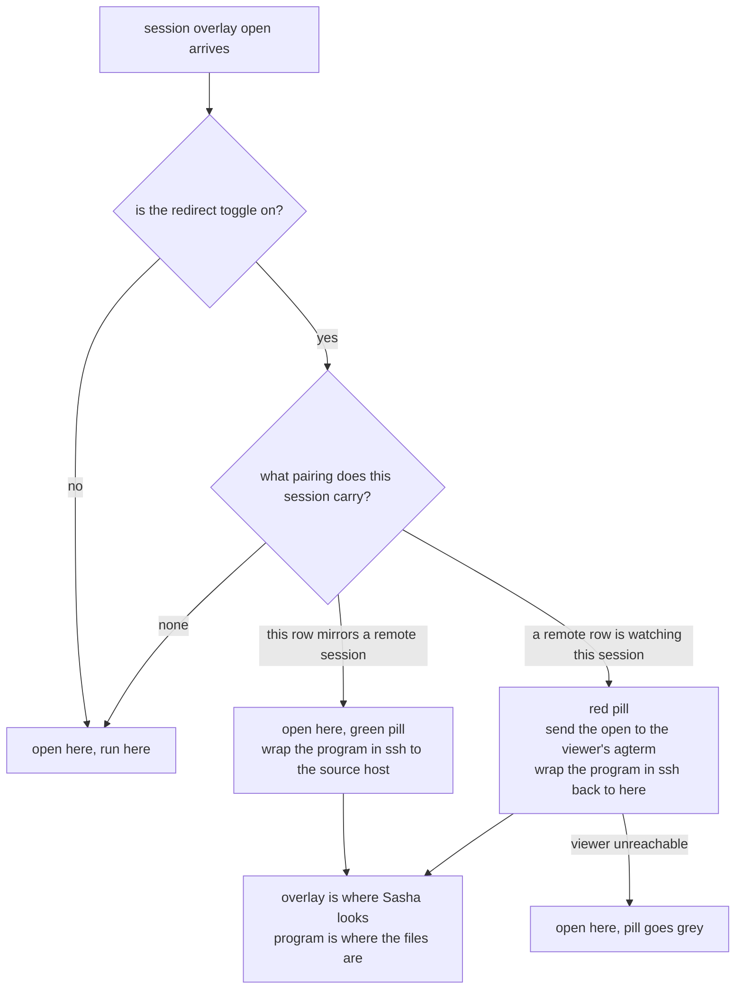

# Overlay redirect: open overlays where Sasha is watching

## Contents

1. [Overview](#overview)
2. [Context (from discovery)](#context-from-discovery)
3. [Development Approach](#development-approach)
4. [Testing Strategy](#testing-strategy)
5. [Progress Tracking](#progress-tracking)
6. [Solution Overview](#solution-overview)
7. [Technical Details](#technical-details)
8. [Implementation Steps](#implementation-steps)
9. [Post-Completion](#post-completion)

## Overview

Sasha's agent sessions run on the workstation. He sometimes works from the laptop, picking the same session
up through a mirrored agterm row over mosh and zmx. Text flows fine. Overlays do not: revdiff, lazygit,
vifm, the fzf pickers and the status HUD all render on the workstation, where nobody is sitting. That makes
the laptop a read-only window instead of a place to work.

This work makes an overlay open on the machine Sasha is looking at, while its program keeps running on the
machine that holds the files. It adds a pill in the title bar so he can always see which of the two is
happening.

It covers the nine keymap chords that run `agtermctl session overlay open`, and every script or hook that
calls the same command. It does **not** cover the status HUD, which has its own control commands and never
passes through the overlay choke point. See "Left out on purpose".

Two things it must not break:

- The everyday desk path, with nobody watching remotely, stays exactly as it is today, with no network call
  anywhere near the overlay.
- `agterm-zmx-mirror` keeps its existing ownership marker in `restoreCommand`. That marker is what stops the
  job closing rows it does not own.

## Context (from discovery)

- **The spec** is `~/.claude/plans/2026-08-11-laptop-mirror-overlays.md`. The brief that started the work is
  `~/.claude/plans/2026-08-11-overlay-redirect-brief.md`. The approved plan this file normalizes is
  `~/.claude/plans/cheerful-nibbling-whale.md`.
- **Repository**: the fork `p4elkin/agterm-vim`, remote `vimfork`, branch `main`. Work happens in the
  isolated worktree `~/dev/oss/agterm/.claude/worktrees/overlay-redirect`, branch `overlay-redirect`.
- **The base is `native-zmx-wrapping`, settled before task 1 started.** That branch is not merged into
  `vimfork/main`, but it already changes `Session.swift`, `Snapshot.swift`, `AppStore.swift`,
  `AppStore+Snapshot.swift`, `ControlProtocol.swift`, `ControlDispatcher.swift` and `ControlServer.swift` —
  every model file tasks 4 to 9 touch. The spec's own "Order of work" decided the wrapping lands first so
  the pairing fields land while the model is already open, rather than as a second pass. `overlay-redirect`
  was rebased onto it and every line number below was re-read on that base. ⚠️ This work therefore rides on
  an unmerged branch: `native-zmx-wrapping` has to reach `vimfork/main` before this can.
- **Read but do not modify**: the worktree `~/dev/oss/agterm/.claude/worktrees/zmx-wrapping` on branch
  `native-zmx-wrapping`. Its `.claude/rules/zmx.md` exists only there, not in this worktree, so read it by
  its full path.
- **Shell side**, in a different repository: `~/dev/agterm-agents/bin/agterm-zmx-mirror`,
  `bin/agterm-remote-overlay`, and the existing shell test harness `bin/agterm-zmx-test`.
- **The pattern to copy** is the NORMAL mode pill, which already does everything this feature needs in the
  same order: pure state in `agtermCore/Sources/agtermCore/NormalModeState.swift`, an app-global observable
  controller in `agterm/Commands/NormalModeController.swift`, a builtin action in `BuiltinAction.swift`, a
  toggle control command dispatched at `ControlDispatcher.swift:679` through `ControlToggleMode.parse`, and
  the pill itself at `agterm/Views/WindowContentView+Titlebar.swift:110,163`.
- **The chain a session field travels is eight places, not five.** `restoreCommand` is the field to copy at
  every one: `Session.swift:216` (live model) → `Snapshot.swift:183` (stored) → `Snapshot.swift:193`
  (initializer) → `Snapshot.swift:214` (`CodingKeys`) → `Snapshot.swift:228` (the custom lossy
  `init(from decoder:)`) → `AppStore+Snapshot.swift:41` (write) → `AppStore+Snapshot.swift:81`
  (`session(from snapshot:)`, the read back) → `AppStore.swift:284` (tree node) →
  `ControlProtocol.swift:540,587` (the wire). Miss the `CodingKeys` or the decoder and the field is written
  to disk and never read back.
- **The choke point**: every overlay Sasha opens goes through `agtermctl session overlay open`, which lands
  in `ControlServer.openSessionOverlay` (`agterm/Control/ControlServer+SessionActions.swift:28`). Nine
  keymap chords use it, not the sixteen the brief and the spec both claim. Only two overlays in the whole
  app bypass the CLI, both editing a config file.
- **A keyless builtin action needs a special case to fire at all.** `CustomCommandRunner.swift:95-97` hands
  `normal_mode`'s whole binding to the key monitor, because an action with no menu item has no other
  dispatcher. Without the same line, `map <chord> <new action>` parses, resolves, and does nothing.

## Development Approach

- **parallel waves**: none — each task builds on the one before it (the pill needs the state, the redirect
  needs the fields), and the one shell task edits a different repository, which a wave worktree cannot cover.
- **testing approach**: TDD (tests first), per Sasha's standing workflow.
- complete each task fully before moving to the next
- make small, focused changes
- **CRITICAL: every task MUST include new/updated tests** for code changes in that task
- **CRITICAL: all tests must pass before starting the next task**
- **CRITICAL: update this plan file when scope changes during implementation**
- run the narrow per-task test command after each change; the full suite runs once in the verify task
- maintain backward compatibility: a session with neither new field set behaves exactly as it does today

## Testing Strategy

- **unit tests**: required for every task that changes code. The decision logic, the field round-trip and
  the toggle all belong in `agtermCore`, which is host-free and therefore fully unit-testable.
- **app-hosted tests**: `make test-app` covers the AppKit side, including the pill and the control server.
- **shell tests**: the mirror job's change is tested in `~/dev/agterm-agents/bin/agterm-zmx-test`, which
  already carries the ownership-marker tests.
- **end to end**: by hand, from the laptop, in the last implementation task. There is no automated harness
  for two machines and this plan does not build one.

⚠️ agterm is the terminal Sasha is using right now. Never run a mutating `agtermctl` command against the
default socket. Read-only `tree` and `window list` are fine. Every write in a test needs an explicitly
isolated socket. Never launch or quit the app, never `pkill agterm`.

## Progress Tracking

- mark completed items with `[x]` immediately when done
- add newly discovered tasks with ➕ prefix
- document issues or blockers with ⚠️ prefix
- keep this plan in sync with the actual work

## Solution Overview

The rule lives in one place, `ControlServer.openSessionOverlay`, because that one function sees both cases:
a chord pressed on the laptop, and a command fired from inside a session on the workstation.

Key design decisions and why:

- **Discovery is by registration, not by probing.** The workstation cannot see the laptop's rows without a
  network call. Measured: one ssh leg to the laptop is 0.43 seconds, and a sleeping laptop costs a full TCP
  timeout. So the laptop tells the workstation it is watching, over the ssh connection the mirror job
  already opens every 20 seconds. The workstation then reads a local field.
- **The app decides, `agtermctl` does the ssh.** Putting ssh in the UI process would block the control
  response. The app answers "local", "mirror of host X" or "watched by host X, row Y"; the CLI carries it out.
- **The escaping is ported, not redesigned.** `bin/agterm-remote-overlay` already solved the escaping chain
  and the ssh-back script, and its reasoning is written down in the file. Only its discovery half is dropped.
- **The pill answers one question**: will my next overlay appear here. Grey covers both "toggle off" and
  "toggle on, but this row has no pairing".

## Technical Details

**The two new session fields**, both optional, both absent on every existing session:

- `mirrorsSession` — on the laptop's row. Which workstation session this row mirrors, and on which host.
  Set by `agterm-zmx-mirror` when it creates the row. Replaces parsing `restoreCommand` for this direction.
- `viewer` — on the workstation's session. Which host is watching, which row id there, and when it was last
  confirmed. Set by the mirror job over its existing ssh connection.

**Liveness**, because a laptop that closes its lid cannot clean up after itself: `viewer` carries a
timestamp and counts as stale after twice the mirror interval (40 seconds by default). One mechanism, not
three. An earlier draft also proposed reading `clients=N` from `zmx list` as a second proof. That is dropped:
the mirror job refreshes the timestamp on every pass anyway, so the client count answers a question the
timestamp has already answered.

**The two phases, and how the app and `agtermctl` talk.** `session.overlay.open` both decides and opens, so
the decision cannot simply be returned or the second, resolved call would re-enter it and loop. The protocol:

1. `agtermctl` sends `session.overlay.open` as it does today.
2. The app runs the decision. On `local` it opens and answers exactly as today. On either redirect outcome it
   opens **nothing** and answers with the outcome, the host and the row id.
3. `agtermctl` builds the wrapped command and re-sends, now with `resolved` set. The app skips the decision
   for a request carrying `resolved` and opens plainly.

`resolved` is a new field on the open arguments. It is not a user-facing flag and is hidden from help.

**`--block` under redirect** is carried, not reimplemented. In the mirror-of case the overlay is local, so
the existing block loop works untouched. In the watched-by case `agtermctl` passes `--block` to the *remote*
`agtermctl` and `exec`s ssh, so the remote side blocks and its exit status comes back through ssh.
`bin/agterm-remote-overlay:286,293` already does exactly this. The local poll loop at
`SessionCommands.swift:692` must never run for a watched-by overlay — it would poll a local session that
has no overlay and report failure.

**Colours**: green on the laptop, the machine Sasha is sitting at and where the overlay lands. Red on the
workstation, whose session is giving its overlays away. Grey everywhere else.

**`--follow`**: the caller's own flag is passed through unchanged. Some chords ask for it and some do not,
and the redirect is not the place to override that.

**Unreachable far side**: open locally, let the pill go grey, print nothing. Every ssh gets
`-o ConnectTimeout=2` so an asleep laptop costs two seconds, not a TCP timeout.

**File length.** `.swiftlint.yml` sets `file_length` to warn at 1000, and `make lint` fails on warnings.
`SessionCommands.swift` is at 917 and `ControlProtocol.swift` at 934 before this work starts. The project
rule is to put new logic in a new file rather than raise the limit, so the CLI side of tasks 4 and 8 goes
into a new `agtermctlKit/OverlayRedirectCommands.swift` from the start, not after the gate fails.

## Implementation Steps

### Task 1: Confirm the ground, and rescue the script task 9 depends on

Mostly read-only. The one write is a commit in a different repository, because the file it saves is currently
untracked and task 9 is told to port from it.

**Files:**
- Modify: `docs/plans/20260811-overlay-redirect-tasks.md` (append a "Findings" section at the end)
- Modify: `~/dev/agterm-agents` (commit the untracked `bin/agterm-remote-overlay` and `bin/agterm-zmx-retire`)

**Model:** sonnet

- [x] ⚠️ commit `bin/agterm-remote-overlay` in `~/dev/agterm-agents` first. `git status` shows it untracked,
      and it holds 293 lines task 9 must port from: the `dq_escape` chain at `:109-113` and the ssh-back
      trigger construction at `:282-284`. Losing it before then loses the reasoning with it
- [x] read `.claude/rules/zmx.md` at its full path,
      `~/dev/oss/agterm/.claude/worktrees/zmx-wrapping/.claude/rules/zmx.md`. It does not exist in this
      worktree
- [x] confirm that a row created with `--command` is never wrapped, so a mirrored row carries exactly one zmx
      layer (the remote one) and the wrapping does not nest zmx inside zmx on the laptop
- [x] confirm that `mirrored_rows()` in `~/dev/agterm-agents/bin/agterm-zmx-mirror:176-190` still finds its
      rows under the wrapping, since it reads the stored `restoreCommand` the wrapping does not touch
- [x] confirm the launch-time orphan sweep does not kill a session that has a laptop client attached
      (a watched session has a client, so it is not a zero-client candidate)
- [x] write the findings into this file, saying plainly which were confirmed and which were not. ⚠️ If any
      comes back negative, stop and report it rather than continuing — each of the three is an assumption
      tasks 8 to 10 are built on

### Task 2: Confirm the rebased base builds

The base was settled before the plan was committed: Sasha chose to rebase onto `native-zmx-wrapping`, and
`overlay-redirect` now sits on it. Every anchor in "Context (from discovery)" and in the task bodies below
was re-read on that base — the wrapping had shifted most of them by roughly ten to twenty lines, because it
adds `zmxPrimaryKey`, `zmxSplitKey` and `keepShellOpen` to the same model files.

What is left is the one thing not yet checked: that the rebased tree actually builds before any task edits it.

**Model:** sonnet

- [x] run `make build` on the rebased branch, before task 3 changes anything — `** BUILD SUCCEEDED **`
- [x] run `cd agtermCore && swift test` to establish the green baseline this work is measured against — all
      2634 tests in 102 suites passed
- [x] ⚠️ if either fails, stop. A red baseline makes every later task's gate meaningless, and the failure
      belongs to `native-zmx-wrapping`, not to this work — neither failed, nothing to stop for

### Task 3: The redirect decision, as pure state in agtermCore

**Files:**
- Create: `agtermCore/Sources/agtermCore/OverlayRedirect.swift`
- Create: `agtermCore/Tests/agtermCoreTests/OverlayRedirectTests.swift`

**Model:** opus

- [x] write the tests first: toggle off gives local whatever the pairing; toggle on with no pairing gives
      local; a mirrors pairing gives mirror-of-host; a viewer pairing gives watched-by host and row; a
      viewer pairing older than the staleness window gives local
- [x] create `OverlayRedirect.swift` with the outcome type (`local`, `mirrorOf(host:)`,
      `watchedBy(host:row:)`) and the pure function that maps toggle plus pairing to an outcome
- [x] add the staleness rule, taking both the window and the current time as parameters rather than reading
      a clock, so the tests pass fixed timestamps
- [x] add the pill colour derivation (grey / green / red) from the same outcome, so pill and behaviour can
      never disagree
- [x] keep the file host-free: no GhosttyKit, AppKit, Metal, CoreGraphics, no CG geometry types
- [x] run `cd agtermCore && swift test --filter OverlayRedirectTests` — must pass before task 4 (16 tests)

### Task 4: Carry the two pairing fields through the session model

Eight sites, not five. Missing the `CodingKeys` or the decoder means the field is written to disk and never
read back, and the round-trip test in this task is what catches that.

**Files:**
- Modify: `agtermCore/Sources/agtermCore/Session.swift` (both fields next to `restoreCommand` at :216)
- Modify: `agtermCore/Sources/agtermCore/Snapshot.swift` (the stored property at :183, the memberwise initializer at :193, `enum CodingKeys` at :214, and the custom lossy `init(from decoder:)` at :228)
- Modify: `agtermCore/Sources/agtermCore/AppStore+Snapshot.swift` (the snapshot written at :41, and the read back in `session(from snapshot:)` beside `session.restoreCommand = snapshot.restoreCommand` at :81)
- Modify: `agtermCore/Sources/agtermCore/AppStore.swift` (the tree node built at :284)
- Modify: `agtermCore/Sources/agtermCore/ControlProtocol.swift` (the wire property at :540 and the initializer at :587)
- Create: `agtermCore/Tests/agtermCoreTests/OverlayRedirectFieldsTests.swift`

**Model:** sonnet

- [x] write the tests first: both fields absent by default; a set field survives a full snapshot encode and
      decode; both appear in the tree node and are omitted when nil; a malformed `viewer` on disk decodes to
      nil rather than throwing
- [x] add `mirrorsSession` and `viewer` at all eight sites, following exactly how `restoreCommand` is carried
- [x] give `viewer` its own small Codable type (host, row id, confirmed-at) in `OverlayRedirect.swift`, and
      honour `Snapshot`'s lossy-decode contract, documented in the comment above `init(from decoder:)` at
      `Snapshot.swift:228`: an unknown shape drops the field to nil, it never throws. A throw there fails the
      whole `SessionSnapshot`, which fails the workspaces array above it, which wipes the entire tree
- [x] document each field in the same style as its neighbours, saying which side sets it and what it means
- [x] confirm a session with neither field set encodes identically to today, so existing consumers do not break
- [x] run `cd agtermCore && swift test --filter OverlayRedirectFieldsTests` — must pass before task 5

### Task 5: A control command that sets the pairing, and the resolved argument

**Files:**
- Modify: `agtermCore/Sources/agtermCore/ControlProtocol.swift` (the command case next to `normalMode = "mode"` at :56, and the `resolved` field on the overlay-open arguments beside the existing open options)
- Modify: `agtermCore/Sources/agtermCore/ControlDispatcher.swift` (the `ControlActions` protocol method at :61, the app-command routing group at :191, and the route itself near the `.normalMode` case at :679)
- Modify: `agterm/Control/ControlServer.swift` (the "dispatcher did not handle" catch-all list at :350)
- Modify: `agterm/Control/ControlServer+SessionActions.swift` (the handler, next to `openSessionOverlay` at :28)
- Create: `agtermCore/Sources/agtermctlKit/OverlayRedirectCommands.swift` (the CLI subcommand; a new file because `SessionCommands.swift` is at 917 lines against a 1000-line lint limit)
- Modify: `agtermCore/Sources/agtermctlKit/Commands.swift` (register the new subcommand beside the existing session group at :92)
- Create: `agtermCore/Tests/agtermCoreTests/OverlayRedirectCommandTests.swift`

**Model:** sonnet

- [x] write the tests first: the command parses its arguments, rejects a missing host, clears the field when
      passed an empty value, and a request carrying `resolved` skips the decision entirely
- [x] add the command so the mirror job can say "this row mirrors session S on host H" and "host H, row R is
      watching this session, as of time T"
- [x] add the `resolved` field to the overlay-open arguments. It is the second half of the two-phase
      protocol: `agtermctl` sets it on its resolved re-send so the app opens plainly instead of deciding
      again and looping. Not a user-facing flag, hidden from help
- [x] make clearing explicit, so a row that stops being mirrored can drop its field
- [x] run `cd agtermCore && swift test --filter OverlayRedirectCommandTests`, then `make build` — both must
      pass before task 6

### Task 6: The redirect toggle and its builtin action

The full fan-out for a `normal_mode`-shaped action is seven files. Six of them are easy to miss, and missing
`CustomCommandRunner.swift` in particular gives an action that parses, resolves and silently does nothing.

**Files:**
- Modify: `agtermCore/Sources/agtermCore/BuiltinAction.swift` (the case next to `normalMode = "normal_mode"` at :24, and the keyless group at :63)
- Modify: `agtermCore/Sources/agtermCore/ControlProtocol.swift` (the command case beside the one added in task 5)
- Modify: `agtermCore/Sources/agtermCore/ControlDispatcher.swift` (the `ControlActions` method at :61, the routing group at :191, and the route next to the `.normalMode` case at :679, reusing `ControlToggleMode.parse`)
- Modify: `agterm/Control/ControlServer+AppCommands.swift` (the implementation, beside `setNormalMode` at :77)
- Modify: `agterm/Control/ControlServer.swift` (the catch-all list at :350)
- Modify: `agterm/AppActions+Palette.swift` (the `perform(_:)` switch, beside `case .normalMode: enterNormalMode()` at :105)
- Modify: `agterm/Commands/CustomCommandRunner.swift` (the `builtinSequences` block at :95-97, which hands a keyless action's binding to the key monitor)
- Create: `agterm/Commands/OverlayRedirectController.swift` (modelled on `agterm/Commands/NormalModeController.swift`)
- Modify: `agtermCore/Sources/agtermctlKit/OverlayRedirectCommands.swift` (the CLI toggle subcommand, in the file created in task 5)
- Create: `agtermCore/Tests/agtermCoreTests/OverlayRedirectToggleTests.swift`

**Model:** sonnet

- [x] write the tests first: the action's raw value round-trips through the keymap, `on`/`off`/`toggle` all
      resolve through `ControlToggleMode.parse`, and — the one the NORMAL pill's own history says to write —
      a bare `map <chord> <the new action>` actually reaches the controller
- [x] add the builtin action, keyless by default like `normal_mode`
- [x] ⚠️ add the `CustomCommandRunner.swift:95-97` line for the new action. `normal_mode` needed it because
      an action with no menu item has no dispatcher. Without it the chord does nothing and the raw-value
      tests still pass, so the test above is the only thing that catches it
- [x] create the app-global observable controller, holding the state from task 3 and republishing it
- [x] persist the toggle across a restart, so Sasha does not re-arm it every time agterm launches
- [x] run `cd agtermCore && swift test --filter OverlayRedirectToggleTests`, then `make build` — both must
      pass before task 7

### Task 7: The pill in the title bar

**Files:**
- Modify: `agterm/Views/WindowContentView+Titlebar.swift` (the pill next to the `normalModePill` use site at :110 and its definition at :163)
- Create: `agtermTests/OverlayRedirectPillTests.swift`

**Model:** sonnet

- [x] write the tests first: the pill's colour follows the active session's outcome, covering grey from the
      toggle being off, grey from no pairing, green, and red
- [x] add the pill beside the NORMAL pill, same capsule shape, but always present, since grey is a real state
- [x] read the colour from the shared derivation in task 3, never from a second copy of the rule
- [x] run `make test-app` — must pass before task 8

### Task 8: Wire the decision into openSessionOverlay

**Files:**
- Modify: `agterm/Control/ControlServer+SessionActions.swift` (inside `openSessionOverlay` at :28, before the store call at :30-42)
- Create: `agtermTests/ControlServerOverlayRedirectTests.swift`

**Model:** opus

- [x] write the tests first, and start with the path that must not change: toggle off, and toggle on with no
      pairing, both open a plain local overlay with no ssh anywhere in the path
- [x] add the test that closes the loop: a request carrying `resolved` opens plainly and never re-enters the
      decision
- [x] add the tests for the two redirect outcomes: the app opens **nothing** and answers with the outcome,
      the host and the row id
- [x] implement it — read the toggle and the two fields, call the task 3 decision, and either open as today
      or answer without opening
- [x] leave `--follow` exactly as it is: the caller's flag passes through untouched
- [x] run `make test-app` — must pass before task 9 (253 tests, 0 failures)

### Task 9: The ssh leg in agtermctl

**Files:**
- Modify: `agtermCore/Sources/agtermctlKit/OverlayRedirectCommands.swift` (the ssh leg, in the file created in task 5)
- Modify: `agtermCore/Sources/agtermctlKit/SessionCommands.swift` (the `Open` overlay subcommand at :624 — call out to the new file, do not grow this one)
- Create: `agtermCore/Tests/agtermctlKitTests/OverlayRedirectSshTests.swift`

**Model:** opus

- [x] read `~/dev/agterm-agents/bin/agterm-remote-overlay` in full first, including its header comment, which
      explains why the ssh-back command lives in a file rather than inline. Port that reasoning, do not
      redesign it
- [x] ⚠️ write this test first, before any other: a `local` outcome sends exactly the request the open
      subcommand sends today, with no ssh process spawned and no second request. This is the desk path, and
      task 8 only protects it at the app layer
- [x] write the remaining tests: the double-quote escaping matches the script's `dq_escape` at `:109-113`,
      the generated ssh-back script is written byte for byte with no re-parsing, and the caller's command
      gets exactly one shell evaluation
- [x] act on the outcome from task 8: mirror-of wraps the program in ssh to the source host and opens
      locally with `resolved` set; watched-by sends the resolved open to the viewer's agterm over ssh and
      wraps the program in ssh back
- [x] ⚠️ `--block` in the watched-by case is carried, not reimplemented: pass `--block` to the remote
      `agtermctl` and let the exit status return through ssh, as `bin/agterm-remote-overlay:286,293` does.
      The local poll loop at `SessionCommands.swift:692` must never run for a watched-by overlay, or it
      polls a local session with no overlay and reports failure. Add a test that it does not run
- [x] pass `-o ConnectTimeout=2` on every ssh, so an asleep laptop costs two seconds rather than a TCP timeout
- [x] on any ssh failure, fall back to a local overlay and print nothing — the grey pill is the notice
- [x] run `cd agtermCore && swift test --filter OverlayRedirectSshTests` — must pass before task 10
      (17 tests; `SocketClientTests|CommandsTests`, 395 tests, still green)

### Task 10: The mirror job registers both directions

⚠️ Prerequisite: both machines must run the fork build. The laptop's job writes the `viewer` field on the
workstation over ssh, so the workstation's `agtermctl` needs the task 5 command. An un-upgraded far side
rejects it as an unknown subcommand, which is why the write below is best-effort.

**Files:**
- Modify: `~/dev/agterm-agents/bin/agterm-zmx-mirror` (set the mirrors field where the row is created and pinned, at :223-231, and refresh the viewer field inside `reconcile_once` at :194)
- Modify: `~/dev/agterm-agents/bin/agterm-zmx-test` (cases beside the existing ownership-marker tests)

**Model:** sonnet

- [x] write the tests first: a newly created row gets its mirrors field; the workstation session gets its
      viewer field with a fresh timestamp; a failed remote read sets nothing at all; ⚠️ a **failed
      registration write** is logged and the pass continues, rather than aborting the reconcile
- [x] set the mirrors field on the laptop row at creation, next to the existing `session restore` pin
- [x] set the viewer field on the workstation session over the ssh connection the job already opens, and
      refresh its timestamp on every pass
- [x] make the registration write best-effort and say so in a comment: an older `agtermctl` on the far side
      must degrade to today's behaviour, never stop mirroring
- [x] ⚠️ leave the ownership marker in `restoreCommand` completely untouched. It is what stops the job
      closing rows it does not own, and moving it in the same change would risk the laptop's window layout
- [x] keep the rule the job must not break: if any part of the remote **read** fails, the whole pass does
      nothing
- [x] run `~/dev/agterm-agents/bin/agterm-zmx-test` — must pass before task 11 (100 passed, 0 failed)

### Task 11: Verify acceptance criteria

- [x] verify the desk path first: with the toggle off, and with it on but no pairing recorded, every one of
      the nine chords in `~/.config/agterm/keymap.conf` that runs `session overlay open` behaves exactly as
      today, with no ssh in the path — confirmed automatable, without pressing a chord. Grepped
      `~/.config/agterm/keymap.conf`: exactly nine `session overlay open` lines, matching the plan's own
      count. `agtermTests/ControlServerOverlayRedirectTests.swift` asserts, at the app-hosted `ControlServer`
      layer, that toggle-off and toggle-on-with-no-pairing both actually open the overlay
      (`session.overlayActive` true) with `response.result?.overlayRedirect` nil, and that a stale viewer
      also falls through to local. `agtermCore/Tests/agtermctlKitTests/OverlayRedirectSshTests.swift`
      asserts, at the `agtermctl` CLI layer, that a `local` outcome sends exactly today's request with
      `effects.ssh.isEmpty` and `effects.scripts.isEmpty` — no ssh process, no ssh-back script. Both suites
      pass (see the `swift test` / `make test-app` runs below). This is the evidence for the desk path, not
      a re-derivation of it
- [x] verify from the laptop, by hand, case one: press `cmd+ctrl+shift+m` on a mirrored row and see lazygit
      showing the workstation's repository, not the laptop's — (skipped - needs two machines with the fork
      deployed, plus a live mirrored session; not automatable in this unattended run). NOT verified
- [x] verify from the laptop, by hand, case two: run revdiff inside a mirrored session and see the overlay
      appear on the laptop, with its annotations file written on the workstation — (skipped - needs two
      machines with the fork deployed, plus a live mirrored session; not automatable). NOT verified
- [x] verify `--block` end to end in the watched-by case: the caller sees the program's real exit status —
      (skipped - needs two machines with the fork deployed and a live viewer pairing; not automatable). The
      unit-level contract (remote agtermctl blocks, exit status returns through ssh, local poll loop never
      runs) is covered by `OverlayRedirectSshTests.watchedByPassesBlockToTheRemoteAgtermctlAndNeverPollsHere`,
      but the real cross-machine exit-status round trip was NOT verified
- [x] verify the pill in all three colours on both machines, including after the laptop has slept —
      (skipped - needs two machines with the fork deployed; not automatable). Pill colour derivation itself
      is unit-tested (task 3, task 7) but the real on-screen appearance on both machines was NOT verified
- [x] verify the unreachable path: with the laptop off the network, an overlay opens locally within about
      two seconds and the pill is grey — (skipped - needs two machines, one taken off the network; not
      automatable). The fallback logic (ssh exit 255 falls back to a plain local overlay) is unit-tested in
      `OverlayRedirectSshTests.anUnreachableViewerFallsBackToAPlainLocalOverlay`, but the real two-second
      timing and grey pill on real hardware were NOT verified. ⚠️ Per task 9's recorded `[deviation]`, the
      ssh-back source host falls back to `p4studio.local`, an mDNS name that only resolves on the same LAN.
      This is a known open defect: a real cross-machine check today would hit that fallback and fail even
      with two machines available, exactly the bug this feature exists to fix
- [x] run `cd agtermCore && swift test` — 2691 tests, 107 suites, all passed
- [x] run `make build` — `** BUILD SUCCEEDED **`
- [x] run `make test-app` — 253 tests, 4 skipped, 0 failures, `** TEST SUCCEEDED **`
- [x] run `make lint` — zero findings (`swiftlint lint --strict --quiet` produced no output). `file_length`
      is not a problem: task 8's `[decision]` line records `ControlProtocol.swift` stayed at 971 lines by
      putting `ControlOverlayRedirect` in `OverlayRedirect.swift` instead

### Task 12: [Final] Update documentation

- [x] update the design document `~/.claude/plans/2026-08-11-laptop-mirror-overlays.md`. Two corrections it
      needs: its section 7 says the pairing "already exists", which is only true on the viewer's side; and
      it says sixteen overlay chords where the keymap has nine — both fixed, plus a "Correction, written
      after the fork build shipped" note appended to section 7 recording what was actually built: neither
      field is parsed from `restoreCommand`, both are written by the new `session.pairing` control command,
      the laptop's `mirrorsSession` write is local and the workstation's `viewer` write travels the mirror
      job's existing ssh connection
- [x] add a `.claude/rules/` entry in the fork describing the redirect, the two-phase protocol, the two
      fields and the pill, so a future session loads the design instead of re-deriving it from code —
      `.claude/rules/overlay-redirect.md`, styled on `.claude/rules/zmx.md`
- [x] ⚠️ capture the escaping reasoning from `bin/agterm-remote-overlay` in that rules entry **before**
      retiring the script, then retire it — captured in the rules entry's "The ssh leg, ported from
      bin/agterm-remote-overlay" section (the file-based ssh-back trigger, `dq_escape`, why `--block` uses
      an inspected `Process` rather than `exec`), including what was deliberately NOT ported (the config
      file and the Tailscale self-lookup autodetect) and the known LAN-only mDNS fallback defect this
      leaves open. Retired with `git -C ~/dev/agterm-agents rm bin/agterm-remote-overlay`, commit `b0d7b10`
      in that repository; `bin/agterm-zmx-retire` is a different, unrelated script and was left alone
- [x] ⚠️ fork-only: do not touch `CHANGELOG.md`, `README.md`, `site/`, or `plugins/agterm/skills/agterm/`,
      and do not offer any of this upstream — confirmed untouched, `git status --short` in the fork
      worktree shows only the new rules file
- [x] move this plan to `docs/plans/completed/` — left in place on purpose. Per the plan-execution harness's
      own instruction, the plan file is moved by the harness after all phases finish; moving it here mid-run
      would break every later review/finalize/stats phase that reads this exact path

### Task 13: Carry the workstation's working directory on the mirrors pairing

Added after the second review round, which proved acceptance case one still fails. Root cause, verified live
on the laptop rather than derived: a chord spawns `agtermctl` in the row's `effectiveCwd`
(`CustomCommandRunner.swift:461`); on a mirrored row `currentCwd` is never set, because the remote shell's
OSC 7 carries the workstation's hostname and libghostty drops it (`OSC 7 host () must be local`); so
`effectiveCwd` falls back to `initialCwd`, which `agterm-zmx-mirror` pins to `--cwd "$HOME"`. Every `☁` row
reports `cwd: /Users/sasha`. The redirect therefore sends `cd "/Users/sasha"`, which exists on both machines,
so the `cd` silently succeeds and lazygit opens in the workstation's home instead of the repository.

Sasha chose: carry the remote cwd on the pairing, refreshed every mirror pass like the viewer heartbeat. The
mirror job already reads `$s.cwd` from the workstation tree in `remote_sessions()`, so the data is one field
away and costs nothing on the overlay path. It can be up to 20 seconds stale, which only matters if he `cd`s
and opens an overlay inside the same 20 seconds.

**Files:**
- Modify: `agtermCore/Sources/agtermCore/OverlayRedirect.swift` (add an optional `cwd` to `OverlayMirrorSource` at :5-13, and carry it on `ControlOverlayRedirect` at :65-75 so the answer reaches the CLI)
- Modify: `agtermCore/Sources/agtermCore/ControlDispatcher.swift` (the `setMirrors` construction at :748, and the validation above it at :727)
- Modify: `agtermCore/Sources/agtermctlKit/OverlayRedirectCommands.swift` (a `--cwd` option on `pairing mirrors` beside `--session` at :77-101, and prefer the answer's cwd over `environment.currentDirectory()` in the mirror-of arm)
- Modify: `agterm/Control/ControlServer+SessionActions.swift` (include the pairing's cwd in the redirect answer built at :63-68)
- Modify: `~/dev/agterm-agents/bin/agterm-zmx-mirror` (read `$s.cwd` in `remote_sessions()` at :98, pass it through `register_mirrors_pairing` at :229, and re-assert it every pass alongside the viewer refresh)
- Modify: `~/dev/agterm-agents/bin/agterm-zmx-test` (cases for the new field)

**Model:** opus

- [x] write the tests first: a mirrors pairing carrying a cwd produces a `mirrorOf` answer that includes it; the CLI's mirror-of arm uses the answer's cwd in preference to its own `currentDirectory()`; a pairing with no cwd still falls back to `currentDirectory()` exactly as today
- [x] ⚠️ make the new field OPTIONAL and prove an old snapshot without it still decodes. `Snapshot`'s lossy-decode contract applies, and a throw there costs the whole session tree, not one field — `aMirrorsPairingStoredBeforeTheCwdFieldExistedDecodesWithANilCwd` in `OverlayRedirectFieldsTests`
- [x] add `cwd` to `OverlayMirrorSource` and carry it through to `ControlOverlayRedirect`, so phase one's answer tells the CLI where to `cd`. `OverlayRedirectOutcome.mirrorOf` gained a `cwd` too, since `.redirect` is the single mapping from outcome to wire answer
- [x] add `--cwd` to `pairing mirrors` and have the mirror job send the workstation's real cwd, refreshed every pass
- [x] ⚠️ do not reintroduce a per-row ssh: the refresh must ride the single batched ssh the previous fixer pass introduced in `refresh_viewer_registrations` — no new ssh of any kind. The cwd comes out of the tree `remote_sessions()` already reads, via the new pure-text `remote_cwd_for` lookup
- [x] run `cd agtermCore && swift test --filter OverlayRedirect`, then `make build`, then `~/dev/agterm-agents/bin/agterm-zmx-test` — all must pass before task 14. 84 tests in 5 suites passed; `** BUILD SUCCEEDED **`; 110 passed, 0 failed (was 100). Also `scripts/test-app.sh -only-testing:agtermTests/ControlServerOverlayRedirectTests` — 17 tests, 0 failures — for the new hosted `testMirrorsPairingAnswersWithTheRecordedCwd`

### Task 14: Resolve the ssh-back source host from a config file

The source host currently falls back to `ProcessInfo.hostName` on the Swift side and bare `hostname` in the
mirror job — `p4studio.local` and `p4air.local`, mDNS names that resolve only on the same LAN. Off-LAN the
ssh-back fails and the silent local fallback puts the overlay back on the machine nobody is watching, which
is the bug this whole feature exists to remove.

Sasha chose the config file, which is what the retired `bin/agterm-remote-overlay` read before task 12 deleted
it (its `read_config` and `resolve_source_host` are recoverable with
`git -C ~/dev/agterm-agents show HEAD~2:bin/agterm-remote-overlay`). Not the Tailscale autodetect: a written
file is inspectable and does not depend on a CLI whose install location varies.

**Files:**
- Modify: `agtermCore/Sources/agtermctlKit/OverlayRedirectCommands.swift` (`resolveSourceHost` at :159-169 — insert the config-file read between the env vars and the hostname fallback)
- Modify: `~/dev/agterm-agents/bin/agterm-zmx-mirror` (`mirror_self_host` at :222 — same precedence on the laptop side)
- Modify: `~/dev/agterm-agents/bin/agterm-zmx-test` (cases for the precedence chain)
- Modify: `.claude/rules/overlay-redirect.md` (replace the known-defect note with the config file, its path, its format, and the precedence)

**Model:** sonnet

- [x] write the tests first, covering the whole precedence chain in order: explicit env var, then config file, then hostname. `resolveSourceHost` already takes its inputs as parameters for exactly this and no test has ever used that
- [x] read the retired script's `read_config` before writing a new parser — it already handles comments, whitespace and a missing file, and its format is `self=<name>` one per line
- [x] use one config path for both sides, `~/.config/agterm-overlay-redirect.conf`, and treat a missing file as "not configured" rather than an error
- [x] ⚠️ keep `hostname` as the last resort rather than failing: a single-machine user who never configures anything must keep today's behaviour exactly
- [x] update the rules entry: this closes the mDNS defect recorded there, so the note becomes setup instructions rather than a known bug
- [x] run `cd agtermCore && swift test --filter OverlayRedirectSsh`, `make build`, `make lint`, and `~/dev/agterm-agents/bin/agterm-zmx-test` — 35 Swift tests passed, `** BUILD SUCCEEDED **`, lint zero findings, 116 shell tests passed (was 110)

## Findings (Task 1)

All three assumptions are **confirmed**. Nothing below blocks tasks 8 to 10.

- **`bin/agterm-remote-overlay` and `bin/agterm-zmx-retire` are committed** in `~/dev/agterm-agents`, commit
  `f7a428d`. Task 9 can port `dq_escape` (`:109-113`) and the ssh-back trigger construction (`:282-284`)
  from a tracked file.
- **A `--command` row is never wrapped — confirmed.** `.claude/rules/zmx.md`, "Wrap decision": a pane is
  wrapped only when, among other conditions, "it has no pinned command (would run a shell, not replace
  it)." A mirrored row is created with `agtermctl session new --command "$cmd"` in
  `agterm-zmx-mirror:223-231`, so it is pinned from creation and the native-zmx-wrapping feature does not
  touch it. One zmx layer only (the remote `zmx attach` inside the ssh command), never two.
- **`mirrored_rows()` still finds its rows under the wrapping — confirmed.** Because the row is never
  wrapped (previous point), its stored `restoreCommand` in the tree JSON is exactly the `mirror_attach_command`
  string the job pinned, unchanged by the wrapping feature. `mirrored_rows()`
  (`~/dev/agterm-agents/bin/agterm-zmx-mirror:176-190`) reads `$s.restoreCommand`, checks it contains `mosh`,
  the host, and `MIRROR_MARK`, and extracts the key — none of that depends on anything the wrapping feature
  changed.
- **The launch-time orphan sweep does not kill a watched session — confirmed.** `ZmxReaper.orphans` in
  `agtermCore/Sources/agtermCore/ZmxReaper.swift:26-28` (read on the `zmx-wrapping` worktree) filters
  `listing.filter { $0.clients == 0 && ... }` — only an exact zero client count is a candidate, and the
  doc comment above it states an unknown count (`clients == nil`) is never treated as one either. A session
  a laptop is watching has a live zmx client attached, so `clients` is nonzero and it is never in the
  candidate set.

## Post-Completion

**Manual verification**

- Latency: every forwarded overlay adds one ssh hop for its keystrokes. fzf over a big tree will feel it.
  No design here removes that. Worth judging in real use before deciding whether it is acceptable.
- The pill's permanent width in the title bar, on both machines. If it is in the way, adding an Interface
  toggle for it is its own small piece of work with its own rules file, deliberately not folded in here.

**Left out on purpose**

- **The status HUD.** It does not pass through `session.overlay.open`. It has its own control commands,
  `sessionHudOpen` / `sessionHudUpdate` / `sessionHudClose` at `ControlProtocol.swift:44-46` with the CLI at
  `SessionCommands.swift:751`, and real callers in `~/.local/bin/claude-pick-conversation.py` and
  `~/.local/bin/agterm-cheatsheet`. So the HUD and the cheat sheet keep appearing on the workstation. This is
  a known gap, not an oversight: redirecting them means repeating the whole two-phase protocol on a second
  command family, and it is worth doing only once this one has proven itself.
- **The two overlays that bypass the CLI**, at `agterm/AppActions.swift:351` and `:378`. Both edit a
  machine-specific config file, so staying local is arguably correct.
- **Two viewers at once.** The design assumes one viewer at a time and does not choose a winner between two.
- **Pulling the laptop's attention** to the row an overlay just opened on. That is the `--follow` question,
  and this work passes the caller's flag through rather than answering it.
