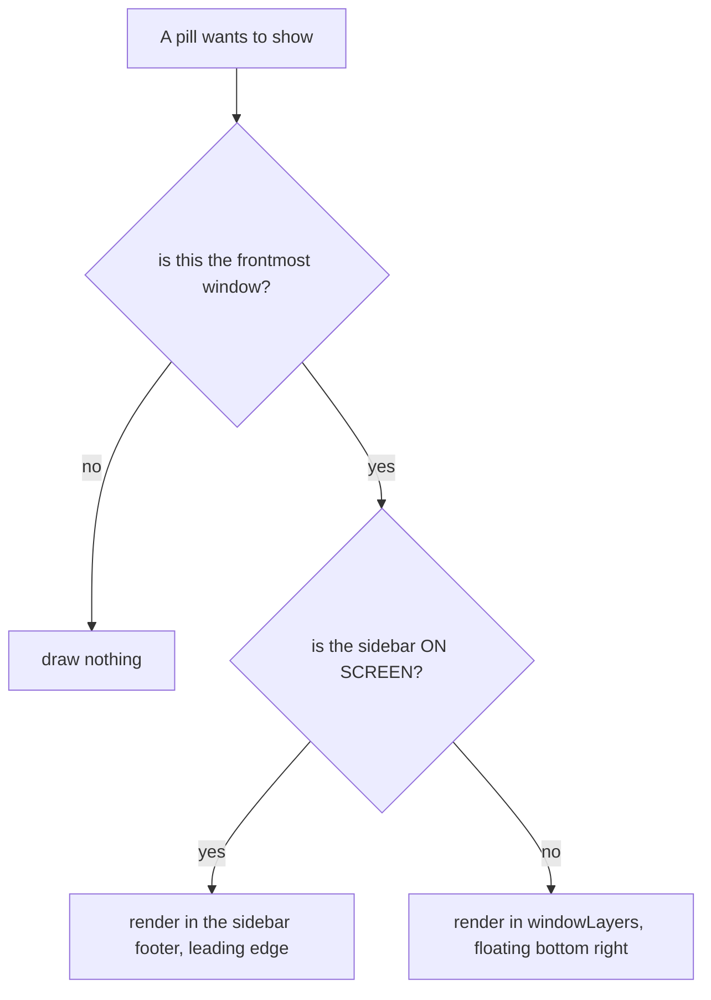

# Move the chrome pills to the sidebar footer

**Status: landed** on branch `chrome-pills-footer`, 2026-08-16. Commits `65aff63` (the move) and
`d51ab24` (the zoom fix). Written 2026-08-13, parked, resumed 2026-08-16.

## Contents

1. [What this changed](#what-this-changed)
2. [The part that needed no code](#the-part-that-needed-no-code)
3. [The two pills](#the-two-pills)
4. [Where the pills go](#where-the-pills-go)
5. [What must not break](#what-must-not-break)
6. [Tasks](#tasks)
7. [Verification](#verification)
8. [What the plan got wrong](#what-the-plan-got-wrong)

## What this changed

NORMAL and OVERLAY left the title bar. They render at the leading edge of the sidebar footer, and
float in the bottom right corner over the terminal whenever the sidebar is not on screen.

No new setting. The pills moved; they were not made configurable. Smallest diff, nothing new in
Settings.

App target only. Nothing in `agtermCore` changed, so `swift test` proved almost nothing here — see
[Verification](#verification).

## The part that needed no code

The four sidebar footer icons were already hideable through **Settings ▸ Interface**. Turning them off
is a settings change, and it empties the footer the pills moved into.

| icon | what it does | Interface element |
|---|---|---|
| `rectangle.stack.badge.plus` | new workspace | `newWorkspace` |
| `plus.rectangle` | new session menu, also "Open Directory…" | `newSession` |
| `square.grid.2x2` | applies or suspends the marked-workspace filter | `focusFilter` |
| flag | the flagged working-set view | `flaggedView` |

The `square.grid.2x2` one is the workspace focus filter. It is drawn at 35% opacity and disabled
whenever no workspace is marked, which is why it looks like it does nothing.

The footer itself is `bottomBar` in `agterm/Views/WindowContentView.swift`.

## The two pills

**NORMAL** — `normalModePill` in `agterm/Views/WindowContentView+Titlebar.swift`. Inverted style:
chrome-coloured capsule with terminal-coloured text, so a mode change does not read as another button.
Shows the armed leader glyphs while a sequence is half typed.

**OVERLAY** — `overlayRedirectPill`, same file. Solid grey/green/red capsule saying which machine the
next `session overlay open` targets. Its own clock, a `TimelineView` on
`overlayRedirectPillTick`, because a viewer going stale is the passage of time and nothing would
otherwise invalidate the body. Gated on `OverlayRedirectController.shared.isEnabled`.

It lost its internal `.padding(.leading, 8)` in this change — that was title-bar glue which would have
double-counted against the container's own spacing.

⚠️ The pill deliberately has no `InterfaceElement` case, and this change did not add one. See
[[overlay-redirect]]; that enum's count is pinned by tests and mirrored in the Settings UI.

## Where the pills go

One container, `chromePills`, holds both pills. It is not `private`: the pills are file-private to the
title-bar extension, while both render sites live in `WindowContentView.swift`. The frontmost-window
gate lives in the container, so it is stated once.

⚠️ **The gate is `sidebarOnScreen`, never `store.sidebarVisible`.** Terminal zoom and the dashboard both
hide the sidebar while leaving that flag set. `sidebarOnScreen` is named once and shared with
`terminalAreaInset`, which needs the same answer for the same reason.

Both render sites gate on it, so exactly one copy of each pill is ever in the view tree. Without that,
zoom leaves the invisible footer copy mounted and `normal-mode-pill` matches twice.

⚠️ **The floating layer mounts in `windowLayers`, not on `detailPane`.** Everything inside
`alwaysMountedSplitLayer` drops to opacity 0 while zoom is on, so a pill hosted there disappears in
exactly the case it exists to cover. It sits at `zIndex(15)` — above the zoom layer, below the picker —
and outside the zoom/non-zoom branch so it survives both.

⚠️ **`allowsHitTesting(false)` is load-bearing twice over.** The floating layer's frame fills the window
so the pills can sit bottom-trailing, so without it the layer swallows every click in the window, not
merely the ones under the capsules.

## What must not break

- **The frontmost-window gate.** There is one app-wide mode and one of this view per window, so without
  it every open window advertises a mode whose keys are not in it. The mode ends on resign-key, so it
  can only belong to the frontmost window — which is what `window list` reports.
- **The armed leader glyphs.** The pill shows the half-typed prefix. That is the whole reason it is
  noticeable enough to prevent silent keystroke eating.
- **The accessibility identifiers.** `normal-mode-pill` is asserted by
  `agtermUITests/ControlNormalModeUITests`, through a whole-app descendant search rather than a fixed
  path, so the move kept it green. Do not rename it.

A benefit rather than a risk: with `toolbarMode == .hidden` the title bar row is not drawn at all, so
the mode indicator used to disappear entirely in that mode. It now shows regardless.

## Tasks

### Task 1: extract the pill container

- [x] add a `chromePills` view holding both pills, carrying the frontmost-window gate
- [x] make it non-`private`, since the render sites are in another file
- [x] run `make lint`

### Task 2: render the pills in the sidebar footer and stop rendering them in the title bar

- [x] render `chromePills` at the leading edge of `bottomBar`
- [x] remove both pills from `titlebarRow`
- [x] drop the OVERLAY pill's internal leading padding
- [x] run `make lint`

### Task 3: float the pills when the sidebar is not on screen

- [x] mount `floatingPillsLayer` in `windowLayers` at `zIndex(15)`, outside the zoom branch
- [x] gate it on `sidebarOnScreen`, and gate the footer copy on the same predicate
- [x] set `allowsHitTesting(false)` and pad off the terminal edge
- [x] run `make lint`

### Task 4: verify

- [x] `cd agtermCore && swift test` — 2878 tests, 109 suites
- [x] `make lint` — zero findings
- [x] `make build`
- [x] `make test-app`
- [x] `-only-testing:agtermUITests/ControlNormalModeUITests`
- [x] manual check in an isolated Debug instance

## Verification

`agtermCore` was untouched, so a green `swift test` said nothing about this change. `make test-app` is
the gate that compiles `agtermTests`, and `ControlNormalModeUITests` is the only automated check that
the pill still exists and is findable — it locates the pill by accessibility identifier and found it in
its new home.

⚠️ **A baseline `make test-app` was run before any edit and was GREEN**, so every later failure would
have been this change's. Worth repeating on the next app-target change: it costs one run and removes
every "was that already broken?" argument.

Manual states checked in an isolated Debug instance (`AGTERM_STATE_DIR` under `/tmp`, real
`keymap.conf` copied into `<stateDir>/config` because `normal_mode` is a keyless builtin and would
otherwise have no bind):

- sidebar visible, mode on — pill in the footer
- sidebar collapsed, mode on — pill floating bottom right, clicks pass through
- terminal zoom, mode on — pill floating bottom right
- `toolbarMode` hidden, mode on — pill still visible

## What the plan got wrong

Recorded because the gates did not catch it and only looking did.

**Task 3 named the wrong host.** The plan said to attach the floating layer to the terminal detail area,
by analogy with `searchBarLayer`. That analogy fails: the search bar never has to survive zoom, and the
pills do. Built that way, the pills covered a collapsed sidebar correctly and vanished under ⌘⇧↩ — zoom
hides the sidebar without clearing `sidebarVisible`, and drops the layer hosting the pill to opacity 0.
Two independent faults, either of which alone would have hidden it.

Every gate passed the broken version, including the UI test that locates the pill by identifier. The
pill *existed*, correctly, at opacity 0. A view being present and being visible are different
questions, and the automated suite only answers the first.
