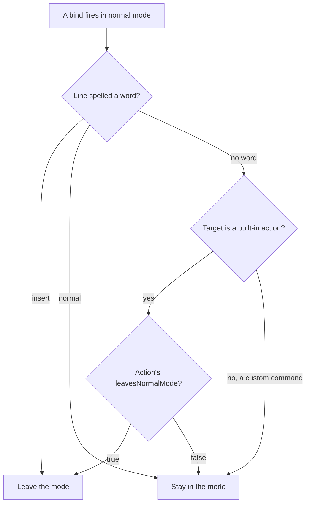

# nmap mode words

## Contents

1. [Overview](#overview)
2. [Context (from discovery)](#context-from-discovery)
3. [Development Approach](#development-approach)
4. [Testing Strategy](#testing-strategy)
5. [Progress Tracking](#progress-tracking)
6. [Solution Overview](#solution-overview)
7. [Technical Details](#technical-details)
8. [What Goes Where](#what-goes-where)
9. [Implementation Steps](#implementation-steps)
10. [Post-Completion](#post-completion)

## Overview

Whether firing a bind also leaves normal mode is decided by the action alone. `BuiltinAction.leavesNormalMode`
returns true for `new_session`, `new_window`, `new_workspace` and `duplicate_session`, and false for
everything else. Its comment explains why `toggle_scratch` and `quick_terminal` were excluded: leaving the
mode there would cost the second press that closes them again.

That reasoning does not survive contact with a real keymap. In the maintainer's file both toggles carry a
global chord as well — ``cmd+ctrl+shift+` `` and ``cmd+ctrl+` `` — so the second bare press is not what closes
them, and opening either one is almost always a request to type. The mode swallowing the first words is
simply wrong there, but hard-coding those two actions into the list would impose the same choice on everyone
using the vim-keys recipe.

This plan adds one optional word at the end of an `nmap` line, so a single bind says what it wants:

```
nmap s toggle_scratch insert      # override: hand the keys over
nmap t quick_terminal insert
nmap f "FZF Files" insert         # works for the quoted form too
nmap space>n new_session normal   # override: keep the mode on
nmap j next_session               # no word: the action decides
```

The action default stays and keeps its four actions. The word overrides it per line, in either direction.

Backward compatible, and provably so: both target forms already reject a trailing word. `nmap s
toggle_scratch insert` gives `unknown action 'toggle_scratch insert'` today, because the target half takes
the whole remainder of the line, and `nmap f "FZF Files" insert` gives `unexpected text 'insert' after
command name; nmap skipped`. No keymap that parses today can change meaning.

## Context (from discovery)

Files and the exact places inside them. Line numbers are against `f60712d`, the rebase tip this plan was
replanted onto; every entry also names its symbol, so a later rebase moving them costs nothing.

- `agtermCore/Sources/agtermCore/Keymap.swift` — `NormalModeBind` (line 56), `ParsedNormalBind` (line 290),
  `parseNormalModeLine` (line 717), `parseNormalModeTarget` (line 756), and `resolveNormalModeBinds`
  (line 802), which builds the final `NormalModeBind` from each parsed line.
- `agtermCore/Sources/agtermCore/KeybindMatcher.swift` — `advance(_:)` (line 41), with two fire paths: the
  exact match at the top, and the re-arm path at line 56 that resets and calls itself.
- `agtermCore/Sources/agtermCore/NormalModeState.swift` — `advance(_:)` (line 53) and its
  `case .fired(.builtin(let action))` branch (line 63), where `if action.leavesNormalMode { exit() }` sits at
  line 66.
- `agtermCore/Sources/agtermCore/BuiltinAction.swift` — `leavesNormalMode` (line 77). Read, not changed.
- `agtermCore/Sources/agtermCore/ControlKeymap.swift` — `ControlKeymapNormalBind` (line 50) and the
  `keymap.normalModeBinds.map` builder (line 160).
- `agtermCore/Sources/agtermctlKit/SocketClient.swift` — the human `normal mode:` block (line 253).
- `cookbook/vim-keys-cheatsheet/cheatsheet.py` — `NMAP_LINE` (line 157), unanchored at the end, so a trailing
  word already parses.

Patterns this follows rather than invents:

- A malformed piece of a line kills the whole line, so a typo cannot hide behind a line that half worked.
  An unknown mode word follows that rule.
- Cross-section resolution runs after all lines are parsed, in `resolveNormalModeBinds`. The word rides on
  `ParsedNormalBind` to reach it, the same way the target does.
- Read-back reports deviations rather than restating defaults, the way `ControlKeymapAction.overridden` is
  set only when the resolved chord differs from the shipped one.

## Development Approach

- **parallel waves**: `foundation (tasks 1-2)`, `apply (tasks 3-4)`, `docs (tasks 5-6)`
- **testing approach**: TDD — each task writes its failing test first
- complete each task fully before moving to the next
- make small, focused changes
- every task includes new or updated tests; they are a deliverable, not an afterthought
- all tests pass before the next task starts
- update this plan file when scope changes during implementation
- run the narrow test command per task; the full suite runs once in the verify task
- maintain backward compatibility

## Testing Strategy

- **unit tests**: required in every task, in `agtermCore/Tests/agtermCoreTests/`.
- **hosted app tests**: `agtermTests/NormalModeKeyRoutingTests.swift` exercises the routing this touches.
  ⚠️ `swift test` does not compile `agtermTests`, so a break there only shows up under `make test-app`.
  That gate runs once, in the verify task.
- **no XCUITest**: nothing here changes a launch path or a window, and `ControlAPIUITests` alone is about
  seven minutes.

## Progress Tracking

- mark completed items with `[x]` immediately when done
- add newly discovered tasks with ➕ prefix
- document issues and blockers with ⚠️ prefix
- update the plan if implementation deviates from the original scope

## Solution Overview

Three decisions carry the design.

**Two words, not one.** `insert` and `normal`, so a line can push in either direction. `insert` is named
after the bare exit key `i`, and behaves like it: it leaves quietly and sends no Escape to the pane. That
stays the difference between `i` and `Esc`.

**The action default stays.** `leavesNormalMode` remains the answer when a line says nothing, so no existing
keymap and no recipe example has to change.

**Which mode wins:**



The custom-command branch keeps today's behavior. A command target has never had a hand-over concept, so
without a word it stays in the mode.

## Technical Details

**The grammar.** One optional word after the target, on `nmap` lines only:

```
nmap <key|sequence> <action|"<command name>"> [insert|normal]
```

Not accepted on `map` lines. A global chord fires outside the mode, where there is no mode to leave, and
trailing text on a `map` line is already a diagnostic. An unrecognised word is a diagnostic naming the word,
and the line is skipped.

**How the word reaches the state machine.** The exit happens inside `NormalModeState.advance`, synchronously,
before the caller performs the action. The word has to arrive at that same point, and
`KeybindMatcher.advance` reports `.fired(target)` without saying which bind matched. Two binds can share a
target and carry different words, so the target alone cannot identify the word.

The fix is one read-only property on the matcher holding the keybind the most recent `.fired` matched, set on
both fire paths. `NormalModeState` reads it and looks the bind up. The two alternatives were both worse:
adding an associated value to `MatchResult.fired` touches about thirty references in `KeybindMatcherTests`
for no behavior gain, and rebuilding the keybind inside `NormalModeState` from `pendingPrefix` would copy the
matcher's re-arm rule into a second place, where it would drift.

**Read-back.** `ControlKeymapNormalBind` gains an optional `mode`, set only when the effective value differs
from the action default. So `nmap space>n new_session insert` prints no word, because `insert` already is
that action's default. The docs must say this, or a missing word reads as a dropped line.

**One helper, two consumers.** The effective value — line word, else action default, else stay — is a single
computed property on `NormalModeBind`, written in task 1. Task 3 and task 4 both read it, so the rule in the
diagram above exists in exactly one place.

## What Goes Where

- **Implementation Steps**: parser, matcher, state machine, read-back, docs, cheat sheet, and their tests.
- **Post-Completion**: the maintainer's own `keymap.conf`, the fork rebuild and deploy, and re-copying the
  installed cheat sheet. None of those are repository changes.

## Implementation Steps

### Task 1: Parse the mode word on an nmap line

**Files:**
- Modify: `agtermCore/Sources/agtermCore/Keymap.swift` (add the word to `NormalModeBind` and
  `ParsedNormalBind`; split it off in `parseNormalModeLine`; carry it through `resolveNormalModeBinds`)
- Modify: `agtermCore/Tests/agtermCoreTests/KeymapTests.swift` (next to the existing `nmap` parse cases)

**Model:** opus
**Wave:** foundation

- [ ] add the mode word type and store it on `NormalModeBind`, with the computed property that resolves
      line word, else `action.leavesNormalMode`, else stay
- [ ] carry the word on `ParsedNormalBind` and pass it through `resolveNormalModeBinds`
- [ ] split a trailing `insert`/`normal` off in `parseNormalModeLine`, before `parseNormalModeTarget` sees
      the text, so the built-in and quoted forms share one rule
- [ ] diagnose an unrecognised trailing word by name and skip the line
- [ ] write tests for both target forms with each word, and for a line with no word
- [ ] write tests for an unknown word, for a word on a `map` line still being a diagnostic, and for a
      keymap with no word parsing exactly as it does today
- [ ] run `cd agtermCore && swift test --filter KeymapTests` — must pass before the next task

### Task 2: Record which keybind fired

**Files:**
- Modify: `agtermCore/Sources/agtermCore/KeybindMatcher.swift` (add the property next to `pendingPrefix`;
  set it on both fire paths in `advance(_:)`)
- Modify: `agtermCore/Tests/agtermCoreTests/KeybindMatcherTests.swift`

**Model:** sonnet
**Wave:** foundation

- [ ] add the read-only property holding the keybind the most recent `.fired` matched
- [ ] set it on the exact-match path at the top of `advance(_:)`
- [ ] set it on the re-arm path, where the match is the fresh chord alone
- [ ] write tests for a single-chord bind, a sequence bind, and the re-arm case
- [ ] write a test that an `.armed` or `.unmatched` result leaves the previous value alone rather than
      reporting a fire that did not happen
- [ ] run `cd agtermCore && swift test --filter KeybindMatcherTests` — must pass before the next task

### Task 3: Apply the word when a bind fires

**Files:**
- Modify: `agtermCore/Sources/agtermCore/NormalModeState.swift` (replace `if action.leavesNormalMode
  { exit() }` in the `.fired(.builtin)` branch of `advance(_:)`; extend the `.fired(.command)` branch)
- Modify: `agtermCore/Tests/agtermCoreTests/NormalModeStateTests.swift`

**Model:** opus
**Wave:** apply

- [ ] keep the binds on the state so the fired keybind can be looked up
- [ ] resolve the effective mode through the task 1 helper and apply it in the built-in branch
- [ ] apply it in the custom-command branch too, which today never leaves the mode
- [ ] write tests for all six paths in the diagram: each word on each target kind, and no word on each
- [ ] write a test that two binds sharing one action but carrying different words behave differently
- [ ] write a test that a sequence bind's word applies, so the re-arm path is covered end to end
- [ ] run `cd agtermCore && swift test --filter NormalModeStateTests` — must pass before the next task

### Task 4: Report the word in keymap list

**Files:**
- Modify: `agtermCore/Sources/agtermCore/ControlKeymap.swift` (add optional `mode` to
  `ControlKeymapNormalBind`; set it in the `keymap.normalModeBinds.map` builder)
- Modify: `agtermCore/Sources/agtermctlKit/SocketClient.swift` (the `normal mode:` block that renders
  `"    \(bind.bind)  \(target)"`)
- Modify: `agtermCore/Tests/agtermCoreTests/ControlKeymapTests.swift`

**Model:** sonnet
**Wave:** apply

- [ ] add the optional `mode` field, documented as present only when it changes the outcome
- [ ] set it in the builder by comparing the effective value against the action default
- [ ] render it as a third column in the human `normal mode:` block
- [ ] write tests that a word differing from the default is reported, on both target kinds
- [ ] write tests that a wordless bind and a word matching the action default both omit the field
- [ ] run `cd agtermCore && swift test --filter ControlKeymapTests` — must pass before the next task

### Task 5: Document the grammar

**Files:**
- Modify: `.claude/rules/keymap.md` (the `nmap` grammar paragraph and the read-back note)
- Modify: `cookbook/vim-keys/README.md` (the paragraph ending "they toggle, and leaving the mode would cost
  the press that closes them again")
- Modify: `plugins/agterm/skills/agterm/SKILL.md` (the keymap section, sole source for installed Claude and
  Codex copies)
- Modify: `FORK-NOTES.md` (the list of what the fork adds)

**Model:** sonnet
**Wave:** docs

- [ ] state the grammar, the two words, and that the action default applies when a line says nothing
- [ ] state that an unknown word skips the line
- [ ] state that `keymap list` prints the word only when it changes the outcome, so a redundant word
      showing nothing is not a dropped line
- [ ] replace the recipe paragraph that says the toggles cannot hand over, and show `s` and `t` with the word
- [ ] run `make lint` — must pass before the next task

### Task 6: Show the word on the cheat sheet

**Files:**
- Modify: `cookbook/vim-keys-cheatsheet/cheatsheet.py` (`NMAP_LINE` and the normal-mode row it feeds)
- Modify: `cookbook/vim-keys-cheatsheet/README.md` (the section describing the normal-mode block)

**Model:** sonnet
**Wave:** docs

- [ ] capture the optional trailing word in `NMAP_LINE`
- [ ] show it on the normal-mode row, and show nothing when the line carried no word
- [ ] confirm a keymap with no mode word renders exactly as it does today
- [ ] run the cheat sheet against a keymap fixture carrying each word and read the output

### Task 7: Verify acceptance criteria

- [ ] verify every requirement in Overview is implemented
- [ ] verify a keymap with no mode word parses, resolves and renders exactly as before
- [ ] run `cd agtermCore && swift test`
- [ ] run `make test-app` — the only gate that compiles `agtermTests/NormalModeKeyRoutingTests.swift`
- [ ] run `make lint` — zero findings required
- [ ] launch a Debug instance with an isolated state dir and a short socket, its `keymap.conf` carrying
      `nmap s toggle_scratch insert`, `nmap t quick_terminal insert` and `nmap space>n new_session normal`
- [ ] in that instance, enter the mode, press `s`, and confirm typed characters land in the scratch
- [ ] in that instance, press `space` then `n`, and confirm the mode pill is still up
- [ ] `agtermctl --socket <isolated> keymap list` shows `insert` on the two toggles, `normal` on `space>n`,
      and no word on a wordless bind

### Task 8: [Final] Update documentation

- [ ] update `CLAUDE.md` if a new pattern emerged worth recording
- [ ] move this plan to `docs/plans/completed/`

## Post-Completion

*Items requiring manual intervention or external systems — no checkboxes, informational only*

**Manual steps for the maintainer:**

- Add `insert` to the `s` and `t` lines in `~/.config/agterm/keymap.conf`, then reload with `cmd+ctrl+;`.
  Nothing in this plan writes to the live config.
- Rebuild and redeploy the fork. None of this is reachable from the daily terminal until then.
- Re-copy the four cheat sheet files into `~/.local/bin/agterm-cheatsheet/`. The installed copy is
  deliberately detached from the checkout and does not update itself.

**Left out on purpose:**

- `toggle_split` is untouched. It sits in the same excluded group as the two toggles, but a split was not
  part of the request, and after this change one word in `keymap.conf` covers it.
