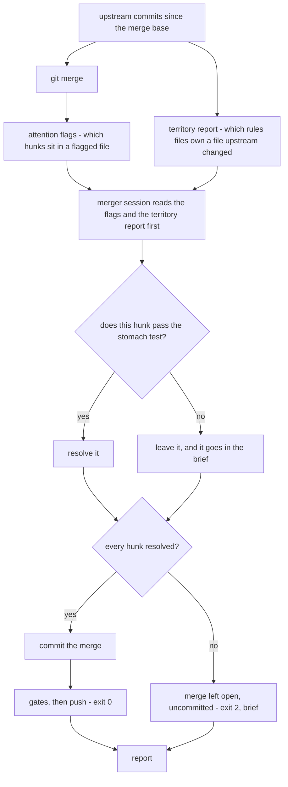

# Triage an upstream merge instead of bailing out on any conflict

Written 2026-08-23. Design agreed with Sasha in conversation on the same day.
The job this changes is `~/.local/bin/agterm-vim-rebase/daily-rebase.sh`, symlinked from
`/Users/sasha/dev/n8n/scripts/agterm-vim-rebase/daily-rebase.sh`.

## Contents

1. [Why the current rule is too blunt](#why-the-current-rule-is-too-blunt)
2. [What we measured](#what-we-measured)
3. [The shape of the change](#the-shape-of-the-change)
4. [The three tiers](#the-three-tiers)
5. [What the script decides, and what the agent decides](#what-the-script-decides-and-what-the-agent-decides)
6. [The territory report](#the-territory-report)
7. [The merger session](#the-merger-session)
8. [The skill](#the-skill)
9. [The brief](#the-brief)
10. [The gate fixer becomes diagnose only](#the-gate-fixer-becomes-diagnose-only)
11. [Exit codes](#exit-codes)
12. [The rerere trap](#the-rerere-trap)
13. [What must not happen](#what-must-not-happen)
14. [Tasks](#tasks)
15. [Verification](#verification)

## Why the current rule is too blunt

Today the job has one rule for conflicts. Any conflict at all stops the run. The merge is left on
disk and a person resolves it by hand.

That rule was right when it was written. It replaced a worse thing, which was an agent resolving
conflicts unattended. But it treats two very different situations as one.

Most conflicts in this fork are mechanical. Both sides add a line near the same place, and the only
reason git could not merge them is that the lines are adjacent. Stopping the whole run for those
wastes a person's evening.

A few conflicts are real. Both sides changed the same text, and choosing between them needs someone
who knows what the fork is for. Those must never be resolved by guessing.

There is also a third case the current rule cannot see at all. Upstream can change a file the fork
depends on without conflicting with it. Nothing flags that, and it is where the worst defect so far
came from. `fork-merge.md` already says this in its own words: the conflict count predicts nothing.

## What we measured

All numbers are from 2026-08-23, against merge base `834b74a` (2026-08-17) and upstream tip
`5d22904` (2026-08-21).

- Upstream changed **81 files** since the merge base.
- **12 files conflict.** Across them there are **19 conflict hunks** holding **242 lines**.
- **13 fork-owned files that upstream changed do not conflict.** These are the silent ones.
- The rules files declare **127 paths** between them in their `paths:` frontmatter.
- But **117 Swift files the fork has modified are declared in no rules file at all.**

Three cheap ways to grade a conflict were tried, and all three gave a wrong answer on this merge.

- Counting files says twelve, which sounds serious. Nearly every one is a single small hunk.
- Counting lines in a hunk ranks a 59 line hunk in a test file above a 12 line hunk in a rules file.
  The small one is the one that needs a person.
- Asking whether the three way base section is empty looked promising and still fails.

Here is the case that killed the third idea. In `AppStore.swift`:

```
<<<<<<< HEAD
                       sessionRecency: controlSessionRecency(),
                       pickPending: pickPending())
||||||| 834b74a
                       pickPending: pickPending())
=======
                       pickPending: pickPending(), app: app)
>>>>>>> upstream/master
```

The base section is not empty, so the rule calls it a real decision. It is not. The fork added one
argument before an existing line. Upstream added a different argument after it. Nothing overlaps.

Now the one that does need a person, from `.claude/rules/settings.md`. The fork edited a sentence to
mention the recency dwell. Upstream rewrote the same sentence to mention the quick terminal panel
size, and reflowed the lines while doing it. Two edits to one sentence. Smaller than the case above,
and much harder.

No cheap measurement separates those two. Reading them does. That is the whole reason the grading
belongs to an agent and not to the script.

The silent files matter just as much. One of them is `agterm/agtermApp.swift`, which `zmx.md`
declares as its own. Upstream changed it in commit `131dfc6`, which refuses to restore a captured
command that cannot be replayed faithfully. And `zmx.md` carries an open question in its own text:
whether a restored keep-shell-open row re-runs its command. Upstream just changed that exact area,
and no conflict points at it.

## The shape of the change



- The territory report is a second input, independent of the conflict set. That is what makes the
  silent files visible.
- Grading happens per hunk, not per merge. One hard hunk must not hold up eleven easy ones.
- A flagged file raises the bar for a hunk. It is not a branch of its own, and it never decides the
  outcome by itself.

## The three tiers

| tier | what the merger session did | exit |
|---|---|---|
| resolved | Every hunk resolved. Merge committed. The job gates it and pushes on green. | 0 |
| resolved with review | Same, and the report calls out resolutions a person should check afterwards. Still pushes on green. | 0 |
| stopped | At least one hunk refused. Merge left OPEN on disk, uncommitted. The brief asks Sasha to choose. | 2 |

⚠️ **There is no partial commit, and an earlier draft of this table implied there was.** A merge
holding an unresolved conflict cannot be committed, so "resolve what you can and leave the rest" is
not a third outcome — it is the stopped tier. What the middle tier resolves, it resolves fully; what
it flags, it flags in prose, after the fact.

That is also why the middle tier pushes rather than holding. The only difference between it and the
top tier is a paragraph in the report, and holding a green merge over a paragraph turns every routine
merge into a chore. A wrong call stays findable because the report names it.

## What the script decides, and what the agent decides

The script computes the attention flags. It does not decide the outcome.

An **attention flag** says a hunk sits in a file where a plausible resolution has silently killed
behaviour before. It raises the bar for that hunk. It is not a stop.

The flagged files, and the sensitive constructs inside them, live in `.claude/rules/fork-merge.md`'s
frontmatter as `flagged:` and `constructs:`. Both the job and the skill read them from there at run
time. "Keeping the lists current" in that file owns how an entry arrives and why the lists cannot be
derived.

As of 2026-08-23 the flagged files are:

- `agterm/Commands/CustomCommandRunner.swift`
- `agtermCore/Sources/agtermCore/Keymap.swift`
- `agtermCore/Sources/agtermCore/BuiltinAction.swift`
- `agtermCore/Sources/agtermCore/NormalModeState.swift`
- `agtermCore/Sources/agtermCore/KeybindMatcher.swift`

An earlier draft made a flag an unconditional stop. That was wrong for two measured reasons.

**The files are not the same size, so a file-level rule is coarse on half of them.**

```
548 lines  CustomCommandRunner.swift
999 lines  Keymap.swift
 94 lines  BuiltinAction.swift
101 lines  NormalModeState.swift
 76 lines  KeybindMatcher.swift
```

A conflict at line 800 of `Keymap.swift`, in the diagnostics, has nothing to do with the parse
passes. Stopping the run for it is the same bluntness this whole change removes elsewhere.

**And the reason for an absolute stop has partly expired.** The stop was justified by there being no
test that could see the failure. That was true on 2026-08-10. It is not true now. Every one of these
exists and was checked on 2026-08-23:

```
FullScreenChordTests          agtermTests/FullScreenChordTests.swift
NormalModeEscapeHandoffTests  agtermTests/NormalModeEscapeHandoffTests.swift
NormalModeKeyRoutingTests     agtermTests/NormalModeKeyRoutingTests.swift
NormalModeStateTests          agtermCore/Tests/agtermCoreTests/NormalModeStateTests.swift
KeybindMatcherTests           agtermCore/Tests/agtermCoreTests/KeybindMatcherTests.swift
BuiltinActionTests            agtermCore/Tests/agtermCoreTests/BuiltinActionTests.swift
```

`FullScreenChordTests` exists because of the defect that created the flagged list in the first place.
The exact failure shape is now pinned by a test.

### The stomach test

A flagged hunk may be resolved when all three of these hold. Any one failing makes it tier three.

1. **The hunk's enclosing declaration is not a sensitive construct.** Sensitive constructs are named,
   not inferred:
   - `handleKeyDown`, both overloads, and `handleNormalModeKey`
   - `parseKeymap`, and its four resolve and validate passes
   - all of `BuiltinAction`, `NormalModeState` and `KeybindMatcher`. At 94, 101 and 76 lines they are
     too small to subdivide, so the bar stays highest exactly where keeping it high is cheapest.
     (`allCases` is synthesised by `CaseIterable`, so no hunk can sit inside it — the enum's case
     list and their order are what matter, and guarding the file whole covers both.)
2. **The report names the enclosing declaration of every flagged hunk.** Naming it is the evidence.
   "It looked fine" is not evidence, and failing to show the reasoning is precisely what the
   2026-08-10 agent did.
3. **`make test-app` is green.** It is the only gate that compiles `agtermTests`, where
   `FullScreenChordTests` and `NormalModeEscapeHandoffTests` live. The other three gates all pass on a
   tree where those are broken.

⚠️ **What this still does not catch: fork behaviour with no test.** `fork-merge.md` says so and it
stays true. So the brief names every flagged hunk that was resolved, **even on a run that proceeded
and pushed**. A wrong call then becomes visible after the fact instead of silent, which is the whole
difference between the 2026-08-10 defect and a mistake somebody can find.

The asymmetry from the earlier draft survives in a narrower form. The agent may always move a hunk to
a stricter tier. It may never waive a condition of the stomach test.

## The territory report

The script computes it every run, before the agent starts. For each `.claude/rules/*.md`, take the
`paths:` list in its frontmatter, and intersect it with the files upstream changed since the merge
base. Mark each hit as conflicted or silent.

⚠️ Measure from the merge base, never from `main..upstream/master`. The second form counts every
file the fork added as though upstream had changed it, because those files differ between the two
branches. Measured on 2026-08-23, that mistake reported all 17 zmx paths as touched by upstream when
the true number was 2.

The report is a spotlight, not a fence. It cannot be a fence, because 117 fork-modified files are
declared nowhere. What it does give:

- The agent learns which rules file governs each file it is about to touch, so it can read the
  invariants before resolving.
- Silent hits get named. Those are the ones no gate and no conflict will surface.
- It never goes stale. A new feature joins the monitoring by declaring its paths, which the fork
  already requires when a feature lands.

This is also the indirect zmx monitoring Sasha asked for. On this merge zmx lights up through
`agtermApp.swift` and `AppStore.swift` without a single zmx conflict.

## The merger session

The agent runs as a real agterm session, not as `claude -p`. The job already does this for the
`make test-app` gate, so the path is tested:

```sh
agtermctl session new --name fork-merge --cwd "$JOB" \
  --workspace-name "$WORKSPACE" --create-workspace \
  --command "..."
```

Two consequences to design around.

- An interactive session has no exit status to hand back. The handshake is a file, exactly like
  `$STATE/test-app.exit`. The skill's last step writes the tier and the exit code. The job waits on
  that file and routes on what it reads.
- The session runs in the app's own Aqua session, which is also why the test-app gate is delegated
  this way.

## The skill

`~/.claude/skills/fork-merge-triage/`, outside the repo. Sasha chose this over an in-repo copy for
simplicity.

The merger session discovers it as an ordinary skill, invocable as `/fork-merge-triage`. There is
nothing to inject, no copy in `$STATE`, and no `git show` out of `HEAD`.

Two things it costs, both accepted knowingly.

- A skill under `~/.claude/skills/` is visible in **every** project, not only this one. An in-repo
  copy under `.claude/skills/` would have scoped it to the fork. Simplicity won.
- It is not versioned with the code, so its procedure can drift from the repo. The lists that move
  most — `flagged`, `constructs`, `declined` — were taken out of it for exactly that reason and live
  in `.claude/rules/fork-merge.md` instead.
  The territory report is computed from the repo at run time rather than written into the skill, so
  the part most likely to change stays current by itself.

The skill holds the tier rules, the resolution rules, the stomach test's procedure, the reading of
`handleKeyDown` after any change to `CustomCommandRunner.swift`, the gate set, the handshake contract,
and the brief template.

It does NOT hold the lists. `flagged`, `constructs` and `declined` live in `.claude/rules/fork-merge.md`'s
frontmatter and are read at run time, so they are versioned with the code they describe. See
"Keeping the lists current" there.

The resolution rules are the ones the fork already lives by. Keep upstream's change and re-apply the
fork's intent on top of it. Never drop an upstream fix. Never resolve by deleting fork behaviour.

## The brief

The brief follows the house decision brief format, which the `failure-run-style` skill owns: the run,
the options, the recommendation, the pointers.

The options are the three Sasha named:

1. Accept the cost and plan an agentic merge for the tangled hunks.
2. Offload a session per problem for deeper analysis. The `offload-session` skill is the mechanism.
3. Redesign the fork's own side so the collision stops coming back.

A report is written on **every** run, including a run that proceeded and pushed. It goes in `$STATE`
and the notification names it. A merge that went through should still say what it resolved and why.

## The gate fixer becomes diagnose only

Today a red gate hands the tree to an agent with Read, Edit, Write, Grep and Glob, one attempt, and
then commits whatever changed with `git add -u`.

That has six problems. The worst is `git add -u`, which commits every tracked change rather than the
ones asked for. There is no file list to scope against. Its output is also discarded, so when it
answers "the cause is not obvious merge fallout, change nothing and say so" nobody ever reads that
sentence. It pins no model. It runs after all four gates rather than after the first red one. And it
has no Bash, so it edits code it can never test.

It becomes diagnose only. On a red gate the agent reads the log, writes a brief in the same format,
changes nothing, and the job exits 2. One shape means "a person is needed", whether the merge
conflicted or a gate went red.

## Exit codes

Unchanged, because the n8n Switch knows three:

- **0** finished and pushed
- **1** stopped, nothing pushed
- **2** a person is needed, and the brief says why

## The rerere trap

`rerere.enabled` and `rerere.autoupdate` are both true in this clone, and `rr-cache` is shared
between worktrees.

⚠️ So a resolution recorded in one run is replayed and **staged** in a later one, with no conflict
markers and nobody having read it. The old fixer brief already warned about this. It now has a new
way to bite, because the rehearsal mode added on 2026-08-23 writes preimages into the same cache.
A rehearsal on 2026-08-23 wrote 12 of them, and they were deleted by hand afterwards.

Two rules follow:

- Resolve in a rehearsal or in the real run, never both.
- The skill must tell the agent to read every staged file that was not in its own list, because a
  staged file with no markers is a rerere replay whose judgement is not trusted.

## What must not happen

- Never push to `upstream`. Its push URL is `DISABLED_never_push_to_upstream`.
- Never resolve a conflict by deleting fork behaviour, and never drop an upstream fix.
- Never let the agent push. The script owns that decision, and only after the gates.
- Never weaken, skip or delete a test to make a gate pass.
- Never invent a fourth exit code without changing the n8n routing.

## Tasks

Done already, on 2026-08-23:

1. [x] Put `flagged`, `constructs` and `declined` in `.claude/rules/fork-merge.md`'s frontmatter, with
       "Keeping the lists current" explaining how an entry arrives and why the lists cannot be derived
2. [x] Add the clause to [[release]]'s two-fork-docs rule: a landing feature answers whether it adds a
       flagged file
3. [x] Add `REHEARSE=1` to the job, which runs the whole thing in a throwaway worktree and never pushes

Still to do:

4. [ ] Write `~/.claude/skills/fork-merge-triage/SKILL.md`: the tier rules, the resolution rules, the
       stomach test's procedure, the `handleKeyDown` check, the gate set, the handshake contract and the
       brief template. It reads the lists from the repo rather than carrying them
5. [ ] Add the territory report to the job: intersect each rules file's `paths:` with what upstream
       changed since the merge base, mark conflicted or silent, write it to `$STATE`
6. [ ] Add the attention flags to the job: read `flagged`/`constructs` from the frontmatter, mark each
       conflicted hunk that sits in one, and hand the flags to the agent rather than acting on them
7. [ ] Replace the conflict bail-out with the merger session, spawned through `agtermctl session new`
       and read back through a file
8. [ ] Add the candidate question: files the fork changed since the last merge that sit on the key
       path, minus `flagged`, minus `declined`. Report it on every run, notify without stopping on a
       green run, and escalate a green run to exit 2 once five are unanswered or one is three weeks old
9. [ ] Let a merger session append to `declined` on an explicit answer, and commit that with the merge.
       Never on silence
10. [ ] Turn the gate fixer into diagnose only, and move it to fire after the first red gate
11. [ ] Write the report on every run, and name it in the notification
12. [ ] Declare the fork's undeclared core files in the rules files that own them, starting with
       `NormalModeState.swift`, which appears in none
13. [ ] Rehearse the whole job on a merge that does not conflict, so the gates and the push path get
       exercised for the first time

## Verification

- A rehearsal reaches the gates and the push path, which the 2026-08-23 rehearsal did not, because it
  stopped at the merge in 2.6 seconds.
- The territory report names `agterm/agtermApp.swift` as a silent zmx hit on the pending merge.
- A flagged hunk whose enclosing declaration is a sensitive construct goes to tier three, and one
  whose enclosing declaration is not can be resolved with the declaration named in the report.
- The merge of the 21 pending upstream commits lands with all four gates green.
- `$STATE` holds a report after a run that pushed, not only after one that stopped.
