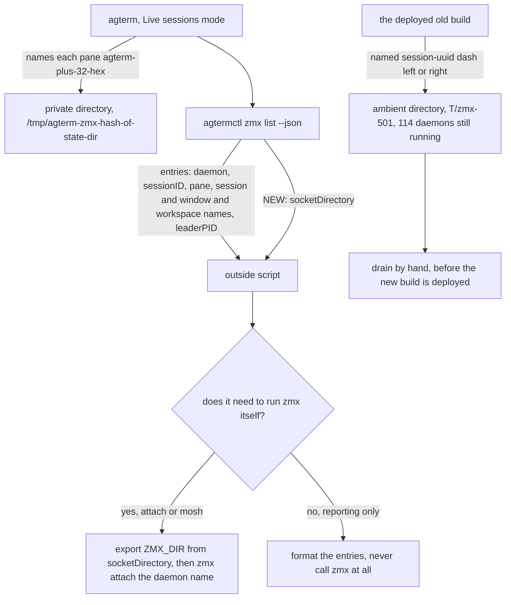

# Adopt upstream's zmx wrapping in the outside agent scripts

Two repositories, two pieces of work. `agterm-vim` puts the zmx socket directory on the wire.
`agterm-agents` repairs three scripts against the new daemon names and deletes three dead ones.
Between them sits one manual step: 114 daemons from the old naming scheme are running right now,
and nothing in the new build will ever claim them.

## Contents

1. [What is true today](#1-what-is-true-today)
2. [The shape of the change](#2-the-shape-of-the-change)
3. [Piece one: the socket directory on the wire](#3-piece-one-the-socket-directory-on-the-wire)
4. [Migration: drain the old namespace, by hand, before the deploy](#4-migration-drain-the-old-namespace-by-hand-before-the-deploy)
5. [Piece two: repair three scripts, delete three](#5-piece-two-repair-three-scripts-delete-three)
5a. [`foregroundShell`, which landed after this plan was drafted](#5a-foregroundshell-which-landed-after-this-plan-was-drafted)
6. [Out of scope: four gaps the merge does not close](#6-out-of-scope-four-gaps-the-merge-does-not-close)
7. [Assumptions](#7-assumptions)

---

## 1. What is true today

### The merge, verified in the code

`b9da29b` deleted the fork's own zmx wrapper and took upstream's. Every claim in the brief holds.

- Daemon names come from a per-pane UUID, not a session id and a role.
  `ZmxSupport.daemonName(for:)` at `agtermCore/Sources/agtermCore/ZmxSupport.swift:159` emits
  `agterm-` plus 32 lowercase hex digits. `isDaemonName` at line 168 accepts exactly that shape and
  nothing else, so `agterm-notes` created by hand is never pruned.
- Daemons live in a private directory. `ZmxSupport.socketDirectory(forStateDirectory:)` at
  `ZmxSupport.swift:154` returns `/tmp/agterm-zmx-` plus an FNV-1a 64 hash of the resolved state
  directory. For the default state directory that is `/tmp/agterm-zmx-f091808f6c0a80d0`. The
  directory exists on this machine already, from a build on 1 September, and is empty.
- Wrapping happens only in Live sessions mode. `ZmxSupport.launchDisposition` at line 120 returns
  `.ordinary` unless the requested mode is `.live`.
- The `agterm_name` label is gone. `agterm/Ghostty/ZmxClient.swift` has no `set` method.
- ⚠️ The socket directory is not on the wire.
  `ZmxSupport.socketDirectory` has exactly one non-test caller, `agterm/agtermApp.swift:251`, which
  hands the value to `ZmxClient.init`, where it is stored `private let` at `ZmxClient.swift:29`. No
  control payload carries it. `ControlZmxInventory` at
  `agtermCore/Sources/agtermCore/ControlPayloads.swift:85` has `restore`, `inventoryComplete` and
  `entries`, and nothing else.

Two smaller facts that change what the scripts must do:

- `ZmxPaneRole` at `ZmxInventory.swift:25` is `left` and `right` only. Scratch and overlay panes are
  never wrapped, so the scripts' `scratch` and `overlay` role handling has nothing left to match.
- Closing a session already kills its daemons. `AppStore.finalizePaneIdentities` at
  `AppStore+Panes.swift:29` and `closeSplit` at line 166 call the pane finalizer, which is
  `client.kill(paneIdentities:)` from `agtermApp.swift:255`. So `agtermctl session close` is now a
  complete replacement for kill-the-daemon-then-close-the-row.

### The live terminal is in the old namespace, with 114 daemons

Read-only, on the default namespace, just now:

- `zmx version` reports `socket_dir /var/folders/cf/.../T/zmx-501`.
- 113 sessions, and a full stock-take joined against `agtermctl tree` says **every one of them matches
  a live agterm row in an open window**. There are no orphans to discard. 112 hold a client; 43 were
  created by the offload launchers; 18 rows have both panes backed. By workspace: `main` 37,
  `tooling` 22, `perf-lab` 21, `agterm` 7, and 26 across thirteen others.
- The one zero-client daemon is `CB4BE4AE-…-right`, the detached split pane of row
  `datastore-investigation` in `main`. A detached pane, not a leak.
- Every name has the old `<session uuid>-left` or `-right` shape.
- The table is at `/tmp/claude-501/zmx-stocktake.tsv`: daemon, clients, pid, row, workspace, window
  state, label, start dir, and whether a launcher created it. Regenerate it before the drain — it is a
  snapshot, and rows come and go.

⚠️ The new build's launch reap runs in the private directory only. It cannot see, claim, prune or kill
any of these 114. They keep running with no client after the app quits, holding whatever agent was in
them, until someone deals with them by hand. Section 4 is that step.

### Live sessions mode is off

`~/Library/Application Support/agterm/settings.json` has 11 keys and neither `restoreMode` nor
`restoreRunningCommand`. `AppSettings.effectiveRestoreMode` at `AppSettings.swift:412` therefore
resolves to `.none`, which is `Fresh shells`.

⚠️ So after the new build is deployed and restarted, no pane is wrapped at all. The mode has to be set
to `live` and the app restarted a second time. That is a deliberate manual step in section 4, not a
defect.

**But `agtermctl zmx list` does NOT report an empty inventory in that state, and a script must not
assume it does.** Measured in the isolated rehearsal: with `active none`, the inventory carries one row
per pane, `state` `claimed` and `observation` `absent`, with no `clients` field. That is
`ZmxInventory.join` returning the union of observed daemons and expected claims, which is what lets
`list` explain a pane whose daemon has vanished. So a reader counting `entries[]` concludes every pane
is backed when none is. **The test for "is this pane really running in a daemon" is
`observation == "running"`, never the presence of a row.** Rehearsed sequence, for section 4 to follow:
`restore mode live` returns `restartRequired`, the same launch still reports `requested none, active
none`, and only after the restart does it report `requested live, active live` with the pane's row
turning to `observation running, 1 client`. The daemon name is unchanged across the restart, because
`paneIdentity` is persisted.

### The six scripts

Spot-checked against the files. The brief's line numbers are right within a line or two.

| script | breaks on the name | breaks on the socket directory | verdict |
|---|---|---|---|
| `bin/agterm-zmx` | yes | yes | rewrite |
| `bin/agterm-zmx-status` | yes | yes | rewrite |
| `bin/agterm-zmx-mirror` | yes | yes, silently | rewrite |
| `bin/agterm-zmx-test` | yes | no | rewrite the key checks |
| `bin/agterm-zmx-sync` | yes | yes | delete |
| `bin/agterm-zmx-retire` | yes | no | delete |
| `zprofile-hook.zsh.example` | it is the origin of the old shape | no | delete |

Unaffected. Do not re-check these.

- `bin/agterm-park`, 2248 lines. Ten mentions of zmx, all of them comments. It never builds a key and
  never runs the zmx binary. See "two assumption drifts" below for the one thing to fix in it.
- `bin/agterm-zmx-whois`. Two mentions of zmx, both comments about other scripts. It resolves a row to
  a Claude conversation through `ps -E`, and never touches a daemon.
- `park-waiter/src/main.rs` and `launchagents/dev.sasha.agterm-zmx-mirror.plist`.

The mirror's silent failure is worth stating on its own, because no error appears anywhere.

> The mirror job wakes on its 20-second pass. `remote_socket_dir()` at
> `bin/agterm-zmx-mirror:296` runs `ssh -n workstation '/opt/homebrew/bin/zmx version'` and reads the
> `socket_dir` field. `zmx version` echoes `$ZMX_DIR` when the caller set it, and a non-login ssh
> command sets nothing, so it reports the default namespace,
> `/var/folders/cf/.../T/zmx-501`. The mirror pins that directory, lists it, and gets nothing back
> from the private directory where the daemons actually are. `reconcile_once()` at line 347 sees an
> empty remote listing, concludes every mirrored row's remote session has ended, and closes them all.
> Then it creates nothing, because there is nothing to mirror. It logs no error at any step.

### Two things the survey missed

**`bin/agterm-zmx-test` breaks too, and nobody named it.** It sources `agterm-zmx` and
`agterm-zmx-mirror` up to their dispatcher markers and unit-tests their helpers. Twelve of its 65
checks are about the old shape: `pane_key` at lines 79-81, `is_pane_key` at 83-95 including
assertions that `-scratch` and `-overlay` keys are accepted, the pinned literal text of `UUID_RE` and
`ROLE_ALT` at 102-105, `key_session_id` at 347, and a fixture at 183 that prints an `agterm_name`
field. Line 747 runs a live `zmx set` and asserts the label appears. All of these will fail, which is
good, but they will fail for the whole suite so nothing else in it gets checked.

**`bin/agterm-park`'s repair model assumes every pane is wrapped.** `cmd_repair`'s docstring at
line 1687 says "agterm wraps every pane as `zmx attach <key> <shell> -lc '<pinned command>...'`". In
Fresh shells mode there is no wrapper, and a restored row's behaviour is decided by the restore mode
alone. Line 1848's warning that "the waiter is then the zmx session's ONLY process" has the same
condition attached. The code is fine either way. Two comments say something that is now true only in
Live sessions mode, and one of them is the explanation a future reader will lean on. Fix the words,
change no logic. `--keep-shell-open` is gone from the app, and `agterm-park` never used it — only
`agterm-zmx-retire` did, which is being deleted.

---

## 2. The shape of the change



Two things to read out of the picture. First, every script that only reports becomes a formatter over
`entries[]` and stops calling `zmx` altogether, which is most of the repair. Second, the one new field
is what lets the remaining `zmx attach` calls survive, and it is why piece one lands first.

---

## 3. Piece one: the socket directory on the wire

### Where the field goes, and why not the other place

The choice: put `socketDirectory` on `ControlZmxInventory`, so only `agtermctl zmx list` carries it.

The alternative was `ControlRestoreStatus`, which `restore.mode` returns bare and `zmx list` repeats as
its header. That would put the directory on both commands, and `restore mode` is the first call a
caller makes. Rejected for three reasons, in order of weight.

- Nobody needs the directory alone. It is an argument to `zmx attach`, whose other argument is a
  daemon name, and `zmx list` is the only command that produces daemon names. A caller that has the
  directory and no name cannot do anything with it. One call should answer the whole question.
- On `restore.mode` the field would frequently be a lie. `restore.mode` answers under `none` and
  `rerun`, where no daemon lives in that directory, and it answers when `zmxClient` is nil in hosted
  tests, where there is no directory at all. `.claude/rules/control-api.md:839` already records this
  exact rule for `unavailableReason`: do not report a live-mode fact under a mode nobody asked for.
- `ControlRestoreStatus` is built by `ControlServer.restoreStatus()` at
  `agterm/Control/ControlServer.swift:557` from the settings model and `GhosttyApp.shared`. It holds no
  zmx client, and `WindowLibrary.directory` is `private` (`WindowLibrary.swift:84`), so it cannot
  recompute the hash either. `listZmxDaemons()` at `agterm/Control/ControlServer+Zmx.swift:13` already
  holds the client that knows the answer.

### The field is optional on the wire and required in the producer

`public let socketDirectory: String?` on `ControlZmxInventory`. The initializer takes
`socketDirectory: String`, last, with no default.

That split is deliberate.

- Optional on the wire, because a new `agtermctl` talking to an upstream-vintage agterm must still
  print `zmx list`. A non-optional `String` would make one missing key fail the decode of the whole
  response. This is the same reason `.claude/rules/control-api.md:842` gives for the modes and states
  travelling as raw strings.
- Required in the initializer, because there is exactly one producer. A default would let it be
  forgotten there, and the CLI would print a blank line with nothing to say why.

⚠️ `agtermCore` is a `.library` product that the `agterm-linux` fork consumes, so a public initializer
with a new required parameter is a source break for any construction site outside this repository.
`ControlZmxInventory` is constructed in exactly one place here, in the app target, so a downstream
consumer that builds this payload has its own equivalent of `ControlServer+Zmx.swift` and its own
socket directory to pass. Check the `agterm-linux` clone before landing rather than assuming, and use
`fork:true` if searching GitHub.

`ZmxClient.socketDirectory` also loses its `private`. Read the value the app is actually using; do not
recompute the hash in a second place.

⚠️ **The recomputation is not merely duplicated work, it is wrong in a way that stays silent.** Proven
by getting it wrong in the rehearsal: `ZmxSupport.socketDirectory` hashes the path after
`standardizedFileURL` and `resolvingSymlinksInPath`, and Foundation's pair of those STRIPS the
`/private` prefix. So for the state directory `/tmp/agz` the app uses
`/tmp/agterm-zmx-e37fc371e9dbafce`, the hash of `/tmp/agz`, while a script reaching for the same answer
through `realpath()` gets `/private/tmp/agz` and so `/tmp/agterm-zmx-9055e82a79b3ad66`. That directory
does not hold the daemon. `zmx list` there does not fail — it creates the directory and answers "no
sessions found". A script would report a healthy empty namespace while every pane was running next
door. This is the whole case for putting the field on the wire.

### Which surfaces the cross-surface contract actually reaches

`.claude/rules/control-api.md:31` lists protocol types, dispatcher, app action, CLI, and tests, and
adds tree read-back for state writes. Working out from that for a nested read-only field on an
existing read command:

| surface | applies? | why |
|---|---|---|
| protocol / round-trip types | yes | the payload gains a field, and the absent-key case needs a decode test |
| dispatcher | no | `zmx.list` already routes at `ControlDispatcher+Zmx.swift:16` and parses no arguments |
| app action | yes | one line in `listZmxDaemons()` |
| CLI | yes, output only | `SocketClient.formatZmx` at `SocketClient.swift:267`. No new argument, so `ZmxCommands.swift` is untouched |
| tree or window read-back | no | not a state write. `restore.mode`'s recorded exemption at `control-api.md:851` is the same situation |
| bundled skill | yes | `reference.md:1420`, `SKILL.md:606`, `examples.md:43` |
| `site/commands.html` | yes | the zmx section at lines 2821-2855 states `zmx list`'s read-back |
| `site/docs.html` | no | it links to the command reference rather than restating the catalog |
| the command-total rule | nothing to do | `control-api.md` forbids any surface stating a total, and this adds no command |

`SkillInstallTests` is not affected. Its count test at
`agtermCore/Tests/agtermCoreTests/SkillInstallTests.swift:60` asserts `fields.count == 16` over
`treeTopLevelFieldNames`, built at line 72 from `Mirror(reflecting: ControlTree(workspaces: []))`.
`ControlTree` is untouched. Confirmed by reading the test, not inferred.

A new `ControlAPIUITests` case is not worth adding. That class is 82 methods and about 7.5 minutes,
and the honest end-to-end check for this field is `ControlServerZmxTests` in the app target, which
already builds a real `ControlServer` with a real `ZmxClient`.

### Tasks

**Socket directory on the zmx list payload.**
Red first: a new test in `agtermCore/Tests/agtermCoreTests/`, named
`theSocketDirectoryRidesTheInventorySoAnOutsideAttachCanFindIt`, encoding a `ControlZmxInventory` and
asserting the wire key `socketDirectory` holds the value passed in. A second test in the same commit,
`anOlderServerOmittingTheDirectoryStillDecodes`, decodes a hand-written JSON object with no
`socketDirectory` key and expects the field to be nil and the rest of the payload intact.
Then add the field and the initializer parameter to `ControlPayloads.swift`.
Verify: `cd agtermCore && swift test --filter ControlPayloads` or the new test's own name.

**The CLI prints it.**
Red first: in `agtermCore/Tests/agtermctlKitTests/ZmxCommandsTests.swift`, a test named
`theDirectoryIsPrintedBecauseAttachingFromOutsideNeedsIt` asserting `formatZmx` output contains the
directory, and a second assertion that a nil directory prints no line rather than an empty one.
Then extend `SocketClient.formatZmx`. Put the directory in the header block with the restore status,
before the rows, because it describes the whole listing and not one daemon.
Verify: `cd agtermCore && swift test --filter ZmxCommandsTests`.

**The app fills it from the client it already holds.**
Red first: in `agtermTests/ControlServerZmxTests.swift`, a test named
`testListReportsTheSocketDirectoryTheClientIsUsing`. The existing `makeServer(runner:)` helper at line
508 builds its `ZmxClient` with `socketDirectory: "/tmp/zmx-dir"`, so the assertion is
`XCTAssertEqual(inventory.socketDirectory, "/tmp/zmx-dir")`.
Then drop `private` from `ZmxClient.socketDirectory` and pass `client.socketDirectory` in
`listZmxDaemons()`.
Verify: `xcodebuild ... -only-testing:agtermTests/ControlServerZmxTests/testListReportsTheSocketDirectoryTheClientIsUsing`.

**The documentation mirrors.**
`plugins/agterm/skills/agterm/reference.md` in the `zmx list` paragraph at 1420: one sentence, that
the listing names the socket directory the daemons live in, and that `ZMX_DIR` must carry it for a
plain shell or a mosh session to reach them. `SKILL.md:606`, one clause. `examples.md:43`, a worked
example that reads the directory and a daemon name out of one `--json` call and attaches — that
example is the reason the field exists, so it earns its place. `site/commands.html`, the `zmx list`
entry at 2843, matching wording.

**The two fork docs, in the same commit as the code.**
`.claude/rules/release.md` requires both. `FORK-NOTES.md` gets one line under
**Control API and tooling** at line 62, beside the `sessionRecency` line. `CHANGELOG-fork.md` gets a
user-facing entry under `## Unreleased` → `### Improved`. Say what it is for: an outside script reads
the directory instead of reimplementing the hash.

No `.claude/rules/fork-merge.md` entry is needed. The rule at "When a feature lands" asks whether the
new behaviour is invisible to the gates. It is not: a merge resolution that took upstream's
`ControlPayloads.swift` whole would fail `swift test` on both new core tests and the CLI test, and
`make test-app` on the app test. Say this in the commit message so the next merger does not have to
re-derive it.

### Gates for piece one

Run each once, at the end.

```
cd agtermCore && swift test
make lint
make release
make test-app
```

⚠️ `make test-app` is the only one of the four that compiles `agtermTests`. The app-side task above
lands its test there, so skipping that gate would leave the one test that proves the field is
populated uncompiled.

---

## 4. Migration: drain the old namespace, by hand, before the deploy

This step comes before the deploy, and nothing in it is automated. Sasha decides what to keep.

The situation, in order:

1. Right now the deployed old build has 114 daemons in `/var/folders/cf/.../T/zmx-501`, 113 with one
   client each. Each holds whatever was running in one pane, mostly parked or live Claude
   conversations.
2. The new build is deployed. Files change under the running app; nothing happens yet.
3. The app is restarted. It wraps nothing, because the restore mode resolves to Fresh shells. It reaps
   in `/tmp/agterm-zmx-f091808f6c0a80d0`, which is empty. The 114 old daemons lose their clients and
   keep running, unclaimed, invisible to every command in the new build.
4. Nothing ever collects them. They are not orphans as far as agterm is concerned, because agterm no
   longer looks in that directory at all.

So, in this order:

**Take stock while the app still holds them.** `zmx list` on the default namespace, saved to a file.
The `agterm_name` label is the human name of each pane, and it is the last time that mapping exists —
the label is gone from the new build and nothing rewrites it. Keep the file.

**Decide, per daemon.** Three outcomes: finish the work in it now, let `agterm-park` archive the
conversation, or discard it. `bin/agterm-park` reads park files rather than daemons, so a parked
conversation survives this independently of its daemon.

**Only then kill what is discarded.** ⚠️ Do this yourself, with the daemon names from the stock-take,
after the app is stopped by hand. Do not write a loop that kills everything the listing returns:
113 of these have a live process in them, and `zmx kill` on the wrong name ends an agent mid-turn with
no undo. The plan does not include a script for this step, on purpose.

**Deploy, restart, then turn Live sessions on.** `agtermctl restore mode live`, then restart again.
Only after that second restart does `agtermctl zmx list` report anything, and only then can piece two
be tested against real daemons. Two restarts, not one: setting the mode changes nothing in the running
process, because a pane is wrapped or not at the moment it is created.

**Check the new namespace is the live one.** `agtermctl zmx list --json` and confirm
`result.zmx.socketDirectory` is `/tmp/agterm-zmx-f091808f6c0a80d0` and the entries have `agterm-`
names. That is also the first real read of the field piece one adds.

---

## 5. Piece two: repair three scripts, delete three

### Delete the three retired scripts

- `bin/agterm-zmx-sync`. Kept only so `agterm-zmx-retire --revert` had a target. Every one of its
  mechanisms is now inside the app: the `mkdir` lock at line 50, the `CLOSE_GRACE` sleep at 313 and
  the reconnect backoff at 322-337 are the pane finalizer, the pending-close window and `zmx prune`.
- `bin/agterm-zmx-retire`. A one-off migration already run. Its precondition
  `deployed_cli_has_flag()` at line 66 greps `agtermctl session new --help` for
  `--keep-shell-open`, a flag this merge removed, so it now refuses to run at all. Its
  `running_app_wraps()` at line 74 hardcodes the old key regex.
- `zprofile-hook.zsh.example`. Line 49 is where the `<uuid>-<role>` scheme was born. It is a record of
  a shape that no longer exists anywhere.

`install.sh` discovers scripts with `find` at line 31, so deleting the files is enough for the
installer. `README.md` needs its three retirement sections cut: the table rows at lines 15 and 40, and
the prose at 74-86 and 127. There is no `dev.sasha.agterm-zmx-sync.plist` left in `launchagents/`.

### `bin/agterm-zmx-status` becomes a formatter

This is the largest deletion and the smallest amount of new code.

Goes:

- The claim reconstruction, lines 86-107 of the embedded Python. It re-implements the app's launch
  reaper outside the app: it reads `~/Library/Application Support/agterm/windows/*.json` directly,
  regex-matches every key in the text, and derives a `-left` and `-right` key from every session id it
  finds. `WINDOWS_DIR` at line 29 goes with it.
- `live_tree()` at lines 42-53 and the multi-document JSON walk at 68-83. `zmx list` output is now
  joined against live windows, pending closes and persisted snapshots by the app itself.
- The `zmx list` subprocess at 113-114, the record reassembly at 115-127 and `field()` at 129-134.
- `KEY_RE` at 62-63, the `sid = key.rsplit('-', 1)[0]` derivation at 161 and the
  `f'{sid.upper()}-left'` claim keys at 105-106.

Stays: the table layout, the colours, the `age()` formatter, the `--watch` alternate-screen loop at
213-226, and the summary counts.

Becomes: one call to `agtermctl zmx list --json`, then a render of `result.zmx.entries[]`. The state
column is `state` and `observation` verbatim, with `windowState` beside it, exactly as the CLI's own
`zmxRow` does at `SocketClient.swift:280`. The header prints `restore` and, when present,
`socketDirectory`. `inventoryComplete == false` prints the app's own warning instead of the script's
`(claim unreadable)` guess.

⚠️ This also fixes the bug the script's own header records at lines 11-22: a restored split's `-right`
daemon printed as an orphan, because `tree` omits a pane that has not rendered. The app's claim walk
reads persisted snapshots and pending closes, which a file scan from outside cannot see, and returns
`unknown` rather than `orphan` whenever the walk was incomplete. The header comment describing the old
workaround should be replaced by one line saying the join now happens in the app.

### `bin/agterm-zmx`: drop the parser, the label and the derived key

Goes:

- `parse_sessions()`, the awk record reassembler at 314-354. It exists only because `zmx list` is not
  one line per session: a `cmd=` value can hold a real newline, which stranded `agterm_name=` on a
  continuation line. `--json` has no such problem.
- `label_session()` at 376-386, including its five-times-0.3-second retry loop waiting for the daemon
  to appear, and every `agterm_name` read. Nothing writes labels any more.
- `pane_key()` at 226-228 and `is_pane_key()` at 233-235. There is no derivable name. A pane's daemon
  is found by matching `sessionID` and `pane` in `entries[]` and reading the `daemon` field.
- `scratch` and `overlay` from `ROLE_ALT` at 107. Those panes are never wrapped.
- `row_keys()`'s first branch at 160-165, which derived one key per surface kind from the session id.
  Its second branch, scanning `restoreCommand` for a pinned key, stays in spirit — see the mirror
  section for the replacement shape.

Stays: `tree_json()` at 121-132, which unions every open window by hand because `agtermctl tree`
defaults to the frontmost. That workaround is still needed for names and cwds. `zmx attach` stays on
the pick and mosh paths, and now takes `ZMX_DIR` from `socketDirectory` instead of relying on the
ambient default. `remote_attach_command()` at 270 and `remote_socket_dir()` at 296 already pin
`ZMX_DIR`; only where the value comes from changes.

`cmd_kill` at 480-499: **do less**. Today it kills each of the row's daemons and then runs
`agtermctl session close`. Session close now kills the row's daemons itself, through the pane finalizer
at `AppStore+Panes.swift:29`. So the whole zmx half of `cmd_kill` is deleted and the function becomes
one `session close` call.

⚠️ Do not translate it into `agtermctl zmx kill` followed by `session close`. Killing a primary pane's
daemon makes the app promote the split survivor into the session, and the `session close` that
followed would then close the promoted session and end the split's live agent. That is a new data-loss
path that does not exist today. The one-call form has no such window.

If a future case really needs `zmx kill` — reaching a pane whose window is closed, which
`session close` cannot address — these are its refusals, from
`ControlZmxError.killRefusal` in `agterm/Control/ControlServer+Zmx.swift`:

- the daemon is not running (`absent`), so there is nothing to kill;
- the daemon is unreadable, refused because forcing it can unlink a live daemon's socket and leave the
  process running and unreachable by name;
- the session is inside its three-second undo window (`pendingClose`);
- the inventory is incomplete or two panes claim one daemon (`unknown`, `conflicted`);
- that pane does not claim that daemon (`orphan`, `foreign`);
- plus, before the host is reached: no `--target`, no `--pane`, no `--force`, or `active` given for
  either selector.

A caller must treat all of these as "leave it alone and say why", not as retryable.

### `bin/agterm-zmx-mirror`: ownership without the key shape

This is the hardest part of piece two. State it plainly: everything else is deletion and reformatting;
this one needs a new mechanism designed.

The easy half. `remote_socket_dir()` at 296-299 stops running `zmx version` over ssh and instead runs
`agtermctl zmx list --json` over ssh, reading `.result.zmx.socketDirectory`. That one call also returns
the daemon names and the restore header, so the pass gains no ssh round trip and loses one. When
`restore.active` is not `live`, the mirror logs that the workstation is not in Live sessions mode and
does nothing, instead of concluding that every remote session ended.

`remote_sessions()` at 130-145 keeps its per-window `tree` read, because `zmx list` carries no cwd and
the pairing needs the pane's own directory. It joins the two on `sessionID` and `pane`: the tree gives
workspace name, session name and `$sf.cwd // $s.cwd`, the inventory gives the `daemon` to attach to.
The `"\($s.id)-\($sf.kind)"` key construction at line 140 goes.

`key_session_id()` at 242-244 is deleted outright. It stripped the role suffix to recover the session
id for `register_mirrors_pairing`. The id now comes straight out of `entries[].sessionID`.

The hard half: which local rows are the mirror's own. Today `mirrored_rows()` at 216-224 answers by
scanning each row's pinned `restoreCommand` for three things — `mosh`, the host name, and the
`MIRROR_MARK` env assignment at 274 — and then extracting the zmx key from the same string with
`scan($keyre)`. The mark itself does not depend on the key shape. Only the extraction does.

Two candidate replacements, and the recommendation.

- **Read `mirrorsSession` off the local tree.** The mirror already writes this field on every pass
  through `agtermctl overlay-redirect pairing mirrors`, and it reads back on `tree` as
  `mirrorsSession` with `host`, `session` and `cwd` (`agtermCore/Sources/agtermCore/OverlayRedirect.swift:5`).
  A row would be the mirror's own when `mirrorsSession.host` equals `MIRROR_HOST`. No string parsing
  at all. Rejected as the primary signal: `.claude/rules/overlay-redirect.md:245` states that both
  pairing writes are deliberately best-effort, because the far or near `agtermctl` may not know the
  subcommand. Making ownership depend on a write that is allowed to fail means a row whose pairing
  write failed is not recognised, gets created again next pass, and duplicates. The mirror's own
  comment at line 425 already says the restore-command pin's failure "is not cosmetic" for exactly
  this reason.
- **Extend `MIRROR_MARK` into a self-describing tag, and keep the pin load-bearing.** The pinned
  command already carries an env assignment; carry two more beside it:
  `AGTERM_ZMX_MIRROR=1 AGTERM_ZMX_MIRROR_SESSION=<remote session uuid> AGTERM_ZMX_MIRROR_PANE=left`.
  Ownership is still the `=1` marker, unchanged and shape-free. Identity is now read by name, with a
  regex over an explicit `KEY=VALUE`, never over a daemon name's shape. The daemon name itself is
  resolved fresh each pass from the remote inventory, keyed on that session id and pane, which means
  the pinned command is rewritten whenever the daemon name changes and the mirror repairs itself.

Recommended: the second. Keep `mirrorsSession` as the redundant cross-check it already is, and keep
its own job of pointing the overlay redirect at the right machine.

`cmd_repin` at 574-582 becomes the migration for rows pinned under the old scheme: it recognises the
old `<uuid>-<role>` key in a marked row's pinned command, maps that session id and role to the current
daemon through the remote inventory, and rewrites the pin in the new form. Run by hand, once, as its
header already insists.

### `bin/agterm-zmx-test`: rewrite the key checks

Delete the twelve checks named in section 1. Replace them with checks of the new helpers: that a pane's
daemon is looked up by session id and pane rather than derived, that a lookup with no matching entry
returns empty rather than a made-up name, that the socket directory is read from
`.result.zmx.socketDirectory` and a missing field is reported rather than silently defaulted, and that
the mirror's ownership test accepts a row carrying `AGTERM_ZMX_MIRROR=1` and rejects a hand-made
`agterm-zmx pick --host` row that carries the same mosh command without it. That last one is the
regression the mark exists for and its check must survive the rewrite.

Drop the live `zmx set` check at 747-748. There is no label to set.

### What replaces `agterm_name`

Nothing needs to. `ControlZmxEntry` (`ControlPayloads.swift:48`) already carries better names than the
label ever held, and they are current rather than a snapshot from creation time:
`sessionName`, `workspaceName`, `windowName`, `windowID`, `sessionID`, `pane`, `leaderPID`, plus
`daemon`, `state`, `observation`, `clients` and `windowState`.

The label had two defects the fields do not. It was written once, at pane creation, so a renamed row
kept its old label for the life of the daemon — `agterm-zmx`'s own comment at 371-375 says nothing
relabels it. And it was absent entirely for any row that pinned its own `zmx attach`, which is why
both the picker and the mirror fell back to showing a raw uuid.

For display, the CLI's own choice is worth copying rather than re-inventing: `window / workspace /
session (pane)`, because one session name can appear in two workspaces and a daemon name says nothing
about which. See `SocketClient.zmxRow` at `SocketClient.swift:280`.

---

## 5a. `foregroundShell`, which landed after this plan was drafted

The daily job merged more upstream on top (`7e04c87`, carrying `#525`) while this plan was being
written. It adds `foregroundShell` to the session node, and the job's own run-report names the scripts
this touches.

Until now a nil `foreground` meant either "a shell holds the pane" or "agterm could not read the pane
at all". `foregroundShell` separates those: the rehearsal reads `foregroundShell: "zsh"` beside
`backedByZmx: true` on an idle wrapped pane. Nothing breaks without the change — the coarser signal
still works — so this is an improvement, not a repair.

- `bin/agterm-park` decides what is parkable partly on an empty foreground. Reading `foregroundShell`
  instead separates "idle at a prompt" from "unreadable", which is the distinction its candidate logic
  actually wants.
- `bin/agterm-zmx-mirror` is named by the run-report for the same reason.

Treat this as one task at the end of piece two, after the three repairs are green. It is the only item
here that is optional.

---

## 6. Out of scope: four gaps the merge does not close

Each is a workaround that stays in place. One line on what would close it, so nobody proposes the
workaround as the fix.

- **No command lists rows including closed windows.** `bin/agterm-park`'s `persisted_row_ids()` at
  1205-1235 and, until this plan, `agterm-zmx-status` both read
  `~/Library/Application Support/agterm/windows/*.json` directly to get one. What would close it: a
  `tree --include-closed` or a `window list --rows` that projects the persisted snapshots, with the
  same "cannot read means cannot tell" contract `ZmxClaimWalk.complete` already has. Note that
  `zmx list` half-closes it: its `entries[]` reach closed and unindexed windows, but only for panes
  that have a daemon, so `agterm-park` still cannot use it.
- **No command says which conversation runs in a pane.** `bin/agterm-zmx-whois` joins `pgrep -x claude`
  against each process's `AGTERM_SESSION_ID` read through `ps -E`. What would close it: a session node
  field carrying the foreground process's own identity beyond the command name. The foreground shell
  field added in `743ce59` is the nearest existing thing and is not enough.
- **No way to occupy a pane and refuse reattach.** That is what `park-waiter/src/main.rs` is: a
  compiled placeholder that holds the pane while a conversation is parked. What would close it: a
  first-class parked pane in the app, which is a much larger feature than a gap.
- **No push when the tree changes.** `agterm-zmx-mirror` polls every 20 seconds and its launch agent
  throttles to 30. What would close it: `events.read` growing a tree-changed event, or a subscription
  the mirror could block on. The control API is one-shot commands plus polled `events.read` by design
  (`control-api.md:22`), so this is a deliberate limit and not an oversight.

---

## 7. Assumptions

- **The state directory does not move.** The socket directory is a hash of it, so a script that caches
  the value across an `AGTERM_STATE_DIR` change would attach to the wrong namespace. Assumed: read the
  field on every pass, never cache it. If a caller needs to cache, it must key the cache on the state
  directory too.
- **`agterm-linux` does not construct `ControlZmxInventory`.** Assumed, not verified — this plan could
  not check that clone. If it does, the new required initializer parameter is a source break there and
  the field needs a defaulted parameter instead, at the cost of letting a producer forget it.
- **Live sessions mode will be turned on.** Everything in piece two is dead code in Fresh shells mode,
  because there are no daemons to list. If the decision is to stay on Fresh shells, then the right
  answer is much smaller: delete all six scripts, keep `agterm-zmx-whois` and `agterm-park`, and skip
  piece one entirely. That is worth deciding before piece two starts, not after.
- **The 114 old daemons are worth draining rather than discarding.** Assumed, because 113 of them hold
  a live process. If the answer is that they are all disposable, section 4 collapses to one `zmx kill`
  loop and the two-restart sequence.
