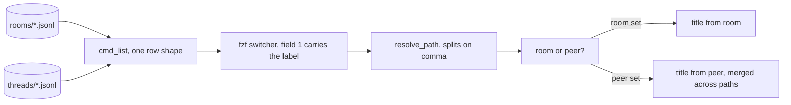

# One chat for rooms and peers

Make the chat-rooms switcher list peer conversations beside rooms, so there is one chat
surface instead of two.

<!-- plan-review: planning:plan-review 2026-09-02 findings=24 resolved report=inline -->
<!-- two rounds on Opus. Round one found 12, four critical, including that the Files blocks
     pointed at a duplicate copy of the recipe. Round two found 12 more in the revisions,
     including that moving the comma split into resolve_path left cmd_markdown taking a list
     at five sites, and that the acceptance task asked the executing session to drive the
     user's live viewer, which the repo rules forbid. -->

## Contents

1. [Which copy to edit](#1-which-copy-to-edit)
2. [Why this is small](#2-why-this-is-small)
3. [The two shapes that have to meet](#3-the-two-shapes-that-have-to-meet)
4. [Implementation steps](#4-implementation-steps)
5. [Keymap, after](#5-keymap-after)
6. [What this does not do](#6-what-this-does-not-do)

## 1. Which copy to edit

⚠️ **Edit the copy in THIS repository, at the worktree-relative paths every Files block below
names.** Two byte-identical copies of the recipe exist and picking the wrong one produces a run
that commits nothing, or commits to a file nothing executes.

- `cookbook/chat-rooms/` in this repo — **the source of truth.** Committed as `aaa4df3`, now on
  the fork's `main`. This is what ralphex can edit and commit.
- `~/dev/oss/agterm-vim/cookbook/chat-rooms/` — a clone of the same repo, on `main`. It is what
  `~/.local/bin/agterm-rooms/` symlinks to, so it is what actually runs.

The live install updates by pulling, not by editing: commit here, push to `main`, then
`git -C ~/dev/oss/agterm-vim pull --ff-only`. Do not edit that clone directly — it is outside
this repository and ralphex would commit nothing.

## 2. Why this is small

Both recipes are the same store under two directory names. `cookbook/chat-rooms/xchat_store.py`
already carries the thread half, copied across when the recipe was written:

- `rooms(claude_session)` and `conversations(my_sessions)` both exist and both enumerate
- `load(path)`, `unread_at(path)`, `advance_cursor_at(path)` are **path-based**, so they work on a
  thread file unchanged, and `advance_cursor_at` derives `<peer>.cursor` beside it
- `merged(paths)` already returns every message across a group, oldest first, and is currently
  dead code in this recipe
- both writers stamp `at` as `%Y-%m-%d %H:%M:%S`, so one sort across both kinds is correct
- both park long bodies in the same `msgs/`, in one shared `XCHAT_HOME`

The record formats overlap on exactly the fields the renderer uses:

| | shared | identity | extra |
|---|---|---|---|
| cross-agent thread | `at` `body` `from` `id` `summary` | `peer` | `direction` `delivery` `priority` `to` |
| chat room | `at` `body` `from` `id` `summary` | `room` | `path` |



## 3. The two shapes that have to meet

Three mismatches, each with a decision already made.

**Row shape.** `cmd_list` unpacks five fields and sorts on `r[4]`; `conversations()` returns
4-tuples with no unread. Both kinds must be normalized to one shape before they go in the same
list, or the sort raises `IndexError` and the unpack `ValueError`.

**Peer unread.** A peer group has several files, so its unread is the sum of `unread_at(p)` across
them. ⚠️ `xchat-hook.py` appends the `sent` copy into the sender's own thread, and `unread_at`
counts every line past the cursor regardless of direction — so a naive count shows "N new" for
messages the agent itself sent. Count only records whose `direction` is not `sent`.

**The label.** Do NOT add a column. `rooms-view.sh` renders `--with-nth='1,2'` and takes the path
from `{3}` in four separate binds — preview, `ctrl-o`, `ctrl-s`, `enter`. A kind at field 1, 2 or 3
shifts the path off `{3}` and breaks all four; appended as field 4 it is never rendered, so nothing
is labelled. Fold the label into field 1 instead, `peer · <name>` beside a bare room title. Then the
viewer needs no change at all, the pager title `t={1}` still reads sensibly, and a room whose title
matches a peer's name stops being two identical rows.

**Several paths in one field.** A peer group's paths join with a comma. Safe because `slug()` keeps
only `[\w.-]` and the other leaf is a UUID, so a path cannot contain one. The split belongs in
`resolve_path`, which `cmd_show` and `cmd_markdown` share — putting it in `cmd_show` alone leaves
`ctrl-o` silently dead, because the viewer's `|| exit 0` swallows `cmd_markdown`'s failure.

## 4. Implementation steps

⚠️ **`cookbook/` HAS a test harness.** `.github/workflows/ci.yml:309` runs every
`cookbook/**/test_*.py` through python3, `cookbook/CONTRIBUTING.md` documents it, and
`cookbook/two-agent-chat/test_peer_chat.py` is the worked example — `unittest`, loading a
hyphenated script with `runpy.run_path`. Write the tests in that shape and as
`cookbook/chat-rooms/test_*.py`, so they become a CI gate rather than scratch. Every `.py` in a
recipe directory needs a shebang to pass the layout step (`ci.yml:266-272`).

Gates per task: the new tests, plus `uvx ruff check --isolated --ignore EXE001` and
`uvx --from shellcheck-py shellcheck`.

### Task 1: Read a peer thread through the shared path resolver

Ordered first because it is harmless while nothing lists peer rows yet. The reverse order leaves a
committed state where a listed peer row's preview and `enter` both fail.

**Files:**
- Modify: `cookbook/chat-rooms/rooms-read.py`
- Create: `cookbook/chat-rooms/test_rooms_read.py`

- [x] in `resolve_path`, accept a comma-separated value and always return a LIST of paths, so both callers take one type. ⚠️ Split on the `.jsonl,` boundary rather than a bare comma: `slug()` and the UUID leaf cannot contain one, but the prefix comes from `XCHAT_HOME` and is unconstrained
- [x] in `cmd_show`, render a group through `store.merged(paths)` and a single path through `store.load` as now
- [x] ⚠️ in `cmd_markdown`, handle a list at EVERY site, not only the title. Five lines there take a `str` today: `getsize`, `store.load`, the two `basename`/`dirname` calls that build the output name, and `advance_cursor_at`. A list raises `TypeError`, which `store.load` does not catch and `rooms-view.sh` swallows with `|| exit 0`, so `ctrl-o` fails silently
- [x] decide the group's `.md` destination: several paths, one document. Name it after the peer, under the session directory of the first path, so re-opening rewrites one file
- [x] title from `room` when present, falling back to `peer`, then to the filename — at BOTH the `cmd_show` and `cmd_markdown` sites
- [x] ⚠️ capture each path's size BEFORE loading and mark each to its own captured size. The current code reads `getsize` before `load` deliberately, so a message appended while the pager is open is not marked read; calling `advance_cursor_at(p)` with the default offset reintroduces that bug
- [x] write `test_rooms_read.py` in the `two-agent-chat/test_peer_chat.py` shape, loading `rooms-read.py` with `runpy.run_path`, with a shebang, and pointing `XCHAT_HOME` at a tmpdir so the tests never read or mark the real store
- [x] test: a peer thread renders with the peer as its title
- [x] test: a two-file group renders both files' messages in time order
- [x] test: `markdown` on a group writes one document and exits 0 — the bind that silently did nothing
- [x] test: marking a group clears the badge for every path in it
- [x] test: a room still renders, marks and writes markdown exactly as before
- [x] run the tests and `ruff check` — both must pass before task 2

### Task 2: List peer conversations beside rooms

**Files:**
- Modify: `cookbook/chat-rooms/rooms-read.py`
- Modify: `cookbook/chat-rooms/test_rooms_read.py`

- [x] normalize both kinds to one row shape before sorting, so `store.rooms()` and `store.conversations()` rows unpack identically
- [x] ⚠️ write a new unread helper in `rooms-read.py`; `store.unread_at` cannot serve. It counts raw non-blank lines past the byte cursor and cannot see a field. The helper seeks to `store.cursor_at(path)`, parses each line past it, and counts only records whose `direction` is not `sent` — the hook writes the sender's own copy into its own thread, and the key really is `direction` with values `sent` and `received`
- [x] a peer group's unread is that helper summed over its paths
- [x] ⚠️ `render` highlights new messages as the tail of the list (`new = i >= len(msgs) - unread`). That assumption breaks for a merged group, because records interleave by time across files and the filtered count excludes `sent` records still in the list. Either mark per-record while merging, or drop the highlight for a group and say so in the README
- [x] put the label in field 1, `peer · <name>` against a bare room title, and add NO new column
- [x] keep the newest-first sort across both kinds so a room and a peer interleave by time
- [x] update the `list` output contract in the module docstring, which currently says `title <TAB> badge <TAB> room file`
- [x] test: one room and one peer thread both appear, newest first, each labelled
- [x] test: a peer grouped across two session ids yields ONE row carrying both paths
- [x] test: a peer's own sent messages do not count toward its unread
- [x] test: the printed contract is still `title <TAB> badge <TAB> path`, so the viewer's four `{3}` binds keep working
- [x] run the tests and `ruff check` — both must pass before task 3

### Task 3: Let the watcher see a peer message

**Files:**
- Modify: `cookbook/chat-rooms/rooms-read.py`
- Modify: `cookbook/chat-rooms/rooms-view.sh`

- [ ] `where` currently prints `store.rooms_dir()`, so the viewer watches only `rooms/`. Print both roots instead — the rooms directory and the threads directory — so `threads/` is covered
- [ ] ⚠️ give `find` the two roots explicitly rather than widening to `home()`. Widening walks `msgs/` once a second, and nothing prunes it: the name filter keeps those files out of `stat`, not out of the traversal
- [ ] `where`'s own docstring line says "the rooms directory, for a file watcher" — correct it
- [ ] rename `ROOMS_DIR` in the viewer and fix the comment above it, both now stale
- [ ] test: `rooms-read.py where` prints both roots. Do NOT test `signature()` — it is a shell function inside a script that ends by launching fzf under `set -eu`, so it cannot be sourced, and CI runs `test_*.py` only
- [ ] run the tests, `ruff check` and `shellcheck` — all must pass before task 4

### Task 4: Refuse a reply on a peer row

**Files:**
- Modify: `cookbook/chat-rooms/rooms-send.sh`

- [ ] ⚠️ there are TWO failure modes, refuse on both. A single-path peer group passes the `-f` test and dies later with "which room?", because a thread record has no `room` key. A multi-path group fails `-f` first with `no such room file: a.jsonl,b.jsonl`
- [ ] the cheap discriminator is the `.jsonl,` boundary or a missing `room` key in the file's last record
- [ ] refuse with a message naming the reason: a peer reply is a `SendMessage`, which this recipe cannot make
- [ ] nothing is written and nothing is typed on that path today, so this is a message change and not a safety fix — keep it that way
- [ ] run `shellcheck` — must pass before task 5

### Task 5: Say what the viewer now covers

**Files:**
- Modify: `cookbook/chat-rooms/README.md`
- Modify: `cookbook/README.md`

- [ ] chat-rooms README: the viewer lists rooms and peer conversations together. The rooms-only statements are the pitch line at the top, the viewer paragraph, the paragraph after it, and the key table. Leave the *Setup* line naming six files alone — it says nothing about rooms versus peers, and editing it invites adding a seventh file that does not exist
- [ ] chat-rooms README: correct the line claiming the two recipes "share a home and do not share code"
- [ ] chat-rooms README: if Task 2 dropped `render`'s new-message highlight for a group, say so in *Limits*
- [ ] chat-rooms README *Requirements*: peer rows appear only when `cross-agent-chat`'s hook is installed, because chat-rooms ships no writer for `threads/`. State it as a dependency, not as a pointer into the other recipe — `cookbook/CONTRIBUTING.md` wants a recipe standing on its own
- [ ] chat-rooms README *Limits*: `ctrl-s` cannot reply to a peer, and the peer badge counts only messages the peer sent
- [ ] `cookbook/README.md`: the chat-rooms index row still describes rooms only
- [ ] leave `cookbook/cross-agent-chat/` untouched and installable on its own — it is published and someone may want only it
- [ ] run the cookbook CI checks locally: layout, index both directions, kebab-case, six headings, shebangs, `shellcheck`, `ruff check`

### Task 6: Verify what a test can verify

⚠️ Everything here runs against a throwaway `XCHAT_HOME`. Do NOT drive the live viewer to check
these. `.claude/rules/planning-rules.md` says static reading and building only, the user's real
store is at `~/.local/state/agterm-xchat`, and `enter` and `ctrl-o` write cursors — so driving it
would clear real badges. The on-screen behaviour is the maintainer's pass below.

- [ ] `list` emits both kinds, newest first, each labelled in field 1, still three tab-separated fields
- [ ] `show` on a peer group renders every file's messages and marks every path
- [ ] `markdown` on a peer group writes one document and exits 0
- [ ] `show` and `markdown` on a room behave exactly as before
- [ ] a peer's own `sent` records do not count toward its unread
- [ ] `where` prints both roots
- [ ] run every `cookbook/chat-rooms/test_*.py`, `uvx ruff check --isolated --ignore EXE001` and `uvx --from shellcheck-py shellcheck`
- [ ] confirm no `__pycache__` or `.ruff_cache` left in the recipe directory

### For the maintainer, by hand

Not tasks. These need the live viewer and belong to whoever installs the change:

- open the switcher and confirm a room and a peer interleave by time, each labelled
- press `enter` on a peer row: the conversation renders and its badge clears
- press `ctrl-o` on a peer row: revdiff opens it. This is the bind that silently did nothing
- append to a peer thread and watch the list reload with no keypress
- press `ctrl-s` on a peer row and read the refusal

## 5. Keymap, after

Only once the viewer lists both does `space>m` make sense to retarget. Until then it points at the
older cross-agent overlay, and moving it early would take the agent-to-agent history off screen.

```
nmap space>m        "Chat"              # one chat, as an 85% overlay
nmap space>shift+m  "Chat in the pane"  # same chat, restored to the right pane
```

`space>shift+M` already does the pane half and needs no change. The overlay line is a one-word
retarget from `agterm-xchat-view.sh` to `rooms-view.sh`. Not a task here: the keymap is live setup,
outside this repository.

## 6. What this does not do

- **No data migration.** `rooms/` and `threads/` keep their own layouts and writers. This is a
  reading change.
- **No merge of the two recipes.** Both stay separately installable, which `CONTRIBUTING.md`
  expects. The cookbook has just taken them.
- **No change to sending.** `xchat-hook.py` still parks agent-to-agent bodies, `rooms-write.py`
  still writes rooms, and the restore hook needs nothing — it only pairs the row and opens the
  viewer.
- **No thread cursor work.** `advance_cursor_at` already derives the cursor beside any thread file
  and nothing else writes there.
