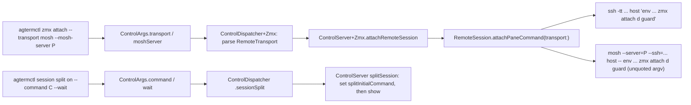

# zmx attach transport and split --command

## Contents
- [Overview](#overview)
- [Context (from discovery)](#context-from-discovery)
- [Development Approach](#development-approach)
- [Testing Strategy](#testing-strategy)
- [Progress Tracking](#progress-tracking)
- [Solution Overview](#solution-overview)
- [Technical Details](#technical-details)
- [Implementation Steps](#implementation-steps)
- [Post-Completion](#post-completion)

## Overview

Two small additions to the fork's control surface. Both are needed by the new attach picker in
`agterm-agents` (`docs/plans/20260917-attach-picker.md` there), which attaches sessions from the
laptop (p4air) to the workstation (p4studio) and to the Linux box (p4linux).

1. `agtermctl zmx attach <host> <session> --transport ssh|mosh [--mosh-server <path>]`.
   Today the native remote attach always uses `ssh -tt`. Claude sessions want mosh (roaming,
   laptop sleep). Codex sessions must stay on ssh (Codex misbehaves over mosh). The picker decides
   per session; the attach only takes the flag.
2. `agtermctl session split on --command <cmd> [--wait]`.
   Today only `session new` and `session scratch` take a command. A row built by a script for a
   p4linux session with two panes needs the right pane to run its own attach command, in the same
   step. `--wait` asks for the press-any-key hold the native remote attach gives its split; it holds
   on a remote-host row and on a local row in Re-run commands mode, not on a local zmx-wrapped split
   in Live sessions mode (see Technical Details).

Neither change alters default behavior: no `--transport` means ssh, as today; no `--command` on a
split means the login shell, as today.

## Context (from discovery)

- `agtermCore/Sources/agtermCore/RemoteSession.swift`: `attachCommand(host:endpoint:daemon:connectTimeout:)`
  builds `ssh -tt -o BatchMode=yes -o ConnectTimeout=N <host> <remote line>`; `attachPaneCommand`
  wraps it with the exit label; `sshArguments` is private; `validate`, `isPlain`, `isPath` are the
  input guards. `CommandRestore.shellQuotedLine` quotes the remote line.
- `agterm/Control/ControlServer+Zmx.swift`: `attachRemoteSession(host:session:window:)` resolves the
  remote tree again, builds `primary` and `split` through the private `paneCommand`, calls
  `store.addSession(... remoteHost: host)`, sets `created.splitInitialCommand`,
  `created.splitCommandWait = true` and `store.setSplitVisibility`.
- `agtermCore/Sources/agtermCore/ControlDispatcher+Zmx.swift`: the `.zmxAttach` case reads
  `request.args?.host` and `request.args?.window`, then calls `actions.attachRemoteSession`.
- `agtermCore/Sources/agtermCore/ControlDispatcher.swift`: the `ControlActions` protocol declares both
  `attachRemoteSession` overloads and `splitSession(_:window:mode:)` /
  `splitSession(_:window:mode:axis:)`. `agtermCore/Sources/agtermCore/ControlActionsDefaults.swift`
  holds the default bodies. The `.sessionSplit` case in `ControlDispatcher.swift` parses `axis` and
  calls `actions.splitSession`.
- `agtermCore/Sources/agtermCore/ControlProtocol.swift`: `ControlArgs` already has `host`, `window`,
  `mode`, `axis`, `command`, `wait`, `pane`. It has no transport field.
- `agtermCore/Sources/agtermctlKit/ZmxCommands.swift`: `Zmx.Attach` has `host`, `session`,
  `--window`; it builds `ControlRequest(cmd: .zmxAttach, target: session, args: ControlArgs(host:window:))`.
- `agtermCore/Sources/agtermctlKit/SessionCommands.swift`: `Split.Visibility` has `mode`, `--axis`,
  `TargetOptions`, `ClientOptions`; it builds `ControlArgs(mode:axis:)`.
- `agterm/Control/ControlServer+SessionActions.swift`: `splitSession(_:window:mode:)` is the app
  side of the split toggle.
- `agtermCore/Sources/agtermCore/Session.swift` already has `splitInitialCommand` and
  `splitCommandWait`; `agtermCore/Sources/agtermCore/AppStore+Panes.swift` swaps them on pane swap.
- Existing tests: `agtermCore/Tests/agtermCoreTests/RemoteSessionTests.swift` (exact argv checks),
  `agtermCore/Tests/agtermCoreTests/ControlDispatcherZmxTests.swift`,
  `agtermCore/Tests/agtermctlKitTests/ZmxCommandsTests.swift` (CLI parse → request),
  `agtermCore/Tests/agtermCoreTests/ControlDispatcherTests.swift` (already covers `.sessionSplit`:
  parse, forwarding, invalid axis), and `agtermCore/Tests/agtermCoreTests/MockControlActions.swift`,
  whose `Call.zmxAttach(host:session:)` and `Call.sessionSplit(target:window:_:_)` cannot observe
  the new arguments yet.
- Docs that describe these commands: `plugins/agterm/skills/agterm/reference.md` (the paragraph
  starting `agtermctl zmx attach HOST SESSION [--window W]`, and the `session split` bullet in the
  session commands list), and `cookbook/remote-session-picker/attach-remote.sh`.
  `.claude/rules/control-api.md` is the rules file for every control-surface file this plan edits;
  read it before task 2. It says the reference documents each command, and forbids stating a count of
  public commands.
- The proven mosh shape, from `agterm-agents/bin/agterm-zmx` `remote_attach_command`:
  `mosh --server="<path>" "<host>" -- /usr/bin/env ZMX_DIR="<dir>" <zmx> attach "<key>"`.
  The elements after `--` are the remote argv, UNQUOTED. mosh (`/opt/homebrew/bin/mosh`, perl,
  `sub shell_quote`) single-quotes each of them itself, the far login shell unquotes them back into
  separate arguments of `mosh-server new ... -- arg1 arg2 ...`, and mosh-server `execvp`s argv[0]
  with no shell in between. Handing mosh one pre-quoted line would make mosh-server execvp the
  literal string `'/usr/bin/env' 'ZMX_SESSION=' ...` and fail with ENOENT. `--server=` is a raw
  shell fragment on the far side (the man page allows `env X=Y mosh-server`), so a server path with
  a space splits into two words there. `--server=` is required on a Mac far side: mosh's ssh
  bootstrap is a non-login shell and `/opt/homebrew/bin` is off its PATH. mosh's `--ssh=` value is
  split with `shellwords`, so `--ssh=ssh -o BatchMode=yes -o ConnectTimeout=N` reaches ssh as
  separate options.
- Live-mode hold: for a local (non-remote) session in Live sessions mode the split pane is
  zmx-wrapped (`ZmxLaunch.wrapsLocally`), `LaunchSeedProvider.seed` returns `waitAfterCommand: false`
  for the `.wrapped` disposition, and the command falls through to a login shell. Only the
  `.ordinary` and `.fallback` dispositions and remote-host sessions honor `splitCommandWait`. The
  reference already says this for `session new --wait`.

## Development Approach
- **testing approach**: TDD. Write the failing test, then the code, one task at a time.
- complete each task fully before moving to the next
- make small, focused changes
- every task adds or updates tests for the code it changes, success and error cases, as separate
  checklist items
- all tests must pass before the next task: `scripts/test.sh` (host-free `swift test` in `agtermCore`)
- update this plan file when scope changes during implementation
- keep backward compatibility: no flag means today's behavior

## Testing Strategy
- unit tests in `agtermCore/Tests` for every task: `RemoteSessionTests`, `ControlDispatcherZmxTests`,
  `ControlDispatcherTests` (split), `ZmxCommandsTests`, the session command parse tests
- no e2e suite in this repo; the live check is in Post-Completion

## Progress Tracking
- mark completed items with `[x]` immediately when done
- add newly discovered tasks with ➕ prefix
- document issues/blockers with ⚠️ prefix
- update plan if implementation deviates from original scope

## Solution Overview

Key decisions:
- `RemoteTransport` is a small public enum in `RemoteSession.swift`: `.ssh` and
  `.mosh(server: String?)`. Parsing from the wire strings lives next to it, so the dispatcher and the
  CLI share one parser and one error text.
- The remote argv is built once as `remoteArgv: [String]` (the `/usr/bin/env ... zmx attach
  <daemon> /bin/sh -c <guard>` elements) and only the transport differs in how it is appended: ssh
  appends `CommandRestore.shellQuotedLine(remoteArgv)` as one last element, as today; mosh appends
  `remoteArgv` verbatim after `--`. The create-only guard stays on both transports.
- mosh quotes each remote argument itself and the far login shell unquotes them, a round trip; a
  pre-quoted line would reach mosh-server's `execvp` as one bogus program name.
- `--mosh-server` is refused with `--transport ssh` (a usage error at the CLI and an error from the
  dispatcher). It is guarded by `isPlain` (no whitespace, no control characters), not `isPath`:
  mosh interpolates `--server=` raw into the far shell line, so a space would split it. The endpoint
  executable keeps `isPath` because it travels through `shellQuotedLine` or argv.
- mosh is given `--ssh=ssh -o BatchMode=yes -o ConnectTimeout=<connectTimeout>`, so the no-prompt
  contract of the ssh path holds for mosh's bootstrap too and `connectTimeout` is not dead there.
- `session split on --command` only applies when the session has no split yet: the predicate is
  `session.hasSplit`. A hidden split (`session split off`) keeps `hasSplit` set and its shell alive,
  so it is refused too; `splitSurface != nil` is not the test, because it is nil for a queued split
  whose seed has not been consumed yet and would race the mount. If the split exists, the response
  is an error naming `session split close` as the way to replace it. This keeps the command from
  silently killing a process (the scratch's run-once respawn is a different contract and is not
  copied).

## Technical Details

### `--transport` (task 1 to 4)

Wire fields, both optional strings on `ControlArgs`:
- `transport`: `"ssh"` (default when absent) or `"mosh"`. Anything else: error
  `invalid transport: <value> (ssh|mosh)`.
- `moshServer`: absolute path of `mosh-server` on the far side. Only with `transport == "mosh"`;
  empty or containing whitespace is an error (`isPlain`), at the CLI and at the dispatcher.

Command shapes (`attachCommand` output, argv), with `remoteArgv` the unquoted array `attachCommand`
builds today (`/usr/bin/env`, `ZMX_SESSION=`, ..., `attach`, daemon, `/bin/sh`, `-c`, guard):
- ssh (unchanged): `["ssh", "-tt", "-o", "BatchMode=yes", "-o", "ConnectTimeout=5", host,
  CommandRestore.shellQuotedLine(remoteArgv)]`
- mosh: `["mosh", "--server=<path>", "--ssh=ssh -o BatchMode=yes -o ConnectTimeout=5", host, "--"]
  + remoteArgv`; without a server path the `--server=` element is omitted. The elements after `--`
  are exactly the argv the ssh form quotes into its last element.

`attachPaneCommand` gains the same `transport` parameter and passes it through; the label and the
exit-status tail do not change. Its doc comment gets one sentence: under mosh the tail's `status=$?`
is mosh-client's exit status, not the guard's `exit 1`, so `disconnected, exit 0` after a vanished
daemon is expected there.

Consumers of the new `transport` value (list and count; recount at acceptance):
1. `RemoteSession.attachCommand` / `attachPaneCommand` (producer of the argv)
2. `ControlArgs.transport`, `ControlArgs.moshServer` (wire)
3. `ControlDispatcher+Zmx` `.zmxAttach` (parse + validate)
4. `ControlActions.attachRemoteSession(host:session:window:transport:)` protocol in
   `ControlDispatcher.swift` and its default in `ControlActionsDefaults.swift`
5. `ControlServer+Zmx.attachRemoteSession` and its private `paneCommand`
6. `Zmx.Attach` in `ZmxCommands.swift` (`--transport`, `--mosh-server`)
7. docs: the `zmx attach` paragraph in `plugins/agterm/skills/agterm/reference.md`, and one line in
   the `cookbook/remote-session-picker/attach-remote.sh` header comment naming the flag
8. tests: `RemoteSessionTests`, `ControlDispatcherZmxTests`, `ZmxCommandsTests`
9. `agtermCore/Tests/agtermCoreTests/MockControlActions.swift`: `Call.zmxAttach` records `host`,
   `session`, `window` and `transport`, and the mock implements the new overload (today its
   two-argument stub cannot observe either `window` or `transport`)

Nine consumers.

### `session split on --command` (task 5 to 7)

CLI: `Split.Visibility` gets `--command <cmd>` and `--wait`. `--wait` without `--command` is a
`ValidationError`. Any mode other than `on` with `--command` is a `ValidationError`
(`--command needs mode on`). The `mode` argument defaults to `toggle`, so `on` must be spelled out:
`session split --command c` without it is that usage error, and the help text says so.

Wire: reuses `ControlArgs.command` and `ControlArgs.wait` (both exist).

Dispatcher: `.sessionSplit` passes `command` and `wait` to a new protocol overload
`splitSession(_:window:mode:axis:command:wait:)`. The existing overloads stay and forward with
`nil`s, as the two existing ones already do for `axis`. Wire callers bypass
`Split.Visibility.validate()`, so the dispatcher repeats the CLI's rules: `wait == true` without
`command` is `ok: false, error: "--wait needs --command"`, never reaching the stub.

Server: in `splitSession`, when `command` is present:
- resolve the session as today;
- if `session.hasSplit` is already set (shown or hidden, the shell is alive), return
  `ok: false, error: "split already running; session split close first"`;
- else set `session.splitInitialCommand = command`, `session.splitCommandWait = wait ?? false`,
  then show the split through the existing path (`store.setSplitVisibility(id, shown: true, axis:)`).
The split's initial command is consumed by the existing pane launch code the same way the native
remote attach's split is; nothing new is needed there. The honoring question is confirmed: the
launch seed is resolved at spawn, not at construction (`LaunchSeedProvider.seed`), and
`makeSplitSurface` runs when the split pane mounts, reading `session.splitInitialCommand` (the
`.right` case in `ZmxLaunch` and in `LaunchSeed`). `ControlServer+Zmx.attachRemoteSession` already
sets the field right before `setSplitVisibility` on exactly this path.

`splitInitialCommand` persists in the snapshot (`SessionSnapshot.splitInitialCommand`, written and
read back in `AppStore+Snapshot`), so a `--command` split re-runs its command on restore in Re-run
commands mode, as `session new --command` does.

`--wait` on a split adds no hold in Live sessions mode for a local zmx-wrapped split (the pane falls
through to the login shell); only ordinary/fallback and remote-host sessions honor it. Same rule the
reference already states for `session new --wait`.

Consumers of `--command` on split (list and count):
1. `Split.Visibility` CLI
2. `ControlDispatcher` `.sessionSplit` case
3. `ControlActions.splitSession(_:window:mode:axis:command:wait:)` + defaults
4. `ControlServer+SessionActions.splitSession`
5. docs: the `session split` bullet in `plugins/agterm/skills/agterm/reference.md`, including the
   Live-mode `--wait` sentence and the restore behavior of a `--command` split
6. tests: the `.sessionSplit` cases in `ControlDispatcherTests`, CLI parse tests
7. `agtermCore/Tests/agtermCoreTests/MockControlActions.swift`: `Call.sessionSplit` records
   `command` and `wait`, and the mock implements the new overload

Seven consumers.

## Implementation Steps

### Task 1: RemoteTransport and the mosh argv in RemoteSession

**Files:**
- Modify: `agtermCore/Sources/agtermCore/RemoteSession.swift`
- Modify: `agtermCore/Tests/agtermCoreTests/RemoteSessionTests.swift`

- [ ] write a failing test: `attachCommand(..., transport: .mosh(server: "/opt/homebrew/bin/mosh-server"))`
      returns exactly `["mosh", "--server=/opt/homebrew/bin/mosh-server",
      "--ssh=ssh -o BatchMode=yes -o ConnectTimeout=5", host, "--"] + remoteArgv`, and the elements
      after `--` equal the argv the ssh form quotes into its last element (assert
      `CommandRestore.shellQuotedLine(Array(mosh[i...])) == ssh.last`)
- [ ] write a failing test: `.mosh(server: nil)` omits the `--server=` element
- [ ] write a failing test: `connectTimeout: 9` shows up as `ConnectTimeout=9` inside the `--ssh=`
      element of the mosh form
- [ ] write a failing test: `.ssh` and the default (no `transport` argument) return the same argv as
      before this change (keep the existing `attachPassesTheEndpointAndGuardAsExactArguments` green)
- [ ] write a failing test: a mosh server path with a space, with a control character, or empty
      throws `invalidTransport` (the `isPlain` rule, not `isPath`)
- [ ] write a failing test: `RemoteTransport.parse(transport: "mosh", moshServer: nil)`,
      `parse("ssh", nil)`, `parse(nil, nil) == .ssh`, `parse("tcp", nil)` throws,
      `parse("ssh", "/x")` throws (server only with mosh)
- [ ] add `public enum RemoteTransport: Equatable, Sendable { case ssh, mosh(server: String?) }` with
      `static func parse(transport: String?, moshServer: String?) throws -> RemoteTransport` and an
      `InvocationError.invalidTransport` case
- [ ] add `transport: RemoteTransport = .ssh` to `attachCommand` and `attachPaneCommand`; split the
      body so `remoteArgv` is built once, a private `transportArguments(host:transport:connectTimeout:)`
      gives the prefix (ssh: today's `sshArguments`; mosh: `mosh`, optional `--server=`, the
      `--ssh=ssh -o BatchMode=yes -o ConnectTimeout=N` element, host, `--`), and the transport decides
      whether `remoteArgv` is appended quoted as one element (ssh) or verbatim (mosh)
- [ ] extend the `attachPaneCommand` doc comment: under mosh, `status=$?` is mosh-client's exit, not
      the guard's, so `disconnected, exit 0` after a vanished daemon is expected
- [ ] run `scripts/test.sh` - must pass before task 2

### Task 2: Wire fields and dispatcher parsing

**Files:**
- Modify: `agtermCore/Sources/agtermCore/ControlProtocol.swift`
- Modify: `agtermCore/Sources/agtermCore/ControlDispatcher.swift`
- Modify: `agtermCore/Sources/agtermCore/ControlActionsDefaults.swift`
- Modify: `agtermCore/Sources/agtermCore/ControlDispatcher+Zmx.swift`
- Modify: `agtermCore/Tests/agtermCoreTests/ControlDispatcherZmxTests.swift`
- Modify: `agtermCore/Tests/agtermCoreTests/MockControlActions.swift` (`Call.zmxAttach` gains
  `window` and `transport`; the mock implements the four-argument overload; a second, minimal
  conformer `LegacyAttachActions` keeps only the two-argument stub, so the protocol defaults can
  still be tested)

- [ ] write a failing test: a `.zmxAttach` request with `args.transport == "mosh"` and
      `args.moshServer == "/opt/homebrew/bin/mosh-server"` reaches the actions stub with
      `transport == .mosh(server: "/opt/homebrew/bin/mosh-server")`
- [ ] write a failing test: no `transport` reaches the stub as `.ssh`
- [ ] write a failing test: `transport == "tcp"` returns `ok: false` with
      `invalid transport: tcp (ssh|mosh)` and never calls the stub
- [ ] write a failing test: `transport == "ssh"` with a `moshServer` returns `ok: false`
      (`--mosh-server needs --transport mosh`)
- [ ] write a failing test: `transport == "mosh"` with `moshServer == ""` returns `ok: false` and
      never calls the stub
- [ ] write a failing test against `LegacyAttachActions`: the default
      `attachRemoteSession(host:session:window:transport:)` returns `ok: false` with
      `ControlActionsUnsupported.message("zmx.attach --transport")` for `.mosh`, and forwards to the
      window form for `.ssh`
- [ ] add `public var transport: String?` and `public var moshServer: String?` to `ControlArgs`
      with doc comments in the file's style, and to its memberwise init where the file keeps one
- [ ] add `attachRemoteSession(host:session:window:transport:)` to the `ControlActions` protocol;
      default it in `ControlActionsDefaults.swift` like the existing `window` default: refuse with
      `ControlActionsUnsupported.message("zmx.attach --transport")` when `transport != .ssh`,
      forward to the three-argument form otherwise (an implementer that ignores transport keeps
      compiling and never silently downgrades a requested mosh to ssh)
- [ ] update `MockControlActions`: `Call.zmxAttach(host:session:window:transport:)` and the
      four-argument overload. `anOlderAttachHostRefusesExplicitWindowPlacement` passes today only
      because the mock lacks that overload and the `window` default refuses first; once the mock
      implements it the request reaches the mock. Add `LegacyAttachActions` in
      `MockControlActions.swift` (two-argument stub only) and point that test and the new default
      test at it
- [ ] in `ControlDispatcher+Zmx.swift`, parse with `RemoteTransport.parse` and call the new overload
- [ ] run `scripts/test.sh` - must pass before task 3

### Task 3: The app side uses the transport

**Files:**
- Modify: `agterm/Control/ControlServer+Zmx.swift`

- [ ] implement `attachRemoteSession(host:session:window:transport:)` in the server by adding the
      parameter to the existing four-step body; the three-argument form forwards with `.ssh`
- [ ] pass `transport` through the private `paneCommand` to `RemoteSession.attachPaneCommand`
- [ ] no new app test target exists for this file; cover the mapping in task 2's dispatcher tests
      and note here that `make build` compiled the app
- [ ] run `make build` - must succeed before task 4

### Task 4: CLI flags on `zmx attach`

**Files:**
- Modify: `agtermCore/Sources/agtermctlKit/ZmxCommands.swift`
- Modify: `agtermCore/Tests/agtermctlKitTests/ZmxCommandsTests.swift`
- Modify: `plugins/agterm/skills/agterm/reference.md` (the `zmx attach` paragraph)
- Modify: `cookbook/remote-session-picker/attach-remote.sh` (header comment only)

- [ ] write a failing test: `Zmx.Attach.parse(["h", "s1", "--transport", "mosh", "--mosh-server", "/p/mosh-server"])`
      makes a request with `args.transport == "mosh"` and `args.moshServer == "/p/mosh-server"`
- [ ] write a failing test: no flags leaves both args nil (today's request is unchanged)
- [ ] write a failing test: `--transport tcp` fails validation; `--mosh-server` without
      `--transport mosh` fails validation
- [ ] add `@Option(name: .long) var transport: String?` (help: `ssh (default) or mosh`) and
      `@Option(name: .long) var moshServer: String?` (help: absolute path of mosh-server on the far
      side; mosh's ssh bootstrap is a non-login shell, so a Homebrew mosh-server needs it) with
      `validate()` for the two rules above
- [ ] document both flags in the `zmx attach` paragraph of the reference and in the cookbook header
- [ ] run `scripts/test.sh` - must pass before task 5

### Task 5: Dispatcher and protocol for `split --command`

**Files:**
- Modify: `agtermCore/Sources/agtermCore/ControlDispatcher.swift`
- Modify: `agtermCore/Sources/agtermCore/ControlActionsDefaults.swift`
- Modify: `agtermCore/Tests/agtermCoreTests/ControlDispatcherTests.swift` (it already covers
  `.sessionSplit`: parse, forwarding and the invalid-axis error; extend those)
- Modify: `agtermCore/Tests/agtermCoreTests/MockControlActions.swift` (`Call.sessionSplit` gains
  `command` and `wait`; the mock implements the new overload)

- [ ] write a failing test: a `.sessionSplit` request with `args.mode == "on"`, `args.command == "c"`,
      `args.wait == true` reaches the stub's new overload with those values
- [ ] write a failing test: a request without `command` still reaches the existing
      `splitSession(_:window:mode:axis:)` behavior (default forwarding keeps old stubs working)
- [ ] write a failing test: `args.wait == true` without `command` returns `ok: false` with
      `--wait needs --command` and never calls the stub
- [ ] add `splitSession(_:window:mode:axis:command:wait:)` to `ControlActions`; default it to
      forward to the `axis` form when `command == nil`, and to return
      `ok: false, error: "split --command is not supported here"` when a command is present
- [ ] route `.sessionSplit` through the new overload, rejecting `wait == true` without `command`
      before the call
- [ ] update `MockControlActions`: `Call.sessionSplit(target:window:_:_:command:wait:)` and the
      overload; adjust the existing forwarding assertion in `ControlDispatcherTests`
- [ ] run `scripts/test.sh` - must pass before task 6

### Task 6: The app side runs the split's command

**Files:**
- Modify: `agterm/Control/ControlServer+SessionActions.swift`

- [ ] implement the new overload: with `command` present and mode `on`, refuse when
      `session.hasSplit` is set (`split already running; session split close first`), else set
      `splitInitialCommand` and `splitCommandWait` and show the split with the given axis (the seed
      is read at mount, see Technical Details; nothing else to adapt)
- [ ] with `command` present and any other mode, return `ok: false, error: "--command needs mode on"`
- [ ] run `make build` - must succeed before task 7

### Task 7: CLI flags on `session split`

**Files:**
- Modify: `agtermCore/Sources/agtermctlKit/SessionCommands.swift`
- Modify: `agtermCore/Tests/agtermctlKitTests/CommandsTests.swift`
- Modify: `plugins/agterm/skills/agterm/reference.md` (the `session split` bullet)

- [ ] write a failing test: `["on", "--command", "c", "--wait"]` parses into
      `ControlArgs(mode: "on", command: "c", wait: true)`
- [ ] write a failing test: `--wait` alone fails validation; `["off", "--command", "c"]` fails
      validation
- [ ] add `--command` and `--wait` to `Split.Visibility` with the validation and help text modeled
      on `session new --command/--wait`; the `--command` help says `mode on must be spelled out
      (the default is toggle)`
- [ ] write a failing test: `["--command", "c"]` (mode left at its `toggle` default) fails
      validation
- [ ] document the flags in the `session split` bullet of the reference, with the sentence that
      `--wait` adds no hold in Live sessions mode for a local zmx-wrapped split (only
      ordinary/fallback and remote-host sessions honor it), and that a `--command` split persists
      its command and re-runs it on restore in Re-run commands mode, as `session new --command` does
- [ ] run `scripts/test.sh` - must pass before task 8

### Task 8: Verify acceptance criteria
- [ ] `agtermctl zmx attach` without flags produces the same request and the same argv as before
- [ ] recount the nine `--transport` consumers and the seven `split --command` consumers listed in
      Technical Details; every one is touched
- [ ] run full test suite: `scripts/test.sh`
- [ ] run `make build`
- [ ] `agtermctl zmx attach --help` and `agtermctl session split visibility --help` show the flags

### Task 9: [Final] Update documentation
- [ ] `CHANGELOG-fork.md` gets two lines under the unreleased section
- [ ] move this plan to `docs/plans/completed/`

## Post-Completion

**Manual verification** (from p4air, after the build is installed on both Macs):
- `agtermctl zmx attach p4studio.local <id> --transport mosh --mosh-server /opt/homebrew/bin/mosh-server`
  on a Claude row: the row attaches, survives closing the laptop lid for a minute, and the far
  daemon shows one more client.
- the same with `--transport ssh` on a Codex row.
- `agtermctl session split on --command 'sleep 3' --wait --target <row>` on a remote-attached row,
  or on a local row with the app in Re-run commands mode: the split holds on the press-any-key
  prompt after three seconds. On a local row in Live sessions mode the split runs the command and
  falls through to a login shell; that is the documented behavior, not a failure.

**External system updates**:
- install the build on p4studio and p4air (`make deploy` builds the release and copies it to
  `~/Applications`; the running app on p4studio is restarted separately, see the agterm-agents picker
  plan). A remote-attached row is never written to disk, so it does not survive a relaunch; the picker
  plan accounts for that.
- `agterm-agents` picker plan depends on both flags. It must not rely on the `--wait` hold for the
  p4linux row's right pane: a local zmx-wrapped split in Live sessions mode falls through to a
  shell. The hold applies to a remote-host session's split and to a local row in Re-run commands
  mode.

<!-- plan-review: planning:plan-review 2026-09-17 findings=12 resolved -->
