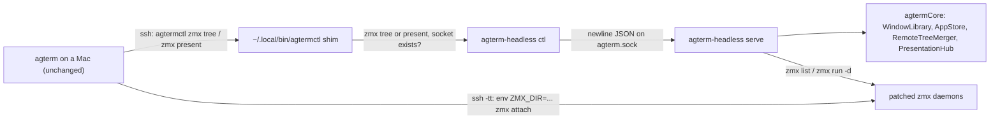

# Spike: a headless agterm origin on p4linux

**Answer: yes.** A ~520-line Swift executable built from the fork's own `agtermCore` makes p4linux an
origin that unmodified agterm on p4studio and p4air attaches to. `zmx tree`, `zmx attach`, lead and
cover, the takeover, and mirrored status and notify all worked on the first real run, with **no Mac-side
change**. Branch `headless-spike`, cut from p4studio's `main` at `471f8bb6`. Nothing is pushed.

## Contents

1. [Results per step](#1-results-per-step)
2. [How it is built](#2-how-it-is-built)
3. [The exact commands](#3-the-exact-commands)
4. [What did not work, and gaps](#4-what-did-not-work-and-gaps)
5. [Against the maintainer's plan and the parked active-Mac design](#5-against-the-maintainers-plan-and-the-parked-active-mac-design)
6. [Estimate for a real server](#6-estimate-for-a-real-server)
7. [What is left running](#7-what-is-left-running)

## 1. Results per step

| Step | Result | Evidence |
|---|---|---|
| Fetch `471f8bb6`, branch | pass | `headless-spike` cut from `471f8bb6` |
| Swift on Linux, `swift build` in `agtermCore/` | partial | a bare `swift build` still fails in `agtermctlKit`; the `agtermCore` target builds after 4 small fixes, and `swift build --product agterm-headless` passes. See [gaps](#4-what-did-not-work-and-gaps) |
| Patched zmx | pass | `~/.local/opt/agterm-headless/zmx`, zmx 0.8.1 + `0001-explicit-leadership.patch` |
| Trace the ssh calls | done | [section 3](#3-the-exact-commands) |
| `agterm-headless` answering `zmx.tree` | pass | JSON lists `spike-loop` with its daemon and endpoint |
| Test session in patched zmx | pass | `agterm-3c266d8c…`, a `read -t 5` tick loop, in its own `ZMX_DIR` |
| `zmx tree p4linux` / `zmx attach p4linux <id>` from p4studio | pass | tree lists `392C641C-…`; the pane shows `spike tick 289` |
| Second attach (p4air), lead and cover | pass | p4studio `"lead": "follower"`, p4air `"leader"`; typing on the follower is refused with `pane is in use on the Mac it runs on; take the lead to drive it from here` |
| Take the lead back | pass | `session lead` on p4studio flips both; `hello-from-studio` typed there reaches the loop (`got: hello-from-studio`) |
| `zmx.present`, status and notify | pass | p4studio `presentation: {mode: presenter, state: connected}`, p4air `mirror, connected`; `session status completed` shows on both rows; p4studio's event stream printed `notify spike-loop spike: notify-check-2` |
| Server restart with both Macs attached | pass, with two losses | both present streams reconnected within ~10 s and later status and notify reached them; the mirrored status was dropped, and the presenter moved to p4air while p4studio kept the lead |

⚠️ The takeover was driven with `agtermctl session lead`, which its help calls the same action as
pressing a key on the cover. Nobody pressed a physical key, and the cover itself was not looked at: the
evidence is the `lead` read-back and the refused typing.

## 2. How it is built



- `agtermCore` on Linux needed four edits, all `#if canImport(Darwin)` guards or one import:
  - `QuitReason.swift`: `NSAppleEventDescriptor` does not exist.
  - `TerminfoInstall.swift`: Glibc's `posix_spawnattr_t` is a struct, not an optional pointer. The
    Linux branch throws `spawnFailed(ENOSYS)`.
  - `HudMarkdown.swift`: swift-corelibs Foundation has no `AttributedString(markdown:)`. Linux
    renders the HUD source as plain lines.
  - `ZmxLead.swift`: `@Observable` needs `import Observation` outside Darwin.
- `agterm-headless` (target `agtermCore/Sources/agterm-headless`, Linux-only in `Package.swift`):
  - `WindowLibrary` persisted under `~/.local/state/agterm-headless`, so pane identities survive a
    restart and daemon names stay `agterm-<pane uuid>`.
  - `DaemonSurface`, a `TerminalSurface` stub with `backedByZmx = true`. It is the whole surface-free
    layer: with it, `AppStore.controlTree` reports every pane zmx-backed, and the Mac's own
    `RemoteTreeMerger.candidates` join runs unchanged.
  - A newline-JSON unix socket speaking the real `ControlRequest` / `ControlResponse`.
  - A direct command switch instead of the `ControlActions` protocol, whose ~100 required methods
    were out of scope. Answers `zmx.tree`, `zmx.present`, `session.status`, `notify`, `tree`,
    `session.new`. Everything else refuses by name.
  - `zmx.present` writes the ok reply, then hands the socket to a `PresentationSink` that subscribes
    to a `PresentationHub` on the viewer's hello. Status and notify go through
    `AppStore.applyControlStatus` and `recordNotificationEvent`, which already publish to the hub.
  - `ctl` mode (also when run as `agtermctl`) stands in for the far `agtermctl`: one request, one
    reply, or a stdin/stdout bridge for `zmx present`.

## 3. The exact commands

What p4studio's agterm runs (from `RemoteSession.treeCommand`, `presentCommand`, `attachCommand`):

```sh
# zmx tree p4linux, and again inside every zmx attach (the remote is re-resolved first)
ssh -T -o BatchMode=yes -o ConnectTimeout=5 p4linux \
  '/bin/sh -c '\''PATH="$PATH:/usr/local/bin:/opt/homebrew/bin" && agtermctl zmx tree --json'\'''
# the presentation stream, for as long as the row is shown
ssh -T -o BatchMode=yes -o ConnectTimeout=5 p4linux \
  '/bin/sh -c '\''PATH="$PATH:/usr/local/bin:/opt/homebrew/bin" && exec agtermctl zmx present <session-id>'\'''
# the pane itself: absolute paths from the tree's endpoint, no agtermctl involved
ssh -tt -o BatchMode=yes -o ConnectTimeout=5 p4linux \
  '/usr/bin/env ZMX_SESSION= ZMX_SESSION_PREFIX= ZMX_NO_DETACH_KEY=1 ZMX_DIR=<socketDirectory> \
   ZMX_MANAGED=<token> ZMX_MANAGED_CLAIM=1 <executable> attach <daemon> /bin/sh -c "...gone..."'
```

- ⚠️ `agtermctl` is found by **bare name**. The far PATH as p4studio sees it is
  `/usr/local/sbin:/usr/local/bin:/usr/bin:/home/sasha/.local/share/mise/shims:/home/sasha/.local/bin`,
  so it resolves to the shim `~/.local/bin/agtermctl` → `agterm-agents/bin/agterm-ctl-remote`.
  Sasha chose to add a branch to the shim (uncommitted in `agterm-agents`): `zmx tree` and
  `zmx present` go to `agterm-headless ctl` while its socket exists; everything else still forwards to
  p4studio. A `/usr/local/bin/agtermctl` was rejected: `/usr/local/bin` precedes `~/.local/bin` in
  the interactive PATH too, so every hook would hit the headless server.

Setup and run on p4linux:

```sh
# Swift: swiftly refuses Arch ("Unsupported Linux platform"), so pretend Ubuntu 24.04
./swiftly init --platform ubuntu24.04 --no-modify-profile --assume-yes --skip-install
. ~/.local/share/swiftly/env.sh && swiftly install --use --assume-yes 6.2   # 6.2.4
sudo pacman -S libxml2-legacy                                              # libxml2.so.2
ln -s /usr/lib/libncursesw.so.6 ~/.local/share/swiftly/toolchains/6.2.4/usr/lib/swift/linux/libncurses.so.6
# patched zmx, same pin as scripts/setup.sh
git -C <build> fetch --depth 1 https://github.com/neurosnap/zmx 8bab1f0173b07e79835ea372d749af3dbf0d0842
git -C <build> apply scripts/zmx-patches/0001-explicit-leadership.patch
zig build -Doptimize=ReleaseSafe && install zig-out/bin/zmx ~/.local/opt/agterm-headless/zmx
# server
cd agtermCore && swift build --product agterm-headless
setsid nohup ~/.local/opt/agterm-headless/agterm-headless serve &
~/.local/opt/agterm-headless/agterm-headless ctl session new --name spike-loop --command '<loop>'
```

From the Macs (`C=/Applications/agterm.app/Contents/MacOS/agtermctl`):

```sh
$C zmx tree p4linux --json
$C zmx attach p4linux 392C641C-4627-409A-9948-4D145B64168C     # p4studio, then p4air
$C tree --json                                                  # surfaces[].lead, presentation
$C session lead --target <local row id>
```

## 4. What did not work, and gaps

- `agtermctlKit` does not build on Linux: Darwin `posix_spawn` types and `POSIX_SPAWN_START_SUSPENDED`
  in `OverlayRunJob.swift`, `_NSGetExecutablePath` in `MiscCommands.swift`. The spike avoids it with
  `ctl` mode. agterm-linux carries fixes for the same spots.
- A hook on p4linux still reaches p4studio, not the headless server: the shim forwards
  `session status` and `notify` as before. The spike sent them with `agterm-headless ctl` directly.
  A real server needs daemons started with `AGTERM_SESSION_ID`/`AGTERM_SOCKET` pointing at it, and
  the shim to route by that.
- Session lifecycle is minimal: `session.new` only, no close, split, rename, or daemon-death cleanup.
  `zmx run` starts the daemon in the caller's cwd, not the session's.
- `newWindow` leaves one default session with no daemon; it is correctly absent from the tree.
- The Mac's refusal text says "the Mac it runs on" when the origin is Linux. Upstream copy.
- A presentation stream opened before the server supported `zmx.present` failed with `exit 1` and
  recovered on its own backoff (`RemotePresentationClient`: doubling from 1 s, capped at 30 s, then
  at 300 s after 8 failures).
- `zmx` runs synchronously on the main queue. A hung `zmx` child would stall every request and
  stream; a real server runs it off the main actor with a deadline.
- Agent status lives only in memory: a server restart dropped the mirrored `completed` status on both
  Macs.
- Not tested: a sleeping Mac holding the lead, mosh transport, HUD and asks, overlays, split panes.

## 5. Against the maintainer's plan and the parked active-Mac design

Read from a summary of the maintainer's page (fetched through WebFetch, not the full text). Its
direction: a **Go relay** on Linux owns the zmx sessions and a SQLite journal. It carries requests
only ("no agterm rules in Go tool"); the Mac runs every relayed request through its own Swift
handlers. One Mac owns a session and the last to attach wins. Per-type delivery: state queued and
reduced, one-shot dropped while unowned, dialogs re-offered.

The choice is which side runs agterm's rules for a Linux-hosted session.

- **Relay (maintainer).** Linux holds no agterm logic, so no Swift on Linux and no drift. The Mac gains
  an ingress adapter, ownership checks, and the queueing table, and every new command needs a relay
  decision. While no Mac owns a session, notifications are dropped.
- **Headless origin (this spike).** Linux runs the same `agtermCore` revision as the Macs, so the
  existing origin protocol (tree, attach, lead, present) works with zero Mac changes. The costs are a
  Swift toolchain on Linux, `#if canImport(Darwin)` guards kept green in the core, and a server
  deploy that must track the Macs' protocol version.

The parked active-Mac design (`agterm-agents/docs/plans/20260928-active-mac.md`) wants a visible
owner, a typing trigger for the switch, and routing of status and notify to the current Mac. The
spike shows upstream's per-pane lead already delivers the first two (the cover, and a key on it takes
the lead). The presentation hub broadcasts status and notify to **every** attached Mac; it does not
route them to the leading one. The presenter role, where asks and overlays go, is independent of the
zmx lead: the hub grants it to the first viewer whose `presenter.acquire` it processes. After a
server restart p4air became presenter while p4studio still led the pane. What it does not give: one owner for **all** p4linux sessions at once,
a presenter that follows the lead, and bringing the recent working set over on a switch.

Recommendation: drop the row-runner part of the parked design. Keep "one switch for all sessions" and
"attach the working set" as small features on top of the headless origin, if still wanted after
living with per-pane lead. Before building further, raise the headless-origin option with the
maintainer: it reaches their stated goal with no Mac-side code, which cuts against their relay plan.

## 6. Estimate for a real server

About **2 to 3 weeks** for a server Sasha could rely on daily; about 1 week for a rough one.

| Piece | Size |
|---|---|
| `agtermctlKit` on Linux, a real `agtermctl` instead of `ctl` mode | 1–2 days |
| Hook routing: daemon env names the headless server; shim routes by it | 1–2 days |
| Session lifecycle: close, split, rename, daemon exit, cwd | 2–3 days |
| A `ControlActions` conformer so `ControlDispatcher` answers everything with refusals by name | 2 days |
| HUD, ask, overlays over present (the core has them; wiring and tests) | 3–4 days |
| systemd user unit, install script, restart with live viewers | 1 day |
| Tests: host-free tests for the server's join and stream | 2 days |

## 7. What is left running

- ⚠️ `agterm-headless serve` is running on p4linux (`~/.local/opt/agterm-headless/`, state in
  `~/.local/state/agterm-headless/`), with the `spike-loop` daemon, and both Macs have a
  `spike-loop` row attached. The shim branch in `agterm-agents/bin/agterm-ctl-remote` is live and
  uncommitted. To undo: close the two rows, `kill` the server's pid, remove the shim branch.
- Swift 6.2.4 (swiftly, profile not modified), `libxml2-legacy`, and the `libncurses.so.6` symlink
  inside the toolchain stay installed.
