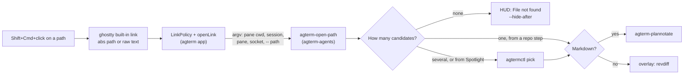

# Clickable file paths — spec

## Contents

- [Problem](#problem)
- [What the user does](#what-the-user-does)
- [Design](#design)
- [Resolution chain and measured hit rate](#resolution-chain-and-measured-hit-rate)
- [Outcomes](#outcomes)
- [Security boundary](#security-boundary)
- [Control API](#control-api)
- [Out of scope](#out-of-scope)
- [Open points](#open-points)

## Problem

Agents write file references into the terminal all the time:

```
- docs/plans/20260929-headless-origin-spec.md
- agterm/Ghostty/GhosttySurfaceView+Input.swift:566
```

To read one, Sasha copies the path, works out which directory it is relative to, and opens it by hand.
The path is relative to wherever the agent was working, which is not always the pane's current directory.

## What the user does

1. Click a path with the same chord as xchat message links (Shift+Cmd+click in agent panes).
2. A markdown file opens in plannotator in the HTML overlay over that pane.
   A code file opens in revdiff in a program overlay over that pane.
3. Several candidates: agterm's native picker lists the full paths, the chosen one opens.
4. No candidate: a HUD says `File not found: <path>` and hides itself after a few seconds.

Shift is required while the program has mouse reporting on, which every Claude Code and zmx pane does;
a plain shell pane uses Cmd+click (`.claude/rules/libghostty.md`, the `link` section).

## Design

Ghostty already detects paths. Its built-in link (the default `link-url`, regex in upstream
`src/config/url.zig`) has a rooted branch (`/…`, `~/…`, `./…`) and a bare branch (`src/config/url.zig`).
On a click, `Surface.processLinks` runs `resolvePathForOpening`: a relative match that exists under the
terminal's pwd arrives as an absolute path, anything else arrives as the raw matched text, `:N` included.
Both reach `openLink` through `GHOSTTY_ACTION_OPEN_URL`, where `LinkPolicy` ignores them today because they
carry no scheme.

So no `link` rule and no new scheme: `LinkPolicy` learns to accept a schemeless path, and the app hands it
to a script in `~/dev/agterm-agents`, the same app/script split as the clickable xchat ids.
Resolution logic then changes without an app rebuild.



**App (`agterm-vim`)**

- `LinkPolicy` gets a `.openPath(path:line:)` disposition for schemeless input (see
  [Security boundary](#security-boundary) for what it accepts).
- A host-free argv builder in `agtermCore` shapes the script's arguments, so pane side, split and line
  handling are unit-tested.
- `GhosttySurfaceView.openLink` gets the matching case and runs `agterm-open-path` with an argv array,
  sharing the helper launch with `openXchatMessage`.

**Script (`agterm-agents/bin/agterm-open-path`)**

- Python, like `xchat-open`. `install.sh` already symlinks `bin/` into `~/.local/bin`.
- The app's environment has no `~/.local/bin` or `/opt/homebrew/bin` on PATH, so the script appends both,
  as `xchat-open` does, and passes absolute tool paths into any overlay command.
- Resolves the path, then shows the HUD, the picker, or a viewer.
- Also runnable by hand: `agterm-open-path --cwd "$PWD" --target "$AGTERM_SESSION_ID" -- docs/x.md`.

## Resolution chain and measured hit rate

The chain stops at the first step that returns at least one existing regular file.

| step | how |
|---|---|
| absolute or `~/` | expand, check it exists |
| pane directory | `<cwd>/<path>` |
| git root | `git -C <cwd> rev-parse --show-toplevel` + path |
| main checkout | parent of `git rev-parse --git-common-dir`, when the pane is in a worktree |
| repo suffix | `git ls-files` entries equal to the path or ending in `/<path>` |
| Spotlight | `mdfind -name <basename>`, kept only when the full path ends in `/<path>` |

Measured on 2026-09-29 by replaying relative paths from the last 300 Claude Code transcripts against each
message's recorded `cwd` (486 paths whose directory still exists):

| step | found | running total |
|---|---|---|
| pane directory | 239 | 49% |
| git root | 7 | 51% |
| main checkout | 10 | 53% |
| repo suffix, unique | 27 | 58% |
| Spotlight, unique | 54 | 69% |
| Spotlight, several | 24 | picker |
| not found | 124 | 26% |

The misses are mostly files deleted since (done backlog items, plans in removed worktrees) and regex
fragments such as `Support/Google/…` cut out of `Application Support/…`.
A local model cannot find a file that no longer exists, so there is no model fallback.
The rate is a lower bound: a click right after the agent writes a path finds more of them.

## Outcomes

| candidates | where from | result |
|---|---|---|
| 0 | — | `session hud "File not found: <path>" --hide-after 4` |
| 1 | any repo step | open it |
| 1 | Spotlight | picker with the one full path (it may be in another repo) |
| 2+ | any | picker, full paths, at most 20 |

A cancelled picker (`pick` exits 2) ends quietly.

Opening:

- `.md`, `.markdown` → `agterm-plannotate <abs> --target <sid> [--pane <side>] [--socket]`, detached.
- any other accepted extension → `agtermctl session overlay open "<abs revdiff> --only=<abs file>"` with
  `--cwd` set to the file's directory, `--target <sid>` and `--pane <side>` when the session is split.

`:N` is parsed and passed on, but neither viewer can jump to a line today; see [Open points](#open-points).

## Security boundary

Terminal output is untrusted. A program can print any path, and it can also emit an OSC 8 hyperlink whose
target is any schemeless string; both reach `openLink`. `LinkPolicy` is therefore the only gate in the app.

It accepts schemeless input only when all of these hold:

- after stripping a trailing run of `.*;!?` and a `:N`, `:N-M` or `:N:C` suffix, the path matches
  `^(?:~/|/)?[\w.@+-]+(?:/[\w.@+~-]+)*$` and contains at least one `/` — so `~/x.md` and `/x.md` pass
  and a bare `x.md` does not; no quotes, `$`, `%`, `?` or `#`;
- a space is allowed only in an absolute path, because ghostty delivers the pwd-resolved absolute path of
  a pane whose directory holds one (`Application Support`); a relative match with a space is refused;
- it does not start with `-`;
- its extension is in the allowlist (markdown plus the code extensions in the plan), matched against the
  whole final component, so `x.tsx` is never read as `x.ts`;
- it is at most 1024 characters and holds no newline.

The app never passes the path to `NSWorkspace` or a shell. The script gets it after `--`, as one argv element.
The script only reads the file and shows it in a viewer; it never executes it.
Reading a file a program named is the same exposure as that program printing the file itself.
The resolver's git calls pass `-c core.fsmonitor=` so a repository config cannot make them run a program.

## Control API

No new control command.
The capability is a script entry point, not an app state, and it uses the existing `session hud`,
`pick` and `session overlay open` commands, which already have read-back (`hud`, `pickPending`,
`htmlOverlays`, `overlay`).

## Out of scope

- Relative paths with spaces, and bare file names without a `/` (`README.md`). Ghostty's regex can match
  both, but `LinkPolicy` refuses them for now; revisit after use.
- Opening files in an editor. revdiff is read-only with annotations; an editor is one picker away later.
- A custom `link` rule in `ghostty.conf`. The built-in link already delivers every path this needs, and it
  is matched before any user rule, so a custom rule for paths could never fire.

## Open points

- OSC 8 links are matched before the built-in link. If Claude Code prints file references as OSC 8
  `file://` hyperlinks, those clicks reveal in Finder instead. Task 5 checks a live Claude Code click; if
  it is OSC 8, `file://` handling for allowed extensions joins this feature.

- Line jump: neither `revdiff` nor plannotator takes a start line. v1 ignores `:N` when opening.
- `revdiff --only` on a tracked file with local changes may show the diff, not the whole file. If so, the
  code viewer switches to `revdiff --stdin --stdin-name=<name> < <file>`, which shows raw text.
- The pane-scoped overlay (`--pane`) is passed only when `Session.isSplit`, so an unsplit pane uses the
  session-wide slot.
