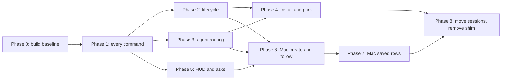

# Plan: the headless agterm origin on p4linux

The spec is `docs/plans/20260929-headless-origin-spec.md`. It names each problem and says why. This
plan turns it into tasks. Each phase names the problems it solves by the spec's short names.

## Contents

1. [Before you start](#before-you-start)
2. [Phases and sizes](#phases-and-sizes)
3. [The support table](#the-support-table)
4. [Phase 0: Linux build and test baseline](#phase-0-linux-build-and-test-baseline)
5. [Phase 1: the server answers every command](#phase-1-the-server-answers-every-command)
6. [Phase 2: session lifecycle on the server](#phase-2-session-lifecycle-on-the-server)
7. [Phase 3: agent calls reach the server](#phase-3-agent-calls-reach-the-server)
8. [Phase 4: install, run and park](#phase-4-install-run-and-park)
9. [Phase 5: HUD and asks](#phase-5-hud-and-asks)
10. [Phase 6: Mac side, create and follow](#phase-6-mac-side-create-and-follow)
11. [Phase 7: Mac side, saved rows and row states](#phase-7-mac-side-saved-rows-and-row-states)
12. [Phase 8: move p4linux sessions and remove the shim](#phase-8-move-p4linux-sessions-and-remove-the-shim)
13. [Later phase: overlays and the picker](#later-phase-overlays-and-the-picker)

## Before you start

- Repository: `~/dev/oss/agterm-vim`, branch cut from `headless-spike`. The park and shim tasks edit
  `~/dev/agterm-agents`, a separate repository with its own commits.
- Linux commands need Swift on PATH: `. ~/.local/share/swiftly/env.sh` first. Every `swift` command
  below runs in `agtermCore/`.
- Never run a test server on `~/.local/state/agterm-headless`. Tests and smoke runs set
  `AGTERM_HEADLESS_STATE` to a temp directory. The live server is Sasha's.
- For anything that touches the Mac app or CLI: never execute `agterm`/`agtermctl` against the default
  socket, never launch or quit the app, static reading only. Mac gates run on p4studio.
- Never pin a line number in a file this plan edits. Name the type or function.
- Each phase that lands a feature updates `FORK-NOTES.md` and `CHANGELOG-fork.md` in the same commit
  (`.claude/rules/release.md`). The rules for the server live in `.claude/rules/headless-origin.md`,
  created by Task 2.
- Gates. Linux, in every phase: `swift build --product agterm-headless && swift test`. Mac, in every
  phase that touches shared code, once at the end of the phase on p4studio, run by the session and not
  by the loop: `cd agtermCore && swift test`, `make test-app`, `make lint`.
- Agent statuses are `idle`, `active`, `completed` and `blocked` (`AgentStatus`). Tests use `active`.

## Phases and sizes

| Phase | What works at the end | Size |
|---|---|---|
| 0 | `agtermctl` and the test targets build on Linux. The server logic is in a kit the Mac also compiles. | 1.5 days |
| 1 | The server answers every command, served or refused by name. Daemons get the pane environment and a login shell. | 3.5 days |
| 2 | Split, swap, rename, close and daemon exit on the server, with a startup grace. | 3 days |
| 3 | Hooks and agents in headless sessions reach the server. | 1 day |
| 4 | systemd unit, install script, version check, park tools. | 1.5 days |
| 5 | Hub presenter callbacks and hand-off; HUD and asks from headless sessions reach the Mac. | 3 days |
| 6 | Mac: `zmx new <host>`, late split shown, presenter follows the lead. | 3.5 days |
| 7 | Mac: remote rows survive a relaunch and a window reopen, keep their transport, Disconnected and Ended on host. | 5 days |
| 8 | New p4linux sessions are headless, the old rows are moved, the real `agtermctl` is installed, the shim is gone. | 4 days, plus about half a day of Sasha-run live steps |
| Later | Program, HTML and URL overlays, the picker. | not sized |

About 26 days in total. Phases 0 to 4 run on p4linux. Phase 5 changes shared core, so it also needs
the Mac gate. Phases 6 and 7 need p4studio for the Mac gates.

## The support table

`HeadlessCatalog.support(for:)` is the one list. This table is its target state; the phase column says
when a command moves from refused to served. Tasks update the catalog and its test as they go.

| Commands | Answer | Phase |
|---|---|---|
| `tree`, `events.read`, `version`, `window.list`, `zmx.tree`, `zmx.present`, `zmx.list`, `notify`, `session.status`, `session.context`, `session.seen`, `session.new`, `session.mark` | served | 1 |
| `session.close`, `session.rename`, `session.split`, `session.split.close`, `session.swap`, `session.text`, `zmx.kill` | served | 2 |
| `session.hud.open`, `.update`, `.close`, `ask.open` (terminal style only; `--style gui` is refused "no windows or UI", Sasha's decision), `ask.result`, `ask.cancel` | refused "later phase" until 5, then served | 5 |
| `zmx.new` | served (host-less form) | 6 |
| every `window.*` but `window.list`; every `workspace.*`; `sidebar`, `sidebar.mode`, `sidebar.flagged-layout`, `sidebar.expand`, `sidebar.collapse`, `sidebar.parked`, `sidebar.width`; `mode`; `theme.set`, `theme.list`; `font.inc`, `font.dec`, `font.reset`; `keymap.reload`, `keymap.list`; `config.reload`; `quick`, `quick.type`, `quick.text`; `dashboard`; `debug.appearance`; `session.select`, `.go`, `.reveal`, `.move`, `.duplicate`, `.flag`, `.park`, `.focus`, `.resize`, `.background` | refused "no windows or UI" | 1 |
| `session.type`, `session.copy`, `session.paste`, `session.selectall`, `session.search`, `surface.zoom`, `surface.cursor`, `session.scratch`, `session.lead` | refused "no terminal surface" | 1 |
| `session.pairing`, `overlay-redirect.toggle`, `session.bookmark.add`, `.list`, `.go`, `.remove`, `hooks.reload`, `hooks.list`, `session.restore`, `restore.clear`, `restore.capture`, `restore.mode`, `zmx.prune`, `zmx.reset`, `zmx.attach` | refused "a Mac feature" | 1 |
| every `session.overlay.*` including `session.overlay.job.run`; `pick.open`, `pick.result`, `pick.cancel` | refused "later phase" | 1 |

## Phase 0: Linux build and test baseline

Solves "no agtermctl on Linux" (build half) and "a merge can break the Linux build unseen". Ends with a
Linux test gate that runs and a kit the Mac compiles.

### Task 1: agtermctl builds on Linux

Read first: `OverlayRunJob.run` in `agtermCore/Sources/agtermctlKit/OverlayRunJob.swift`. It returns an
`Int32` and reports failures as a `launchFailed` frame; it does not throw. Also the executable-path
helper that calls `_NSGetExecutablePath` in `MiscCommands.swift`. `SocketClient.swift` has the Glibc
branch to copy. The `agterm-linux` fork carries fixes for these two spots; compare with a clone of it
if one is available.

- [x] Write a test in `agtermctlKitTests/OverlayRunJobTests.swift`, inside `#if os(Linux)`: `run` returns a failure code and reports a `launchFailed` frame whose text contains "not supported on Linux".
- [x] Wrap the existing spawn tests in that file in `#if canImport(Darwin)`, since they fail on Linux.
- [x] In `OverlayRunJob.swift`, wrap the `posix_spawn` path in `#if canImport(Darwin)`. The Linux branch reports that refusal. Program overlays are the later phase.
- [x] In `MiscCommands.swift`, add a Linux branch reading `/proc/self/exe` with `readlink`.
- [x] Acceptance: `swift build --product agtermctl && swift test --filter OverlayRunJobTests`

### Task 2: test targets build and run on Linux

`QuitReasonTests.swift` uses `NSAppleEventDescriptor`. `CodexStatusHookTests.swift` imports Darwin.
There may be more; the build will say.

- [x] Run `swift build --build-tests` on Linux and list every failing test file.
- [x] Wrap each Darwin-only test file or test in `#if canImport(Darwin)`. Do not change a production file in this task.
- [x] Run `swift test` on Linux. For each runtime failure, decide: a Darwin behaviour (for example `HudMarkdown`'s attributed output, which is plain text on Linux) gets a `canImport(Darwin)` guard; anything else is a real bug and stops the task.
- [x] Create `.claude/rules/headless-origin.md` with a `paths:` frontmatter (`agtermCore/Sources/agterm-headless/**`, `agtermCore/Sources/AgtermHeadlessKit/**`, `agtermCore/Tests/AgtermHeadlessKitTests/**`, `scripts/headless/**`) and a "Linux test gate" section with the guarded list and the final pass count.
- [x] Add `headless-origin.md` to the "Path-scoped rules" list in `CLAUDE.md`, one line.
- [x] Acceptance: `swift build --build-tests && swift test && grep -q headless-origin.md ../CLAUDE.md`

### Task 3: move the server logic into AgtermHeadlessKit

Read first: `agtermCore/Package.swift` (the `#if os(Linux)` block adding `agterm-headless`) and the four
files in `agtermCore/Sources/agterm-headless/`.

- [x] Write `Tests/AgtermHeadlessKitTests/HeadlessConfigTests.swift` first: `HeadlessConfig` from an injected environment honours `AGTERM_HEADLESS_STATE` and `AGTERM_HEADLESS_ZMX`, and `socketPath` equals `ControlResolve.socketPath(stateDir: stateDirectory, appSupport: "")`.
- [x] In `Package.swift`, add target `AgtermHeadlessKit` (depends on `agtermCore`) and test target `AgtermHeadlessKitTests`, outside any `#if`. The Linux-only executable now depends on the kit.
- [x] Move `HeadlessConfig`, `DaemonSurface` and the model part of `Headless` into `Sources/AgtermHeadlessKit/`, public where the executable needs them. Make `HeadlessConfig.fromEnvironment` take the environment as a parameter. `Socket.swift`, `Presentation.swift` and `main.swift` stay in the executable.
- [x] Keep the stream half in the executable: the fd write in `openPresentation`, the `streams` list and the heartbeat timer use `UnixSocket` and `PresentationStream`. Give the kit a `HeadlessStreams` protocol with `adopt(session:fd:)` and `closeStreams(session:)`, implemented by the executable and faked in tests.
- [x] No behaviour change. The spike's `handle` switch moves with `Headless` and is replaced in Phase 1.
- [x] Acceptance: `swift test --filter AgtermHeadlessKitTests && swift build --product agterm-headless`

Phase 0 gate: Linux gate, and the Mac gate on p4studio (`Package.swift` and shared test files changed).
Result 2026-09-29: Linux 4193 tests green; Mac `swift test` 4366 green, `make lint` clean; `make test-app` 1093 passed, 1 failed. The failure, `HtmlOverlayRegistryTests/testAFolderGrantKeepsFilesOutsideItOut`, also fails on clean `main` (`f6f184b6`, macOS 26.7), so it is a known failure outside this plan. Sasha accepted it.

## Phase 1: the server answers every command

Solves "most commands are refused", "a hung zmx call freezes the server", "no agtermctl on Linux"
(the `ctl` half), and the daemon half of "agent calls go to the Mac".

### Task 4: a zmx runner with a deadline

Prior art: the app's `ZmxClient` (`agterm/Ghostty/ZmxClient.swift`), with its injectable `Runner`,
`timeout` and `terminationGrace`. It imports Darwin and `os` and is `@MainActor`, so we do not hoist it.

- [x] Write `ZmxRunnerTests` first, using `/bin/sleep` and `/bin/sh` as the executable, so it runs on both platforms: a 30-second sleep with a 1-second timeout returns `.timedOut` in under 2 seconds; a nonzero exit returns `.failed` with stderr; the child environment has `ZMX_DIR` set and `ZMX_SESSION` and `ZMX_SESSION_PREFIX` removed; a given working directory is applied; a call to the synchronous core from a `@MainActor` test function returns (no deadlock).
- [x] Add `ZmxRunning` and `ProcessZmxRunner` in the kit. The core is synchronous: start the process, wait for exit with a deadline on a background semaphore, SIGTERM at the deadline, SIGKILL after a 0.25 s grace. It never awaits a task. Say in one comment line that it mirrors `ZmxClient`.
- [x] Add an async entry that runs the synchronous core on a global dispatch queue, for `zmx list`.
- [x] Add a `FakeZmxRunner` in the test target that records calls and returns scripted output.
- [x] Acceptance: `swift test --filter ZmxRunnerTests`

### Task 5: the support table in code

- [x] Write `HeadlessCatalogTests` first from [the support table](#the-support-table): the phase 1 served list is served; every other command is refused with a reason that contains the command's raw value and "headless origin".
- [x] Add `HeadlessCatalog.support(for: Command) -> HeadlessSupport` with cases `served` and `refused(String)`. The switch has no `default`, so a new upstream command fails the build on both platforms.
- [x] Acceptance: `swift test --filter HeadlessCatalogTests`

### Task 6: a refusing conformer with full command coverage

Read first: the `ControlActions` protocol in `ControlDispatcher.swift` (118 requirements), the 29
defaults in `ControlActionsDefaults.swift`, and `MockControlActions.swift` in the core tests for the
shape of a full conformer.

- [x] Write `HeadlessCoverageTests` first: for every `Command`, a hand-built request with minimal valid arguments, dispatched through `ControlDispatcher(actions: HeadlessActions(...))`, gets a non-nil response; for every command the catalog refuses, the response is the catalog's text. Keep the request list next to the catalog test.
- [x] Add `HeadlessActions` implementing every requirement without a default as `HeadlessCatalog`'s refusal, and overriding the defaults that would otherwise answer with generic text.
- [x] Acceptance: `swift test --filter HeadlessCoverageTests`

### Task 7: the served read and status commands

Port the spike's `Headless.attachableSessions`, `setStatus`, `openPresentation` and the notify arm.

- [x] Write `HeadlessActionsTests` first. Build a `Headless` on a temp state directory with a `FakeZmxRunner` and one session. Through the dispatcher: `tree` lists the session; `zmx.tree` returns it with its daemon when the fake `zmx list` shows it, and refuses a host; `zmx.list` returns the joined inventory; `session.status active --target <id>` changes the tree; `session.context` and `session.seen` change the tree; `session.mark` returns 1, then 2; `notify` records an event visible in `events.read`; `window.list` lists the window; `version` returns the commit from a `BUILD` file in the install directory, and no commit when the file is missing; `zmx.present <id>` answers ok with the id.
- [x] Implement those methods. `remoteTree(host:)` runs `zmx list` through the async runner entry. `markSessionTurn` calls `AppStore.markTurn` and writes nothing to a pty.
- [x] Wire `presentationHub` onto every store, as the spike does.
- [x] Acceptance: `swift test --filter HeadlessActionsTests`

### Task 8: the socket serves the dispatcher, and ctl mode goes

Read first: how the app hands off a presentation stream after the ok reply (`ControlServer`'s
connection handler for `.zmxPresent`).

- [x] In the executable, replace the `handle` switch with `await ControlDispatcher(actions: headlessActions).dispatch(request)`. The per-connection thread (not the main thread) waits on a semaphore while a `@MainActor` task runs it.
- [x] For `.zmxPresent`: write the ok reply, then hand the descriptor to `PresentationStream`, as today.
- [x] Delete `ctl` mode, its `request(for:)` parser, the `bridge` helper, and the argv0 `agtermctl` check in `main.swift`. `serve` is the only mode.
- [x] Add `scripts/headless/smoke.sh`: start `agterm-headless serve` with a temp `AGTERM_HEADLESS_STATE` and `AGTERM_HEADLESS_ZMX` pointing at an installed patched zmx (exit 0 with a message when none is found); with the built `agtermctl --socket`, run `tree`, `zmx tree`, `session new --command 'sleep 600'`, `notify`, and `window new` (expect the refusal); kill the daemons it made and the server.
- [x] Acceptance: `swift build --product agterm-headless && swift build --product agtermctl && scripts/headless/smoke.sh`

### Task 9: daemons get the pane environment and a login shell

Read first: `SurfaceEnvironment.session` in `agtermCore/Sources/agtermCore/SurfaceEnvironment.swift`
and the spike's `Headless.newSession`.

- [x] Write the test first in `HeadlessActionsTests`: `session.new --command true --name t` makes the fake runner see `run agterm-<pane uuid> -d sh -c true`; the environment contains `SHELL=<shell>`, where `<shell>` comes from an injected password-database lookup, and at least `AGTERM_ENABLED=1`, `AGTERM_SESSION_ID=<id>`, `AGTERM_SOCKET=<state>/agterm.sock`, `AGTERM_STATE_DIR=<state>`, `AGTERM_PANE=left`, `AGTERM_PANE_ID=<pane uuid>`, the window and workspace ids, `TERM_PROGRAM` and `TERM_PROGRAM_VERSION`.
- [x] Serve `createSession` through the dispatcher's `ControlSessionCreateOptions`. Build the environment with `SurfaceEnvironment.session(...)` and add `AGTERM_STATE_DIR`. Set `SHELL` from `getpwuid`, falling back to `/bin/sh`. zmx starts `$SHELL` as a login shell and types the command (zmx `src/main.zig`), so no `-lc` wrapper is needed.
- [x] Keep the spike's cleanup: a failed `zmx run` kills the daemon and closes the session.
- [x] Acceptance: `swift test --filter HeadlessActionsTests`

### Task 10: phase 1 docs

- [x] Extend `.claude/rules/headless-origin.md`: what the server serves (point at `HeadlessCatalog` as the one list), the runner deadline and why the core is synchronous, and the pane environment and `SHELL` contract.
- [x] In `.claude/rules/fork-merge.md`, under "Where upstream and the fork keep colliding", add `HeadlessCatalog.swift`: a new upstream `Command` or `ControlActions` requirement fails the Mac `swift test` there; classify it in the catalog and add its method.
- [x] Add one line to `FORK-NOTES.md` under the right group, pointing at the rules file. Add a user-facing entry to `CHANGELOG-fork.md` under `## Unreleased`.
- [x] Acceptance: `grep -q HeadlessCatalog .claude/rules/fork-merge.md && grep -q headless-origin FORK-NOTES.md && grep -qi headless CHANGELOG-fork.md`

Phase 1 gate: Linux gate, and the Mac gate on p4studio.
Result 2026-09-30: Linux 4230 tests green; Mac `swift test` 4403 green, `make lint` clean; `make test-app` failed only
the known `main` failure and `testACurrentReloadAfterAFailedFirstLoadLoadsTheSource`, which passed alone on rerun
(a localhost WebKit timing flake in the same suite). The Mac run found two runner defects the serial Linux gate
cannot see, both starvation of `DispatchQueue.global()` under parallel load: fixed in `0c8c32cf` and `23eb7209`.

Live check, run by Sasha or the session, not by the loop: deploy the new binaries by hand as in the
spike, and restart the server. From p4studio `agtermctl zmx tree p4linux --json` and `zmx attach`
still work (the shim's spike branch must now call the Linux `agtermctl`; Phase 3 replaces it, so point
it there by hand until then). `ssh p4linux ~/.local/opt/agterm-headless/agtermctl window list` answers.
A session made with `session new --command zsh` has `claude` on its PATH.

## Phase 2: session lifecycle on the server

Solves "no session lifecycle on the server".

### Task 11: session.new honours cwd and runs a bare shell

- [x] Test first: `session.new --cwd /tmp --command true` runs the runner with cwd `/tmp` and stores `/tmp` as the session cwd. `session.new` with no command runs `true`, so the daemon's login shell waits at its prompt.
- [x] Verify by hand with the real patched zmx in a temp `ZMX_DIR` that `SHELL=<shell> zmx run <name> -d sh -c true` leaves a live daemon at a login-shell prompt. If it does not, find the zmx form that does and record it in the rules file.
- [x] Implement. A missing `--cwd` means the home directory.
- [x] Acceptance: `swift test --filter HeadlessActionsTests`

### Task 12: session.close, zmx.kill and session.rename

- [x] Test first: `session.close --target <id>` runs `zmx kill <daemon> --force` for each pane and removes the session from `tree`; `zmx.kill --target <id> --pane right --force` kills only the split daemon and closes the split; `session.rename` changes the name in `tree` and `zmx tree`.
- [x] Implement with `AppStore.closeSession`, `closeSplit` and `renameSession`. Save the store and the library index after each.
- [x] Mark the three commands served in `HeadlessCatalog` and its test.
- [x] Acceptance: `swift test --filter 'HeadlessActionsTests|HeadlessCatalogTests'`

### Task 13: split, split close and swap

Read first: `AppStore.setSplitVisibility`, `swapPanes`, `closeSplit` and `savePaneLayout`, which publish
the `layout` frame, and `PaneRoleMutableSurface` in `TerminalSurface.swift`.

- [x] Test first: with a recording `PresentationSink` subscribed to the hub, `session.split --target <id> --command true` creates a daemon for the new split pane with `AGTERM_PANE=right` and publishes a two-pane layout; `session.swap` answers ok (not `roleNotMutable`) and publishes the swapped primary; `session.split.close` kills the split daemon and publishes a one-pane layout.
- [x] Make `DaemonSurface` conform to `PaneRoleMutableSurface`.
- [x] Implement `splitSession` (all overloads the dispatcher reaches), `closeSessionSplit` and `swapSessionPanes`. Attach a `DaemonSurface` to the new pane. A hidden split (`off`) keeps its daemon.
- [x] Mark the commands served in the catalog.
- [x] Acceptance: `swift test --filter 'HeadlessActionsTests|HeadlessCatalogTests'`

### Task 14: the daemon watcher

- [x] Test first, with the fake runner and an injected clock: a pane whose daemon appeared in one list and is missing in the next is closed (split pane first, then primary); a session with no panes left is closed and `HeadlessStreams.closeStreams(session:)` is called; a restored pane never listed since start is left alone before the 10-minute startup grace ends and closed after it; a pane whose daemon appears during the grace (a park replay) is kept; a pane created after start and not yet listed is left alone for 10 minutes from its creation, then closed; a failed `zmx list` changes nothing.
- [x] Implement `DaemonWatcher` in the kit, polling every 5 seconds through the async runner entry, applying changes on the main actor.
- [x] Acceptance: `swift test --filter DaemonWatcherTests`

### Task 15: session.text from zmx history

- [x] Test first: `session.text --target <id>` returns the fake runner's `zmx history <daemon>` output, honouring the dispatcher's line options; the right pane reads the split daemon.
- [x] Implement `readSessionText`, and mark it served in the catalog.
- [x] Acceptance: `swift test --filter 'HeadlessActionsTests|HeadlessCatalogTests'`

### Task 16: phase 2 docs

- [x] Add the lifecycle rules to `.claude/rules/headless-origin.md`: one daemon per pane, the watcher's "listed before" rule and the startup grace, close kills daemons.
- [x] Update the `FORK-NOTES.md` line if its wording no longer fits. Add a `CHANGELOG-fork.md` entry.
- [x] Acceptance: `grep -q DaemonWatcher .claude/rules/headless-origin.md`

Phase 2 gate: Linux gate, and the Mac gate on p4studio (the kit changed).
Result 2026-09-30: Linux 4268 tests green; Mac `swift test` 4441 green and `make lint` clean at `a1e03bc0`;
`make test-app` failed only the known `main` failure and `SessionHostClientTests.testDeadPidfileDoesNotPreventFreshHost`,
whose suite passed 7/7 alone on rerun. The branch changes neither the app target nor the session host.

Live check: with p4studio attached, run `agtermctl session split` for the session on p4linux. p4studio
does not grow the split yet (Phase 6). Reattach from p4studio and the split is there. `session swap`
shows live on p4studio. `zmx kill` the split daemon and p4studio closes the split pane.

## Phase 3: agent calls reach the server

Solves the routing half of "agent calls go to the Mac". The shim edits are in `~/dev/agterm-agents`.

### Task 17: the shim routes by pane environment

Superseded, not done: Phase 8 deleted the shim (`bin/agterm-ctl-remote`, Task 47), and `agtermctl` on p4linux is
the server's own CLI (Task 46). The boxes below stay open on purpose.

Read first: the spike branch at the top of `bin/agterm-ctl-remote` and `tests/test_agterm_ctl_remote.py`.

- [ ] Write tests first in `tests/test_agterm_ctl_remote.py`, with a fake Linux `agtermctl` through a new seam `AGTERM_CTL_REMOTE_HEADLESS_CTL` and a fake state directory through `AGTERM_CTL_REMOTE_HEADLESS_STATE`. Cases that reach the fake: `AGTERM_SOCKET=<state>/agterm.sock` with `session status active --target X --socket <state>/agterm.sock` (and `AGTERM_STATE_DIR=<state>` is in the fake's environment); with the fake installed and no `AGTERM_SOCKET`, `zmx tree --json`, `zmx present <id>` and `zmx new --json --name t`, each also when the socket file is missing (the fake's failure exit code comes back unchanged). Cases that take the Mac path: `zmx tree p4studio`; `zmx tree` when the Linux `agtermctl` is not installed; `AGTERM_SOCKET` pointing elsewhere.
- [ ] Replace the spike branch with the routing rule. "Installed" means the Linux `agtermctl` binary exists. Default Linux `agtermctl` path: `~/.local/opt/agterm-headless/agtermctl`. Default state: `~/.local/state/agterm-headless`.
- [ ] Update the header comment of the shim: one paragraph on the routing rule and why an installed server never falls back to the Mac.
- [ ] Acceptance: `cd ~/dev/agterm-agents && python -m pytest tests/test_agterm_ctl_remote.py -q`

### Task 18: the status hook against a test server

- [x] Extend `scripts/headless/smoke.sh` in agterm-vim: create a session, build the same pane variables the server gives it, run `agterm/Resources/agent-status/agterm-agent-status.sh active` with those variables and `AGTERMCTL` set to the built `agtermctl`, then check `tree --json` shows the status.
- [x] Acceptance: `scripts/headless/smoke.sh`

Phase 3 gate: the agterm-agents pytest file above, and the Linux gate.
Live checks 2026-09-30, server `3a463d94` deployed by hand: all passed on p4studio. A bare `notify` from a
server pane failed on `--target active`; the server now names the fix. Seen state does not flow back (Task 49).
The second Mac (p4air) was offline and is unchecked.
Result 2026-09-30: `tests/test_agterm_ctl_remote.py` 97 passed (`uv run --with pytest`, on `headless-routing`
`9e794bf`); Linux 4268 tests green at `579af661`; `scripts/headless/smoke.sh` ok, status hook included.

Live check: in a p4linux session created by the server, start Claude. The row on p4studio shows the
status. `agtermctl notify hi` from that pane appears on both Macs. Stop the server: `agtermctl zmx
tree p4linux` on p4studio fails instead of listing p4studio's own sessions.

## Phase 4: install, run and park

Solves "no install, service or version check" and "park tools miss the server's sessions".

### Task 19: the install script

- [x] Write `scripts/headless/install.sh`: build `agterm-headless` and `agtermctl` with `swift build -c release`; build zmx from `ZMX_REV` read out of `scripts/setup.sh` with every patch in `scripts/zmx-patches/` applied, for the host's Linux target; keep a stamp of the revision and the patch digest, as `setup.sh` does, so an unchanged zmx is not rebuilt; install into `~/.local/opt/agterm-headless/`; write `BUILD` with `git rev-parse --short HEAD`; install the unit (next task); print what changed.
- [x] Add `--dry-run`, which prints the steps and changes nothing.
- [x] Acceptance: `shellcheck scripts/headless/install.sh && scripts/headless/install.sh --dry-run`

### Task 20: the systemd user unit

- [x] Write `scripts/headless/agterm-headless.service`: `ExecStart=%h/.local/opt/agterm-headless/agterm-headless serve`, `Restart=on-failure`, an explicit `PATH`, and `KillMode=process` with a one-line comment saying why: the zmx daemons are in the unit's cgroup.
- [x] `install.sh` copies it to `~/.config/systemd/user/`, runs `daemon-reload` and `enable`, and restarts the service only when the binary changed.
- [x] Acceptance: `systemd-analyze --user verify scripts/headless/agterm-headless.service && grep -q '^KillMode=process' scripts/headless/agterm-headless.service`

### Task 21: the version check

- [x] Write `scripts/headless/check-version.sh <mac>...`: read the server's commit (`agtermctl version --json`) and presentation version (`agtermctl zmx tree --json`, field `result.remote.presentation`) with the Linux `agtermctl`; for each Mac, run `ssh <mac> /Applications/agterm.app/Contents/MacOS/agtermctl version --json` and `… zmx tree --json` (both read-only); print one line per Mac; exit 1 on a different presentation version; warn on a different commit; warn separately when either side reports no commit.
- [x] Add a fixture mode that reads JSON files instead of running commands. Add `scripts/headless/test-check-version.sh`, a plain shell test that feeds matching, mismatching and commit-less fixtures and checks the exit codes and warnings.
- [x] Acceptance: `shellcheck scripts/headless/check-version.sh && scripts/headless/test-check-version.sh`

### Task 22: park tools target the server's zmx directory

In `~/dev/agterm-agents`. Read first: `zmx_list`, `_env_of`, the snapshot selection and the replay loop
in `bin/agterm-zmx-park`, and how `bin/agterm-park` calls zmx.

- [x] Write tests first in `tests/test_agterm_zmx_park_headless.py` with a fake `zmx` on PATH that logs its argv and `ZMX_DIR`. `--zmx <path> --zmx-dir <dir>` makes every zmx call use that binary and `ZMX_DIR`. The manifests go to a separate subdirectory, so the default park's `latest` is untouched. In this mode a session with a Claude and `clients=0` is kept. The snapshot records `AGTERM_SESSION_ID`, `AGTERM_SOCKET`, `AGTERM_STATE_DIR`, `AGTERM_PANE` and `AGTERM_PANE_ID` and nothing else, and the replay passes them to `zmx run`. The replay removes a stale socket file under the original name before `zmx run`.
- [x] Implement in `bin/agterm-zmx-park`. Name the added `_env_of` keys in its docstring: they are ids and paths, not secrets.
- [x] Give `bin/agterm-park` the same `--zmx` and `--zmx-dir` options, with one test.
- [x] Add `systemd/agterm-headless-park-snapshot.service`, `.timer`, `-replay.service` and `-shutdown.service`, copies of the existing park units with the two options.
- [x] Acceptance: `cd ~/dev/agterm-agents && python -m pytest tests/test_agterm_zmx_park_headless.py tests/test_agterm_park.py -q`

### Task 23: phase 4 docs

- [x] Add install, the unit, the `KillMode` reason, the version rule, and the park replay versus the startup grace to `.claude/rules/headless-origin.md`. Add a line to `.claude/rules/fork-merge.md`'s gate list: after a merge, `swift build --product agterm-headless` on p4linux.
- [x] `FORK-NOTES.md` and `CHANGELOG-fork.md` entries.
- [x] Acceptance: `grep -q 'KillMode=process' .claude/rules/headless-origin.md && grep -q 'product agterm-headless' .claude/rules/fork-merge.md`

Phase 4 gate: Linux gate and the two pytest files.
Result 2026-09-30: Linux 4270 tests green; the two pytest files 276 passed on agterm-agents `headless-park`
`3cd942a`. The whole agterm-agents suite has 129 failures in six files, the same 129 on `main`.

Live check: Sasha stops the spike server, runs `scripts/headless/install.sh`, and checks
`systemctl --user status agterm-headless`. With a Mac attached, `systemctl --user restart
agterm-headless`: `zmx list` shows the same daemons with the same pids, and the Mac's stream reconnects
within about 10 seconds. `scripts/headless/check-version.sh p4studio p4air` prints both. A park
snapshot and replay of one killed session brings the Mac row back. A reboot is not part of the check:
the disk is LUKS and needs a person at the console.

Live check 2026-09-30, `46c85818` installed with `install.sh` (the hand-started server stopped first):
the service runs; `systemctl --user restart` kept both daemons' pids and the Mac stream reconnected in about
3 seconds; `check-version.sh p4studio p4air` printed both (presentation 1, different commit: warning).
Park, run from agterm-agents `headless-park` in boot order (service stopped, daemon killed, replay, service
started): the daemon came back under its name in its directory and the server kept the session. It first
found two defects, fixed in `cedf2af`: bare shells were dropped as `ended`, and had no directory to replay
into. The Mac row's stream reconnected but its terminal stayed disconnected: reattaching a row is Phase 7's
supervisor. Not yet done: merging `headless-park` and installing the headless park units.

## Phase 5: HUD and asks

Solves "HUD and asks are not served". The hub callbacks are shared core, so this phase needs the Mac
gate.

### Task 24: hub presenter callbacks

Consumers of the hub change, 6 in total. Recount at acceptance.

1. `PresentationHub.onPresenterWillChange` and `onPresenterChanged`, fired on every change of holder: a grant, a release, a hand-off, and (Phase 6) a take.
2. The hello mode recorded per subscriber, and the hand-off at release to the earliest remaining subscriber whose hello asked for presenter mode, with `presenter.granted` sent to it.
3. `onPresenterLost`, now fired only when a release leaves nobody to take the role. `onPresenterChanged` fires only when a new holder exists.
4. The Mac origin's `attachPresentationHub` in `ControlServer+Presentation.swift`: `onPresenterWillChange` sends `ask.dismiss` and `overlay.close` to the old holder; `onPresenterChanged` re-offers the ask with `reofferRemoteAsk` and treats the overlay as lost (`remoteOverlayPresenterLost`). The no-holder case stays with `onPresenterLost` and today's take-back, so take-back runs once.
5. The server's ask path (Task 26) offers the waiting or presented ask from `onPresenterChanged`.
6. The server's ask path dismisses the old holder's ask in `onPresenterWillChange`.

- [x] Tests first in `PresentationHubTests`: a first `presenter.acquire` fires `onPresenterChanged` once and `onPresenterWillChange` never; the holder disconnecting while a second presenter-mode viewer is connected sends `presenter.granted` to the second, fires both callbacks, and does not fire `onPresenterLost`; with no such viewer left it fires `onPresenterWillChange` and `onPresenterLost` and not `onPresenterChanged`; a mirror-mode viewer is never handed the role; a second viewer's refused acquire fires nothing.
- [x] Implement consumers 1 to 3 in `PresentationHub.swift`.
- [x] In the core, add public `AppStore.presentAsk(_:in:paneIdentity:window:)` in `AppStore+RemoteAsk.swift` with today's body of `presentAskRemotely` minus the `followsRemotely` check, and make `presentAskRemotely` the check plus a call to it. `AppStoreRemoteAskTests` still pass; add "presentAsk with an empty lead book sends ask.request".
- [x] Add `AppStore.reofferRemoteAsk(forSession:includeWaiting:)` next to it: act when `session.askPresentedRemotely`, or when `includeWaiting` and an ask is pending; capture `askPaneIdentity` and the window from `AskRegistry.shared.owner(for:)` before `releaseAsk()`, which clears the pane; then `presentAsk(_:in:paneIdentity:window:)`. Tests in `AppStoreRemoteAskTests`: "after a re-offer, cancel sends ask.dismiss to the new presenter"; "a grant with a locally drawn ask moves nothing" (with `includeWaiting: false`); "a waiting ask is offered with its pane" (with `true`).
- [x] Implement consumer 4, passing `includeWaiting: false`. Hosted test in `ControlServerPresentationTests`: "a hand-off on a Mac origin re-offers the ask to the new viewer". It asserts nothing about the old viewer: on a hand-off the hub has already dropped that subscriber, so no dismiss can reach it. Do not reorder the hub to write to a dropped sink. The old-viewer dismiss is tested for a take in Task 32.
- [x] Acceptance: `swift test --filter 'PresentationHubTests|AppStoreRemoteAskTests' && scripts/test-app.sh -only-testing:agtermTests/ControlServerPresentationTests`

### Task 25: the HUD on the server

Read first: `ControlDispatcher+Hud.swift` (what the dispatcher already validates), `AppStore.openHud`,
`updateHud`, `closeHud`, `publishHud`, and how the app's HUD path sets the auto-hide deadline.

- [x] Test first in `HeadlessHudTests`, with a recording sink and an injected clock: `session.hud.open` publishes a `hud` frame with the spec and the pane; `update` republishes with a higher generation; `close` publishes `hud(nil)`; a `hideAfter` of 2 seconds publishes `hud(nil)` after the clock passes 2 seconds; a HUD open on a split closes with that split.
- [x] Implement `openHud`, `updateHud` and `closeHud` in `HeadlessActions`. Pass an empty helper command and file to `AppStore.openHud`. Size from `spec.sizePercent`, or the core's default clamp.
- [x] Mark the three commands served in the catalog.
- [x] Acceptance: `swift test --filter 'HeadlessHudTests|HeadlessCatalogTests'`

### Task 26: asks with and without a presenter

Read first: `AppStore.presentAskRemotely` and `Session.followsRemotely` (why the server cannot call it),
`Session.onRemoteAskEnded` (internal, so only core code can set it), `resolveRemoteAsk`,
`AskRegistry.resolveOwner` (set by the app in `ControlServer`'s init), and the ask arm in
`ControlDispatcher+Ask.swift`.

- [x] Test first in `HeadlessAskTests`, with a hub and two recording sinks and an empty `ZmxLeadBook`. With a presenter, `ask.open` sends `ask.request` to the presenter only, and `ask.result` reports pending. The presenter's `ask.resolve` makes `ask.result` return the button. With no presenter, `ask.open` is ok and pending, and no frame is sent. A viewer's `presenter.acquire` then leads to `ask.request` on that viewer. The presenter disconnecting sends the ask back to waiting, and a new presenter gets it again under the new owner generation. `ask.cancel` ends it in either state, sends `ask.dismiss` to a presenter, and sends nothing for a waiting ask. Closing the session with a presented ask sends `ask.dismiss`. Closing the session with a waiting ask makes `ask.result` return cancelled. A confirmed `ask.rejected` ends the ask as `cancelled` with `ControlAskResult.presentationLost`; a rejection naming an older ask changes nothing. A waiting ask with `--pane right` is offered to the next presenter with the split pane's identity. `ask.open --style gui` is refused by name. `pick.open` is refused by name.
- [x] Implement the server ask path in the kit: `presentAsk` when a presenter exists; otherwise a waiting ask in the session's own slot (`session.openAsk(ask, paneIdentity:)` with no remote owner, registered as a session ask), so every existing end path ends it. From `onPresenterChanged`: `reofferRemoteAsk(forSession:includeWaiting: true)` (Task 24). From `onPresenterWillChange`: dismiss to the old holder. On presenter loss: `session.takeAskBack()`, never `takeBackRemoteAsk`, and the ask waits. On an `ask.rejected` that `isPresentingRemotely(ref, forSession:)` confirms: resolve it `cancelled` with `ControlAskResult.presentationLost`, as the Mac's `failHandback` does. Resolve `--pane` and `--pane-id` in the kit with no visibility check (the Mac's `resolvePanePlacement` is app code). `openAsk` refuses `style == .gui` with "gui asks are not available on a headless origin; use --style terminal". Set `AskRegistry.shared.resolveOwner` at server start the way `ControlServer`'s init does.
- [x] Wire `hub.onPresenterFrame` to `resolveRemoteAsk` and the rejection path, as `ControlServer+Presentation.swift` does on the Mac.
- [x] Mark the ask commands served in the catalog.
- [x] Acceptance: `swift test --filter 'HeadlessAskTests|HeadlessCatalogTests|AppStoreRemoteAskTests'`

### Task 27: phase 5 docs

- [x] Add the HUD and ask rules to `.claude/rules/headless-origin.md`: why the server does not call `presentAskRemotely`, a waiting ask stays in the session slot and is never drawn on the server, the two hub callbacks.
- [x] `FORK-NOTES.md` and `CHANGELOG-fork.md` entries.
- [x] Recount the callback consumers with `grep -rn onPresenterChanged`.
- [x] Acceptance: `grep -q 'session slot' .claude/rules/headless-origin.md`

Phase 5 gate: Linux gate, and the Mac gate on p4studio.
Result 2026-09-30 at `97b14a8d`: Linux 4303 tests green; Mac `swift test` 4476 green. `make lint` failed on
`withPaneSession`'s six parameters, fixed in `4f9f5639`. `make test-app` 1101 tests with one failure,
`HtmlOverlayRegistryTests.testAFolderGrantKeepsFilesOutsideItOut`, which fails the same way at `471f8bb6`, the
upstream merge that brought #659, before any Phase 1 to 5 change: not this plan's.
The Mac `swift test` must run over plain ssh: in an agterm row, upstream `zsh -i` tests stop on the tty and it hangs.

Live check: from a headless pane, `agtermctl session hud open hello --hide-after 5`: the panel shows on
both Macs and goes after 5 seconds. `agtermctl ask open Q --button yes --button no --target
$AGTERM_SESSION_ID`: the dialog shows on the presenting Mac, and the chosen button prints on p4linux.
Close the lid of the presenting Mac: within the 30-second stale timeout the other Mac is granted presenter and the ask shows there.
Result 2026-10-01, `444b43ef` on p4linux, p4studio and p4air: the HUD with `--hide-after 5` showed on
both Macs and was gone from both by 8 seconds. An ask from p4linux showed on the presenter and its answer
printed on p4linux. With p4air presenting, an open ask moved to p4studio about 30 seconds after the lid
closed, together with the presenter role. On screen the pane cover stayed up until a key press: it shows
the zmx lead, which the sleeping Mac still held, and a grant moves only the presenter. Sasha kept that
(2026-10-01): a grant never takes the lead. The ask draws only while its row is selected.

## Phase 6: Mac side, create and follow

Solves "the Mac cannot create a p4linux session", "a split made on the origin after attach is not
shown on the Mac", and "the presenter ignores the lead". Runs on p4studio for the Mac gates.

Consumers of the new `zmx.new` command, 12 in total. Recount at acceptance.

1. `Command.zmxNew = "zmx.new"` in `ControlProtocol.swift`.
2. The zmx group arm of `ControlDispatcher.dispatch`.
3. The `.zmxNew` arm in `dispatchZmxCommand` (`ControlDispatcher+Zmx.swift`), with validation.
4. `ControlActions.createAttachableSession(_:)`, the host-less form, with a refusing default in `ControlActionsDefaults.swift`.
5. `ControlActions.createRemoteSession(host:options:window:)`, the host form, with a refusing default.
6. The app's fallback switch in `ControlServer.dispatch`: add `.zmxNew` to the "did not handle" list.
7. `ControlServer.waitsOnNetwork`: add `.zmxNew`, or the ssh blocks the accept thread.
8. The Mac's `createRemoteSession` in `ControlServer+Zmx.swift`.
9. `RemoteSession.newCommand(host:options:)`, next to `treeCommand`.
10. `Zmx.New` in `agtermctlKit/ZmxCommands.swift`.
11. `HeadlessActions.createAttachableSession` and `HeadlessCatalog`.
12. The shim route (done in Task 17; verify).

Documented in `.claude/rules/control-api.md` (catalog list and "Remote sessions") only. It is fork-only,
so the bundled skill and `site/commands.html` leave it out, as the rules for fork-only commands say.

### Task 28: zmx.new on the wire and in the CLI

- [x] Tests first: in `ControlDispatcherZmxTests`, host-less `zmx.new` calls `createAttachableSession` with name, command and cwd; with a host it calls `createRemoteSession`; an invalid host or a control character in the name is refused before any action; the defaults refuse. In `ZmxCommandsTests`, `agtermctl zmx new p4linux --name t --command c --cwd /x --window W` builds that request, and `zmx new --json` without a host builds the host-less one.
- [x] Implement consumers 1 to 5 and 10. Add `.zmxNew` to `HeadlessCatalog` as refused for now, so the kit builds.
- [x] Acceptance: `swift test --filter 'ControlDispatcherZmxTests|ZmxCommandsTests|HeadlessCatalogTests'`

### Task 29: the server serves host-less zmx.new

- [x] Test first in `HeadlessActionsTests`: host-less `zmx.new` creates a session like `session.new` and returns its id, and `zmx tree` lists it at once when the fake zmx lists its daemon.
- [x] Implement consumer 11 and mark it served.
- [x] Acceptance: `swift test --filter 'HeadlessActionsTests|HeadlessCatalogTests'`

### Task 30: the Mac creates and attaches

Read first: `ControlServer.attachRemoteSession(host:session:window:transport:)` and
`RemoteSession.treeCommand` in `RemoteSession.swift`.

- [x] Tests first: in `RemoteSessionTests`, `newCommand` quotes name, command and cwd as one `/bin/sh -c` chain exactly as `treeCommand` does, and refuses a bad host. In the hosted `ControlServerRemotePresentationTests` (or a sibling), with an injected remote runner: a far answer `{ok:true,result:{id}}` leads to one attach of that id; a far refusal is returned as is and creates no row.
- [x] Implement consumers 6 to 9. The far call parses like `RemoteTreeMerger.decode`.
- [x] Acceptance: `swift test --filter RemoteSessionTests && scripts/test-app.sh -only-testing:agtermTests/ControlServerRemotePresentationTests`

### Task 31: a split added on the origin grows on the Mac

Read first: `AppStore.applyRemoteLayout` in `AppStore+RemoteLayout.swift`, `agtermApp.applyRemoteLayout`
in `agterm/agtermApp+RemoteLayout.swift`, `RemoteBinding` and `RemotePresentationState` in
`RemotePresentationState.swift`, and `PaneReattach.launch` in `agterm/Ghostty/PaneLead.swift`.

- [x] Tests first. In `RemotePresentationStateTests`: `RemoteBinding.adding(localPane:daemon:)` returns a binding that maps the new pane both ways and keeps the old ones. In `AppStoreRemoteLayoutTests`: `AppStore.addRemotePane(local:daemon:forSession:)` grows the binding and keeps mode, layout and held panes ("growing the binding keeps mode and layout"). In `AppStoreRemoteLayoutTests`: `remoteLayoutAddedPane` returns the new origin pane for a valid two-pane layout on a one-pane replica, and nil for a layout whose second pane is already mapped or an invalid layout; `applyRemoteLayout`'s existing tests still pass unchanged.
- [x] Add `RemoteBinding.adding(localPane:daemon:)`, make `RemotePresentationState.binding` a `var`, add `AppStore.remoteLayoutAddedPane(_:forSession:)` next to `applyRemoteLayout`, and add public `AppStore.addRemotePane(local:daemon:forSession:)` in `AppStore+RemotePresentation.swift` (the app cannot write `Session.remotePresentation`, which is `internal(set)`). Do not change `applyRemoteLayout`'s signature.
- [x] In `agtermApp.applyRemoteLayout`, when the new function returns a pane: open the split with `RemoteSession.attachPaneCommand` for daemon `ZmxSupport.daemonName(for: <origin pane>)` on the binding's origin, `splitCommandWait = true`, the layout's axis, and the origin's transport once Task 35 adds it; then call `addRemotePane`.
- [x] Hosted test in `RemoteLayoutCloseTests` or a sibling: the layout frame leads to a split whose initial command attaches that daemon.
- [x] Acceptance: `swift test --filter 'AppStoreRemoteLayoutTests|RemotePresentationStateTests' && scripts/test-app.sh -only-testing:agtermTests/RemoteLayoutCloseTests`

### Task 32: presenter.take in the core

Consumers of the new frame kind, 11 in total. Recount at acceptance.

1. `PresentationFrame.Body.presenterTake`.
2. The kind-name switch in `PresentationFrames.swift`.
3. The decode switch.
4. The encode path.
5. `PresenterGrant.transfer(session:to:)`.
6. The `.presenterTake` arm in `PresentationHub.receive`, which fires the Task 24 callbacks.
7. `RemotePresentationClient.takePresenter()` and the ignore arm in its `receive` switch.
8. The `.hello` arm of `RemotePresentationClient.receive`: sends `presenter.take` instead of `presenter.acquire` when the client's lead query says the row's primary pane leads.
9. The Mac's lead hook: the app's `roleChanged` closure calls `takePresenter()`.
10. The server's `onPresenterWillChange` handler dismisses the old holder's ask (already written in Task 26; verify it runs for a take).
11. The Mac origin's two callbacks (Task 24; verify they run for a take).

- [x] Tests first. `PresentationFramesTests`: `presenter.take` round-trips. `PresenterGrantTests`: `transfer` moves the holder and bumps the generation; a transfer to the holder changes nothing. `PresentationHubTests`: a take from the second viewer fires `onPresenterWillChange` while the first still holds, sends `presenter.refused` to the first and `presenter.granted` to the second, then fires `onPresenterChanged`. `RemotePresentationClientTests`: `takePresenter()` sends the frame on the current link and does nothing with no link; a reconnect whose lead query answers true sends `presenter.take` after hello; false sends `presenter.acquire`. `HeadlessAskTests`: a take sends `ask.dismiss` to the previous presenter and `ask.request` to the new one under the new owner generation. Hosted `ControlServerPresentationTests`: "a take on a Mac origin dismisses the ask on the old viewer and re-offers it".
- [x] Implement consumers 1 to 8 and 10. The client gets the lead query as an injected closure, so the core client does not read `ZmxLeadBook` directly.
- [x] Acceptance: `swift test --filter 'PresentationFramesTests|PresenterGrantTests|PresentationHubTests|RemotePresentationClientTests|HeadlessAskTests' && scripts/test-app.sh -only-testing:agtermTests/ControlServerPresentationTests`

### Task 33: the Mac takes presenter with the lead

- [x] Hosted test first: a lead notice that makes a remote row's primary pane `.leader` makes that row's presentation client send `presenter.take`; a `.follower` notice, or a `.leader` notice for the split pane, sends nothing; a client created for a row whose primary pane already leads gets a lead query that answers true.
- [x] In the app's `roleChanged` closure (set in `agtermApp.swift`, called from `PaneLead.report`), call `takePresenter()` on the row's client when the primary pane's new role is `.leader` and the session has a `remotePresentation`. Where the app creates a row's `RemotePresentationClient`, pass a lead query reading `ZmxLeadBook.shared` for the row's primary pane.
- [x] Acceptance: `scripts/test-app.sh -only-testing:agtermTests/ControlServerRemotePresentationTests`

### Task 49: seen on the Mac reaches the origin

Found in the Phase 3 live check (2026-09-30): opening a remote row on p4studio cleared its unseen count and
Claude's auto-reset status on the Mac only. The server kept `unseen 4, status blocked`, which a reattach,
a server restart or a second Mac shows again. Numbered after Phase 8 because it was added late.

- [x] Tests first: core, a `seen` frame from a subscribed viewer makes the hub call `onPresenterFrame`-style
  handling that runs `markSessionSeen` for the session; hosted, clearing unseen on a remote row
  (`AppStore.clearUnseen` and the refocus path) sends one `seen` frame on its presentation client and none for
  a local row.
- [x] Add the viewer frame, send it from the app where a remote row is marked seen, and apply it on the
  server through the existing `session.seen` path. Any viewer may send it, not only the presenter.
- [x] Acceptance: `swift test --filter 'PresentationHubTests|HeadlessActionsTests'` and
  `scripts/test-app.sh -only-testing:agtermTests/ControlServerRemotePresentationTests`

### Task 34: phase 6 docs

- [x] `.claude/rules/control-api.md`: add `zmx.new` to the catalog list with a "fork only" note, a bullet under "Remote sessions" for its host-optional shape, and one line for `presenter.take` where the presenter role is described.
- [x] `.claude/rules/headless-origin.md`: the two Mac features and their consumer lists.
- [x] `FORK-NOTES.md` and `CHANGELOG-fork.md` entries.
- [x] Recount the two consumer lists above against the code with `grep -rn zmxNew` and `grep -rn presenterTake`.
- [x] Acceptance: `grep -q 'zmx.new' .claude/rules/control-api.md && grep -q 'presenter.take' .claude/rules/control-api.md`

Phase 6 gate: Linux gate, then the Mac gate on p4studio (`swift test`, `make test-app`, `make lint`).
Result 2026-09-30 at `22647482`: Linux 4338 tests green; Mac `swift test` 4511 green; `make lint` clean;
`make test-app` 1112 tests with three failures. Two were the new `seen` tests, whose fixture never ran
`attachPresentationHub`; fixed in `dbb7d804`, and both classes then passed (49 tests). The third is the
upstream `HtmlOverlayRegistryTests` failure recorded under Phase 5.

Live check on p4studio, with a deployed build: `agtermctl zmx new p4linux --name t --command claude`
opens an attached row. On p4linux `agtermctl session split --target <id>`: the row grows a split on
p4studio. Press a key on p4air's cover for that row, then open an ask on p4linux: it shows on p4air.
Restart the server: after the streams reconnect, a new ask still shows on p4air.
Result 2026-10-01, `444b43ef`: `zmx new p4linux` opened an attached, connected, leading row. A split
made on p4linux grew on p4studio. Attaching on p4air took the lead and the presenter; a key typed on
p4studio took both back, per pane, and the next ask showed on p4studio only. After a server restart both
Macs reconnected within about 6 seconds and a new ask showed on the presenter.

Session-only check before Phase 7, not run by the loop: in an isolated Debug instance, let a remote
pane's ssh exit (stop the daemon on p4linux), then trigger the reattach path `PaneReattach.launch` uses
on that pane. Record in `.claude/rules/headless-origin.md` whether it works on an exited surface. Task
39 reads that record.

## Phase 7: Mac side, saved rows and row states

Solves "remote rows are lost on relaunch" and "a dead remote row gives no reason". Runs on p4studio.

Consumers of the new `remoteState` read-back field, 7 in total. Recount at acceptance.

1. `RemoteRowState` (new fork file `RemoteRowState.swift`) and its storage as `rowState` on `RemotePresentationState`.
2. `ControlSessionNode.remoteState`, optional, omitted when nil (`ControlProjection.swift`).
3. The producer where `AppStore` builds the tree node with `remoteHost`.
4. The sidebar row notice in `WorkspaceSidebar+RowRendering.swift`, today reading `connection.rowNotice(host:)`.
5. The `RemoteRowSupervisor` that sets it through `AppStore.setRemoteRowState`.
6. Tree read-back tests (`remoteState` present for a remote row, absent for a local one).
7. The bundled skill's session-node field list in `plugins/agterm/skills/agterm/reference.md`, which documents fork-only read-back fields.

### Task 35: the RemoteRowBook model

Prior art: `RemoteBinding` and `RemoteBinding.Origin` in `RemotePresentationState.swift` hold the host,
endpoint, session name, remote session id and daemons. The book stores those, by pane role, plus the
`RemoteTransport`.

- [x] Tests first in `RemoteRowBookTests`: a record with ssh and one with mosh transport encode and decode; `presentationVersion` round-trips, and a restore passes it to `RemoteBinding(...)`; a row without an origin produces no record; `records(from:previous:)` over a library with one remote row and one local row returns one record with window, workspace and position; records in `previous` for a window that is closed but still in the library are kept unchanged ("window close then reopen keeps the row"); a record for a window no longer in the library is dropped; a record with an invalid host or daemon name is dropped on load; a mosh record whose server or client path fails `RemoteSession.isPlainMoshServer` is dropped on load, because the synthesized `Codable` skips `RemoteTransport.parse` and `--server=` reaches the far shell raw; the file lives at `<stateDir>/remote-rows.json`, is written atomically, and a missing file reads as empty.
- [x] Add a `Codable` conformance to `RemoteTransport` in `RemoteSession.swift` (a round-trip test for `.ssh` and `.mosh`). Add `transport` to `RemoteBinding.Origin`, which is not persisted itself; the book record encodes the transport. Set it in `attachRemoteSession`. Make `PaneReattach.launch` pass it to `attachPaneCommand`. Test in `RemotePresentationStateTests`, and hosted "the transport survives attach, save and restore" in Task 37.
- [x] Add `agtermCore/Sources/agtermCore/RemoteRowBook.swift` (new, fork). No command is stored. A row whose binding has no `origin` is not saved.
- [x] Acceptance: `swift test --filter 'RemoteRowBookTests|RemotePresentationStateTests'`

### Task 36: the app writes the book

Read first: `AppStore.onRemoteRowVisibility` and `emitRemoteVisibility` in `AppStore+Events.swift`.
Those fire on visibility and undo, so the book is not driven by them.

- [x] Hosted tests first in `RemoteRowBookAppTests`: attaching a remote row writes one record; closing the row removes it once the close is final; closing its window keeps the record; `applicationWillTerminate` writes the current order first, and nothing during quit teardown rewrites the book ("quit teardown does not empty the book"); an on-demand `restore.capture` does not stop later writes.
- [x] Write the book from a library walk, debounced, on the store's tree-changed signal, with the previous book as `previous`. In `AppDelegate.applicationWillTerminate`, write it once just before `library?.isTerminating = true`; the flag then stops every later write. Not in `captureForegroundCommands`, which `restore.capture` also calls, and not in `applicationShouldTerminate`, which can be cancelled.
- [x] Acceptance: `scripts/test-app.sh -only-testing:agtermTests/RemoteRowBookAppTests`

### Task 37: rows come back at launch

- [x] Tests first: a core `restorePlan(records:windowID:store:)` returns, per record of that window, the workspace and position; hosted `RemoteRowRestoreTests`: a launch with one record creates one remote row in its saved workspace and position, not selected and not focused, bound, with the attach command built from the saved endpoint and transport (a mosh record gives a mosh command), and starts its presentation stream; this happens in each restore mode; "launch restores each open window once"; "reopening a closed window recreates its remote row" (a reopen restores once more); "nothing is created twice"; "a restored row's attach command carries no claim".
- [x] Add a `WindowLibrary.onStoreLoaded` callback fired from `loadStore(for:launchRestore:)` only when `launchRestore` is false, with a core test that a reopen fires it and a launch load does not. The launch loads run inside `WindowLibrary.init` (`bootstrap`), before any callback can be set.
- [x] Implement: at launch, `ControlServer.restoreRemoteRows()` walks `library.openIDs()`; `agtermApp.init` calls it once, right after `ControlServer(...)` is constructed, inside the existing `!Self.isHostedUnitTest` guard, never from the scene `.task`; it reads `remote-rows.json` before Task 36's book writer is armed. Hosted `RemoteRowRestoreTests` call the method directly; on a reopen, from `onStoreLoaded`. Split the part of `attachRemoteSession` after discovery into a function both paths call. It takes the lead attachment (`claim: true` for a user attach, `claim: false` for a restore), the workspace, the insert position, and whether to select and focus; a restore passes its saved workspace and position, `select: false`, and no `focusSplitPane`.
- [x] Acceptance: `swift test --filter 'RemoteRowBookTests|WindowLibraryTests' && scripts/test-app.sh -only-testing:agtermTests/RemoteRowRestoreTests`

### Task 38: row state and its read-back

- [x] Tests first in `RemoteRowStateTests`: `RemoteRowState.classify(tree:binding:)` gives `disconnected` for a failed tree, `disconnected` for an ok tree whose endpoint differs from the binding's `Origin.endpoint`, `endedOnHost` for an ok tree from the same endpoint without the session id, `attached` when the id is listed. In `AppStoreTreeProjectionTests`: the node carries `remoteState` for a remote row and omits it for a local row. The row notice reads "Disconnected from p4linux, retrying" and "Ended on p4linux. Close the row to remove it".
- [x] Add public `AppStore.setRemoteRowState(_:forSession:)` in `AppStore+RemotePresentation.swift`; the app cannot write `Session.remotePresentation` directly. `classify` takes the binding's origin endpoint; a row without an origin is never classified.
- [x] Implement consumers 1 to 4, 6 and 7.
- [x] Acceptance: `swift test --filter 'RemoteRowStateTests|AppStoreTreeProjectionTests'`

### Task 39: the supervisor

- [x] Hosted tests first in `RemoteRowSupervisorTests`, with an injected tree runner and clock: a remote pane exit runs one tree call per host; `disconnected` retries every 30 seconds and, when the tree lists the session again, reattaches the pane through the path `PaneReattach.launch` uses, with `ZmxLeadAttachment(claim: false)`, and sets `attached`; `endedOnHost` makes no more calls; closing the row stops the retries; a split closed on the origin (the pane is held, or the last layout removed it) causes no tree call and no reattach.
- [x] Read the Phase 6 session-only check in `.claude/rules/headless-origin.md`. If the reattach path does not work on an exited surface, implement the spec's fallback instead: close the row and attach a new one at the same position.
- [x] Implement `RemoteRowSupervisor` (new app file), consumer 5. Skip any pane for which `remotePaneIsHeld` or `canCloseRemovedRemotePane` is true.
- [x] Acceptance: `scripts/test-app.sh -only-testing:agtermTests/RemoteRowSupervisorTests`

### Task 40: phase 7 docs

- [x] `.claude/rules/control-api.md`, "Remote sessions" and "Tree and window read-back": remote rows are saved in the book without a command, restored at launch in every restore mode, and `remoteState` is read back. Update the line saying a remote session is never persisted.
- [x] `.claude/rules/headless-origin.md`: the book, its write rule, and the supervisor.
- [x] `FORK-NOTES.md` and `CHANGELOG-fork.md` entries.
- [x] Recount the `remoteState` consumers with `grep -rn remoteState`.
- [x] Acceptance: `grep -q remoteState .claude/rules/control-api.md && grep -q remoteState plugins/agterm/skills/agterm/reference.md && grep -q RemoteRowBook FORK-NOTES.md`

Phase 7 gate: Linux gate, then the Mac gate on p4studio.
Result 2026-09-30 at `27927545`: Linux 4371 tests green; Mac `swift test` 4544 green; `make lint` clean;
`make test-app` 1129 tests with one failure, the upstream `HtmlOverlayRegistryTests` one. A first Mac
`swift test` died on SIGSEGV from a stale incremental build; a clean `.build` passed.

Live check on p4studio, in an isolated Debug instance with its own state directory: attach two p4linux
rows through a throwaway ssh host alias (for example `p4linux-test` in `~/.ssh/config`, pointing at
p4linux), move one, quit the instance cleanly (this exercises the `applicationWillTerminate` write; SIGTERM skips it), relaunch: both come back in place. Point the alias
at an unused address, and the rows say Disconnected; point it back, and they reattach within 30
seconds. Nothing on p4linux changes, so Sasha's own ssh is never cut. `agtermctl session close` the
session on p4linux, and the row says Ended on p4linux.
Result 2026-10-01, Debug `444b43ef` with state in `/tmp/ap7` and alias `p4linux-test`: after a clean
quit and relaunch both rows came back at positions 0 and 2, attached, with no new daemons on p4linux.
With the alias pointed at `192.0.2.1` and the pane ssh clients killed, both rows read `disconnected`; with
the alias restored both reattached after 21 seconds, which also answers whether `PaneReattach` works on
an exited surface. Closing one session on p4linux turned its row `endedOnHost`; the other stayed attached.

## Phase 8: move p4linux sessions and remove the shim

Solves "p4linux sessions still run as Mac rows". Starts only when Phases 0 to 7 are in daily use.

Order changed 2026-10-01, after Task 41's inventory (`~/dev/agterm-agents/docs/headless-migration.md`):
the headless server does not yet forward `session.overlay.*` or `pick.*`, so the code for Tasks 42 to 46
is written on agterm-agents branch `headless-phase8` and merges only once overlay forwarding exists
(`docs/plans/20261001-headless-overlay-forwarding-plan.md`). Task 46's `install.sh` half also waits for it:
it points every `agtermctl` on p4linux at the server, plain `ssh p4linux` rows included. It also comes after
live steps 1 to 4, or the rows not yet moved send their hooks, rooms and typing to a server that does not
know them.
`install.sh`'s `mac_host()` reads the Mac's name out of `bin/agterm-ctl-remote`, so Task 46 moves that
name before Task 47 deletes the shim. Task 47's removal list also takes `agterm-zmx-far-sync`,
`agterm-park-watch` and the `bind_argv` branch of `agterm-attach-picker`.
Most edits are in `~/dev/agterm-agents`. Steps marked **Sasha-run** touch live rows, daemons or the
live Mac socket; the loop never runs them.

### Task 41: inventory of the Mac path

- [x] Write `~/dev/agterm-agents/docs/headless-migration.md`: every entry point that creates or binds a p4linux row (`agterm-zmx new|bind|pick --host`, `offload.sh --host`, the shim's `session new` rewrite, `agterm-attach-picker`, `agterm-reattach-far`), the Mac's forced ssh command `bin/agtermctl-shim-wrapper` and its `authorized_keys` entry, every reader of `AGTERM_CTL_REMOTE_HOST`, `AGTERM_REMOTE_HOST` and `AGTERM_REMOTE_SELF_HOST` (from `grep -rl` over `bin`, `hooks`, `skills`), and for each one: switch, keep (with the reason, as for `XCHAT_REMOTE_HOST` in `hooks/xchat_remote.py`), or remove.
- [x] Acceptance: `cd ~/dev/agterm-agents && test -s docs/headless-migration.md && grep -q agterm-ctl-remote docs/headless-migration.md`

### Task 42: new p4linux sessions are headless

- [x] Tests first in `tests/test_agterm_zmx_headless_new.py`, with a fake `agtermctl`: `agterm-zmx new --host p4linux --name t --cwd /x --cmd c` on the Mac runs `agtermctl zmx new p4linux --name t --cwd /x --command c` and writes no host variables; `offload.sh --host p4linux` run on p4linux calls the Linux `agtermctl zmx new --json` and makes no call to the Mac: the session waits in `zmx tree p4linux`.
- [x] Implement in `bin/agterm-zmx` and `skills/offload-session/offload.sh`. Keep the old builder behind `--legacy` until Task 47 removes it.
- [x] Acceptance: `cd ~/dev/agterm-agents && python -m pytest tests/test_agterm_zmx_headless_new.py tests/test_offload_session_identity.py -q`

### Task 43: removed

No Mac call stays (Sasha, 2026-09-30). A session made on p4linux waits in the picker until Sasha attaches it
from the Mac. `offload-session` and its skill say so (Task 48).

### Task 44: park and replay into the server

Read first: the snapshot, conversation-id routes and replay loop in `bin/agterm-zmx-park`, and Task 22's
`--zmx` and `--zmx-dir` options.

- [x] Tests first in `tests/test_agterm_zmx_park_migrate.py`, with a fake `zmx` and a fake Linux `agtermctl`: `migrate` without `--apply` prints the plan and changes nothing; with `--apply`, per row, it kills the old daemon before creating the new session (never two Claudes on one conversation), runs `agtermctl zmx new --json --name <name> --cwd <cwd> --command <frozen launcher with --resume <id>>`, and appends `<old key> <conversation id> <route> <new id> <scrollback file>` to a mapping file; a weak-route row is skipped and listed unless `--include-weak`; a row with no Claude becomes a plain shell in its cwd and is listed as such; `--only <old key>` moves one row.
- [x] Implement the `migrate` mode in `bin/agterm-zmx-park`.
- [x] Acceptance: `cd ~/dev/agterm-agents && python -m pytest tests/test_agterm_zmx_park_migrate.py -q`

### Task 45: the Mac switches its rows

- [x] Tests first in `tests/test_agterm_headless_switch_rows.py`, with a fake Mac `agtermctl` and a fixture mapping: per mapping line, the script finds the old row by its pinned key, runs `agtermctl zmx attach p4linux <new id>`, moves the new row after the old one, and closes the old row only after the attach answered ok; `--dry-run` only prints; a failed attach leaves the old row.
- [x] Add `bin/agterm-headless-switch-rows`, reading the mapping from p4linux over ssh.
- [x] Acceptance: `cd ~/dev/agterm-agents && python -m pytest tests/test_agterm_headless_switch_rows.py -q`

### Task 46: the real agtermctl on p4linux

- [x] Test first in `agtermctlKitTests/CommandsTests.swift`, inside `#if os(Linux)`: with no `--socket` and no `AGTERM_STATE_DIR`, `socketPath` is `$HOME/.local/state/agterm-headless/agterm.sock`. The macOS default is unchanged.
- [x] Add the Linux branch to `BasicOptions.socketPath` in `agtermctlKit/Commands.swift`.
- [x] In agterm-agents `install.sh`, on the remote host: link `~/.local/bin/agtermctl` to `~/.local/opt/agterm-headless/agtermctl` instead of the shim, and write no `AGTERMCTL` export. Keep `XCHAT_REMOTE_HOST`. Update `tests/test_install_sh.py`.
- [x] Acceptance: `swift test --filter CommandsTests && cd ~/dev/agterm-agents && python -m pytest tests/test_install_sh.py -q`

Done differently, 2026-10-03: the `AGTERMCTL` export stays, because it names `~/.local/bin/agtermctl`, now the
server's CLI, and `xchat-hud-notify.sh` has no other way to find it; the Mac's name moved to agterm-agents
`config/mac-host`. `swift test --filter CommandsTests` was not run: no Swift changed in this task.

### Task 47: check, then remove the shim

- [x] Write `bin/agterm-mac-path-check` with a test in `tests/test_agterm_mac_path_check.py`: it exits 1 and lists the offender when any process has `AGTERM_CTL_REMOTE_HOST` in its environment (read with the named-key discipline of `_env_of`), when `zmx list` in the default directory shows an `agterm` row key, or when a given Mac `tree --json` fixture has a row whose command attaches the default directory.
- [x] Remove `bin/agterm-ctl-remote` and `tests/test_agterm_ctl_remote.py`, the shim linking and export code in `install.sh`, the host-variable `printf` and the `--legacy` builder in `bin/agterm-zmx`, and each reader Task 41 marked "remove".
- [x] Acceptance: `cd ~/dev/agterm-agents && python -m pytest tests -q && ! grep -rn 'agterm-ctl-remote' bin hooks skills install.sh`

### Task 48: phase 8 docs

- [x] agterm-vim: `FORK-NOTES.md`, `CHANGELOG-fork.md`, and `.claude/rules/headless-origin.md` say p4linux sessions are headless and the shim is gone.
- [x] agterm-agents: `README.md`, `docs/headless-migration.md` (what was done), `skills/agent-sessions/SKILL.md` (its shim section and the host-variable table), and `skills/offload-session/SKILL.md` (`--host`).
- [x] Acceptance: `cd ~/dev/agterm-agents && ! grep -n 'agterm-ctl-remote' README.md skills/agent-sessions/SKILL.md skills/offload-session/SKILL.md`

Phase 8 gate: the Linux gate, the full agterm-agents pytest suite, and the Mac gate on p4studio
(`Commands.swift` changed).

Live steps, **Sasha-run**, in this order, not by the loop:

1. Install Tasks 42 to 46 on p4linux and both Macs. Create one test session with
   `agtermctl zmx new p4linux --name t --command claude` and check it appears and reports status.
2. `agterm-zmx-park migrate` (dry run) on p4linux. Read the plan, especially weak-route and plain-shell
   rows.
3. Move one row with `--apply --only <key>`, then `agterm-headless-switch-rows --only <key>` on the Mac
   holding it. Confirm the new row shows the resumed conversation's last message and a status. Then
   move the rest.
4. Run `agterm-mac-path-check` on p4linux with each Mac's `tree --json`. It must exit 0.
5. Install Task 46's `install.sh` change. `agtermctl version` on p4linux answers from the Linux binary.
6. Install Task 47 once overlay forwarding covers every caller the shim still serves.

## Later phase: overlays and the picker

Sketch only. Size it when Phases 0 to 7 are in daily use.

- **Program overlays.** The frames and the job contract exist (`overlay.request`, `claimOverlayJob`,
  `OverlayJobs`, `session.overlay.job.run`). The server needs `openSessionOverlay` to create a job and
  hand it to the presenter, and `agtermctl session overlay job run` on Linux, which needs a Linux spawn
  path in `OverlayRunJob` instead of Task 1's refusal.
- **HTML overlays with assets.** The page and its files must travel to the presenter. Needs a size limit
  and a transfer frame.
- **URL overlays.** A loopback URL on p4linux needs an ssh forward from the presenting Mac, with a port
  chosen per overlay and closed with it.
- **Pick.** A `pick.request` and `pick.resolve` frame pair, like asks, and a Mac viewer that shows the
  native picker for a remote row.
- **session.type.** Only if a zmx input path proves reliable.

<!-- plan-review: planning:plan-review 2026-09-29 findings=60 resolved -->
