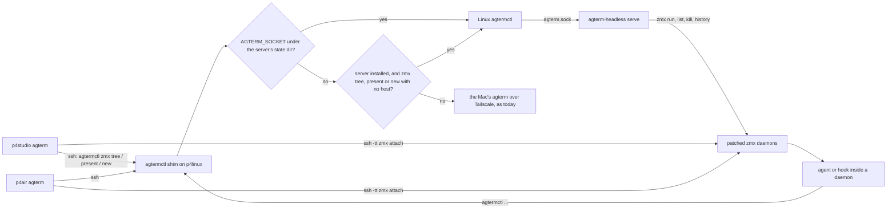

# Spec: the headless agterm origin on p4linux

The spike (`docs/plans/20260928-headless-server-spike.md`) proved that a Swift server built from the
fork's `agtermCore` can act as a remote origin. The Macs attach to it with no change. This spec lists
the problems that stop Sasha from using it every day, and says for each one what we change and how we
will know it works. The task list is in `20260929-headless-origin-plan.md`.

## Contents

1. [Scope in one paragraph](#1-scope-in-one-paragraph)
2. [Who talks to whom](#2-who-talks-to-whom)
3. [The problems, and how each is solved](#3-the-problems-and-how-each-is-solved)
4. [Not solved, and why](#4-not-solved-and-why)
5. [Decisions and trade-offs](#5-decisions-and-trade-offs)
6. [Changes to shared code, and the merge risk](#6-changes-to-shared-code-and-the-merge-risk)
7. [Coverage against the maintainer's feature list](#7-coverage-against-the-maintainers-feature-list)
8. [Where the code differs from the brief](#8-where-the-code-differs-from-the-brief)

## 1. Scope in one paragraph

p4linux runs `agterm-headless serve`. It owns the zmx daemons in
`~/.local/state/agterm-headless/zmx` and answers the full control command set from the same
`ControlDispatcher` the Mac app uses. Agents inside those daemons reach this server, not the Mac. The
Macs (p4studio, p4air) attach as today, and the fork adds four Mac features: create a p4linux session
from the Mac, show a split made on the origin after attach, move the presenter role with the zmx lead,
and keep remote rows across a Mac relaunch with a visible Disconnected or Ended on host state. Program,
HTML and URL overlays and the picker come in a later phase. Durability stays with the park tools.

## 2. Who talks to whom

This is the target flow, after the plan. Today the shim sends only `zmx tree` and `zmx present` to the
server, and only while its socket exists (the spike's uncommitted branch). Every other call, agents'
hooks included, goes to the Mac.

The shim (`agterm-agents/bin/agterm-ctl-remote`, installed as `~/.local/bin/agtermctl`) is the one
place that decides where a bare `agtermctl` call on p4linux goes. It sends a call to the server only
when the server is installed, and never falls back to the Mac for a call meant for the server. The
diagram shows this middle state. The shim is intermediate: the last phase moves every p4linux session
to the server, installs the real Linux `agtermctl` as `~/.local/bin/agtermctl`, and removes the shim
(see "p4linux sessions still run as Mac rows").

## 3. The problems, and how each is solved

Each problem has a short name. The plan's tasks repeat that name.

### 3.1 Most commands are refused

- **Today.** Any command other than `tree`, `zmx.tree`, `zmx.present`, `session.status`, `notify` and
  `session.new` gets `<cmd> is not supported by agterm-headless`.
- **Why.** `Headless.handle` in `agtermCore/Sources/agterm-headless/Headless.swift` is a hand-written
  switch with a `default` refusal. The spike skipped the `ControlActions` protocol
  (`ControlDispatcher.swift`): 118 requirements, 29 of them with defaults.
- **What is true in the app.** The migration to the dispatcher is complete. `ControlServer.dispatch`
  calls `ControlDispatcher(actions: self).dispatch(request)` first. Its fallback switch only answers
  `debug.appearance` and lists every other command as "control dispatcher did not handle". So a
  conformer gets every command's parsing, validation and error text for free.
- **Change (Linux server).** A `HeadlessActions` type conforms to `ControlActions`. A
  `HeadlessCatalog.support(for:)` function classifies every `Command` case in an exhaustive switch
  with no `default`, as served or refused with a reason. A refused command answers
  `<cmd> is not available on a headless origin: <reason>`. The plan holds the one complete table.
  `session.mark` is served: it advances the store's turn counter and returns the number. It writes no
  visible mark into the pane, which the protocol already allows for a failed pty write.
- **Check.** A test dispatches every `Command` through `ControlDispatcher(actions: HeadlessActions)` and
  gets a non-nil answer. Served commands answer ok on a model with one session. Every refusal names its
  command.

### 3.2 No session lifecycle on the server

- **Today.** `session.new` works. Split, swap, rename and close are refused. A daemon that exits leaves
  its pane in the model, so `zmx tree` just stops listing it and the model never shrinks. `zmx run`
  starts the daemon in the server's working directory, not the session's.
- **Why.** `Headless.newSession` passes `cwd: NSHomeDirectory()` to the store and runs `zmx run` with
  no working directory. Nothing polls the daemons. `AppStore.swapPanes` also needs both surfaces to be
  `PaneRoleMutableSurface`, and the spike's `DaemonSurface` is only a `TerminalSurface`, so swap would
  answer `roleNotMutable`.
- **Change (Linux server).** `HeadlessActions` serves `session.new` (with `--cwd`), `session.close`,
  `session.rename`, `session.split` (one new daemon for the split pane), `session.split.close`,
  `session.swap`, `zmx.kill` and `session.text` (read with `zmx history`). `DaemonSurface` also
  conforms to `PaneRoleMutableSurface`. The store calls exist in core (`AppStore.setSplitVisibility`,
  `swapPanes`, `closeSplit`, `closeSession`, `renameSession`). They publish the `layout` frame through
  `savePaneLayout`, so attached Macs see swap, axis and pane removal live.
- **Change (daemon watcher).** A `DaemonWatcher` polls `zmx list` every 5 seconds off the main actor.
  A pane whose daemon it listed before and no longer lists is closed in the model. A pane never listed
  since the server started is closed only after a startup grace of 10 minutes. The grace covers a
  reboot: the park replay recreates daemons in that window, and a pane that stays missing after it is
  dead. The last pane closes the session and ends its presentation streams.
- **Check.** Unit tests with a fake zmx runner for each command, for the watcher and for the grace.
  Live: split on p4linux, swap, and watch p4studio follow. Kill a daemon and watch `zmx tree p4linux`
  drop the session.

### 3.3 No agtermctl on Linux

- **Today.** `swift build` fails in `agtermctlKit`. The spike's `agterm-headless ctl` parses six
  command shapes by hand (`request(for:)` in `main.swift`).
- **Why.** Two Darwin-only spots: `posix_spawn` with `POSIX_SPAWN_START_SUSPENDED` in
  `OverlayRunJob.swift`, and `_NSGetExecutablePath` in `MiscCommands.swift`. `SocketClient.swift`
  already has a Glibc branch.
- **Change (shared agtermctlKit, Linux-only branches).** On Linux, `OverlayRunJob.run` reports
  `launchFailed` with "program overlay jobs are not supported on Linux yet", and the executable path is
  read from `/proc/self/exe`. The real `agtermctl` is installed next to the server. The spike's `ctl`
  mode is deleted: the shim calls the Linux `agtermctl` directly.
- **Why `AGTERM_STATE_DIR` must be set.** `agtermctl` never reads `AGTERM_SOCKET` for its default. It
  resolves `--socket`, then `AGTERM_STATE_DIR`, then `$HOME/Library/Application Support/agterm`
  (`agtermCore/Sources/agtermctlKit/Commands.swift:34-38`). On Linux the last one is meaningless.
- **Check.** `swift build --product agtermctl` passes on p4linux. `agtermctl --socket <sock> tree`
  answers from a test server.

### 3.4 Agent calls go to the Mac

- **Today.** A Claude in a headless daemon runs the status hook, and the status never reaches the
  headless row. A daemon inherits the server's environment. Under systemd that has no
  `AGTERM_SESSION_ID`, so the hook does nothing. The spike server was started from a p4linux shell
  inside a Mac-created row, so its daemons carry that row's id, and a hook would set the status of that
  unrelated Mac row through the shim. Under systemd the daemon may also start `/bin/sh` instead of
  Sasha's shell, so `claude` from mise shims may not be on its PATH.
- **Why.** Three gaps. First, the daemon gets no `AGTERM_*` variables of its own: `Headless.newSession`
  runs `zmx run <daemon> -d sh -c <command>` with the server's own environment. Second, `zmx run`
  starts a login `$SHELL` in a PTY and types the command into it, and it reads `SHELL` from its own
  environment, falling back to `/bin/sh` (zmx `src/main.zig`, `shell_env`). A systemd user unit may
  not set `SHELL`. Third, the shim sends everything except `zmx tree` and `zmx present` to the Mac.
- **What the hook expects.** `agterm-agent-status.sh` skips everything without `AGTERM_SESSION_ID` and
  calls `agtermctl session status <state> --target "$AGTERM_SESSION_ID" --socket "$AGTERM_SOCKET"`
  (`agterm/Resources/agent-status/agterm-agent-status.sh:81-84`). The app builds these variables with
  `SurfaceEnvironment.session` (`agtermCore/Sources/agtermCore/SurfaceEnvironment.swift:15-35`).
- **Change (Linux server).** Every daemon the server starts gets `SurfaceEnvironment.session(...)` for
  its pane (`AGTERM_ENABLED`, `AGTERM_SESSION_ID`, `AGTERM_SOCKET`, `AGTERM_WINDOW_ID`,
  `AGTERM_WORKSPACE_ID`, `AGTERM_PANE`, `AGTERM_PANE_ID`, `TERM_PROGRAM`, `TERM_PROGRAM_VERSION`) plus
  `AGTERM_STATE_DIR`. The runner also sets `SHELL` from the password database, not from the unit's
  environment. zmx then starts that shell as a login shell, so the profile and mise shims apply.
- **Change (agterm-agents repo, the shim).** Route to the Linux `agtermctl` when `AGTERM_SOCKET` is
  inside the server's state directory. Also route `zmx tree`, `zmx present` and `zmx new` with no host
  word when the server is installed (its binary exists), whether or not the socket exists. A server
  that is down then fails the call. It must not fall back to the Mac: the Mac would answer its own tree,
  and a Mac row would read that as "the session ended". Everything else goes to the Mac as today.
- **Check.** Shim tests with a fake Linux `agtermctl`, including "server installed, socket missing".
  Live: run Claude in a headless session and see the row status change on both Macs. `command -v
  claude` in a server-made pane prints a path.

### 3.5 HUD and asks are not served

- **Today.** `session.hud.open` and `ask.open` are refused by the spike switch.
- **What the Mac viewer already renders.** A viewer applies `hud`, `ask.request`, `ask.dismiss`,
  `overlay.request`, `overlay.close`, `overlay.resize`, `status`, `context`, `notify` and `layout`
  frames (`remoteEffects` in `agterm/Control/ControlServer+RemotePresentation.swift`). So HUD and asks
  need no viewer work.
- **Why the server needs its own code.** On the Mac, the HUD path measures a font and writes a body file
  for a helper program (`ControlServer+Hud.swift`), and the ask path shows a local dialog when no
  presenter exists (`ControlServer+Ask.swift`). Both are app-target code. And the core's
  `AppStore.presentAskRemotely` hands an ask over only when `Session.followsRemotely` is true, which
  reads `ZmxLeadBook`. The server is not a zmx client, so its lead book is always empty and that check
  always fails. The kit cannot copy that function either: it sets `Session.onRemoteAskEnded`, which is
  internal to the core, and that callback is what sends `ask.dismiss` from every end path (session close, split close, cancel). And `ask.result` answers only after a host sets
  `AskRegistry.shared.resolveOwner`, which today only the app does.
- **Why a waiting ask can be stranded.** A viewer sends `presenter.acquire` only in its `.hello` arm.
  When the presenting Mac's stream goes stale, the hub releases the role and tells nobody. A second
  Mac that is still connected stays a mirror until it reconnects.
- **Change (Linux server).**
  - HUD: open, update and close through the store (`AppStore.openHud` with an empty helper command),
    then `publishHud`. The server owns the auto-hide timer.
  - Ask with a presenter: a new public core helper `AppStore.presentAsk(_:in:paneIdentity:window:)`
    holds today's body of `presentAskRemotely` without the `followsRemotely` check, including the
    `onRemoteAskEnded` dismissal. `presentAskRemotely` becomes the check plus a call to it, so the Mac is
    unchanged. The server calls the helper directly and sets `AskRegistry.shared.resolveOwner` at
    start. The answer comes back through `PresentationHub.onPresenterFrame` into `resolveRemoteAsk`.
  - Moving an ask to a new presenter: a second core helper,
    `AppStore.reofferRemoteAsk(forSession:includeWaiting:)`. The Mac origin passes `false`, so it acts
    only on an ask already presented remotely (`askPresentedRemotely`) and a grant never moves an ask
    drawn locally. The server passes `true`, which also covers its waiting asks. It captures the pane
    (`askPaneIdentity`) and the window (`AskRegistry.shared.owner(for:)`) first, because `releaseAsk()`
    clears the pane, then calls `releaseAsk()` and `presentAsk` again. Going through
    `presentAsk` sets `onRemoteAskEnded` again, which `releaseAsk()` clears, so a later cancel still
    sends `ask.dismiss` to the new presenter.
  - Ask with no presenter: the ask waits in the session's own ask slot (`openAsk` with no remote
    owner, registered as a session ask), and `ask.result` reports it pending. It is never drawn on the
    server, because nothing can draw there. Keeping it in the slot means every existing end path
    (session close, split close, the daemon watcher, cancel) ends it too. A new presenter gets it through
    `reofferRemoteAsk(forSession:includeWaiting: true)`. When a presenter is lost, the server calls `session.takeAskBack()`
    directly, never `takeBackRemoteAsk`, and the ask waits again. When a presenter rejects an ask
    that `isPresentingRemotely(ref)` confirms is the current one, the server ends it as `cancelled`
    with `ControlAskResult.presentationLost`, as the Mac's `failHandback` does, so it never waits
    forever. The kit resolves `--pane` and `--pane-id` itself, with no visibility check; the Mac's
    `resolvePanePlacement` is app-target code.
  - Only terminal-style asks. `ask.open --style gui` is refused by name on a headless origin. A Mac
    viewer rejects a GUI replica whenever the row is not on screen, and a GUI ask with no `--target`
    centres on a window, which the server does not have.
- **Change (shared core, hub).**
  - Two hub callbacks: `onPresenterWillChange(session)`, called while the old holder still holds, and
    `onPresenterChanged(session)`, called after every change of holder, grants included. The server
    dismisses a presented ask to the old holder in the first and offers the ask to the new holder in
    the second. This moves the "who presents" signal into the tested kit instead of the Linux-only
    stream code.
  - A hand-off on release. The hub records whether each viewer's hello asked for presenter mode. When
    the holder goes away and another such viewer of the session is still connected, the hub gives the
    role to the earliest of them and sends it `presenter.granted`, which today's clients already handle.
    `onPresenterLost` then fires only when nobody is left to take the role.
  - The Mac origin sets both callbacks too. In the first it dismisses the ask and closes the overlay on
    the old viewer. In the second, which acts only when a new holder exists, it re-offers the ask. The
    no-holder case stays with `onPresenterLost` and today's take-back, so it runs once. Without this, a take or a hand-off would leave a dialog on the old Mac that nobody
    can answer.
- **Check.** Tests with a fake presentation sink, including "a presenter and an empty lead book still
  gets `ask.request`", "closing the session with a presented ask sends `ask.dismiss`", and "a release
  hands the role to the other connected viewer". Live: `agtermctl ask open` from a headless pane shows the dialog on the
  presenting Mac, and the answer prints on p4linux.

### 3.6 The presenter ignores the lead

- **Today.** The spike restarted the server with both Macs attached. p4studio kept the zmx lead, but
  p4air became presenter. Asks and overlays go to the presenter, so they would pop up on the laptop.
- **Why.** `PresenterGrant.acquire` gives the role to the first viewer that asks and nothing preempts
  it. A viewer asks only once, in the `.hello` arm of `RemotePresentationClient.receive`. The origin
  cannot fix this alone: it has no link between a zmx client's lead and a presentation stream. The
  restart case matters most: the daemons survive, so no lead report fires on either Mac.
- **Change (shared core and Mac app).** A new frame kind `presenter.take`, sent by a viewer.
  - The hub runs `onPresenterWillChange`, moves the role, sends `presenter.refused` to the old holder
    (which the existing client maps to mirror), sends `presenter.granted` to the new one, and runs
    `onPresenterChanged`.
  - The viewer sends `presenter.take` instead of `presenter.acquire` in its `.hello` arm when the row's
    primary pane is `.leader` in `ZmxLeadBook`. This covers the restart. One rule, the primary pane,
    so a split led from two Macs does not make both take the role.
  - The Mac also sends it when the primary pane of a remote row becomes `.leader` (`PaneLead.report` →
    the app's `roleChanged` closure) while the stream is up.
  - An older origin decodes the new kind as `.unknown` and ignores it, so no version bump is needed.
  - Losing the presenter role ends that viewer's overlays: a take on p4air closes a lazygit overlay
    open on p4studio. This is intended.
- **Check.** Hub, grant and client unit tests, including "a reconnect while leader sends take" and "a
  take dismisses the ask on the old presenter". Live: take the lead on p4air with a key on the cover,
  then open an ask on p4linux. It shows on p4air. Restart the server: it still shows on p4air.

### 3.7 A hung zmx call freezes the server

- **Today.** A zmx child that never exits stops every request and every stream.
- **Why.** `Headless.zmx` runs `Process` and `waitUntilExit()` on the main actor with no deadline.
- **Change (Linux server).** A `ZmxRunner` whose core is synchronous: it starts the process, waits
  with a deadline (3 seconds), then sends SIGTERM and SIGKILL after a grace period. It is modelled on
  the app's `ZmxClient` (`agterm/Ghostty/ZmxClient.swift:37`). An async entry runs that core on a
  background queue, for `zmx list` in `zmx.tree` and the watcher. Create, split, close and kill call the
  synchronous core from the synchronous `ControlActions` methods. They block the main actor, but only
  up to the deadline. Nothing waits on a task that needs the main actor, so there is no deadlock.
- **Check.** A runner test with `/bin/sleep 30` returns "timed out" in under 2 seconds with a 1-second
  deadline. A test calls the synchronous core from `@MainActor` code and returns.

### 3.8 The Mac cannot create a p4linux session

- **Today.** Sasha must ssh to p4linux, create the session there, then `zmx attach` from the Mac by id.
- **Why.** `zmx.attach` only attaches a session that exists (it refuses an id the far tree lacks). No
  command asks a remote origin to create one.
- **Change (shared core, CLI, Mac app, server).** A new command `zmx.new`, shaped exactly like
  `zmx.tree`: the host is optional.
  - With no host it creates an attachable session on this origin and returns its id. The headless
    server serves it. The Mac app refuses it for now.
  - With a host (on the Mac) it runs the host-less form over ssh on the far side, then calls the
    existing `attachRemoteSession(host:session:window:transport:)`.
  - CLI: `agtermctl zmx new <host> [--name N] [--command C] [--cwd DIR] [--window W]`.
- **Check.** Dispatcher and CLI tests. Live: `agtermctl zmx new p4linux --name t --command claude` on
  p4studio opens an attached row running Claude on p4linux.

### 3.9 A split made on the origin after attach is not shown on the Mac

- **Today.** The Mac copies the split at attach time (`attachRemoteSession` reads `panes` and
  `splitAxis`). Later `layout` frames apply swap, axis, visibility and pane removal. A pane added on
  the origin after attach is ignored.
- **Why.** `AppStore.applyRemoteLayout` acts only when the local session already has both panes
  realized and mapped. And `RemoteBinding` cannot learn a new pane: its daemon map is a private `let`,
  and `RemotePresentationState.binding` is a `let`.
- **Change (shared core and Mac app).** A separate `AppStore.remoteLayoutAddedPane(_:forSession:)`
  returns the origin pane of a valid two-pane layout that the one-pane local row lacks.
  `applyRemoteLayout` keeps its signature. `RemoteBinding` gains a function that returns a copy with
  one more pane. The app cannot write `Session.remotePresentation` (`public internal(set)`), and
  `bindRemote` would reset mode, layout and held panes, so a new public
  `AppStore.addRemotePane(local:daemon:forSession:)` swaps in the grown binding and keeps the rest. The
  app opens the split with an
  attach command for daemon `ZmxSupport.daemonName(for: <origin pane>)` on the binding's origin. This
  also fixes the same case for a Mac origin.
- **Check.** Core tests on the new function, the binding copy, and "growing the binding keeps mode and
  layout". Live: split on p4linux, and p4studio
  grows the split.

### 3.10 Remote rows are lost on relaunch

- **Today.** Quit agterm on p4studio and start it again: every p4linux row is gone. Sasha re-attaches
  each one by id.
- **Why.** `Session.isPersistable` is `remoteHost == nil`
  (`agtermCore/Sources/agtermCore/Session.swift:146-148`). The snapshot filters on it
  (`AppStore+Snapshot.swift:68`). The reason is in `Session.swift:138-141`: a persisted ssh command
  would reconnect on a re-run launch, or come back as a plain shell under a wrong marker.
- **Change (new fork file in core, Mac app).** A separate `RemoteRowBook` file in the state directory.
  It stores no command: host, transport, the presentation version (without it
  `RemotePresentationClient.start()` reports `.unsupported` and the row gets no stream), the `RemoteBinding.Origin` (endpoint and session name), the
  remote session id, daemons by pane role, split axis, window, workspace and position. Nothing records
  the transport today, and `PaneReattach.launch` always rebuilds an ssh command. So
  `RemoteBinding.Origin` gains `transport`, set in `attachRemoteSession` and read by the book,
  `PaneReattach.launch` and the late split. `RemoteTransport` gains a `Codable` conformance so the book
  record can store it. A mosh record's client path is a local binary path and can go stale; the restore
  then fails like any bad mosh path does today. A row whose binding has no origin is not saved and not
  supervised; it keeps today's behaviour.
  - Written from a walk of the rows in open windows, not from `remote.opened` and `remote.closed`.
    Those events describe visibility, undo included (`AppStore+Events.swift`), so a window close would
    delete records. Records for a window that is closed but reopenable are kept as they are.
  - The last write happens in `applicationWillTerminate`, next to `library?.isTerminating = true`, and
    `isTerminating` stops every later write. Not in `captureForegroundCommands`: `restore.capture`
    also calls that.
  - A window's rows are recreated in place from the saved endpoint and transport at two moments. At
    launch, one walk over `library.openIDs()` runs once, from `ControlServer.restoreRemoteRows()`, called in `agtermApp.init` right
    after `ControlServer` is constructed (inside the existing `!Self.isHostedUnitTest` guard, never from
    the scene `.task`, which runs per window mount), and before the book writer is armed;
    the launch loads happen inside `WindowLibrary.init`, before any callback can be set. When a closed
    window is reopened, a new `WindowLibrary.onStoreLoaded` callback fires for loads with
    `launchRestore == false`. Rows are placed in their saved workspace and position, not selected and
    not focused. The reopened window's snapshot
    has no remote rows, because the snapshot filters them out, so without this a reopen would lose them.
    The attach command is the one `attachRemoteSession` builds, except that it does not claim the lead
    (`ZmxLeadAttachment(claim: false)`). A relaunch must not take the lead from another Mac that is
    typing; the existing automatic take on an unowned daemon covers a session nobody leads. The command
    attaches and never creates (its guard prints "remote session is gone"), which keeps the reason in
    `Session.swift` satisfied.
  - Remote rows come back in every restore mode. They are attachments to another machine, and the
    restore mode governs this Mac's own shells and daemons.
- **Check.** Core tests for the book, including "a window close then reopen keeps the row" and "quit
  teardown does not empty the book", "the transport survives attach, save and restore", "reopening a
  closed window recreates its remote row" and "a restored row does not claim the lead". Live: quit and relaunch p4studio, and the p4linux rows come back
  in their places.

### 3.11 A dead remote row gives no reason

- **Today.** When ssh drops or the daemon ends, the pane prints `agterm: <name> (left) on p4linux
  disconnected, exit 255` and waits for a key, which closes the row. The sidebar shows "Lost the
  connection … retrying" only while the presentation stream fails. What exists already: the lead cover
  says "in use elsewhere".
- **Why.** The app has no state for a remote row beyond the stream's `RemotePresentationConnection`.
  Nothing asks the origin whether the session still exists after the pane exits.
- **Change (new fork file in core, Mac app).** A `RemoteRowState` of `attached`, `disconnected` or
  `endedOnHost`, declared in a fork file. When a remote pane exits, the app runs `zmx tree <host>` once
  for that host:
  - the tree fails, or answers with an endpoint different from the binding's `Origin.endpoint`:
    `disconnected`. A different endpoint means some other agterm answered, so its list says nothing
    about this session. A supervisor retries every 30 seconds and reattaches the pane through the
    existing `PaneReattach.launch` path when the session is listed again, without claiming the lead;
  - the tree answers from the same endpoint without the session id: `endedOnHost`. The row stays until
    Sasha closes it;
  - the tree still lists the session: reattach at once.
  An exit the origin caused on purpose is not a failure. A pane that `remotePaneIsHeld` or that the
  last `layout` frame removed (`canCloseRemovedRemotePane`) is left to the existing close path in
  `agtermApp+RemoteLayout.swift`. The app sets the state through a new public
  `AppStore.setRemoteRowState(_:forSession:)`, for the same `internal(set)` reason. The state is read back as `remoteState` on the session node in
  `tree`, and the sidebar row notice shows it.
- **Check.** Core tests for the classification, including the endpoint rule. A hosted test "a split
  closed on the origin causes no reattach". Live: break the ssh route from the Mac side, see
  Disconnected, restore it, see the row come back. Close a session on p4linux, see Ended on host.

### 3.12 No install, service or version check

- **Today.** The spike binary runs from `setsid nohup`. Nothing restarts it. Nothing compares its
  revision with the Macs'.
- **Why.** It was a spike. And the version the server must track is not obvious:
  `PresentationCodec.version` (1) travels in every `zmx tree` answer (`RemoteTree.swift:105`) and in
  hello, where both sides take the lower. The control protocol has no number: an unknown `cmd` fails to
  decode, and the error names it. `version` returns the app version and the short git commit, and
  `AppIdentity` drops a commit of `unknown`.
- **Change (fork scripts).** `scripts/headless/install.sh` builds `agterm-headless` and `agtermctl`
  in release mode, builds zmx for Linux from the pins in `scripts/setup.sh` plus
  `scripts/zmx-patches/`, writes a `BUILD` file with `git rev-parse --short HEAD` (the form
  `scripts/build.sh` uses), and installs a systemd user unit.
  `scripts/headless/check-version.sh <mac>...` reads each Mac with
  `ssh <mac> /Applications/agterm.app/Contents/MacOS/agtermctl version --json` and `… zmx tree --json`,
  both read-only. A different commit is a warning, a missing commit its own warning, and a different
  presentation version an error.
- ⚠️ **The unit needs `KillMode=process`.** The default `control-group` kills every process in the
  unit's cgroup on stop or restart. The zmx daemons the server starts live in that cgroup, so every
  session would die with a server restart.
- **Check.** `systemd-analyze --user verify` on the unit. Live: `systemctl --user restart
  agterm-headless`, and `zmx list` shows the same daemons with the same pids.

### 3.13 Park tools miss the server's sessions

- **Today.** A park snapshot does not include the server's sessions, so a reboot loses them.
- **Why.** `agterm-zmx-park` calls bare `zmx list`, `zmx history`, `zmx set` and `zmx run`, so it sees
  only the default zmx directory. It also keeps only sessions with a client. A headless session with
  no Mac attached has none.
- **Change (agterm-agents repo only).** A way to point `agterm-zmx-park` and `agterm-park` at another
  zmx binary and `ZMX_DIR`, with its own manifest directory. In that mode it keeps sessions with a
  Claude and no client, records the `AGTERM_*` names from "agent calls go to the Mac" (ids and paths,
  none of them secret), and replays with them. It removes stale socket files first, because the
  server's zmx directory is on disk, not on tmpfs. Extra systemd units run it for the server's
  directory. The server's startup grace (see "no session lifecycle on the server") gives the replay
  time to finish.
- **Check.** pytest with a fake zmx. Live: snapshot, kill a daemon, replay, and the Mac row reattaches.

### 3.14 A merge can break the Linux build unseen

- **Today.** `agterm-headless` exists only inside `#if os(Linux)` in `Package.swift`. The Mac gates never
  compile it. If upstream adds a `ControlActions` requirement or a `Command` case, the server stops
  building and nobody notices until the next deploy.
- **Why.** The daily merge job and the Mac gates compile only what macOS builds.
- **Change (package layout).** Move everything except the socket, the stream I/O and `main` into a new
  library target, `AgtermHeadlessKit`, built on every platform, with its own test target. The Mac's
  `swift test` then compiles the conformer and the exhaustive support switch. A new upstream command
  fails the Mac gate until someone classifies it. `fork-merge.md` names `HeadlessCatalog.swift` as a
  collision point with a one-line recipe.
- **Check.** `swift test --filter AgtermHeadlessKitTests` passes on p4studio and on p4linux.

### 3.15 p4linux sessions still run as Mac rows

- **Today.** Every p4linux agent is a Mac-owned row. Its pane command is a mosh call to p4linux that
  runs `zmx attach <row id>-<pane>` against the default zmx directory (`/run/user/1000/zmx`). The Mac
  exports `AGTERM_CTL_REMOTE_HOST`, `AGTERM_REMOTE_HOST` and `AGTERM_REMOTE_SELF_HOST` into it, and
  its hooks reach the Mac through the shim. Headless sessions exist next to these, so two systems run
  side by side.
- **Why.** Every path that creates a p4linux row still builds a Mac row:
  - `agterm-zmx new --host p4linux` (`agterm-agents/bin/agterm-zmx`, the `new` subcommand), which
    writes the three host variables into the pane command;
  - `offload-session --host p4linux` (`skills/offload-session/offload.sh`), which calls
    `agterm-zmx new --host`;
  - `agtermctl session new --command …` typed on p4linux, which the shim rewrites into a zmx row on
    the Mac (the "rewrite table" in `bin/agterm-ctl-remote`);
  - `agterm-zmx bind --host` and `pick --host`, and `bin/agterm-attach-picker` and
    `bin/agterm-reattach-far`, which bind a Mac row to a daemon in the default directory.
  `install.sh` links `~/.local/bin/agtermctl` to the shim on the remote host and writes an `AGTERMCTL`
  export and `XCHAT_REMOTE_HOST` into `~/.zshenv`.
- **Change (agterm-agents repo, and one Linux-only line in agtermctlKit).**
  - New p4linux sessions use the server. `agterm-zmx new --host p4linux` runs the Mac's
    `agtermctl zmx new p4linux`. Run on p4linux, `offload.sh --host` creates the session with the
    Linux `agtermctl zmx new` and then asks the Mac to attach it (see the decision below).
  - A one-time move of the existing rows by park and replay. `agterm-zmx-park` already resolves each
    Claude's conversation id. A new `migrate` mode ends each old daemon, creates a headless session in
    the same cwd running the frozen launcher with `claude --resume <id>`, and writes a mapping from the
    old row to the new session id. A Mac-side script reads the mapping, attaches each new session next
    to its old row, and closes the old row.
  - The real Linux `agtermctl` becomes `~/.local/bin/agtermctl`. On Linux its default socket becomes
    the server's (`#if os(Linux)` in `BasicOptions.socketPath`, `agtermctlKit/Commands.swift`).
  - After a check that nothing still uses the Mac path, the shim, its install code, its `AGTERMCTL`
    export and the three host variables in `agterm-zmx` are removed. `XCHAT_REMOTE_HOST` stays: agent
    chat to the Mac is not the control path, and `hooks/xchat_remote.py` falls back to it.
- **What the move loses.** Scrollback (the park snapshot keeps it as a file, not in the new pane).
  Running non-Claude processes, such as a build or a dev server: their rows come back as plain shells
  in the same cwd. A Claude turn in progress is cut off, and the conversation resumes from its last
  saved message. A row matched only by the weak route (newest transcript in the project) is flagged
  and not moved until Sasha confirms it.
- **Check.** Tests with fake zmx and fake `agtermctl` for the create paths, `migrate` and the Mac-side
  switch. Before removal, a check script finds no process with `AGTERM_CTL_REMOTE_HOST` in its
  environment (reading only that name), no `agterm` row in the default zmx directory, and no Mac row
  whose command attaches the default directory. Sasha confirms each moved row by its mapping line: the
  new row shows the resumed conversation's last message, and `tree` on p4linux shows its status.

## 4. Not solved, and why

| Not solved | Reason |
|---|---|
| Program overlays, HTML overlays with assets, URL overlays | Later phase, as Sasha decided. The frames and the job contract exist for a Mac origin. The server needs a job runner, asset transfer and an ssh forward. Until then an agent in a headless session gets a refusal by name. Today the shim sends its `session overlay open` to the Mac. |
| `pick.open` from a headless session | No presentation frame carries a picker. It needs a new frame kind on both sides. Later phase. |
| Durability beyond the park tools | Sasha's call. No journal, no SQLite. The status of a session is lost when the server restarts. The next hook call sets it again. |
| Split, rename and close of the origin session from the Mac UI | A Mac verb on a remote row acts on the local row by design. A split there opens a local shell (`.claude/rules/control-api.md`, "Remote sessions"). Making the verbs act on the origin is the relay's ingress problem. On p4linux, `agtermctl` does all three, and splits reach the Mac through "a split made on the origin after attach is not shown on the Mac". |
| Close asks "keep or end" | Closing a remote row keeps the daemon, as today. End it with `agtermctl session close` on p4linux. |
| One owner for all p4linux sessions, and moving the working set on a switch | Parked in the active-Mac design. Per-pane lead plus "the presenter ignores the lead" covers the daily case. |
| Notify while no Mac is attached | Dropped, as in the maintainer's design and as today. |
| The visible turn mark in a headless pane | `session.mark` counts turns on the server but cannot write into the pane's pty. Bookmarks keep the number and lose the jump. |
| Live cwd of a headless pane | The server has no surface, so no OSC 7. The tree shows the cwd the session was created in. The Mac's attached pane still reports the real cwd. |
| mosh to a headless origin | Not tested. `zmx.new` uses ssh. A saved row keeps its transport through `RemoteBinding.Origin.transport`. |
| The cover text "the Mac it runs on" when the origin is Linux | Upstream copy in an upstream file. |
| `session.type` on the server | Needs a zmx input path the spike did not test. Refused by name. |
| Scrollback and running non-Claude processes across the one-time move | zmx cannot move a live daemon's PTY into another directory, and a running process keeps the environment that points at the Mac. The park snapshot keeps the scrollback as a file. |

## 5. Decisions and trade-offs

**Where the server's logic lives: a library built on every platform, or the Linux-only executable.**
In a Linux-only target, a merge that adds a `ControlActions` requirement passes every Mac gate and
breaks the server at the next deploy. In a platform-neutral `AgtermHeadlessKit`, the Mac's
`swift test` compiles it, so the same merge fails at once. The cost is real: the daily merge job goes
red on every upstream merge that adds a command, until someone adds one line to `HeadlessCatalog`.
That is a few minutes each time, and it is the moment the question "does the server serve this?" has
to be answered anyway. We take the library.

**The full dispatcher, or growing the spike's switch.** The switch duplicates parsing and error text
for every command it adds, and drifts. The dispatcher gives the Mac's exact behaviour. The cost is
about 89 methods without defaults, most of them one-line refusals. We take the dispatcher.

**A zmx runner of our own, or hoisting the app's `ZmxClient` into core.** `ZmxClient` imports Darwin
and `os`, is `@MainActor`, and sits in an upstream file. Hoisting it moves an upstream file and
collides with every upstream change to it. We write a small runner in the kit with the same shape (an
injectable runner, a timeout, a grace period) and say so in its comment.

**Blocking zmx calls: all off the main actor, or only the frequent ones.** `ControlActions.createSession`
and the split and close methods are synchronous, so making them async means changing the shared
protocol. We keep them synchronous, bounded by the runner's deadline, and move only `zmx list` (tree
and watcher) off the main actor. A hung create then stalls the server for 3 seconds, not forever.

**How agent calls find the server: by the pane's environment, or by a second `agtermctl` on PATH.** A
`/usr/local/bin/agtermctl` wins over the shim for every shell, so every hook in a plain p4linux shell
would hit the server (rejected in the spike). The environment test is exact: only panes the server
started carry its socket. We route by `AGTERM_SOCKET`.

**Which shell the daemon gets: whatever `SHELL` the unit has, or the password database's.** zmx
already starts a login shell and types the command into it. Under a unit without `SHELL` that shell is
`/bin/sh`, with no mise shims. Setting `SHELL` from the password database gives the same shell an ssh
login gets. The cost is one lookup per spawn. We set `SHELL`.

**An ask with no presenter: wait, or refuse.** A refusal makes the agent fail when Sasha has simply
closed the laptop. Waiting matches the maintainer's "pending until answered" and uses the CLI's own
polling. There is no CLI timeout: the ask waits until it is answered, cancelled with `ask cancel`, or
its session closes. We wait.

**GUI-style asks on the server: serve them, or refuse them.** Sasha decided: refuse `--style gui` by
name. A GUI replica is rejected whenever the row is not on screen, and with one Mac that rejection would
leave the ask waiting for a presenter change that never comes, while the CLI polls with no limit.
Terminal-style asks wait hidden until the session is shown, so they are served.

**Handing an ask to a presenter: change `presentAskRemotely`'s check, or split out a helper.** The
function checks the zmx lead book, which is empty on the server. Dropping the check changes a rule the
Mac origin relies on. A kit-only copy cannot set the internal `onRemoteAskEnded`, so dialogs would
outlive their asks. A public core helper holding the body without the check changes no Mac behaviour
and gives the server the same end paths. We split out the helper.

**A waiting ask when the presenter leaves: hand the role on, or wait for a reconnect.** Waiting means an
ask sits unseen while another Mac is connected and looking at the session. Handing on reuses the
existing `presenter.granted` frame, which today's clients handle. The cost is a hub rule change in an
upstream file. We hand the role on.

**Presenter follows the lead: a shared-core frame, or leave it.** Leaving it sends asks to whichever
Mac asked first, often the wrong one. No Linux-only fix exists, because the origin cannot tie a zmx
lead to a stream. The shared change is additive and ignored by older peers. We take the frame.

**Creating from the Mac: a new `zmx.new`, or `session new` through the shim.** From an ssh command the
shim cannot tell a Mac's `session new` from a p4linux user's, which today is correctly sent to the Mac.
`zmx.new` copies the `zmx.tree` shape the rules already call "the whole design", so the routing rule
stays one line. We add `zmx.new`.

**Saving remote rows: a separate book with no command, or a field in the snapshot.** A snapshot field
changes upstream's schema in `Snapshot.swift` and invites exactly the persisted ssh command the
`Session` comment forbids. A fork-added file never conflicts and stores only data. We take the book.

**Restoring a row: attach from the saved endpoint, or run discovery first.** Discovery first means an
unreachable host at launch loses the row. The saved endpoint lets the row appear at once in its place.
The attach command itself reports a vanished daemon. We attach from the saved endpoint.

**Recovering a disconnected row: reattach the pane, or replace the row.** `PaneReattach.launch`
already rebuilds a remote pane's attach command from the binding, for the lead's automatic reattach.
Reusing it keeps the row id. ⚠️ Assumption: it works on a surface whose process has already exited.
If it does not, the fallback is to close the row and attach a new one at the same position.

**Moving the existing rows: adopt the live daemons, or park and replay.** Adopting keeps every running
process but cannot fix their environment; park and replay loses scrollback and non-Claude processes but
gives every pane the server's environment. Adopting would mean moving each socket from the default zmx
directory into the server's and renaming it from `<row id>-<pane>` to `agterm-<pane uuid>`. Even if zmx
tolerated that, every running Claude and hook keeps `AGTERM_SESSION_ID` of the Mac row and the three
host variables, so their calls would still need the shim that this phase removes. Park and replay
already exists and already resumes by conversation id. We park and replay.

**Sessions made on p4linux without the shim: appear only in the picker, or keep one Mac call.** Today an
agent on p4linux runs `offload-session` and a row appears on the Mac at once. Without any call to the
Mac, the new session waits in `zmx tree p4linux` until Sasha attaches it. Keeping the existing forced
ssh command on the Mac (`bin/agtermctl-shim-wrapper`) with an allow-list of one verb, `zmx attach
p4linux <id>`, keeps the row appearing, at the cost of a small Mac path that stays. Sasha decided
2026-09-30: no Mac call stays. A session made on p4linux waits in the picker.

**Daemon exit: poll `zmx list`, or one `zmx wait` per daemon.** One process per daemon forever costs
more than one list every 5 seconds, and the list is already parsed (`ZmxListParser`). We poll.

## 6. Changes to shared code, and the merge risk

`fork-merge.md` asks for every non-Linux-only change to shared code to be named with its reason.

| File (upstream unless marked) | Change | Linux-only? | Why it is worth the merge risk |
|---|---|---|---|
| `agtermCore/Package.swift` | Add `AgtermHeadlessKit` and its test target | No | It makes the Mac gates guard the server ("a merge can break the Linux build unseen"). |
| `agtermctlKit/OverlayRunJob.swift`, `MiscCommands.swift`, their tests | `#if canImport(Darwin)` branches | Yes | Without them no `agtermctl` on Linux. |
| A handful of `agtermCoreTests` files | `#if canImport(Darwin)` around Darwin-only tests | Yes | Without them no Linux test gate. |
| `ControlProtocol.swift`, `ControlDispatcher.swift`, `ControlDispatcher+Zmx.swift`, `ControlActionsDefaults.swift`, `agtermctlKit/ZmxCommands.swift`, `RemoteSession.swift` | `zmx.new` | No | The only way to create on a remote origin from the Mac. Additive, in the zmx group. |
| `PresentationHub.swift` | `onPresenterWillChange`, `onPresenterChanged`, record the hello mode, hand the role on at release | No | The server must know when a presenter arrives or leaves, and an ask must reach a Mac that is still connected. |
| `AppStore+RemoteAsk.swift` | Public `presentAsk` (today's body without the lead check) and `reofferRemoteAsk` | No | The server's ask path needs the internal `onRemoteAskEnded` dismissal. |
| `PresentationFrames.swift`, `PresenterGrant.swift`, `PresentationHub.swift`, `RemotePresentationClient.swift` | `presenter.take` | No | Without it asks reach the wrong Mac. Additive on the wire. |
| `AppStore+RemoteLayout.swift`, `RemotePresentationState.swift` | `remoteLayoutAddedPane`, a `RemoteBinding` copy with one more pane, `binding` becomes `var` | No | Fixes a real viewer gap for any origin. |
| `RemotePresentationState.swift`, `RemoteSession.swift` | `RemoteBinding.Origin.transport`; `RemoteTransport` becomes `Codable` | No | A saved or reattached mosh row must stay mosh. |
| `WindowLibrary.swift` | An `onStoreLoaded` callback fired from `loadStore(for:launchRestore:)` for runtime loads | No | Remote rows come back when a closed window is reopened, not only at launch. |
| `AppStore.swift` | Pass `remoteState` where the session node is built with `remoteHost:` | No | Row states read back in `tree`. |
| `AppStore+RemotePresentation.swift` | Public `addRemotePane` and `setRemoteRowState` | No | `Session.remotePresentation` is `internal(set)`, and `bindRemote` resets the rest of the state. |
| `RemotePresentationState.swift`, `ControlProjection.swift` | A `rowState` field, `remoteState` on the tree node | No | Row states. Optional, omitted when nil. The enum itself is in a fork file. |
| `RemoteRowBook.swift`, `RemoteRowState.swift` (new, fork) | The saved rows, the row state | New files | Cannot conflict. |
| App: `Control/ControlServer.swift` | `.zmxNew` in the fallback switch and in `waitsOnNetwork` | No | Required by the new command. |
| App: `Control/ControlServer+Zmx.swift` | `createRemoteSession`, a shared helper split out of `attachRemoteSession`, set `Origin.transport` | No | Create from the Mac, and restore saved rows. |
| App: `Control/ControlServer+Presentation.swift` | Set the two hub callbacks: dismiss on the old viewer, re-offer or take back | No | A take or a hand-off must not strand a dialog on a Mac origin. |
| App: `Ghostty/PaneLead.swift` | `PaneReattach.launch` reads `Origin.transport` | No | A mosh row reattaches over mosh. |
| App: `agtermApp.swift`, `agtermApp+RemoteLayout.swift` | Send `presenter.take` on lead; grow a split | No | Presenter follows the lead, late split. |
| App: `AppDelegate.swift` | Write the book in `applicationWillTerminate` | No | Saved rows. |
| App: `Views/WorkspaceSidebar+RowRendering.swift` | Row notice reads the row state | No | Row states. |
| App: `RemoteRowSupervisor.swift` (new, fork) | Retry and reattach | New file | Cannot conflict. |
| `agtermctlKit/Commands.swift` | Linux default socket is the server's | Yes | The real `agtermctl` replaces the shim on p4linux. |

`agterm/Control/ControlServer.swift` is already in `fork-merge.md`'s `declined` list; the author
reconsiders that with this change. The author also decides whether `PresentationHub.swift`,
`AppStore+RemoteLayout.swift` and `HeadlessCatalog.swift` join `flagged`.

## 7. Coverage against the maintainer's feature list

| Maintainer feature | Here |
|---|---|
| Create from the Mac | "the Mac cannot create a p4linux session" |
| Split, swap, rename, end on the server | "no session lifecycle on the server" |
| Split, rename, close from the Mac UI | Not solved (section 4) |
| Status, context, notify | Spike, plus "most commands are refused" and "agent calls go to the Mac" |
| HUD, ask | "HUD and asks are not served", with "the presenter ignores the lead" for the target Mac |
| Pick, HTML overlays, URL overlays, program overlays | Later phase |
| Size lead with the in-use cover | Spike, unchanged |
| Saved row placement | "remote rows are lost on relaunch" |
| Connect picker | Existing `zmx tree` plus the attach picker in agterm-agents |
| Owned here, in use elsewhere | Existing lead cover |
| Disconnected, Ended on host | "a dead remote row gives no reason" |
| Delivery kinds | State lives on the server and reaches every viewer by snapshot. One-shot is dropped with no viewer. Dialogs wait. Page and job are the later phase. |
| Offline queue, SQLite journal | Not needed: the server holds the state. Durability via the park tools ("park tools miss the server's sessions"). |

## 8. Where the code differs from the brief

- **Nothing is unmigrated in the app.** Only `debug.appearance` returns nil from the dispatcher. The
  headless can use the dispatcher for every command.
- **The Mac does pick up a split, but only at attach time.** Live layout changes work except a pane
  added after attach. So split is server work plus one Mac change.
- **The core has no picker frame.** HUD and ask frames exist. `pick` over `zmx.present` does not, so
  pick moves to the later phase.
- **Program overlay frames also exist** (`overlay.request`, `overlay.close`, `overlay.resize`, jobs).
  They stay in the later phase as decided.
- **The core's remote-ask path cannot run on the server.** `presentAskRemotely` checks the zmx lead
  book, which only a zmx client fills.
- **`agtermctlKit`'s socket client already builds on Linux.** Only `OverlayRunJob.swift` and
  `MiscCommands.swift` need branches.
- **`agtermctl` does not read `AGTERM_SOCKET`** for its default socket. The hook passes it with
  `--socket`. Routing therefore needs `AGTERM_STATE_DIR` for bare calls and `AGTERM_SOCKET` for the
  shim test.
- **The Linux test gate does not compile today.** `QuitReasonTests` uses `NSAppleEventDescriptor` and
  `CodexStatusHookTests` imports Darwin. The plan's first phase measures the full list.
- **The protocol version the server must track is `PresentationCodec.version`**, carried in `zmx tree`.
  The control protocol has no number.
- **The hook in a headless daemon does not get "no such session".** The daemon inherits the server's
  environment, so the hook does nothing, or updates an unrelated Mac row.
- **The server's zmx directory is on disk, not tmpfs.** After a reboot its sockets are stale files,
  which the park replay must clear.
- **`systemd` would kill the sessions on restart** unless the unit sets `KillMode=process`.
