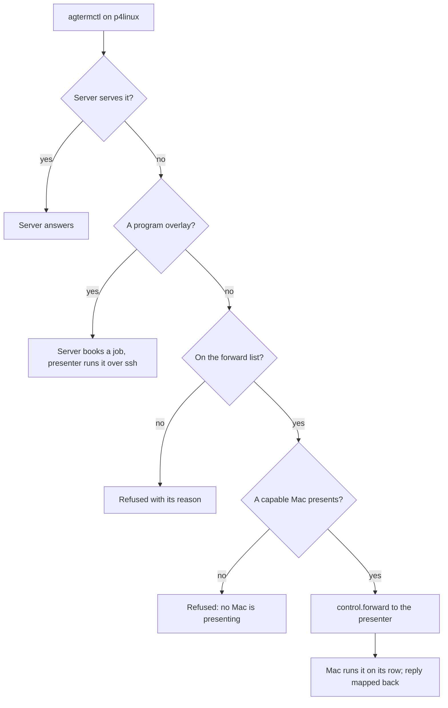

# Spec: one generic forward for what the headless server cannot do

Status: draft 3, 2026-10-01, after two plan-review rounds. Replaces the per-command design of the same
name (commit `85feb5a7`), which Sasha rejected the same day: it ported each Mac command into the server,
about L, and widened upstream files. Builds on Phases 5 to 8 of `docs/plans/20260929-headless-origin-plan.md`.

## Contents

1. [The idea](#the-idea)
2. [Risks, assessed first](#risks-assessed-first)
3. [What is served, forwarded, or refused](#what-is-served-forwarded-or-refused)
4. [The forward, step by step](#the-forward-step-by-step)
5. [Program overlays: the job path](#program-overlays-the-job-path)
6. [Ids in replies and later polls](#ids-in-replies-and-later-polls)
7. [Typing without a Mac](#typing-without-a-mac)
8. [Tools that need a change](#tools-that-need-a-change)
9. [Upstream files touched](#upstream-files-touched)
10. [Phases and size](#phases-and-size)
11. [Decisions](#decisions)

## The idea

Today the shim sends every `agtermctl` call from p4linux to the Mac, and the Mac does the work.
After the move, the server answers what it owns. Two more paths cover the rest:

- **Program overlays** (revdiff, `agterm-open-at`) use upstream's overlay-job path: the server books a
  job and asks the presenter to show it; the Mac runs `ssh p4linux agtermctl session overlay run-job
  <job>`, and the program runs on p4linux under the server's job. This is how a Mac origin already
  serves a remote viewer.
- **Everything else that needs the Mac's UI** is forwarded: the server hands the raw request to the
  presenting Mac, the Mac runs it on its own row, and the answer comes back.

## Risks, assessed first

Ranked by what the user would be left with if the risk came true.

1. **The Mac runs text from p4linux on the Mac.** A forwarded `session overlay open <command>`, run as
   is, would start that command on the Mac; so would a forwarded `session scratch`, which opens a Mac
   login shell on the row (the 2026-09-07 ralphex incident, `scratch_shell_needed` in the shim). An
   `--html` file path would be read as a Mac path.
   - Mitigation: program overlays never travel as a forward; they take the job path, where no command
     text reaches the Mac. `session scratch` is refused in every mode. `session overlay open --html` is
     refused until a file transfer exists. The Mac re-checks the allowlist and refuses any forwarded
     request that carries `command`. Tests on both sides.
2. **The program gets the Mac's identity.** A program started by the Mac would see the Mac row's
   `AGTERM_*` ids, which the server does not know.
   - Mitigation: on the job path the program is spawned by `session overlay run-job` on p4linux with the
     `OverlayLaunchContext` the server built from its own pane environment.
3. **An untargeted command acts on whatever the Mac has selected.** `session flag` with no `--target`
   means the selected session on the Mac. The CLI does not read `AGTERM_SESSION_ID` itself.
   - Mitigation: a forward must name one of the server's sessions by its full id (no prefix, no
     `active`); otherwise it is refused. The server sends the full id. The Mac maps it to its row and never
     applies a default. The `window` argument is dropped before sending; the Mac uses the row's window.
4. **Ids in the reply are the Mac's.** A forwarded `pick open` answers with a pick id that
   `pick result <id>` and `pick cancel <id>` send back as `target`; a page answers with a `pageID`.
   - Mitigation: the server records each pick id and page id from a forwarded reply, with its session and
     presenter generation, and routes the later polls by that table. Session ids in replies are mapped
     Mac to server. Program overlays need none of this: the server owns the job and answers `result`
     itself.
5. **The presenter changes or leaves mid-request.**
   - Mitigation: a forward in flight has a 10-second deadline and then fails with "the presenting Mac
     left". A poll whose pick or page went to a presenter that is gone gets a final answer at once: pick
     `cancelled`, page `closed`. An open page or pick does not move to the new presenter, as with the
     shim. A program overlay follows upstream's job rules on presenter loss.
6. **Scope creep.** A denylist would forward every new upstream command by default.
   - Mitigation: `ForwardPolicy` is an exhaustive switch over `Command` with no `default`, so a new
     upstream command fails the build until someone classifies it.
7. **Shared ssh connection.** Each job opens one ssh channel from the Mac to p4linux; the shim measured
   `Session open refused by peer` in September on a shared multiplexed connection.
   - Mitigation: `RemoteSession.runJobCommand` passes `-o ControlMaster=no -o ControlPath=none`.
8. **Version skew.** A Mac without the new frame would ignore it.
   - Mitigation: the Mac lists `forward` in its hello `kinds`; the server forwards only to a presenter
     that listed it, else refuses with "the presenting Mac does not support forwarding".
9. **Frame size.** A large pick list, or a large reply such as `session overlay text --all`, can exceed
   `PresentationCodec.maxFrameBytes` (256 KB), and `RemotePresentationClient.send` drops an unencodable
   frame silently.
   - Mitigation: the server refuses an oversized request before sending; the Mac replies ok:false with
     "reply larger than the frame limit" instead of an oversized reply.
10. **Merge risk.** The frame lives in upstream files.
    - Mitigation: small edits, listed under [Upstream files touched](#upstream-files-touched); the
      forwarder, the server's job bookkeeping and the Mac executor are new fork files.
11. **Trust.** Any process on p4linux that can reach the server socket can drive the session-scoped
    commands of rows presenting its sessions, the Mac clipboard included (`session copy`, `paste`). Today
    any p4linux process can run the shim and drive the WHOLE Mac, so the exposure shrinks. Sasha accepted
    the clipboard reach on 2026-10-01.

## What is served, forwarded, or refused

- **Served by the server, as today:** `tree`, `window list`, `events`, `version`, `notify`,
  `session status/context/seen/mark/new/close/rename/split/split close/swap/text`, HUD, ask, `zmx.*`
  except `attach`, `prune` and `reset`.
- **Newly served by the server:**
  - `session type`, through `zmx type` ([Typing](#typing-without-a-mac)).
  - Program overlays on the job path: `session overlay open <command>`, and `close`, `resize` and
    `result` for an overlay the server booked; `session overlay run-job`, the claim the Mac's ssh makes.
- **Forwarded to the presenter** (the allowlist): `session overlay open --url`; page polls by
  `--page`; `session overlay close` and `resize` for a pane where the server holds no job; `reload`,
  `navigate`, `submit`, `copy`, `text`; `pick open/result/cancel`; `session flag`, `select`, `reveal`,
  `focus`, `background`; `session copy`, `paste`, `select-all`, `search`;
  `session bookmark add/list/go/remove`.
- **Routing inside the overlay family**, decided per request, not per command: `open` with a command is
  a job, with `--url` a forward, with `--html` refused; `result` without `--page` is always served by the
  server, never forwarded, because the Mac would answer with its ssh helper's status; `close` and
  `resize` are served while the server holds a job for that pane, else forwarded.
- **Refused:**
  - `session scratch` (risk 1) and `session overlay open --html` (risk 1).
  - `surface zoom` and `surface cursor`: their target embeds the session id; nothing on p4linux uses them.
  - `session type --select`: the server has no selection; plain `session type` is served.
  - `session duplicate`, `move`, `park`, `resize`: they reshape the Mac's sidebar or create Mac rows,
    and their replies carry Mac ids.
  - `window *`, `workspace *`, `sidebar *`, `theme`, `font`, `quick`, `dashboard`, `keymap`,
    `config reload`, `normal-mode`: global Mac UI.
  - `hooks *`, `restore *`, `session restore`, `session pairing`, `overlay-redirect`,
    `zmx attach/prune/reset`, `session lead`: Mac management.

  Accepted losses: the `agsess` jump, `offload.sh`'s workspace move, `launch.sh`'s scratch fallback.

## The forward, step by step

1. A pick or page poll is routed by the id table first, with its id untouched. Otherwise the server
   resolves the target to one of its sessions (risk 3). It drops `window`.
2. It checks: forwardable, a presenter exists and listed `forward`, the size fits.
3. It sends `control.forward` with a request id and the request.
4. The Mac's executor finds its row bound to that stream's session, re-checks `ForwardPolicy`,
   refuses a request carrying `command`, sets `resolved` on an overlay open so no overlay-redirect answer
   comes back, rewrites `target`, and runs the request through `ControlServer.dispatch`, which reaches
   both the core dispatcher and the app switch. It maps ids in the reply to the server's and replies
   `control.forwarded`.
5. The server records pick and page ids (risk 4) and answers the caller.

The CLI needs one change: `pick` gains `--target`, filled from `AGTERM_SESSION_ID` when absent. On the
Mac the executor turns that target into the row's window, so Mac callers are unaffected.

## Program overlays: the job path

- `session overlay open <command>` on the server books a job in an `OverlayJobs` the `Headless` owns,
  reusing core `AppStore.openRemoteOverlay` and its siblings. The core method requires the session to be
  followed remotely, which reads the zmx lead book the server never fills; it gains a `requireFollower`
  parameter, true on the Mac and false on the server (Sasha, 2026-10-01). The `OverlayLaunchContext` is
  built from the server's session environment with no pane, as the Mac's `sessionEnvironment` does, plus
  `AGTERM_STATE_DIR` and `SHELL`, and the request's cwd. A
  relative `--cwd` is refused; with none, the session's stored cwd is used, else `$HOME`.
- It sends upstream's `overlay.request` frame to the presenter. The Mac's existing viewer half
  (`showReplicaOverlay`) opens an overlay running `RemoteSession.runJobCommand`, which ssh-es to p4linux
  and runs `agtermctl session overlay run-job <job>`.
- Until Task 46 installs the real `agtermctl` on p4linux, that ssh reaches the shim. The shim learns to
  send `session overlay run-job` to the local server, since p4linux is never a Mac origin (Sasha,
  2026-10-01); the route goes with the shim in Task 47.
- The helper claims the job on the server socket, spawns the program in its own pty on p4linux, and
  reports the exit status to the server. `OverlayRunJob`'s Linux spawn uses
  `posix_spawn_file_actions_addtcsetpgrp_np` (glibc 2.35 or newer).
- `result` and `--block` are answered by the server from the job; `close` and `resize` go to the Mac as
  upstream's `overlay.close` and `overlay.resize` frames. No poll is forwarded, so presenter changes need
  no id table here.

## Ids in replies and later polls

- Session ids in a forwarded reply are mapped Mac to server through the row's binding.
- The server keeps "pick id or page id → session, presenter generation". `pick result`, `pick cancel`
  and a page poll by `pageID` are routed by that entry. If the presenter's stream is gone, the poll gets a
  final answer at once (risk 5).
- An entry is dropped when its pick or page ends, with its session, or when its presenter's stream ends.

## Typing without a Mac

- Why it is not forwarded: a session viewed only on the laptop has no presenter once the lid closes, and
  a session made on p4linux has no row until Sasha attaches it. Room delivery and the compact tools run
  unattended and must still type.
- `session type` is served on the server with `zmx type <daemon>`: never retried, as agterm's
  `ZmxClient.type`; paced like the Mac's `coveredType` (`KeystrokeSegments`, a separate Return).
- One serial lane per pane, so two callers never interleave text and Return. `--pane scratch` is refused.
- Typed text clears an agent status through `agentIndicator.clearedBy(pane:keystroke:reset:)`, with the
  server's default reset rule.

## Tools that need a change

- `agterm-open-path` refuses any row with `remoteHost`. For a click on a headless row it needs the
  server's session id on the Mac, so the Mac tree gains a read-back of the bound server session id.
  It is untracked in `~/.local/bin` on both machines: diff the two copies and adopt one first.
- `agterm-review-live` checks the Mac's reader in the p4linux `tree`, which never holds it. It asks
  through a forwarded `session overlay text` on the reader's pane instead (Sasha, 2026-10-01).

## Upstream files touched

| File | Change |
|---|---|
| `PresentationFrames.swift` | two frame cases, their codec, the no-payload list |
| `PresentationHub.swift` | keep hello kinds; `presenterSupports`; the reply in the presenter-only arm |
| `RemotePresentationClient.swift` | the `controlForward` effect and its receive arm |
| `ControlServer.swift` | `dispatch` becomes internal |
| `RemoteSession.swift` | `runJobCommand` opts out of ssh multiplexing |
| `AppStore+RemoteOverlay.swift` | `openRemoteOverlay` gains `requireFollower` |
| `agtermctlKit` `OverlayRunJob.swift`, pick command | the Linux spawn; `pick --target` |
| `ControlProjection.swift` | the bound server session id on a remote row |
| fork files | `ForwardPolicy`, the server's forwarder and job bookkeeping, the Mac executor, `HeadlessCatalog` |

About 9 upstream files, each a small edit. The rejected design widened about 8 upstream files with
whole new mechanisms (a page slot, a pick registry, a flag mirror).

## Phases and size

1. **Typing on the server.** S to M.
2. **The forward.** Policy, frames, hub, forwarder with the id table, Mac executor, `pick --target`,
   the tree read-back. M.
3. **Program overlays on the job path.** The server's job bookkeeping and claim, the Linux spawn,
   `runJobCommand` multiplexing opt-out. M.
4. **Tools.** `agterm-open-path`, `agterm-review-live`. S.

Total M to L. Each phase runs the Linux gate and the Mac gate.

## Decisions

Taken by Sasha on 2026-10-01: refuse when no Mac presents; pick targets its own session; one generic
forward, not per-command ports; keep typing on the server; fix `agterm-review-live`; a forwarded flag
lands on the presenting Mac's row only; program overlays take the job path, not a Mac-built ssh wrap;
keep the clipboard commands; accept the 0.1-second `--block` poll for forwarded pages; a shim route
for `run-job` until Task 46; `requireFollower` on `openRemoteOverlay`; refuse `surface zoom`,
`surface cursor` and `session type --select`.
