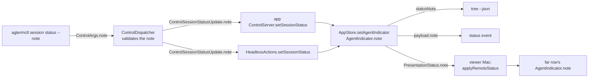

# `session status --note`: a one-line reason on the agent status indicator

<!-- plan-review: planning:plan-review 2026-10-03 findings=7 resolved -->

Part 2 of the agent-pulse design (`/Users/sasha/dev/agterm-agents/docs/plans/20261003-agent-pulse.md`,
"Part 2: the agterm note field"), approved by Sasha on 2026-10-03.
This plan implements it on branch `agterm-note`, cut from `main` at `e75e50e0`.
Size: M. Drivers: about 14 source files across three modules, one hosted test, five doc surfaces.

## Contents

1. [Contract](#1-contract)
2. [Data path](#2-data-path)
3. [Decisions beyond the contract](#3-decisions-beyond-the-contract)
4. [Tasks](#4-tasks)
5. [Consumers of the new field](#5-consumers-of-the-new-field)
6. [Verify](#6-verify)
7. [Landing](#7-landing)

## 1. Contract

- `agtermctl session status <state> --note TEXT`: one line, trimmed, at most 256 UTF-8 bytes, no control
  characters, no U+2028/U+2029. The rules are `Session.validateContext`'s. A breaking value is rejected
  with a clear message and changes nothing.
- The note is part of `AgentIndicator`. A status set without `--note` clears it. The auto-reset to idle on
  a visit (`AppStore.clearAutoResetIndicator`, headless `HeadlessActions.markSessionSeen`) clears it.
- Read-back: `tree --json` row field `statusNote` (`ControlSessionNode`); `ControlEventPayload.note` on the
  `status` event; `PresentationStatus.note` for far rows, optional, so an old peer decodes without it.
- A note-only change emits a `status` event, through `AgentIndicator`'s synthesized `Equatable`.
- `statusChangedAt`: a write that differs from the previous indicator ONLY in `note` keeps the stamp.
  Every other write restamps as today, identical repeats included. `AppStore+AutoFollow` orders blocked
  rows by this stamp.
- The pane rule in `AppStore.applyControlStatus` is unchanged: another pane's write over `blocked` is
  refused, its note with it.
- An old `agtermctl` keeps ArgumentParser's normal `Unknown option '--note'` error. The agent-pulse mod
  retries without the note on it. Nothing in this plan touches that path.

## 2. Data path

## 3. Decisions beyond the contract

Each is small and reversible. Sasha can overrule any of them at the route question.

- **Wire key.** A new `ControlArgs.note`, not the shared `text`. `text` already means three things, and a
  dedicated key keeps `session.status` requests readable in a socket log.
- **Blank note.** `--note "   "` is rejected (`note must not be empty (omit --note to clear it)`), as
  `session context` rejects a blank set. Omitting `--note` is the one clearing form.
- **Idle carries no note.** `setAgentIndicator` drops the note when the status is `idle`. Reason: a far
  row receives idle as an absent `PresentationStatus`, so an idle note could never travel, and the tree
  already hides every other per-call override on idle. `session status idle --note x` succeeds and stores
  no note. The mod never sends one.
- **A far row re-validates.** `applyRemoteStatus` keeps a wire note only when `validateStatusNote`
  accepts it, as `applyRemoteContext` does for context. An invalid one is dropped, the status kept.
- **Validation code.** `SessionContext.swift` gets one private line checker, parameterized by field name
  and blank-value hint. `validateContext` keeps its signature and its exact messages (tests pin them).
  A new `Session.validateStatusNote` returns `note must …` messages. Same 256-byte limit constant.
- **Where it is checked.** In the dispatcher only, like `session.context`. The CLI does no local check,
  so the server's message is the one a caller sees.
- **Public API stays source-compatible.** `agtermCore` is a library that `agterm-linux` consumes. Every
  new public init parameter is `note: String? = nil` (or `statusNote: String? = nil`): `AgentIndicator`,
  `PresentationStatus`, `ControlEventPayload`, `ControlArgs`, `ControlSessionStatusUpdate`,
  `ControlSessionNode`.
- **Compat init.** `ControlProtocolCompatibility`'s `ControlSessionNode` init is a frozen old signature
  for `agterm-linux`. It gets no new parameter: it forwards to the main init, whose new `statusNote`
  defaults to nil. No ambiguity: the main init's `backedByZmx` has no default, the compat init lacks it.
- **Human event line.** `EventFormatter.human` appends `note=<String(reflecting: note)>` last, after
  `shape=`, so a `"` inside the note is escaped. CLAUDE.md requires every event argument there.
- **Fork-merge `flagged` list** (`release.md` asks at landing): no addition. Every rule here is pinned
  by an `agtermCore` test that the merge gates run, so a merge that drops it fails a gate.

## 4. Tasks

Test-first: each task writes its failing tests, then the code. Test files named below exist on `main`.

### Task 1: validation

- [ ] Tests in `SessionTests` beside the `validateContext` tests: trims outer spaces; a
  256-byte multi-byte note passes, 257 bytes fails; `\n`, `\t`, U+0007, U+2028, U+2029 fail even when
  outer; blank fails; each failure message starts with `note`.
- [ ] `SessionContext.swift`: extract the shared checker, add `validateStatusNote`. Existing context
  tests stay green unchanged.

### Task 2: the indicator and the store

- [ ] Tests in `AppStoreStatusTests`:
  - a write with a note stores it; the next write without one clears it;
  - a note-only change keeps `statusChangedAt` and emits one `status` event whose payload carries `note`
    and `previous` equal to `status`;
  - an identical repeat (same note) restamps and emits nothing;
  - a state change with the same note restamps;
  - an idle write with a note stores none;
  - another pane's non-blocked write over `blocked` is refused and leaves the old note;
  - selecting an `autoReset` row clears the note.
- [ ] `AgentStatus.swift`: `AgentIndicator.note: String?`, init parameter `note: String? = nil`.
- [ ] `AppStore+Status.swift` `setAgentIndicator`: drop the note on idle; restamp unless the write
  differs from `previous` only in `note`; pass `note` into `ControlEventPayload`.
  Update its doc comment's "stamps on every set" sentence.
- [ ] `ControlEvents.swift`: `ControlEventPayload.note`.

### Task 3: tree read-back

- [ ] Tests in `AppStoreTreeProjectionTests`: `statusNote` present on a non-idle row with a note; absent
  without one and on idle. A `ControlProtocolTests` case: the node encodes `statusNote` and a node JSON
  without it decodes.
- [ ] `ControlProjection.swift`: `ControlSessionNode.statusNote`, init parameter after
  `statusChangedAt`. `AppStore.controlTree` fills it (`idle ? nil : note`).

### Task 4: far rows

- [ ] Tests in `PresentationFramesTests`: `PresentationStatus` round-trips `note`; a status JSON with no
  `note` key decodes to nil. In `RemotePresentationStateTests`: `applyRemoteStatus` sets the far row's
  note; an invalid wire note is dropped and the status kept.
- [ ] `PresentationFrames.swift`: `PresentationStatus.note`, init parameter `note: String? = nil`.
  Synthesized `Codable` already uses `decodeIfPresent` / `encodeIfPresent` for an optional.
- [ ] `AppStore+Presentation.swift` `presentationStatus(of:)` and `AppStore+RemotePresentation.swift`
  `applyRemoteStatus` carry it. `applyRemoteSnapshotStatus` delegates and needs no edit.

### Task 5: protocol and dispatcher

- [ ] Tests in `ControlDispatcherSessionMetadataTests`: a valid note reaches `MockControlActions` trimmed;
  a 300-byte note, a newline note and a blank note each return `ok: false` with a `note` message and never
  call `setSessionStatus`. `ControlProtocolTests`: `ControlArgs.note` round-trips.
- [ ] `ControlProtocol.swift`: `ControlArgs.note` (property, init parameter, assignment).
- [ ] `ControlModes.swift`: `ControlSessionStatusUpdate.note`.
- [ ] `ControlDispatcher.swift` `session.status` arm: validate, pass the trimmed value.
### Task 6: both `setSessionStatus` implementations

- [ ] Tests in `HeadlessActionsTests`: `setSessionStatus` with a note shows in the headless tree; a
  refused write over `blocked` keeps the old note.
- [ ] `HeadlessActions.setSessionStatus` and the app's `ControlServer+SessionActions.setSessionStatus`
  pass `update.note` into `AgentIndicator`.
- [ ] Hosted test in `agtermTests/ControlServerPresentationTests`: a status with a note reaches the
  viewer's frame (the existing `testAStatusChangeReachesTheViewerAfterTheSnapshot` pattern).

### Task 7: CLI

- [ ] Tests in `agtermctlKitTests/CommandsTests`: `session status active --note "ci: waiting"` builds
  `args.note`; without `--note` it is nil. `EventCommandsTests`: the human line ends in
  `note="ci: waiting"`.
- [ ] `SessionMetadataCommands.swift` `Session.Status`: `@Option var note: String?`, help text
  "One-line reason shown with the status (max 256 bytes); cleared by the next status set without it."
- [ ] `EventCommands.swift` `EventFormatter.human`.

### Task 8: docs

Three facts change in the docs: the new argument, the new read-back fields, and the stamp rule's
note-only exception. Every place that states "every set restamps" or lists the `status` event fields or
the tree status fields gets the update. Found by grep at plan time; re-grep at acceptance.

- [ ] `.claude/rules/control-api.md`: the status bullets (overrides in `ControlEventPayload`, tree
  read-back, `statusChangedAt`) gain the note and the restamp exception.
- [ ] Swift doc comments: `ControlSessionNode.statusChangedAt`, `ControlEventPayload.previous` ("Equal to
  `status` when only …" gains note), `setAgentIndicator`.
- [ ] `plugins/agterm/skills/agterm/SKILL.md`: the `session status` signature, the tree field list and its
  stamp sentence. `reference.md`: the tree field list and stamp sentence, the `status` event field list,
  the `session status` entry's stamp sentence.
- [ ] `site/commands.html`: `session status` arguments, both stamp sentences, the tree field list, the
  `status` event field list. `site/docs.html`: the tree field list and its stamp sentence.
- [ ] `FORK-NOTES.md` `## Control API`: one line. `CHANGELOG-fork.md` `## Unreleased` → `### New Features`:
  one entry.

## 5. Consumers of the new field

Producers: `AgentIndicator.note` (set by both `setSessionStatus` and `applyRemoteStatus`).
Consumers in this repo, 7:

1. `AppStore.setAgentIndicator`: restamp rule and `ControlEventPayload.note`.
2. `AppStore.controlTree`: `ControlSessionNode.statusNote`.
3. `AppStore.presentationStatus(of:)`: `PresentationStatus.note`.
4. `AppStore.applyRemoteStatus`: reads `PresentationStatus.note`.
5. `EventFormatter.human`: reads `ControlEventPayload.note`.
6. `ControlDispatcher` `session.status` arm: reads `ControlArgs.note`.
7. The two `setSessionStatus` implementations: read `ControlSessionStatusUpdate.note` (counted as one
   consumer of the update field, two call sites: app and headless).

Out of this repo, 3, from the design: the pulse page (`tree` per window), `mods-band` (tree snapshot and
`events --kind status`), `mods-wake` (through `agterm-wait --inbox`). The restamp rule has one more
in-repo consumer, unchanged in code: `AppStore+AutoFollow`.

`HtmlBridge` passes `tree` responses through without a field list, so the pulse page needs no bridge edit.
Recount at acceptance.

## 6. Verify

From the worktree, once each at the end:

- `cd agtermCore && swift test`
- `make test-app`
- `make lint`

Targeted runs while working: `swift test --filter <Suite>`; a hosted test by `-only-testing`.

Live, after Sasha restarts each build (only on this session's own row, `agterm-row-id`):

- `agtermctl session status active --note "probe" --target <row>`
- `agtermctl tree --json` shows `statusNote: "probe"` on the row.
- `agtermctl events --json --kind status` shows `note: "probe"`.
- a 300-byte note is rejected and `tree` still shows `probe`.
- `agtermctl session status idle --target <row>` resets the row.

## 7. Landing

- Commits on `agterm-note` after the gates are green. No push.
- Review: native `revmux:revmux`, profile `codex-claude`; accepted findings fixed here.
- `main`: merge only once its working tree is clean (another merge is in progress there today).
- Mac: `make deploy` from the worktree. Sasha restarts the app.
- p4linux: fetch `agterm-note` over ssh into `/home/sasha/dev/oss/agterm-vim`, add a worktree on
  `headless-phase8-note` cut from `headless-phase8`, merge, run `scripts/headless/install.sh --dry-run`,
  then the real install. The commits between `c8e6fdb4` (running build) and `headless-phase8`
  (`e3af25de`, 8 commits) are docs-only, checked at plan time.
  ⚠️ But `main` and `headless-phase8` have diverged since `a5d2a5f9`: 29 commits only on `main`.
  Merging `agterm-note` would also ship `main`'s bare-file-names code (`LinkPolicy.swift`,
  `OpenLinkLaunch.swift`, `GhosttySurfaceView+Input.swift`). Sasha picks merge or cherry-pick. After a merge touching
  `agtermCore`, `swift build --product agterm-headless` there as well. Sasha restarts the server.
