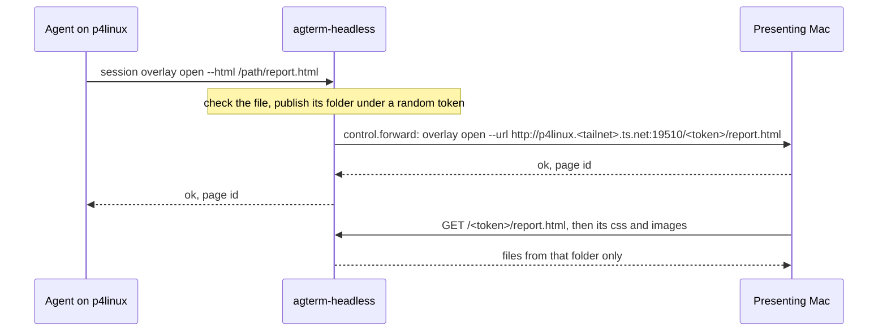

# Spec: `--html` overlays from a headless session, served over the tailnet

Status: draft 1, 2026-10-04. Sasha asked for it and authorized building it in the same request.

## Contents

1. [The problem](#the-problem)
2. [The idea](#the-idea)
3. [What changes](#what-changes)
4. [What a served page loses](#what-a-served-page-loses)
5. [Safety](#safety)
6. [Configuration and install](#configuration-and-install)
7. [The plannotator page host](#the-plannotator-page-host)
8. [Tests and gates](#tests-and-gates)
9. [Not in scope](#not-in-scope)

## The problem

- An agent on p4linux that runs `agtermctl session overlay open --html <file>` is refused:
  `an --html page is a file on the origin; use --url`. The file is on p4linux and the page is drawn on a Mac.
- Clicks (Jira, commits) are not affected: the Mac builds those pages itself.
- plannotator works on the home LAN only. It serves its page under `AGTERM_PAGE_HOST=p4linux.local`, an
  mDNS name, so p4air away from home cannot load it.

## The idea

The headless server serves the page itself, over HTTP, on its Tailscale address. It rewrites the request
into a `--url` overlay that points at that address, and forwards it like any other `--url` open.

## What changes

All in fork files except the unit file and `install.sh`, which are fork files too.

- **`HeadlessConfig`** gains `pageHost` (from `AGTERM_HEADLESS_PAGE_HOST`, nil when unset or empty) and
  `pagePort` (from `AGTERM_HEADLESS_PAGE_PORT`, default 19510; 0 takes any free port, for tests).
- **`HeadlessPages`** (new, `AgtermHeadlessKit`), the page table. Thread-safe, because the HTTP threads read it.
  - `publish(file:grantRoot:session:)` checks the file with the same rule the Mac uses,
    `HtmlOverlay.grantError`, and that it is a regular file. The served root is `--cwd` when given, else the
    file's folder. It returns the URL `http://<pageHost>:<pagePort>/<token>/<path of the file under the root>`.
    The token is a fresh random UUID.
  - `file(forPath:)` maps a request path to a file: known token, percent-decoded, and the real path (symlinks
    resolved) must stay inside the root's real path by whole components. Anything else is nil.
  - `forget(token:)`, `forget(session:)`. At most 64 tokens; the oldest goes first.
- **`PageServer`** (new, `AgtermHeadlessKit`), a minimal HTTP/1.1 server on plain sockets.
  - Binds `pageHost`'s IPv4 address on `pagePort`, so it listens on the tailnet only.
  - Starts lazily, on the first `--html` request, so a server that starts before Tailscale is up still works.
    A failed bind is retried on the next request, and that request is refused with the reason.
  - `GET` and `HEAD` only. One dedicated thread accepts; one dedicated thread per connection (the kit's rule:
    never the global pool). `Connection: close`, request head capped at 16 KiB, file capped at 64 MiB.
  - Headers: `Content-Type` by extension, `Cache-Control: no-store` (so reload re-reads the file),
    `X-Content-Type-Options: nosniff`, `Referrer-Policy: no-referrer`.
  - 404 for an unknown token or path, 405 for other methods, 400 for a malformed request.
- **`HeadlessActions.respond(to:)`**, before routing: a `session.overlay.open` with `html` set is published
  and rewritten. `html`, `cwd` and `chromeless` are cleared and `url` is set; every other argument is kept.
  The rewritten request then routes as a `--url` open, which is forwarded. A failed forward forgets the token.
  - No `pageHost` configured: refused as
    `session.overlay.open is not available on a headless origin: an --html page needs AGTERM_HEADLESS_PAGE_HOST`.
- **Session close** forgets the session's tokens, next to `HeadlessForwarder.forget(session:)`.
- **`ForwardPolicy` does not change.** It still refuses a raw `--html` request. That keeps the Mac's re-check
  of a forwarded request correct, and keeps the change out of shared core and the app.

## What a served page loses

A served page is a `--url` page on the Mac, not a file page. Three differences, accepted:

- No theme defaults. A file page gets the terminal's `color-scheme` and text color; a page without its own
  colors renders with the browser's defaults.
- `--chromeless` is dropped: the Mac refuses it for `--url`. The page shows its origin strip.
- The page's origin is `http://p4linux…:19510`, not `file://`. Relative links inside the folder still work.

## Safety

- Only published folders are served, each under a 128-bit random token. No listing, no index.
- Paths are resolved with symlinks, so `..`, `%2e%2e` and a symlink pointing out of the folder all fail.
- The listener binds the tailnet address only. The LAN and the internet cannot reach it.
- The firewall needs one rule for the tailnet, the same shape plannotator already has:
  `ufw allow from 100.64.0.0/10 to any port 19510 proto tcp comment agterm-headless-pages`.

## Configuration and install

- `agterm-headless.service` gains `EnvironmentFile=-%h/.config/agterm-headless/env`.
- `install.sh` writes `AGTERM_HEADLESS_PAGE_HOST=<tailscale name>` into that file when the file does not set
  it yet and `tailscale status --json` names this machine (`Self.DNSName`, trailing dot dropped). It never
  overwrites a value someone set. It prints the `ufw` rule as a hint; it does not run `sudo`.
- `--dry-run` prints what it would write.

## The plannotator page host

In `~/dev/agterm-agents`, `install.sh` exports `AGTERM_PAGE_HOST="$(hostname -s).local"` on a far machine.
It changes to the Tailscale name when `tailscale` answers, with `.local` as the fallback. The firewall
already allows 19500–19509 from the tailnet.

## Tests and gates

`AgtermHeadlessKitTests`, swift-testing:

- config: host and port parsed, empty host is nil, an unreadable port falls back to the default;
- publish: URL shape, default root is the file's folder, refusals for a relative path, a missing file and a
  file outside `--cwd`;
- file lookup: a subfolder file resolves; unknown token, `..`, encoded `..` and a symlink escape are nil;
- forget by session and the 64-token cap;
- rewrite: `html`, `cwd`, `chromeless` cleared, `url` set, other arguments kept; no page host refuses with
  the text above; a forward with no presenter forgets the token;
- HTTP: a real listener on 127.0.0.1, GET returns the bytes and the content type, HEAD has no body, unknown
  path 404, POST 405.

Gates: the Linux gate (`swift test --no-parallel`, `swift build --product agterm-headless`) and the Mac's
`swift test` plus `make lint` in a fresh clone on p4studio. No app code changes, so `make test-app` is not
needed. Live check: an agent-side `--html` open on a headless row shows the page on the presenting Mac,
with a CSS file and an image next to it.

## Not in scope

- `--url http://localhost…` from p4linux (needs an ssh forward on the Mac; next step).
- Moving an open page to a new presenter.
- Theme defaults for served pages.
