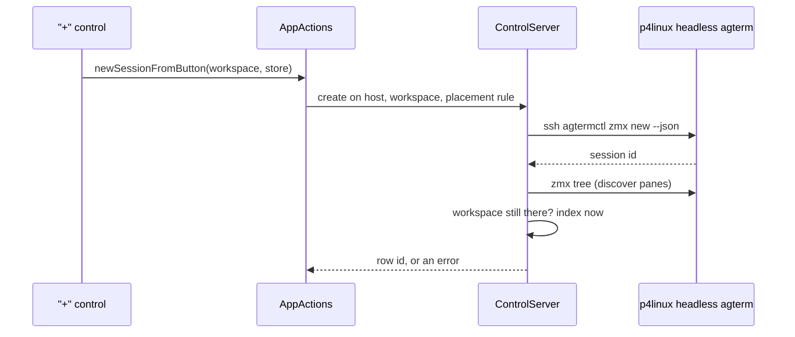

# The "+" button can create the session on a remote host

<!-- plan-review: planning:plan-review 2026-10-06 findings=42 resolved -->

Status: design agreed 2026-10-06 (Settings field, host default directory, `zmx new --workspace`).
Plan reviewed in 5 rounds (round 4 approved the design; round 5 fixed the pending state and the pair checks). Approved 2026-10-06 with a
pending state added; implemented as a plan pair with a Claude mate.
Supersedes the keymap `new-session-command` design kept on branch `plus-button-command-v1`.

## Contents

- [Goal](#goal)
- [Spec](#spec)
  - [The setting](#the-setting)
  - [Which controls use it](#which-controls-use-it)
  - [Creating the row](#creating-the-row)
  - [Errors and repeated clicks](#errors-and-repeated-clicks)
  - [Control API](#control-api)
- [Plan](#plan)
- [Consumers of the new fields](#consumers-of-the-new-fields)
- [Later](#later)

## Goal

With a host set in Settings, a click on a "+" new-session control creates the session on that host
through the app's own `zmx new HOST` path and attaches it as a row in the clicked workspace.
Sasha's use: host `p4linux`, whose headless agterm server owns the session.

## Spec

### The setting

- `AppSettings.newSessionHost: String?`, in Settings ▸ Sessions as a text field
  "New sessions are created on", placeholder `this Mac`. It saves on submit, on focus loss and when the
  Settings view disappears, not per keystroke.
- `effectiveNewSessionHost` is nil for empty, whitespace, a value `RemoteSession.isPlain` rejects, or one
  starting with `-` (the rule `zmx.new` applies). An invalid value shows an inline note under the field,
  and the controls stay local.
- No directory field. The far session starts in the headless server's default directory.
- Deliberate control exemption, like `newSessionDirectory` and `newSessionPlacement`: no command sets or
  reads it.

### Which controls use it

| Control | With a host set |
|---|---|
| Sidebar workspace row "+" (`addSessionButtonClicked`) | remote, in the clicked workspace |
| Sidebar workspace right-click "New Session" (`menuNewSession`) | remote, in that workspace |
| Sidebar footer (`bottomBar`) `plus.rectangle` menu, "New Session" | remote, in the current workspace |
| Footer menu, new item "New Local Session" | local; shown only with a host set |
| Footer menu "Open Directory…" | local, unchanged |
| `cmd+n`, File menu, Dock menu, palette, `new_session_in_workspace`, `session.new` | local, unchanged |

`cmd+n` stays local so a keyboard user always has a local path.

Behavior change: the two sidebar controls are now gated by `uiActionsEnabled(for:)` of their own window.
They had no gate; zoom, the dashboard and a picker all hide the sidebar, so nothing visible changes.

### Creating the row

- The window is the control's own store, not the frontmost window.
- Name and command are not sent, so the host picks its defaults. `workspace` is never forwarded to the far
  side: the far `zmx.new` has no host and would refuse it.
- When a workspace is given (the button path, or `zmx.new --workspace`), the window and the workspace are
  resolved together before the ssh call, and the attach step is given that window explicitly. Without a
  workspace the window is still resolved after discovery, as `testUntargetedAttachUsesTheActiveWindowAfterDiscovery`
  pins. Without this, `zmx new HOST --workspace` with no `--window` would re-resolve the
  frontmost window after the round trip and fail if the user switched windows meanwhile.
  A workspace that does not resolve is refused with no ssh.
- After the round trip, at the point `attachRemoteSession` already re-resolves the window, the workspace is
  checked again and the insertion index is computed then, not at click time.
- The button path uses the new-session placement setting (#665) for the index, like a local "+".
  `zmx.attach` and the socket `zmx.new` keep appending: per `settings.md` the setting applies only to
  New Session. An internal, non-protocol entry carries this rule; the `ControlActions` requirements keep
  their signatures, so `ControlActionsDefaults`, `MockControlActions`, `HeadlessActions` and agterm-linux
  are untouched.
- Selection: the row is selected and focused only when the window's selection is still the one at click
  time, with `noteUserActivity` so auto-follow leaves it. Otherwise it is inserted unselected and
  `focusSplitPane` is skipped, so a slow host never pulls the user away from what they moved on to.

### Errors and repeated clicks

- The internal entry returns an outcome, not a bare `ControlResponse`: attached with the row id, refused
  before the far session existed, or created on the host as `<id>` but not attached. `AppActions` picks the
  alert title from it. The socket `zmx.new` keeps its error text unchanged.
- A failure shows a sheet alert on the control's window, when that window is still open.
  - Before the far session exists: "Could not create a session on <host>" and the error.
  - After it exists (discovery, window or workspace failed): "A session was created on <host> but could
    not be attached" and the error. It stays on the host and shows up in `zmx tree <host>`. Accepted limit.
  - There is no fallback to a local session, which would hide that the host is down.
- While one remote create is in flight for a window, further button clicks in that window are ignored.
  The guard is released in a `defer`, so a closed window or a failure never leaves "+" dead.
- During the round trip, up to about 20 seconds against a dead host (two ssh calls, 10-second deadline
  each), every "+" new-session control of that window looks disabled: the sidebar row "+" buttons, the
  right-click "New Session" item and the footer "New Session" item. "New Local Session" stays enabled.
  Decided by Sasha on 2026-10-06.
- The in-flight state lives in one `@Observable` per-window registry that both the AppKit sidebar and the
  SwiftUI footer read, so it clears itself when the create ends, on every path. The registry IS the
  repeated-click guard above; there is no second flag that could drift from what the user sees.

### Control API

- `zmx.new` gains `workspace`, valid only with a host: an id, an id prefix or `active`, resolved like
  `session.new --workspace` (never by name). Without a host it is refused, because a local `zmx new`
  creates no row. `agtermctl zmx new HOST --workspace <ws>`. It appends, like today.
- The field rides in `ControlZmxNewOptions` with a defaulted init parameter, which stays source compatible.
  Its doc comment, which says the destination belongs to the attach, is updated.
- `zmx.new` is fork-only and is left out of the bundled skill and `site/` (`control-api.md`), so the docs go
  to `.claude/rules` and the fork notes only.

## Plan

TDD: each task writes its failing test first and runs it narrowly.
The pair starts with `--link` for the six ignored artifacts, whose stamps match this branch's pins
(checked 2026-10-06): `GhosttyKit.xcframework`, `.ghostty-build-stamp`, `.zmx-build-stamp`,
`agterm/Resources/ghostty`, `agterm/Resources/terminfo`, `agterm/Resources/zmx`.
Worktree branch `worktree-plus-button-command`, reset to `origin/main` at `7e41a601`.

### Task 1: the setting, host-free

- [ ] Tests in agtermCore: `AppSettings` round-trips `newSessionHost`; `effectiveNewSessionHost` is nil for
      empty, whitespace, a host `isPlain` rejects and one starting with `-`, and the trimmed host otherwise.
- [ ] Add the field, its init parameter and `effectiveNewSessionHost`.
- [ ] Name the suite `AppSettingsNewSessionHostTests`.

Check: `cd agtermCore && swift test --filter AppSettingsNewSessionHostTests 2>&1 | grep -q "Suite AppSettingsNewSessionHostTests passed"`

### Task 2: `zmx.new --workspace` in agtermCore

- [ ] Tests: the dispatcher passes `workspace` inside the options with a host and refuses it without one;
      `ZmxCommands.New` builds the request with `--workspace`; `RemoteSession.newCommand` does not forward
      `workspace`.
- [ ] Add `workspace` to `ControlZmxNewOptions` (defaulted) and `ZmxCommands.New`; refuse in `.zmxNew`.
- [ ] Name the suite `ZmxNewWorkspaceTests` in `agtermCoreTests` and the CLI suite `ZmxNewWorkspaceCLITests` in
      `agtermctlKitTests`; the checks match these names, so a renamed suite fails instead of passing empty.

Check: `cd agtermCore && out=$(swift test --filter ZmxNewWorkspace 2>&1); printf '%s' "$out" | grep -q "Suite ZmxNewWorkspaceTests passed" && printf '%s' "$out" | grep -q "Suite ZmxNewWorkspaceCLITests passed"`

### Task 3: placement in the app

depends: 2

- [ ] Hosted tests in `agtermTests/ControlServerZmxTests.swift` with its `FakeRemoteRunner`, modelled on
      `testAFarRefusalOfNewIsReturnedAsItCameAndCreatesNoRow`:
  - `zmx.new HOST --workspace <non-current>` puts the row in that workspace, appended;
  - an unresolvable workspace is refused with `runner.invocations.count == 0`;
  - a workspace removed during the fake round trip gives the "created but not attached" refusal, no row;
  - the button entry with placement `afterCurrent` inserts after the selection read at insert time;
  - the button entry inserts unselected when the selection changed during the round trip, and focus stays
    on the previously selected session: copy the real-window setup and polling of
    `testAttachFocusesTheSplitPaneOnceItsSurfacesMaterialize`, make that session's surface first responder,
    and assert it still is after the same polling window;
  - `zmx.new HOST --workspace` with no window still lands in the original window when the active window
    changes during the round trip;
  - the outcome is "created but not attached", with the far id, when discovery fails after the create.
- [ ] Implement: resolve `options.workspace` before ssh; an internal
      `createRemoteSessionForButton(host:options:window:placement:)`, a distinct name so no call is ambiguous,
      used by the button, where `placement` says
      whether to apply the new-session setting and carries the click-time selection; the public requirement
      calls it with the plain append rule and maps the outcome back to a `ControlResponse`; pin the window
      with the workspace before ssh; re-check the workspace and compute the index after discovery; call
      `focusSplitPane` only for a selected insert.

Check: `scripts/test-app.sh -only-testing:agtermTests/ControlServerZmxTests 2>&1 | grep -q "Test Suite 'ControlServerZmxTests' passed"`

### Task 4: the controls

depends: 1, 3

- [ ] Hosted tests first, with the remote create injected as a stub closure:
  - host set: the closure gets the store's window and the workspace, and no local row is added;
  - a second call while the first is pending is ignored, and a call after it finishes runs;
  - no host: a local row at the placement index, selected, as `SidebarNewSessionPlacementTests` expects,
    for both the sidebar entry and the toolbar entry, which now uses its own store instead of the frontmost;
  - a failure reaches the alert seam (a stubbed presenter), and nothing is presented for a closed window.
- [ ] `AppActions`: a `createRemoteSession` closure wired from `agtermApp` to the control server's internal
      entry, as `openWindow` is wired; `newSessionFromButton(workspaceID:in:)` and the local half
      `newLocalSession(workspaceID:in:)`, which keeps `noteUserActivity` and `focusActiveSession`.
- [ ] Route `addSessionButtonClicked`, `menuNewSession` and the toolbar "New Session" through it. Add the
      toolbar "New Local Session" item. The toolbar help reads `New Session on <host>` with a host set.
      `AppActions` is not observable and `settingsModel` is wired in the scene `.task`, after the first
      render. So the toolbar keeps a `@State` mirror of the host, seeded from `actions.settingsModel` when
      already wired, and refreshed on a new `.agtermNewSessionHostChanged` notification. `setNewSessionHost`
      posts it (Task 5), and the scene `.task` posts it once right after `actions.settingsModel = settingsModel`.
      The menu sits in the sidebar footer, `WindowContentView.bottomBar`. The mirror lives on
      `WindowContentView`; `onReceive` and an `onAppear` re-seed go on `bottomBar`'s `HStack`, since a
      collapsed sidebar may unmount it, never on the root body chain, which is at the type checker's limit (see the `FullscreenEdgeObserver` comment).
- [ ] The pending state: a per-window `@Observable` in-flight registry, set and cleared (in `defer`) by
      `newSessionFromButton`; it is the repeated-click guard.
  - Sidebar row "+": add a pending flag to the workspace `RowContent` built by `rowContent(forWorkspace:)`, so
    `reloadChangedContentRows()` reloads that row; `updateNSView` reads the registry so reconcile runs. The
    cell configure path sets `addButton.isEnabled` on EVERY configure, since cells are recycled, and
    `setColors` lowers the "+" alpha while pending, because an explicit `contentTintColor` does not dim by
    itself.
  - Right-click "New Session": `menu(forRow:)` builds the menu fresh with `autoenablesItems = false`, so set
    `isEnabled = !pending` at build time. No `validateMenuItem`; a menu left open across the end of a create
    stays dimmed until reopened, which is acceptable.
  - Footer "New Session": `.disabled` from the registry.
  - Hosted tests: the registry is set while the stubbed create is pending and clear after it returns, on
    success and on failure; the real sidebar cell's "+" is disabled during the pending create and enabled
    after.
- [ ] The new tests live in `agtermTests/NewSessionButtonTests.swift`.

Check: `scripts/test-app.sh -only-testing:agtermTests/NewSessionButtonTests -only-testing:agtermTests/SidebarNewSessionPlacementTests 2>&1 | grep -q "Test Suite 'NewSessionButtonTests' passed"`

### Task 5: Settings UI

depends: 1, 4

- [ ] `SettingsModel.setNewSessionHost`, next to `setNewSessionPlacement`; it posts the toolbar's notification.
- [ ] The Settings ▸ Sessions text field with commit on submit, on focus loss and in `onDisappear`, and the
      invalid-host note.
- [ ] The field itself is checked by hand in Task 7.

Check: `make build`

### Task 6: docs

depends: 4, 5

- [ ] `.claude/rules/settings.md`: the field, the exemption, the button-only placement rule.
- [ ] `.claude/rules/control-api.md`: `zmx.new [HOST] --workspace` in the Remote sessions bullet.
- [ ] `FORK-NOTES.md`, one or two lines under `What's here`. Decide whether
      `WorkspaceSidebar+ContextMenu.swift` joins the `flagged` list in `.claude/rules/fork-merge.md`.
- [ ] `CHANGELOG-fork.md` under `## Unreleased`.

Check: `git diff --check 7e41a601`

### Task 7: gates and manual check (main session)

depends: 6
owner: lead

- [ ] Each once: `cd agtermCore && swift test`, `make test-app`, `make lint`, `make build`.
- [ ] Debug instance with an isolated short `AGTERM_STATE_DIR`, host `p4linux` in its Settings: "+" on a
      non-current workspace, the right-click item, the toolbar item and "New Local Session"; an unreachable
      host for the alert, and the dimmed "+" while it waits. ⚠️ Each real click creates a session on
      p4linux; close them afterwards.

Check: `cd agtermCore && swift test`

## Consumers of the new fields

The per-window in-flight registry has 6 consumers: `newSessionFromButton` (sets and clears it, and is the
guard), the workspace `RowContent`, the sidebar cell configure and `setColors` path, the right-click
"New Session" item, the footer "New Session" item, and the hosted tests.

`AppSettings.newSessionHost` has 5 consumers:

1. `effectiveNewSessionHost`
2. `SettingsModel.setNewSessionHost`
3. the Settings field
4. `AppActions.newSessionFromButton`
5. the toolbar "New Local Session" visibility and help text

`.agtermNewSessionHostChanged` has 3: the post in `setNewSessionHost`, the post in the scene `.task`, and
the `bottomBar` `onReceive`.

`ControlZmxNewOptions.workspace` has 4: `ZmxCommands.New`, the `.zmxNew` dispatcher check,
`createRemoteSession`, and `RemoteSession.newCommand`, which must leave it out.

## Later

- "Remote workspaces": a workspace that carries its own host and far directory, so "+" in it creates
  there. Sasha raised it on 2026-10-06; not in this plan.
- `agterm-agents`: `agterm-zmx new --host` can pass `--workspace` to `zmx new` and drop its
  `session move` step. A separate commit in that repo after this lands.
