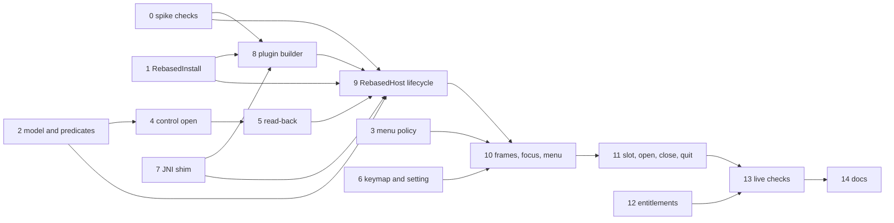

# Plan: Rebased as an in-process overlay

<!-- plan-review: planning:plan-review 2026-10-07 findings=52 resolved -->

Implements [the spec](20261007-rebased-overlay-spec.md). Read it first: this plan does not repeat the design.
Implemented as a plan pair: the lead session and a Codex mate, through `pair`.

## Contents

1. [Conventions](#conventions)
2. [Phase 0: what the spike has not shown yet](#phase-0-what-the-spike-has-not-shown-yet)
3. [Phase 1: pure parts in agtermCore](#phase-1-pure-parts-in-agtermcore)
4. [Phase 2: the host in the app](#phase-2-the-host-in-the-app)
5. [Phase 3: live verification and docs](#phase-3-live-verification-and-docs)
6. [Final gates](#final-gates)

Edges implied by a longer path are not drawn. Each task's `depends:` line is the full list.

## Conventions

- Work happens on the `pair/<slug>` branches that `pair start` creates from `main`. Nothing merges to
  `main` before [Final gates](#final-gates) pass, and nothing is deployed: deploying and restarting agterm
  are Sasha's actions.
- A pair worktree links all six build artifacts from the main checkout, as `CLAUDE.md`'s worktree section
  says: `GhosttyKit.xcframework`, `agterm/Resources/{ghostty,terminfo,zmx}` (absolute targets),
  `.ghostty-build-stamp` and `.zmx-build-stamp`. Link a set only while its stamp matches. Otherwise
  `scripts/test-app.sh`, which runs `scripts/setup.sh` on every call, rebuilds zmx or libghostty.
- Tests first in every task. Run only the task's own check while working. The full gates run once, at the
  end (`CLAUDE.md`).
- Every check runs from the repo root, as `pair` runs it; core checks `cd agtermCore` themselves.
- ⚠️ Hosted and UI runs from different worktrees collide: every hosted host binds the same
  `AGTERM_CONTROL_SOCKET` from `project.yml`, and XCUITest kills running instances of the Debug bundle id.
  So every `xcodebuild` run in this plan goes through one shared lock:
  `/usr/bin/lockf /tmp/agterm-vim-xcode.lock scripts/test-app.sh …`. The acceptance lines spell it out.
- A check for a new test class first proves the class exists (`grep -q`), because `swift test --filter` and
  `-only-testing:` both pass when nothing matches.
- A task that edits an app-target file runs at least one hosted class, so the app build is checked too.
- ⚠️ The mate never launches or quits any agterm, and never runs `agterm` or `agtermctl`. The one exception
  to the plan rules' "never launch the app": the lead, in Tasks 0 and 13 only, launches a separate Debug
  instance, or in Task 13 the Release copy under bundle id `com.umputun.agterm.smoke`, with a short `/tmp` `AGTERM_STATE_DIR` as `CLAUDE.md` describes, addresses it only with
  `--socket`, and stops it by PID. Nothing ever touches the default socket or the deployed app.
- New fork files go under `agterm/Rebased/` (app) and `agtermCore/Sources/agtermCore/Rebased*.swift` (core).
  An edit to an upstream file stays minimal and is listed in Task 14 for `fork-merge.md`.
- `agtermCore` is a library that `agterm-linux` consumes. Add public API with defaults. Do not change an
  existing public initializer's required parameters. A new `Codable` wire field is optional, so older
  peers still decode.
- Rebased must be installed at `/Applications/Rebased.app` for the hosted tests in Tasks 8 and 9. Those tests
  skip, with a message, when it is absent.
- The verification file `docs/plans/20261007-rebased-overlay-verification.md` holds one line per check:
  `- [x] <name>: pass — <what was seen>`, or `- [ ] <name>: fail — <what was seen>`. Live lines in Task 13
  start with `live-`.
- Spike reference code: `/private/tmp/claude-501/-Users-sasha-dev-oss-agterm-vim/8ac57a78-64ac-4fba-b8df-81b7ed01ad58/scratchpad/rebased-spike/`
  (`spike.m`, `plugin/`). Task 0 copies it into the repo, because the scratchpad is temporary.

## Phase 0: what the spike has not shown yet

### Task 0: extend the spike, record the results

owner: lead

- [ ] Copy the spike (`spike.m`, the plugin source, the build lines) to `docs/plans/rebased-spike/`, so the
  mate and later sessions can read it.
- [ ] Extend the spike plugin with `hide`, `show` and `saveAll`, called by the host over JNI through a
  `System.getProperties()` bridge object, as the spec's bridge section describes. Extend the host with
  the spec's frame rules (invisible until settled, snap-back, `.fullScreenNone`, undo minimize).
- [ ] Package the spike plugin the way Task 8 will: `javac` from Rebased's JBR, then `/usr/bin/zip -r -X`
  into `lib/<name>.jar`. JBR ships no `jar` tool.
- [ ] Menu probe inside a Debug agterm, as an uncommitted throwaway patch in a scratch worktree: on a key
  chord, install an empty `NSMenu` as `NSApp.mainMenu`, fill it with one item, then reinstall the saved
  SwiftUI menu. Check that SwiftUI never replaces the foreign menu while it is installed, and that every
  SwiftUI menu item and `reconcileStockMenuChords` still work after the swap back.
- [ ] Run each check and record its line in the verification file:
  - `menu-swiftui`: the menu probe above;
  - `hide-show`: `setVisible(false)` then `setVisible(true)` keeps the frame attachable, and focus returns
    to the IDE;
  - `full-screen`: an attached frame follows the host window into and out of native full screen;
  - `frame-owner`: opening a project shows no visible jump, and a resize, zoom, full-screen or minimize
    from inside the IDE ends with the frame back on the slot;
  - `save-at-quit`: with an unsaved edit, `saveAll` is called from inside `applicationWillTerminate` while
    the main thread is blocked waiting for it, as agterm will call it. It returns within 2 s and the edit
    is on disk. If it cannot finish because AWT needs the main thread, the spec changes to save from
    `applicationShouldTerminate` with `.terminateLater`, keeping the run loop alive, and this check is
    re-run that way;
  - `bridge`: the plugin's `hostEvent` native reaches the host after `RegisterNatives` on the bridge's class;
  - `zip-plugin`: the zipped plugin loads.
- [ ] A check that fails changes the spec before Phase 2 starts. Ask Sasha when the change is a design
  change.
- [ ] Check: `test -f docs/plans/rebased-spike/spike.m && test "$(grep -c '^- \[x\] [a-z-]*: pass' docs/plans/20261007-rebased-overlay-verification.md)" -ge 7`

## Phase 1: pure parts in agtermCore

### Task 1: `RebasedInstall`, the JVM option list

- [ ] Tests first in `RebasedInstallTests`, with a fixture `product-info.json` (two launch entries, one
  `macOS`/`aarch64` with `customCommands`) and a fixture `.vmoptions` (comments, blank lines):
  - the option order is `-XX:ErrorFile`, `-XX:HeapDumpPath`, the `.vmoptions` lines, then
    `additionalJvmArguments`, then the class path, `-Dide.native.launcher=true`, `-Dsun.java.command=<main>`,
    then the four `idea.*.path` overrides under the given state dir;
  - `$APP_PACKAGE` is replaced with the bundle path; `customCommands` are ignored;
  - the class path is `Contents/lib/<jar>` in `bootClassPathJarNames` order;
  - `minRequiredJavaVersion` above the runtime's `JAVA_VERSION` (read from `jbr/Contents/Home/release`)
    is an error naming both versions; a missing macOS entry is an error;
  - an input whose contents are nil (the file was missing) is an error naming its path;
  - `pluginCacheKey(buildNumber:sourceDigest:)` changes when either input changes.
- [ ] Implement `RebasedInstall`. It is pure: it takes each file's path and optional contents, plus the
  bundle path and state dir. A thin reader in the app (Task 9) reads the files.
- [ ] Acceptance: `grep -rq RebasedInstallTests agtermCore/Tests && cd agtermCore && swift test --no-parallel --filter RebasedInstallTests`

### Task 2: the slot model, the predicates, teardown

- [ ] Tests first, extending `HtmlOverlayTests`:
  - `rebasedOverlayActive` is true only with `overlayActive` and a `rebasedOverlay`;
  - `coverOverlayActive` is true for a program, a page or Rebased; `programOverlayActive` is false for
    Rebased; `htmlOverlayActive` is false for Rebased;
  - Rebased opens into an empty slot and replaces a HUD, as a page does. With a program or a page in the
    slot it answers `.alreadyOpen`, and the occupant is untouched. Closing it clears `rebasedOverlay`;
  - `Session.topmostSurface` and `focusTarget` return nil while Rebased covers the session, as for a page;
  - `teardownOverlaySlot` (session, workspace, pending-close and window teardown) and `closeOverlay` both
    clear `rebasedOverlay` and fire `RebasedOverlayReleases`.
- [ ] Add `RebasedOverlay` (project dir, `state: starting | shown | failed(String)`) and
  `Session.rebasedOverlay`, beside `htmlOverlay`. The size is the existing `Session.overlaySizePercent`,
  so `session overlay resize` works unchanged. Store open and close go through the same seam as
  `AppStore.openHtmlOverlay` and `closeOverlay`.
- [ ] Add `RebasedOverlayReleases`, shaped like `HtmlOverlayReleases`: the one signal the app's host needs
  when the model drops a Rebased occupant. Task 9 subscribes and hides the frame, so no IDE frame outlives
  its session.
- [ ] Walk every site found by `grep -rn 'htmlOverlayActive\|htmlOverlay\b\|coverOverlayActive\|programOverlayActive\|topmostHtmlOverlay\|htmlHidesTerminal\|pageMayCover' agterm agtermCore/Sources`.
  This includes the 14 sites in `.claude/rules/control-api.md` and the focus reads (`topmostSurface`,
  `focusTarget`, `AppActions+Focus` `pageMayCover`, `htmlHidesTerminal`, `topmostHtmlOverlay`). For each,
  decide whether Rebased behaves like a page there, and edit it. A site in `agtermCore` gets a test. A site
  in an app view is listed in the commit message and checked live in Task 13.
- [ ] Acceptance: `grep -q rebasedOverlayActive agtermCore/Tests/agtermCoreTests/HtmlOverlayTests.swift && (cd agtermCore && swift test --no-parallel --filter 'HtmlOverlayTests|AppStoreSessionStateTests') && /usr/bin/lockf /tmp/agterm-vim-xcode.lock scripts/test-app.sh -only-testing:agtermTests/ControlServerLinkOverlayTests -only-testing:agtermTests/HtmlOverlayRegistryTests`

### Task 3: `RebasedMenuPolicy`

- [ ] Tests first in `RebasedMenuPolicyTests`. Inputs: the key window's kind (`agterm`, `ide`, `other`),
  whether the sacrificial menu has been installed, and which menu is installed now. Output: install
  `agterm`, `sacrificial`, `ide`, or nothing. Cases: the first IDE key installs the sacrificial menu;
  later IDE keys install `ide`; an agterm key installs `agterm`; `other` (a panel, the quick terminal)
  changes nothing; repeated events are idempotent. `reconcileAllowed` is false while `ide` is installed.
- [ ] Implement it as a pure value type.
- [ ] Acceptance: `grep -rq RebasedMenuPolicyTests agtermCore/Tests && cd agtermCore && swift test --no-parallel --filter RebasedMenuPolicyTests`

### Task 4: `session overlay open --rebased`

depends: 2

- [ ] Tests first:
  - `OverlayCommandsTests` (agtermctlKit): `--rebased` parses, with optional `--cwd`, `--size-percent`
    and `--target`. A relative `--cwd` is made absolute by the CLI, as for `--html`. Each of these with
    `--rebased` is a usage error: a COMMAND, `--html`, `--url`, `--pane`, `--wait`, `--block`, `--js`,
    `--navigation`, `--chromeless`, `--persistent`, `--browse`, `--background-color`.
  - `ControlProtocolTests`: the request round-trips, and a request JSON without the `rebased` key still
    decodes (an older `agtermctl`, the p4linux origin, an ssh viewer).
  - `ControlDispatcherOverlayTests`: `overlayContent` yields the Rebased case; the rejected combinations
    answer the same error shape as command-plus-page today.
  - `ForwardPolicyTests`: `ForwardPolicy.route` answers `.refused("Rebased overlays open on a Mac only")`
    for a `sessionOverlayOpen` with `rebased`, next to the `--html` branch. The command stays `.routed` in
    `ForwardPolicy.kind`, so `HeadlessCatalogTests` is unchanged. The branch must come before the
    `case .sessionOverlayOpen` that answers `.job`.
  - `HeadlessPagesTests` (AgtermHeadlessKitTests): the text the user sees, built by
    `HeadlessActions.respond`, as for the `--html` refusal.
  - `ControlServerOverlayRedirectTests` (hosted) gains a case: with the redirect on, `--rebased` does not
    redirect.
- [ ] Add the content: `ControlArgs.rebased: Bool?`, sent as `rebased ? true : nil`;
  `ControlSessionOverlayOpenOptions.rebased: Bool = false` (not `Codable`); the dispatcher branch; the CLI
  flag; the route refusal.
- [ ] Mac host: `ControlServer.openSessionOverlay` skips the overlay-redirect decision for `--rebased`, and
  refuses on a remote row with "Rebased overlays open on the Mac that holds the repository". Any other
  Rebased open answers "not implemented" until Task 11.
- [ ] Acceptance: `(cd agtermCore && swift test --no-parallel --filter 'OverlayCommandsTests|ControlProtocolTests|ControlDispatcherOverlayTests|ForwardPolicyTests|HeadlessPagesTests') && grep -q 'Rebased overlays open on a Mac only' agtermCore/Tests/AgtermHeadlessKitTests/HeadlessPagesTests.swift && for f in agtermctlKitTests/OverlayCommandsTests agtermCoreTests/ControlProtocolTests agtermCoreTests/ControlDispatcherOverlayTests agtermCoreTests/ForwardPolicyTests; do grep -qi rebased agtermCore/Tests/$f.swift || exit 1; done && grep -qi rebased agtermTests/ControlServerOverlayRedirectTests.swift && /usr/bin/lockf /tmp/agterm-vim-xcode.lock scripts/test-app.sh -only-testing:agtermTests/ControlServerOverlayRedirectTests`

### Task 5: read-back

depends: 4

- [ ] Tests first in `AppStoreTreeProjectionTests`: a session with a Rebased overlay projects
  `rebasedOverlay: {project, state, error?}`, and one without projects nothing. The size stays in the
  existing `overlaySizePercent`. The tree top level projects `rebased: {jvm, error?, projects}` when the
  tree builder is given a Rebased status, and nothing when it is not.
- [ ] The top-level status is app-global, so it follows the `liveReset` and `indexUnsaved` pattern:
  `ControlServer` passes it into the store's tree builder, read from a status provider that Task 9's `RebasedHost`
  fills; until then the provider answers `notStarted`. It passes nil while the JVM state is `notStarted`, so the field is absent for anyone who never opens Rebased.
- [ ] Consumers, 5: `ControlProjection`, the tree builder call in `ControlServer.swift`,
  `AppStoreTreeProjectionTests`, `plugins/agterm/skills/agterm/reference.md` (the tree field list, beside
  `htmlOverlays`), and the skill's `SKILL.md` overlay section. Recount at acceptance.
- [ ] Acceptance: `grep -q rebasedOverlay agtermCore/Tests/agtermCoreTests/AppStoreTreeProjectionTests.swift && (cd agtermCore && swift test --no-parallel --filter AppStoreTreeProjectionTests) && grep -q rebasedOverlay plugins/agterm/skills/agterm/reference.md && grep -q rebasedOverlay plugins/agterm/skills/agterm/SKILL.md && grep -qF "$(printf '\140rebased\140')" plugins/agterm/skills/agterm/reference.md && /usr/bin/lockf /tmp/agterm-vim-xcode.lock scripts/test-app.sh -only-testing:agtermTests/ControlServerLinkOverlayTests`

### Task 6: the keymap action and the setting

- [ ] Tests first: `BuiltinActionTests` (`rebased_toggle` exists, raw name, no default chord, `allCases.count`
  goes from 51 to 52, the default-chord table lists it as keyless); `KeymapTests` (a `map` line binds it);
  `AppSettingsTests` (`rebasedAppPath` round-trips, absent means `/Applications/Rebased.app`).
- [ ] Add the builtin case, its place in `defaultChord`'s keyless list, its merge line in
  `CustomCommandRunner.rebuild()` (one line, flagged file), the `AppSettings` field, `SettingsModel`
  setter, and a text field in Settings beside the fork's other entries.
- [ ] Palette row: `PaletteCommand.toggleRebased` ("Toggle Rebased") with `builtinAction` `.rebasedToggle`,
  tested in `PaletteCatalogTests` (the count and title list, and `.toggleRebased` joins `needSession`: it
  acts on the active session). `AppActions+Palette` runs it through
  `AppActions.toggleRebasedOverlay()`. That method is an empty stub here, and Task 11 fills it.
  `AppActionsPaletteTests` then finds the action in the palette rows, not in `paletteLessHandler`.
- [ ] Acceptance: `grep -q rebased_toggle agtermCore/Tests/agtermCoreTests/BuiltinActionTests.swift && grep -q rebased_toggle agtermCore/Tests/agtermCoreTests/KeymapTests.swift && grep -q rebasedAppPath agtermCore/Tests/agtermCoreTests/AppSettingsTests.swift && (cd agtermCore && swift test --no-parallel --filter 'BuiltinActionTests|KeymapTests|AppSettingsTests|PaletteCatalogTests') && /usr/bin/lockf /tmp/agterm-vim-xcode.lock scripts/test-app.sh -only-testing:agtermTests/AppActionsPaletteTests`

## Phase 2: the host in the app

### Task 7: the JNI shim

- [ ] Vendor `jni.h` and `darwin/jni_md.h` from JBR 25 into `agterm/Rebased/JNI/include/` with their license
  headers intact (GPLv2 with the Classpath Exception). Add a C shim and a module map, and wire them in
  `project.yml` (header search path, module import) with a one-line comment on why. The `agtermTests`
  target gets the same include path (`SWIFT_INCLUDE_PATHS` and `HEADER_SEARCH_PATHS`), because
  `@testable import agterm` loads the clang modules agterm imports.
- [ ] The shim exposes plain C functions to Swift: `rb_start(libjvm, options, count, mainClass)` on a
  dedicated 8 MB thread that never calls `DestroyJavaVM`; `rb_bridge_call(cmd, arg)` (attach, read the
  `agterm.rebased.bridge` property, call it); `rb_register_events(callback)` (`RegisterNatives` on the
  bridge's class for `hostEvent`).
- [ ] A start that fails before `JNI_CreateJavaVM` succeeds (`dlopen`, a missing symbol) leaves the shim
  startable again, so the user can fix the path and retry. After a JVM is created, a second `rb_start` is
  refused. The started-once guard sits behind a seam a test can set.
- [ ] Hosted test `RebasedJVMTests` starts no JVM: `rb_start` with a missing `libjvm` returns the `dlopen`
  error string and a retry returns it again; with the guard set, `rb_start` is refused.
- [ ] Acceptance: `test -f agtermTests/RebasedJVMTests.swift && /usr/bin/lockf /tmp/agterm-vim-xcode.lock scripts/test-app.sh -only-testing:agtermTests/RebasedJVMTests`

### Task 8: the bridge plugin and its builder

depends: 0, 1, 7

- [ ] Java source in `agterm/Resources/rebased/` (a folder resource in `project.yml`, like `hud`, and added
  to the target's `excludes:` list as `Resources/hud` is), from the Task 0 plugin: exit and restart veto,
  the bridge object (`open`, `show`, `hide`, `saveAll`), the `hostEvent` native, and an AWT window
  listener that reports `frameOpened`, `frameClosed` and `windowOpened`.
- [ ] `RebasedPluginBuilder` (app): when `pluginCacheKey` differs from the stamp in the plugins dir, run
  Rebased's `jbr/Contents/Home/bin/javac --release 21 -cp '<lib>/*'`, then `/usr/bin/zip -r -X` the
  classes and `META-INF/plugin.xml` into `lib/<name>.jar`, as Task 0 measured. Write the stamp last.
  Errors carry the stderr of `javac` or `zip`.
- [ ] Hosted test `RebasedPluginBuilderTests`: builds into a temp state dir, a second call is a no-op, a
  changed key rebuilds. Skips when Rebased is absent.
- [ ] Acceptance: `test -f agtermTests/RebasedPluginBuilderTests.swift && test -d /Applications/Rebased.app && /usr/bin/lockf /tmp/agterm-vim-xcode.lock scripts/test-app.sh -only-testing:agtermTests/RebasedPluginBuilderTests`

### Task 9: `RebasedHost`, the lifecycle

depends: 0, 1, 2, 5, 7, 8

- [ ] The single owner, like `HtmlOverlayRegistry.shared`. It starts the JVM on the first open (builder,
  then the file reader and `RebasedInstall`, then `rb_start`), waits for `ready`, keeps the
  project-to-window map, and provides the status Task 5's `rebased` field reads. Every JVM callback hops
  to the main queue.
- [ ] The builder, the file reader and `rb_start` run off the main actor while the slot shows "Starting
  Rebased". The 30 s `ready` deadline starts after the plugin build. A start that misses it sets every
  waiting overlay to `failed("Rebased did not start within 30 s")`, so "Starting Rebased" never stays on
  screen.
- [ ] The JVM state (`notStarted | starting | running | failed`) is separate from each overlay's state.
  A `ready` after the deadline moves the JVM to `running`, and the next open or retry uses that JVM
  without `rb_start`. Only a JVM that was never created is retried through `rb_start`.
- [ ] Project dir: `--cwd` or the session cwd, raised to `git rev-parse --show-toplevel` when inside a repo.
- [ ] `show(session)`, `hide(session)`, and the clear-itself rules: a `frameClosed` for a shown project
  closes that session's overlay; a failed start sets `state = failed(error)`; a `RebasedOverlayReleases`
  signal hides that session's frame.
- [ ] `RebasedHost` becomes the status provider Task 5's `ControlServer` tree call reads.
- [ ] `isIDEKeyWindow`: true while the key window is one of the IDE's windows. Task 10's monitors read it.
  Tests can override it.
- [ ] One frame, one place: showing a project already shown elsewhere hides it there, and that slot shows
  "Rebased is shown in another session".
- [ ] Windows the IDE opens later (`windowOpened`), as the spec says: while the overlay is visible, the
  window is attached; a dialog that opens while hidden shows the overlay again in its last session; a
  popup that opens while hidden is ordered out.
- [ ] Hosted test `RebasedHostTests` with a fake bridge and a test clock (the host takes the bridge calls
  as a protocol): the event sequences above, the deadline, a late `ready` followed by a retry, the
  release signal and the three `windowOpened` cases produce the right store state and bridge calls, with no JVM.
- [ ] Acceptance: `test -f agtermTests/RebasedHostTests.swift && /usr/bin/lockf /tmp/agterm-vim-xcode.lock scripts/test-app.sh -only-testing:agtermTests/RebasedHostTests`

### Task 10: frames, focus and the menu

depends: 3, 6, 9

- [ ] `RebasedFrameKeeper` (app), on an `NSWindow` it is given: attach as child, hide the buttons and the
  title, `.fullScreenNone`, start at `alphaValue = 0`, fit to a target rect, reveal after 150 ms without
  an IDE-initiated change, snap back on `didResize`/`didMove` with its own `setFrame` marked, undo
  `didMiniaturize`. Dialogs keep their size and are only attached. `reparent(to:)` detaches from one
  window and attaches to another, for a session moved between windows.
- [ ] The key monitor: a local `NSEvent` monitor, installed while an IDE window is key. It matches only the
  direct chord bound to `rebased_toggle`, through a pure core type `RebasedKeyMatcher` built from a
  `Keymap`. A leader sequence is ignored over the IDE, so ⌃Space stays IntelliJ's completion. Every other
  key goes to the IDE untouched.
- [ ] The other app-wide monitors pass the event through untouched while `RebasedHost.isIDEKeyWindow` is
  true: `SessionSwitcher` (⌃Tab), `PaneShortcuts` (⌃1, ⌃2) and `UndoCloseShortcut` (⌘Z). Their
  `handleKeyDown` methods become internal, so a test can call them.
- [ ] The menu: apply `RebasedMenuPolicy` on `NSWindow.didBecomeKeyNotification`, holding the SwiftUI
  menu object and IntelliJ's. `AppDelegate.reconcileStockMenuChords` returns early when
  `reconcileAllowed` is false, and runs right after the policy reinstalls the agterm menu, so a keymap
  reload made while the IDE was key is not left stale; the gate is a small internal function the test can call, because the
  method itself is private.
- [ ] Tests:
  - hosted `RebasedFrameKeeperTests` with plain `NSWindow`s standing in for the IDE frame: a resize from
    outside snaps back; the keeper's own fit does not loop; the reveal waits for quiet; a minimize is
    undone; a dialog keeps its size; `reparent(to:)` moves the child; the parent closes and the IDE window
    is detached and still open;
  - core `RebasedKeyMatcherTests`: a direct `map` chord matches; with no `map` line nothing matches; a
    leader sequence bound to `rebased_toggle` does not match; ⌃Space and an unbound key pass through;
  - hosted `RebasedKeyPassThroughTests`: with `isIDEKeyWindow` overridden to true, the ⌃Tab, ⌃1 and ⌘Z
    handlers return the event untouched, and with it false they consume it. The ⌘Z case sets up a pending
    close first, or it passes with or without the gate;
  - hosted `StockMenuChordTests` gains a case: the gate refuses reconcile while the IDE menu is installed.
- [ ] Acceptance: `test -f agtermTests/RebasedFrameKeeperTests.swift && test -f agtermTests/RebasedKeyPassThroughTests.swift && grep -rq RebasedKeyMatcherTests agtermCore/Tests && grep -qi rebased agtermTests/StockMenuChordTests.swift && (cd agtermCore && swift test --no-parallel --filter RebasedKeyMatcherTests) && /usr/bin/lockf /tmp/agterm-vim-xcode.lock scripts/test-app.sh -only-testing:agtermTests/RebasedFrameKeeperTests -only-testing:agtermTests/RebasedKeyPassThroughTests -only-testing:agtermTests/StockMenuChordTests`

### Task 11: the slot, the open and close paths, quit

depends: 2, 4, 5, 6, 10

- [ ] `RebasedSlotView` (`NSViewRepresentable`, never dismantles the IDE window) is a third branch of the
  `Group` in `overlayPanel`, beside `HtmlOverlayView` and `TerminalView`, sized by `OverlayPanelStyle`.
  Without that branch, Rebased falls into the `else` branch, which builds an overlay terminal surface. The
  view reports its screen rect on layout and on the window's move and resize, and shows "Starting
  Rebased", the error, or "shown in another session".
- [ ] `ControlServer.openSessionOverlay` routes the Rebased case to the store and `RebasedHost`, replacing
  Task 4's "not implemented".
- [ ] `AppActions.toggleRebasedOverlay()`: opens Rebased for the active session's project when the slot is
  empty or holds a HUD, closes it when the slot holds Rebased, and answers "overlay already open" over a
  program or a page. ⌘W (`AppActions.closeActiveSession`) and `session overlay close` close it too.
  `refocus` after close goes to the terminal, as for a page.
- [ ] Visibility: session switch, window close and minimize hide the frame. `session overlay resize`
  refits it. The command, session and pick palettes, the dashboard and terminal zoom hide it while they
  are up, because a child window draws above them. A session moved to another window calls `reparent`.
- [ ] Quit: `saveAll` through the bridge, waiting at most 2 s, before the existing flush. It runs where
  Task 0's `save-at-quit` check says it works: `applicationWillTerminate`, or `applicationShouldTerminate`
  with `.terminateLater`. A JVM never started costs nothing.
- [ ] Hosted test `ControlServerRebasedOverlayTests` with the fake bridge: open, close, toggle (both
  directions, and refused over a page), resize, session switch, palette shown, remote-row refusal and quit
  produce the expected bridge calls and tree.
- [ ] Acceptance: `test -f agtermTests/ControlServerRebasedOverlayTests.swift && /usr/bin/lockf /tmp/agterm-vim-xcode.lock scripts/test-app.sh -only-testing:agtermTests/ControlServerRebasedOverlayTests -only-testing:agtermTests/AppActionsPaletteTests`

### Task 12: entitlements

- [ ] Add `com.apple.security.cs.allow-jit` and `com.apple.security.cs.disable-library-validation` to
  `agterm/agterm.entitlements`. Rewrite its header comment: these two now ship because the Rebased overlay
  loads Rebased's `libjvm` (a different Team ID) and runs its JIT; the spike measured that both are
  needed. `allow-unsigned-executable-memory` stays Debug-only.
- [ ] Rewrite the header comment of `agterm/agterm-debug.entitlements` to match: Debug adds one exception
  now, not three, and its sentence "The Release bundle has no dylib and no JIT" is no longer true.
- [ ] `.github/workflows/ci.yml`: add both keys to the expected Release set in "Verify the app's Release
  entitlements", and change "Verify the Debug entitlements are the shipping set plus the exceptions" to
  one exception. CI does not run on the fork's `main`, so the edit keeps the file true rather than green.
- [ ] `.claude/rules/ci.md`: the entitlements paragraphs say the same.
- [ ] Acceptance: `make release && codesign -d --entitlements - --xml build/DerivedData/Build/Products/Release/agterm.app | plutil -p - | grep -c 'allow-jit\|disable-library-validation' | grep -qx 2`

## Phase 3: live verification and docs

### Task 13: live checks in an isolated Debug instance

owner: lead
depends: 5, 11, 12

- [ ] End-to-end, written and run by the lead (XCUITest needs the driver's automation grant): a new
  `ControlRebasedOverlayUITests: ControlAPITestCase`, shaped like `ControlHtmlOverlayUITests`, whose
  `seededSettings` points `rebasedAppPath` at a missing app. One case,
  `testOpenWithMissingAppReportsFailure`: `session overlay open --rebased` succeeds, and `tree` shows
  `rebasedOverlay.state` failed and the top-level `rebased.error`.
- [ ] Build Debug and launch a separate instance with a short `/tmp` `AGTERM_STATE_DIR` and
  `mkdir -p "$AGTERM_STATE_DIR/windows"`, as `CLAUDE.md` describes. Address it only with `--socket`.
- [ ] Record a `live-` line in the verification file for each: open full-pane and floating; resize and
  move the window; switch sessions and back; the IDE opens a dialog while hidden; the IDE tries to resize,
  zoom, enter full screen and minimize; menus switch with focus and SwiftUI's menu is intact after; ⌘Q in
  the IDE is refused; `tree` shows both read-back fields; closing
  the session hides the frame; a palette, the dashboard and zoom show above the slot; the direct toggle
  chord works from inside the IDE; ⌃Space completes code, ⌃Tab opens IntelliJ's Switcher, ⌃1 reaches the IDE, and ⌘Z
  right after closing a session undoes the IDE edit; each app-view predicate site Task 2 listed. Then the TCC
  check per service the IDE touched.
- [ ] Release smoke run, without the live bundle id: `make release`, copy the app to the scratch dir, set
  its `CFBundleIdentifier` to `com.umputun.agterm.smoke`, and re-sign by hand (not `sign-local.sh`, which
  exits 0 with a broken seal when its keychain is missing). Each of `agtermctl`, `zmx` and
  `agterm-session-host` in `Contents/MacOS` first:
  `codesign --force --options runtime --sign - --identifier com.umputun.agterm.smoke.<helper>`; then the
  app: `codesign --force --options runtime --sign - --entitlements agterm/agterm.entitlements`. Without
  `--options runtime` library validation is off and the check proves nothing. Record that `codesign -dv`
  shows `flags=0x10002(adhoc,runtime)` and `codesign -d --entitlements -` lists both keys. A copy under the live
  id would share the live defaults domain (saved window frames) and Dock identity. Launch it with its own
  short `/tmp` `AGTERM_STATE_DIR`, open Rebased once, and record `live-release-signing`: the JVM loads
  under the shipping entitlements. Stop it by PID, stop its daemons, and check
  `lsappinfo list | grep -A4 agterm.smoke` shows nothing. Tell Sasha if anything lingers.
- [ ] Ask Sasha to try it in the Debug instance, and record the report.
- [ ] Last, because it ends the instance: the agterm quit saves an unsaved IDE edit. Record `live-quit-save`.
- [ ] If the instance is still running, stop it by its PID with SIGTERM; confirm no Dock tile lingers.
- [ ] Check: `test -f agtermUITests/ControlRebasedOverlayUITests.swift && test "$(grep -c '^- \[x\] live-[a-z-]*: pass' docs/plans/20261007-rebased-overlay-verification.md)" -ge 14 && xcodegen generate && /usr/bin/lockf /tmp/agterm-vim-xcode.lock xcodebuild test -project agterm.xcodeproj -scheme agterm -destination 'platform=macOS' -derivedDataPath build/DerivedData -only-testing:agtermUITests/ControlRebasedOverlayUITests/testOpenWithMissingAppReportsFailure`

### Task 14: docs

depends: 13

- [ ] New `.claude/rules/rebased-overlay.md`: how it works now, the frame and menu rules, the bridge, the
  risks. `CLAUDE.md`'s path-scoped rules list gets its line.
- [ ] `.claude/rules/control-api.md`: Rebased in the occupant paragraph and the cover-site list.
- [ ] Skill: `SKILL.md` gets `--rebased` on the `session overlay open` line. `reference.md` gets it in the
  `session overlay open` entry, in the headless refusals list, and `rebased_toggle` in the builtins list.
- [ ] `.claude/rules/keymap.md`: add `rebased_toggle` to the keyless actions `CustomCommandRunner.rebuild`
  feeds the sequence engine, and say that over the IDE only its direct chord works.
  `.claude/rules/menu-actions.md`: ⌃1/⌃2 are no longer "always consumed"; they pass to the IDE. `.claude/rules/settings.md`:
  the `rebasedAppPath` setting.
- [ ] `site/commands.html` is not changed: fork-only commands stay off the upstream site, as for
  `zmx.new`. Record that in `rebased-overlay.md`.
- [ ] `FORK-NOTES.md`: one line under **Panes and sessions**. `CHANGELOG-fork.md`: an `### Added` entry
  under `## Unreleased`.
- [ ] `.claude/rules/fork-merge.md`: add to the frontmatter `flagged:` list and to the prose list the
  upstream files this feature edits where a plausible resolution could silently drop it. At least:
  `Session+HtmlOverlay.swift` (predicates), `AppDelegate.swift` (`reconcileStockMenuChords`, quit),
  `WindowContentView+Detail.swift` (slot), `AppActions.swift` (⌘W chain),
  `ControlServer+SessionActions.swift`, `ControlDispatcher+Overlay.swift`, `ForwardPolicy.swift`,
  `SessionSwitcher.swift`, `PaneShortcuts.swift`, `UndoCloseShortcut.swift` (IDE pass-through).
- [ ] Acceptance: `grep -q 'rebased-overlay.md' CLAUDE.md && grep -q 'rebased-overlay.md' FORK-NOTES.md && grep -qi rebased CHANGELOG-fork.md && grep -qi rebased .claude/rules/control-api.md && grep -q -- '--rebased' plugins/agterm/skills/agterm/SKILL.md && grep -q rebased_toggle plugins/agterm/skills/agterm/reference.md && grep -q rebased_toggle .claude/rules/keymap.md && grep -q rebasedAppPath .claude/rules/settings.md && grep -q ForwardPolicy.swift .claude/rules/fork-merge.md`

## Final gates

Run once each, after Task 14, from the integration branch, `xcodebuild` runs under the shared lock:

- `cd agtermCore && swift test`
- `make test-app`
- `make lint`
- `make release` (Task 12 changed what Release signs)
- `swift test --no-parallel` and `swift build --product agterm-headless` on p4linux, in a fresh clone under
  `/tmp` (Task 4 touched `ForwardPolicy` and public `agtermCore` types).

Then report to Sasha. Merging to `main`, deploying and restarting agterm are Sasha's calls.
