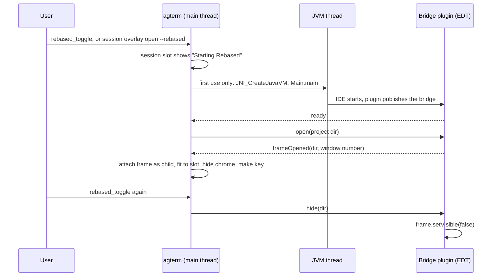

# Spec: Rebased as an in-process overlay

Status: draft 2, 2026-10-07. Sasha asked for it after the spike passed and accepted the three decisions below as recommended. Fork-only; upstream would decline it
(an IDE inside the terminal, and two hardened-runtime exceptions).

## Contents

1. [The goal](#the-goal)
2. [What the spike proved](#what-the-spike-proved)
3. [The design](#the-design)
4. [What changes in agterm](#what-changes-in-agterm)
5. [The bridge plugin](#the-bridge-plugin)
6. [Control API, keymap and settings](#control-api-keymap-and-settings)
7. [Risks and what we accept](#risks-and-what-we-accept)
8. [Decisions for Sasha](#decisions-for-sasha)
9. [Tests and gates](#tests-and-gates)
10. [Not in scope](#not-in-scope)

## The goal

Open [Rebased](https://github.com/detachhead/rebased), the IntelliJ-platform git client, over a session the
way an HTML page opens: full-pane or floating, sized to the slot, moving and resizing with the window,
closed with one chord, started on first use. No fork of Rebased and no patch to the IntelliJ platform.

## What the spike proved

A throwaway Objective-C host (`spike.m`, kept in the session scratchpad) ran every step below on this Mac
with Rebased 1.1.20 (build 262.10968, JBR 25.0.4):

- **Boot.** `dlopen` of Rebased's `libjvm.dylib`, `JNI_CreateJavaVM` with the options Rebased's own launcher
  builds (`product-info.json` `additionalJvmArguments` and `bootClassPathJarNames`, plus `bin/rebased.vmoptions`),
  then `com.intellij.idea.Main.main` on a background thread started after `applicationDidFinishLaunching`.
  JBR takes its embedded path: `NSApp` stays the host's class. First window in 1.6–2.3 s.
- **Attach.** `addChildWindow(_:ordered: .above)` moves the IDE frame with the host in lockstep. The host
  setting the frame on its own resize makes resize follow. Dialogs and popups are attached the same way and
  move too. Hiding the traffic lights and the title works.
- **Exit veto.** A 20-line plugin registers `ApplicationListener.canExitApplication() → false` through
  `addApplicationListener`. IntelliJ's exit request was refused; host and IDE stayed up. A `plugin.xml`
  topic listener would not be consulted: `ApplicationImpl.canExit` reads only the dispatcher's listeners.
- **Menu bar.** IntelliJ writes its items into whatever `NSApp.mainMenu` is installed when its frame first
  becomes key, once. The host keeps that object and swaps menus on key-window changes. Measured across
  repeated focus switches.
- **libghostty in the same process.** The spike linked `libghostty-internal.a` and called `ghostty_init` first.
  Ghostty's sentry (Breakpad backend, `task_set_exception_ports`) is on for macOS by default and starts in
  `ghostty_init`. The JVM ran 40 s of IntelliJ work, which takes deliberate memory faults, and survived. No
  new Ghostty crash report was written.
- **Signing.** Under the hardened runtime, `libjvm` is refused without `disable-library-validation` ("different
  Team IDs"), and the process aborts without `allow-jit`. With both it boots.
- **Memory.** RSS 300–650 MB on the Welcome screen, 400–830 MB with one project open.

## The design

One JVM per agterm process, started on the first open and kept until agterm quits: HotSpot cannot be created
twice. One IntelliJ instance serves every session. Each session's overlay shows the IDE frame for that
session's project.

**The slot.** The session-wide overlay slot gets a third occupant beside a program and an HTML page. Its
view is a placeholder `NSView` that reports its rectangle in screen coordinates whenever layout, the window
frame, the sidebar or the floating size changes. agterm sets the IDE frame to that rectangle. Moving the
window needs nothing: a child window follows its parent.

**The slot owns the frame.** IntelliJ changes its own window: opening a project creates a new frame and
restores that project's saved bounds, and the IDE can maximize, minimize or enter full screen from its own
menus. agterm treats any frame the IDE sets as a request it overrides:

- A new project frame starts invisible (`alphaValue = 0`). agterm attaches it, fits it to the slot, and
  shows it once no IDE-initiated move or resize has arrived for 150 ms. The user never sees the restored
  bounds or a jump.
- After that, agterm observes `didResize` and `didMove` on every attached IDE window. A frame that differs
  from the slot's rectangle is snapped back on the next main-queue turn. agterm's own `setFrame` calls are
  marked, so a snap never triggers another snap.
- Full screen is blocked at the window: attached frames get `collectionBehavior` `.fullScreenNone`, so the
  IDE's own full-screen command does nothing. A minimize from the IDE's Window menu is undone on
  `didMiniaturize`: deminiaturize, then refit.
- Dialogs keep the size the IDE gives them. Only their position follows the host, because they are children.

**Visibility.** The frame is shown only while its session is the visible session of its window, the
overlay is open, and the window is not minimized. Switching sessions, closing the overlay or closing the
window hides it through the bridge (`setVisible(false)`, so AWT's own state stays true). One project frame
can be in one place only: if two sessions show the same project, the one focused last wins and the other
slot shows "Rebased is shown in another session".
A child window always draws above its parent's content, so agterm UI drawn inside the window would open
under the IDE frame. The frame is also hidden while a palette (command, session, pick), the dashboard or
terminal zoom is up, and shown again when it closes. A session moved to another window takes its frame
along: the frame is detached from the old window and attached to the new one.
Like a page, Rebased opens only into an empty slot or over a HUD. With a program or a page in the slot,
the open and the toggle chord answer "overlay already open".

**It clears itself.** If the IDE closes the attached project frame, for example ⌘W on the last tab, which
IntelliJ turns into "close project", the overlay closes. If the JVM fails to start, the slot shows the error
and the tree reports it. ⌘W and the toggle chord close it like any overlay.

**Windows the IDE opens later.** The plugin reports every AWT window it opens. While the overlay is visible,
agterm attaches the new window to the host window. While it is hidden, a new dialog brings the overlay back
in its last session, because a dialog usually wants an answer (a git credential prompt). A popup that
appears while hidden is ordered out.

**Keys.** While an IDE window is key, agterm's keymap stays out of the way. `CustomCommandRunner` already
passes keys for windows outside `WindowRegistry`. Three other app-wide local monitors do not, and each checks
one predicate, "the key window is an IDE window", owned by `RebasedHost`: `SessionSwitcher` (⌃Tab is
IntelliJ's Switcher), `PaneShortcuts` (⌃1, ⌃2) and `UndoCloseShortcut` (⌘Z). One more local monitor, active
only while an IDE window is key, matches the direct chord bound to `rebased_toggle` and nothing else. A leader
sequence does not work over the IDE: the leader ⌃Space is IntelliJ's code completion, and swallowing it
would break completion. Session navigation chords do not work over the IDE in v1.

**The menu bar.** SwiftUI owns agterm's menu and `AppDelegate.reconcileStockMenuChords` patches it on
activation, keymap change and menu-tracking start. Before the first IDE frame becomes key, agterm installs a
sacrificial empty `NSMenu`, so IntelliJ writes into that object and never into SwiftUI's. From then on, key
window kind decides the menu: an IDE window installs the IDE menu, an agterm window reinstalls the saved
SwiftUI menu. `reconcileStockMenuChords` returns early while the IDE menu is installed.

**Quit.** `applicationWillTerminate` asks the bridge to `saveAll`, waiting at most 2 s, before the existing
flush. Process exit ends the JVM. IntelliJ's own exit stays vetoed.

## What changes in agterm

Pure parts go to `agtermCore`, side effects stay in the app target, per the #78 split.

- **`agtermCore`**
  - `RebasedInstall`: reads `product-info.json` and the `.vmoptions` file and builds the JVM option list the
    way Rebased's launcher does (`$APP_PACKAGE` substitution, class path from `bootClassPathJarNames`,
    `-XX:ErrorFile` and `-XX:HeapDumpPath` into agterm's state dir, `-Dide.native.launcher=true`,
    `-Dsun.java.command`), plus the `idea.*.path` overrides (see [decisions](#decisions-for-sasha)).
    Validates `minRequiredJavaVersion` against the bundled runtime's `release` file. Pure and tested on fixtures.
  - `RebasedOverlay`: the slot's model (project dir, state `starting | shown | failed(error)`; the size is the session's existing
    `overlaySizePercent`).
    A field on `Session` beside `htmlOverlay`.
  - `Session` predicates: a new `rebasedOverlayActive`; `coverOverlayActive` becomes program, page or Rebased;
    `programOverlayActive` excludes it. The cover-site list in `control-api.md` (the paragraph on an HTML
    page as a third occupant) names 11 cover sites and 3 program-only sites. Each of the 14 is checked in the
    plan by name; most need no edit because they read `coverOverlayActive` already.
  - `RebasedMenuPolicy`: given the key window's kind and what has been installed, which menu object to
    install. Pure and tested.
  - Control: protocol argument, dispatcher branch in `overlayContent`, projection fields (see below).
- **App target**, new folder `agterm/Rebased/`
  - `RebasedJVM`: the JNI shim. A small C file compiled into the app with vendored `jni.h` and `jni_md.h`
    (GPLv2 with the Classpath Exception), exposed to Swift through a module map. It owns the JVM thread,
    `RegisterNatives` for the plugin's callbacks, and the calls into the bridge. Every callback from a JVM
    thread hops to the main queue, the same rule as `GhosttyCallbacks`.
  - `RebasedHost`: the single owner, like `HtmlOverlayRegistry`. It starts the JVM lazily, keeps the
    project-to-window map, attaches and detaches child windows, hides chrome, fits frames, runs the key
    monitor and the menu policy.
  - `RebasedSlotView`: the `NSViewRepresentable` placeholder composed in `overlayPanel` of
    `WindowContentView+Detail.swift`, as a third branch of the `Group` in `overlayPanel`, beside `HtmlOverlayView` and `TerminalView`, sized by the existing `OverlayPanelStyle`.
  - `AppDelegate`: the `saveAll` step in `applicationWillTerminate`, and the early return in
    `reconcileStockMenuChords`.
- **Signing.** `agterm/agterm.entitlements` gains `com.apple.security.cs.allow-jit` and
  `com.apple.security.cs.disable-library-validation`. Nothing new is bundled as a Mach-O, so
  `scripts/sign-local.sh` and the post-build signing script do not change. The two `ci.yml` entitlement
  checks, `ci.md` and both entitlements files' header comments are updated to match, although that CI does
  not run on the fork's `main`.
- **Fork docs**, in the commit that lands the feature: a `FORK-NOTES.md` line under **Panes and sessions**
  pointing at a new `.claude/rules/rebased-overlay.md`, and a `CHANGELOG-fork.md` entry under
  `## Unreleased`. `fork-merge.md`'s lists get the touched upstream files the plan names as dangerous.
- **Skill.** `plugins/agterm/skills/agterm/` documents `--rebased`.

## The bridge plugin

Java source shipped as a resource folder `agterm/Resources/rebased/`. On first start, and again whenever
Rebased's `buildNumber` or the source digest changes, agterm compiles it with Rebased's own
`jbr/Contents/Home/bin/javac` against Rebased's own `lib/*.jar` into the plugins path. That keeps the plugin
in step with the installed Rebased build and needs no JDK at build time. Compilation takes a few seconds,
once per Rebased version.

What it does:

- Vetoes exit and restart (`canExitApplication`, `canRestartApplication`).
- Publishes a bridge object in `System.getProperties()` under `agterm.rebased.bridge`. Its type is a JDK
  interface, so agterm can call it through JNI without seeing the plugin's class loader. Commands: `open`,
  `show`, `hide`, `saveAll`.
- Declares `static native void hostEvent(String kind, String payload)`. agterm binds it with
  `RegisterNatives` on the bridge's class. Events: `ready`, `frameOpened <dir> <windowNumber>`,
  `frameClosed <dir>`, `windowOpened <windowNumber> <dialog|popup>`.
- Finds a frame's `NSWindow` with `MacUtil.getWindowFromJavaWindow` and reports its `windowNumber`. agterm
  resolves it with `NSApp.window(withWindowNumber:)`.

## Control API, keymap and settings

- **Open.** `agtermctl session overlay open --rebased [--cwd DIR] [--size-percent N] [--target ID]`. The
  project is `--cwd`, or the session's cwd, raised to its git top level. `--rebased` with a command,
  `--html` or `--url` is rejected. Refused on a headless origin (in `ForwardPolicy.route`, beside the `--html` refusal) and on a
  remote row in v1: the repository is not on the presenting Mac.
- **Close.** The existing `session overlay close`, ⌘W, and the toggle chord.
- **Read-back.** `ControlSessionNode` gains `rebasedOverlay: {project, state, error?}`. The tree
  top level gains `rebased: {jvm: starting|running|failed, error?, projects}`, absent until the JVM is
  first started (as `liveReset` is absent when idle).
- **Keymap.** Builtin `rebased_toggle`, keyless by default. Keyless builtins need a merge line in
  `CustomCommandRunner.rebuild()`, which is a flagged file in `fork-merge.md`. It is one line.
  The command palette gets a "Toggle Rebased" row, so the action is found without a `map` line.
- **Settings.** The path to `Rebased.app` (default `/Applications/Rebased.app`) in `AppSettings` and a field in
  Settings. No interface-element toggle.

## Risks and what we accept

- ⚠️ **Shared fate.** A JVM crash ends agterm. zmx keeps every shell, but each pane's UI is gone until
  relaunch. IntelliJ heap (up to `-Xmx2048m` from `rebased.vmoptions`) stays resident until agterm quits.
- ⚠️ **Weaker hardening of the terminal.** `disable-library-validation` lets agterm load libraries signed by
  anyone. `DYLD_INSERT_LIBRARIES` stays blocked (no `allow-dyld-environment-variables`).
- **Keychain.** IntelliJ's credential store defaults to the Keychain. Items it writes belong to agterm's
  ad-hoc signature, which changes on every deploy, so expect Keychain prompts after deploys. Workaround:
  set the IDE's password storage to KeePass or "do not save".
- **TCC.** Everything the IDE touches is attributed to agterm, so the IDE gets agterm's grants and no new
  prompt subject. Checked per service in the plan, as `CLAUDE.md` asks.
- **Ghostty crash capture** may stop working once the JVM runs. The spike showed the JVM survives; it did
  not show that Breakpad still catches a real Ghostty crash. Accepted.
- **Rebased updates** change `product-info.json`. `RebasedInstall` reads it at each start, so a changed option
  list follows automatically. A changed layout fails the start with a clear error.
- **IntelliJ minimum frame size.** A slot smaller than it overflows. Floating overlays are the natural fit.

## Decisions for Sasha

All three accepted as recommended on 2026-10-07.

1. **IDE state directories.** Recommended: agterm's own (`<stateDir>/rebased/{config,system,plugins,log}`),
   so a standalone Rebased can run at the same time without a lock conflict. Cost: settings and recent
   projects are not shared with standalone Rebased. The alternative shares them, and then the two cannot run
   together.
2. **Plugin build.** Recommended: compile on first use with Rebased's own `javac`, as above. The alternative
   is a prebuilt jar committed to the repo, built by a script against an installed Rebased.
3. **Title bar.** Recommended for v1: hide the buttons and the title, keep the empty strip. Removing the
   strip (`styleMask` without `.titled`) looked fine in one try, but click offsets were not checked.

## Tests and gates

- `agtermCore` tests: `RebasedInstall` against a fixture `product-info.json` and `.vmoptions` (substitution,
  class path order, overrides, version check). `RebasedMenuPolicy` transitions. The predicate sites,
  found by grep: a site in `agtermCore` gets a test that it reads the right predicate; a site in an app
  view is listed in its commit and checked live. Slot teardown hides the frame. Protocol, dispatcher and CLI parsing of `--rebased`,
  including the rejected combinations and the headless refusal. Projection of both read-back fields.
- The first plan tasks verify what the spike did not, inside a Debug agterm, before the rest is built:
  1. the sacrificial menu keeps SwiftUI's menu untouched, and SwiftUI does not replace the IDE menu;
  2. hide and show through `setVisible` keep the frame attached and keyboard focus sane;
  3. the attached frame follows the window into and out of native full screen;
  4. opening a project shows no visible jump: the restored bounds stay hidden until the fit settles, and a
     resize, zoom, full-screen or minimize from inside the IDE ends with the frame back on the slot;
  5. `saveAll` at quit finishes inside the 2 s bound.
- A manual check list in an isolated Debug instance (separate state dir and socket): open, float, resize,
  switch sessions, open a dialog while hidden, quit. One Release smoke run, from a copy with its own bundle
  id, proves the JVM loads under the shipping entitlements.
- Gates: `swift test`, `make test-app`, `make lint`, `make release`, once each at the end.

## Later: Rebased as the annotation viewer

The longer goal is to replace plannotator: browse and annotate code in Rebased (through a modified
agterm-annotate, as an IntelliJ plugin) and send the notes to a chat room or back to the pane. v1 keeps
three doors open for it and builds none of it:

- The plugins dir is an ordinary IntelliJ plugins dir, so a second plugin can be installed there beside the
  bridge (from Rebased's Settings, or by agterm).
- The bridge's command set and `hostEvent` kinds are open strings. `openFile <path>:<line>` and an
  `annotations` event can be added without changing the JNI shim.
- `session overlay open --rebased` has room for a later `--file <path>[:<line>]`.

## Not in scope

- Pane-scoped (`--pane`) Rebased overlays.
- Session navigation chords while the IDE has focus.
- Other IntelliJ-platform apps. The code is shaped so one could follow, but nothing is promised.
- Shipping a JVM or Rebased inside agterm. Rebased stays a separate install.
- Upstream.
