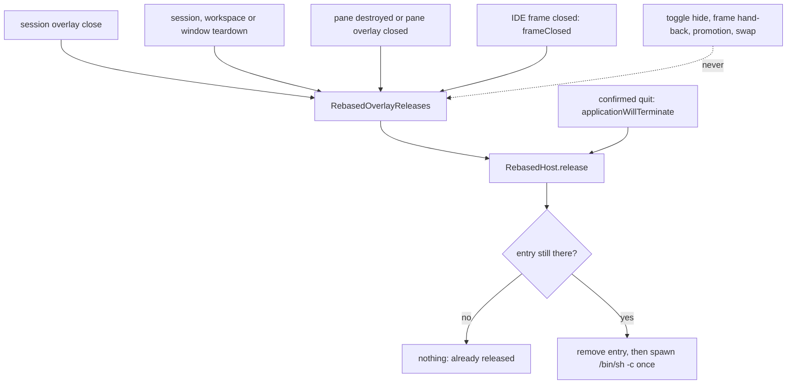

# Plan: the agterm-vim part of the IntelliJ live review

Implements the agterm-vim half of [the spec](20261008-ide-live-review-spec.md): its section
"agterm-vim: the overlay", the agterm-vim rows of "New fields, events and their consumers", "Control API
coverage" and "Tests by behavior", and the first item of "Delivery: three plans". Read the spec first.
This plan does not repeat its reasoning. The claude-remarks plan
(`/Users/sasha/dev/claude-remarks/docs/plans/20261008-publish-hook.md`) and the agterm-agents plan depend on
the flags this plan adds.

## Contents

1. [What is true today](#what-is-true-today)
2. [Spec drift](#spec-drift)
3. [Decisions](#decisions)
4. [Design](#design)
5. [Accepted limits](#accepted-limits)
6. [Review notes](#review-notes)
7. [Open questions](#open-questions)
8. [Conventions](#conventions)
9. [Tasks](#tasks)
10. [New fields and their consumers](#new-fields-and-their-consumers)

## What is true today

Read on `main` at `76677df5`, after `--diff RANGE` (`ff7c2338`) and remote rows (`fc302ed1`, `f9737fae`).

- A session holds at most one Rebased overlay, in the session-wide slot only: `Session.rebasedOverlay`,
  opened by `AppStore.openRebasedOverlay` (`RebasedOverlay.swift`). `--pane` is in the `--rebased` conflict
  list of `ControlDispatcher.overlayContent` and of `validateRebased` in the CLI.
  `RebasedOverlayOpenFailure` has three cases (`unknownSession`, `alreadyOpen`, `presenter`) and no pane form.
- Pane slots already hold a second kind of occupant besides a program: an HTML page, `PaneOverlay.html`.
  `AppStore.openHtmlOverlay` has a pane branch (`agtermCore/Sources/agtermCore/AppStore+HtmlOverlay.swift:40`),
  and `Session.updateHtmlOverlay` finds a page by id in the session slot or either pane slot. This is the
  prior art the pane Rebased overlay copies.
- `RebasedHost` keys its entries by overlay id, but visibility (`visible`, `visibleSlots`), the frame rect
  (`slots`, keyed by `NSWindow`) and state writes (`setState(_:session:)`, which writes
  `session.rebasedOverlay`) are keyed by session or window. `mirrored` rebuilds the value with
  `RebasedOverlay(project:diff:source:id:)`, because `project` and `source` are `let`s.
- `RebasedHost.openOverlay` returns `String?` (the refusal), and `AppActions.toggleRebasedOverlay` returns
  `Void` and beeps on a refusal.
- `AppActions.confirmCloseSession` shows no dialog unless `settings.confirmCloseSession == true`, and that
  setting defaults to nil. ⌘W on a session therefore closes it with no question by default.
- `AppActions.focusSplitPane` (⌃1, ⌥⌘←, `session.focus left`) asks `focusTarget`; over a page it lets the page
  take focus. Nothing asks the host to make an IDE window key.
- `RebasedOverlayReleases.onRelease` (public, `(UUID) -> Void`) passes the overlay id to
  `RebasedHost.release`, which removes the entry once. The release fires from `AppStore.closeOverlay` and
  `Session.teardownOverlaySlot`. Neither pane path fires it, because no pane holds Rebased yet.
- `AppActions.toggleRebasedOverlay` closes the overlay (`store.closeOverlay`). `RebasedSlotNSView.sync`
  reports the slot visible on every layout, and `RebasedHost.setSlotVisible(true)` calls `show(session:)`,
  which adopts the frame again. A hide that lives only in the host would be undone by the next layout.
- Views: the bridge has one view verb, `diff <base>\t<head>\t<0|1>\t<dir>`. `RangeDiff.show` runs git on a
  pooled thread and shows `VcsDiffUtil.showChangesDialog`, or a modal error dialog. No event comes back.
  An empty range shows a dialog titled `(no changes)`. The host sends `diff` only while the frame is shown
  in the asking session (`RebasedHost.sendDiff`), and keeps one pending range per overlay (`pendingDiffs`).
- A `--diff` for the project the session already shows goes to that overlay (`RebasedHost.openOverlay`,
  the `deliver` branch). On a remote row, `openRemote` refreshes the mirror first and then delivers.
- No path replaces a Rebased occupant. `AppStore.openOverlay` and `openHtmlOverlay` close only a HUD and
  refuse every other occupant; `openRebasedOverlay` does the same.
- `ControlServer.swift` has an exhaustive `switch request.cmd` in its dispatcher fallback (the
  `control dispatcher did not handle` arm). A new `Command` case fails the app build until it gets a row.
- The prior art for running a detached shell command is `CustomCommandRunner.spawn`
  (`agterm/Commands/CustomCommandRunner.swift`): `/bin/sh -c`, the app environment merged with the
  session's `CommandContext.environment()`, `PATH` widened by `CommandPath.widened`, stdio on
  `FileHandle.nullDevice`. Found with `jbcontext search -p agterm`. The session context it exports comes from
  `CustomCommandRunner.context(for:in:selectionSurface:…)`, which is `private`.
- The prior art for a fork-only command family is `session.bookmark`: its own dispatcher file
  (`agtermCore/Sources/agtermCore/ControlDispatcher+Bookmark.swift:10`), its own CLI file
  (`agtermCore/Sources/agtermctlKit/BookmarkCommands.swift`), a refusal in `HeadlessActions`, and a class in
  `ForwardPolicy.kind`. The `ControlActions` protocol is in `agtermCore/Sources/agtermCore/ControlDispatcher.swift`.
- `RebasedHost.swift` is 593 lines in one type. The type limit is 800.

## Spec drift

Where the code moved on since the spec was written, and what this plan does about it.

- **`--rebased` is forwarded, not refused, on a headless origin.** `ForwardPolicy.route` now answers
  `.forwarded` for `session.overlay.open --rebased`: the Mac presenting the row opens a mirror. The spec says
  "`ForwardPolicy` refuses `session.rebased.show` like `--rebased`" (spec line 366). This plan classifies
  `session.rebased.show` and `session.rebased.toggle` as `.forwarded`, the same way `--rebased` is routed
  today. It adds one refusal the spec did not need before: a forwarded open carrying `--on-close` is refused,
  because otherwise the origin makes the Mac run a shell command the origin chose.
- **Remote rows exist.** `RebasedOverlay.State.fetching`, `RebasedOverlay.source`, `openRemote` and
  `mirrored` are new. A mirror is a detached clone of the host's commits: it has no host working copy, and
  `--file` or `--project` would name host paths. The spec is silent; see [Decisions](#decisions).
- **The read-back has two fields the spec does not list.** `ControlRebasedOverlayNode` carries `diff` (the
  last range asked for) and `source` (`host:path`). Both stay. `view` becomes the field that says whether a
  view opened; `diff` keeps its documented meaning.
- **`openFile` changes its field order.** The spec's `openFile <request>\t<dir>\t<path>\t<line>` (spec
  line 154) has two fields that may hold a tab, which breaks the bridge's one parsing rule: the field that may
  hold a tab is last. The verb becomes `openFile <request>\t<line>\t<path>\t<dir>`, and the dispatcher and the
  CLI refuse a `--file` path holding a tab or a newline.
- **"Slot replacement" is not reachable today** (spec line 172). No open replaces a Rebased occupant (see
  above). The release paths that do exist are `AppStore.closeOverlay`, `Session.teardownOverlaySlot` (session
  close, workspace close, pending-close finalize, window teardown), `AppStore.closePaneOverlay`,
  `Session.teardownPaneOverlay` (pane destruction), `frameClosed`, and quit. The tests cover those. If a
  replacing path is added later, it goes through `closeOverlay` and fires the release.
- **The spec's consumer count for "overlay location" is 11.** The code has 30 read sites, mostly the
  predicates that ask "does this pane overlay have a terminal surface" (`paneOverlayIsHtml`) or "does this
  pane have a cover" (`paneOverlay(pane) != nil`). The list, with a decision per site, is in
  [New fields and their consumers](#new-fields-and-their-consumers).
- **Fork-only commands in the bundled skill.** `overlay-redirect.md` ("Left out on purpose") keeps fork-only
  commands out of `plugins/agterm/skills/agterm/`. The Rebased overlay already broke that rule on purpose:
  `SKILL.md` and `reference.md` document `--rebased`, marked "fork only". This plan follows the Rebased
  precedent and the spec, and adds `session rebased show` and `session rebased toggle` marked the same way.
- **The spec has no control twin for hide.** `CLAUDE.md` makes a new user action incomplete without one.
  Sasha decided to add `session rebased toggle`; see [Decisions](#decisions).

## Decisions

Settled with Sasha on 2026-10-08 after the first plan review.

- **A view on a hidden overlay does not show it.** The view waits as `view.state: queued`, with no deadline.
  The next toggle shows the IDE at that view. This holds for `session rebased show` and for the same-project
  reuse of an open.
- **On a remote row, `--working-tree`, `--file`, `--project` and `--on-close` are refused** with
  `--<flag> works on a local row only`, on `session overlay open` and on `session rebased show` alike.
  `--diff` and `--pane` keep working, and `show --diff` refreshes the mirror before it sends the range.
- **`--on-close` runs in an environment the app builds**, as `CustomCommandRunner.spawn` does. The caller
  passes an absolute path. The caller's environment is never sent over the socket.
- **Hide has a control twin.** `agtermctl session rebased toggle` does what the chord does, and the read-back
  reports `hidden: true|false` while an overlay is held.
- **A git error in a pane overlay shows no modal dialog.** The view reports `viewFailed`, and the read-back
  shows `view.state: failed` with the error text in `view.detail`. A session-wide overlay keeps the error
  dialog as well as the event.
- **A HUD over a pane IDE leaves the IDE shown.** See [Accepted limits](#accepted-limits).
- **Focusing a pane IDE makes it key.** When the pane holding a shown IDE becomes the focused pane (⌃1,
  `session focus left`, an open over the focused pane), the IDE window becomes key through
  `RebasedHost.focus(overlay:)`. `splitFocused` and the real keyboard target then agree.
- **⌘W always confirms while a session holds a Rebased overlay.** Shown or hidden, pane or session-wide slot:
  ⌘W on that session shows a confirmation dialog that names the review, whatever
  `settings.confirmCloseSession` says. Cancelling always leaves everything as it was. What Confirm closes
  depends on what ⌘W reaches:
  - a shown session-wide overlay with the agterm window key: Confirm closes only the IDE overlay (today's
    `store.closeOverlay` rung), so the review ends and `--on-close` runs at once. The session and its chat
    stay;
  - every other case (a pane IDE shown or hidden, a hidden session-wide overlay): Confirm closes the session
    as today, and `--on-close` runs at finalize.
- **A pane overlay shows a diff as an editor tab, never a dialog.** Task 1 must confirm `tab`. If only the
  fitted dialog works, the work stops and Sasha decides; no task builds dialog fitting.

## Design

### Where a Rebased overlay lives

One session holds at most one Rebased overlay: in the session slot (`Session.rebasedOverlay`, as today) or in
one pane slot (`PaneOverlay.rebased`, new, beside `PaneOverlay.html`).

- The location is derived live, by asking which slot holds the overlay's id, as
  `Session.paneOverlayRole(of:)` does for a surface. `Session.rebasedPlacement` answers
  `(overlay, pane: OverlayPane?)` or nil. Nothing stores the location, so `promotePaneOverlay` and
  `AppStore.swapPanes`, which move the whole `PaneOverlay`, move the value with no Rebased code. The host's
  visibility still has to survive the move; see [Visibility](#visibility).
- `Session.updateRebasedOverlay(_ id:, _ change:)` writes the value wherever it is, copied from
  `updateHtmlOverlay`. The host's `setState` goes through it, keyed by overlay id, never by session.
  `RebasedOverlay.project` and `RebasedOverlay.source` become `var`s, so `mirrored` changes `project`,
  `source` and `state` in place and keeps `view`, `hidden` and `onClose`.
- `RebasedHost.openOverlay` grows across the tasks into
  `openOverlay(in:session:cwd:project:pane:sizePercent:view:onClose:) -> Result<RebasedOpened, RebasedOpenRefusal>`,
  where `RebasedOpened` carries the overlay id and the request id (nil without a view): `pane:`, `project:`,
  the result type and the reuse rule in Task 9, `view:` in Task 12, `onClose:` in Task 13.
- `AppStore.openRebasedOverlay` gains `pane: OverlayPane? = nil`. Both branches refuse when the session holds
  a Rebased overlay anywhere. The pane branch follows `openHtmlOverlay`'s pane branch: `.alreadyOpen` for an
  occupied pane, and a new `.paneNotVisible` for a pane the deck does not lay out. `RebasedOverlayOpenFailure`
  gains `message(pane:)`, as `HtmlOverlayOpenFailure` has.
- `AppStore.closeRebasedOverlay(_ sessionID:, id:)` closes it wherever it is, and only if that slot still holds
  `id`. `frameClosed` and `session overlay close --overlay <id>` use it. Quit does not close anything; it
  calls `releaseAllBeforeQuit` (see [On close](#on-close)).
- A pane Rebased overlay has no terminal surface. One predicate, `Session.paneOverlayIsProgram(_:)` (a program
  occupant: neither a page nor Rebased), replaces `!paneOverlayIsHtml(pane)` wherever the question is "is there
  a terminal surface here". Without it `dropUnrealizedPaneOverlays` tears the IDE down on the first layout
  change, and `paneOverlayPanel`'s last branch builds an overlay terminal under it.

Rejected: a computed `Session.rebasedOverlay` that reads and writes both places. Every existing caller would
keep compiling, but `closeOverlay` and `teardownOverlaySlot`, which mean the session slot, would then clear a
pane occupant. The explicit placement accessor costs more edits and keeps "session slot" meaning one thing.

### Hide

`RebasedOverlay.hidden` is model state, because the slot view re-shows the frame on every layout.

- While hidden the slot stays held: an open of another occupant is refused, and the read-back reports the
  overlay with `hidden: true`.
- While hidden the overlay covers nothing, in either slot:
  - session slot: `rebasedOverlayActive` (and so `coverOverlayActive` and every cover site that follows it)
    and `fullOverlayActive` exclude a hidden overlay;
  - pane slot: a new `Session.paneOverlayCovers(_:)` excludes a hidden occupant. It replaces the raw
    `paneOverlay(pane) != nil` in `deckPane`'s `covered` (which also drives `PaneOverlayCover` and
    `PaneLeadCover`), `focusedOverlayPane` and `focusTarget`. `TerminalZoom` and `dashboardCover(for:)`
    treat a hidden pane holder as no overlay.
- While hidden the deck renders only the `RebasedSlotView` reporter, with `visible` false, so the host hides
  the frame through the existing `hide` verb. No message, no backdrop wash, no framed background, border or
  shadow: `OverlayPanelStyle` resolves chromeless, `RebasedSlot.message` returns nil, and neither the
  session panel's click catcher nor the pane panel is hit-testable. The deck's branch tests "held", never
  "active": with "active" a hidden overlay falls into the `TerminalView` branch and builds an overlay terminal.
- The ⌘W ladder (`AppActions.closeActiveSession`) skips a hidden session-wide overlay and every Rebased pane
  occupant, shown or hidden, and goes to the session close. While the session holds a Rebased overlay
  anywhere, that close always asks first ([Decisions](#decisions)): `confirmCloseSession` gains a Rebased
  branch that ignores `settings.confirmCloseSession`, names the review in its message ("Close “<session>”
  and end the Rebased review of <project>?"), and still honours `ContentView.shouldBypassCloseConfirmation`
  for XCUITest launches. The dialog goes through an injectable `closeConfirmer` seam on `AppActions`, so a
  hosted test sees the request without a modal. A shown session-wide overlay stops at the
  `session.overlayActive` rung, which also asks first, through the same `closeConfirmer` with a message that
  names the review ("End the Rebased review of <project>?"). Confirm runs today's `store.closeOverlay`: the IDE
  closes, `--on-close` runs at once, and the session and its chat stay. Cancel changes nothing. With the IDE
  window key, ⌘W never reaches this ladder: `RebasedMenuPolicy` sends it to the IDE.
- A pane hide refocuses the pane's terminal, as a session-wide hide does through `.onChange(of:
  coverOverlayActive)`. `.onChange(of: openPaneOverlays)` does not fire on a hide, so the toggle refocuses.
- `toggleRebasedOverlay`: a held overlay flips `hidden`; with none, it opens a session-wide one as today.
  It returns a discardable `RebasedToggleOutcome` (`hidden`, `shown`, `opened`, `refused(String)`); the chord
  beeps on `refused`. The palette row, `rebased_toggle` and `session rebased toggle` share this method.
- The toggle calls the host directly as well as setting the model: `RebasedHost.hide(overlay:)` on hide, and
  `RebasedHost.show(overlay:)` on show, which shows only while a reporter says the slot is visible. Hosted
  tests can therefore observe the bridge's `hide` and `show`. The slot view's later report is idempotent.
- The deck's rules live in static predicates, so hosted tests can test them without SwiftUI:
  `RebasedSlot.isVisible` (both slots' visibility terms), `RebasedSlot.message(for:shownElsewhere:)`, and the
  two hit-test gates (the session panel's and `paneOverlayPanel`'s).

### Visibility

- The slot view reports with a reporter token. The host counts an overlay visible while any of its reporters
  says so. A swap or a promotion mounts a new `RebasedSlotNSView` and dismantles the old one in an order
  SwiftUI does not promise; with one flag per session, a late "hidden" from the old view would hide the frame
  for good.
- The frame rect is keyed by overlay id: `RebasedSlotNSView` reports its rect with its overlay id, and
  `RebasedFrameKeeper.slotRect` asks for the current holder of a frame. Resize, split ratio and window moves
  all arrive as a new layout report.
- A pane holder's slot is visible only while `gates.visible`, `!gates.overlaid` (`DeckPaneGates.overlaid`:
  `coverOverlayActive || scratchActive`, so a program, a page or the scratch, never a HUD), no
  `rebasedCovered` term holds (palette, pick, dashboard, zoom), and no session-wide ask or ask on that pane is
  pending. A floating lazygit opened by a chord over a pane IDE therefore hides the IDE, and so does ⌘J's
  scratch, which the deck draws above pane overlays; closing either shows the IDE again. A HUD does not hide
  it ([Accepted limits](#accepted-limits)).
- "Rebased is shown in another session" appears only while another holder has the frame
  (`RebasedHost.isShownElsewhere(overlay:)`, true when `visible[project]` names a different overlay). When a
  local term hides the frame, the slot shows nothing.
- Focus: `AppActions.focusSplitPane` asks `RebasedHost.focus(overlay:)` when the target pane holds a shown
  IDE, instead of retrying `focusTarget`, which is nil there. `RebasedFrames` gains `makeKey(_ frame:)`.
- An open over the focused pane makes the IDE key once: the host marks the overlay at open, and on its FIRST
  show it calls `RebasedHost.focus(overlay:)` only if the holder's pane is still the focused pane of the
  selected session in the key window. The mark clears at that first show either way. `show` never calls
  `focus` otherwise, so closing a palette or switching back never pulls the keyboard into the IDE.
- That question goes through a seam, `RebasedHost.isFocusedPane: (UUID, OverlayPane) -> Bool`, set in
  `RebasedHost.configure`: true when the session id is `library.activeStore`'s `selectedSessionID` and that
  session's `focusedPane` is the pane. The host never reads `NSApp.keyWindow` for it. The hosted test wires the
  closure to its own `library` in `setUp`, as `host.store` is wired in `ControlServerRebasedOverlayTests.setUp`.

### Views

A view is a diff or a file. Core owns the value and its life; the host owns the timer and the bridge.

- `RebasedView` (core): `.diff(RebasedDiff, workingTree: Bool)` or `.file(path: String, line: Int)`.
  `RebasedFileTarget(spec:)` parses `path[:line]`: the last `:` followed by digits only is the line, line ≥ 1,
  0 meaning none. A path holding a tab or a newline is refused.
- `--working-tree` needs `--diff`, and the range's head must be the default: `A..` or `A...B`. In `A...B` the
  head only picks the merge base. `A..B --working-tree` is refused, because `B` would be silently unused.
- `RebasedViewRequest` (core): `id`, `kind` (`diff`, `working-tree`, `file`), `target` (the range spec or the
  path), `state` (`queued`, `sent`, `opened`, `failed`), `detail`. Pure transitions: `issue` mints a new id
  and clears the old result; `sent`; `apply(event:request:)` accepts only the current id; `timedOut(request:)`
  fails only a current `sent` request. It is stored on `RebasedOverlay.view`. This keeps the ledger testable
  in core and out of the 593-line host type.
- The host sends a queued view only while the frame is shown in its own slot (the `sendDiff` rule today) and
  arms a 60 s deadline at the send. A hidden overlay keeps its view queued, with no deadline.
- Bridge verbs (the field that may hold a tab is always last):
  - `diff <request>\t<base>\t<head>\t<0|1 merge base>\t<0|1 working tree>\t<session|pane>\t<dir>`. With
    working tree: `GitChangeUtils.getDiffWithWorkingDir` from the base, or from the merge base for `A...B`.
    An empty result shows nothing and emits `viewOpened <request>\t0`. `session` shows the changes dialog;
    `pane` shows the changes as an editor tab inside the frame, and a git error there shows no dialog.
  - `openFile <request>\t<line>\t<path>\t<dir>`: the file in an editor, caret on the line.
  - `port`: the IDE's built-in server port once it has started, empty before.
- Events: `viewOpened <request>\t<detail>` (the changed-file count, or the path) once the viewer is installed;
  `viewFailed <request>\t<reason>` for a git error, a missing file, or no open project.
- `rebased.port` on the tree: after each `frameOpened` without a known port, the host asks `port` off the
  main actor at 0.5 s, then doubling to at most 4 s, and stops 30 s after that `frameOpened`. The next
  `frameOpened` starts it again.

### On close

- `--on-close <command>` is captured at open as `RebasedOnClose` (core): the command, the cwd (the open's
  `--cwd`, else the session's local working directory), and the environment. The environment is built on
  the Mac: the app's environment, the session's `CommandContext.environment()`, `AGTERM_SOCKET`, and `PATH`
  widened by `CommandPath.widened`, as `CustomCommandRunner.spawn` builds it.
- It is stored on `RebasedOverlay.onClose` (the read-back says `onClose: true`) and copied into the host's
  `Entry` at `RebasedHost.open`. `RebasedOverlayReleases.onRelease` keeps its public `UUID` signature.
- `RebasedHost.release` is the release-once operation: `entries.removeValue` succeeds once, and only then is
  the command started. `RebasedOnCloseRunner` (app) starts it detached, stdio on `nullDevice`, and logs a spawn
  failure. The host calls it through a seam so hosted tests record calls instead of running a shell.
- The environment comes through a seam set in `RebasedHost.configure`, filled by a new internal
  `CustomCommandRunner.environment(for:in:)` that wraps the private `context(for:in:…)` with no selection.
- TCC: `RebasedOnCloseRunner` spawns exactly as `CustomCommandRunner.spawn` does, a child of the app process,
  so its attribution is the same and no service sees a new subject.
- Quit: `RebasedHost.releaseAllBeforeQuit()` in `applicationWillTerminate`, beside and outside
  `saveBeforeQuit`'s `jvm == .running` guard, releases every entry: starting and failed ones too. A cancelled
  quit never reaches `applicationWillTerminate`.
- A soft-closed session releases at finalize, not at the soft close, so undo brings the overlay back with its
  callback still armed. A quit finalizes pending closes, and the entry guard keeps the two paths from running
  the command twice.
- An open carrying `--on-close` needs a fresh holder. `RebasedHost.openOverlay` refuses it before the
  same-project reuse branch and before `openRemote`, so a refused open changes nothing about the existing
  holder. Error: `a Rebased overlay is already open in this session; --on-close needs a new one`.

### Control surface

- `session overlay open --rebased` gains `--pane left|right`, `--working-tree`, `--file <path>[:<line>]`
  (excludes `--diff`), `--project <dir>` (no `.git` walk), and `--on-close <command>`. Each of the five without
  `--rebased` is refused, like `--diff` today. `--pane` with `--size-percent` stays refused.
- `--project` picks the IDE project. Beside it, `--cwd` keeps only its `--on-close` working-directory role.
  A relative `--file` or `--project` is made absolute by the CLI against the caller's directory, as `--html`
  is, never against `--cwd`.
- The same-project reuse stays for opens without `--on-close`, and now covers `--file` too. It applies only
  when the open names no `--pane` or the holder's own pane; otherwise the open is refused
  `overlay already open`.
- A successful open answers `{id, overlay, request}` (`ControlResult.overlay`, `ControlResult.request`, both
  optional). `request` is absent when the open asked for no view.
- `session overlay close --overlay <id>` closes the Rebased overlay with that id, wherever it is, and refuses
  when no slot of the session holds it. `--overlay` with `--pane` is refused. This is the `pageID` / `--page`
  pair of HTML pages, applied to close.
- New command `session.rebased.show` (`agtermctl session rebased show (--diff RANGE [--working-tree] |
  --file <path>[:<line>])`) for the session's held overlay. It answers `{id, overlay, request}` and refuses
  with `no Rebased overlay in this session`.
- New command `session.rebased.toggle` (`agtermctl session rebased toggle`): the chord's action for the
  addressed session. It answers `{id, overlay}` and `text` `hidden`, `shown` or `opened`; a refusal over a
  program or a page is the chord's beep in words, `overlay already open`.
- Read-back: `rebasedOverlay: {project, state, error?, diff?, source?, pane?, hidden, view?: {request, kind,
  target, state, detail?}, onClose?}`, present while the overlay is held, hidden included. `hidden` is always
  present on the node, `true` or `false`; on the wire it is `Bool?`, always set by the producer, so a newer
  `agtermctl` still decodes an older app's tree (the `ControlSessionNode.realized` precedent). Top level:
  `rebased: {jvm, error?, projects, port?}`.
- Headless: `ForwardPolicy.kind` answers `.forwarded` for both new commands. `ForwardPolicy.route` refuses
  `session.overlay.open --rebased --on-close`, and forwards `session.overlay.close --overlay` ahead of the
  `holdsJob` arm, so an origin holding its own job never closes that job in place of the Mac's IDE.
  `HeadlessActions` gets the new `ControlActions` methods through defaults in `ControlActionsDefaults` that
  refuse.
- No control events. `viewOpened` and `viewFailed` are bridge events, and `hidden` is poll-only like the rest
  of the overlay state, so `EventFormatter.human` has nothing new to print.
- `site/commands.html` stays untouched: fork-only commands stay off the upstream site.

### Public library rules

`agtermCore` is consumed by `agterm-linux`. Every new public field is optional or defaulted, every new
initializer parameter has a default and goes last, and no existing public initializer loses a parameter.
`ControlSessionOverlayOpenOptions.rebasedDiff` stays; the new fields sit beside it. New `Codable` wire fields
are optional, so an older peer still decodes. Two additions are not purely additive and are named here:
`RebasedOverlayOpenFailure.paneNotVisible` (a downstream exhaustive switch over the public enum stops
compiling) and the two new `Command` cases (the same, which `ForwardPolicy.kind` relies on).

## Accepted limits

- **A HUD over a pane IDE is hidden under it.** Sasha has the IDE on the left pane and a status toast opens as
  a session-wide HUD. The IDE window is a child window above agterm's content, so the HUD's left half sits
  under the IDE until the IDE is hidden or the HUD closes. Hiding the IDE for each HUD instead would blank it
  for every toast. Recorded in `rebased-overlay.md` (Task 15).
- **The search bar can sit under a right-pane IDE.** `searchBarLayer` is drawn top-trailing over the whole
  detail pane. With the IDE on the right pane, ⌘F in the left terminal opens its bar under the IDE window.
  The live review puts the IDE on the left, where this cannot happen. Recorded in `rebased-overlay.md`.
- **Ctrl-1 and Ctrl-2 reach the IDE while it is key.** `PaneShortcuts` returns early on `isIDEKeyWindow`, so
  from a pane IDE they do not move focus to the chat pane; a click does. The other direction works: ⌃1 from
  the right pane makes the IDE key ([Decisions](#decisions)). Task 11 audits this and records the result;
  changing it is out of scope unless the audit finds a cheap safe change.

## Review notes

- Round 2, "skill description at its cap": fixed by keeping the new commands out of the `description` and in
  the body only. The trigger rule in `CLAUDE.md` is for capabilities agents should find unprompted; these two
  commands are named by the live-review skill that drives them.

## Open questions

- Which of the upstream files this plan hooks into join `flagged` in `fork-merge.md`'s frontmatter. Task 15
  asks Sasha at landing time, as `release.md` requires.

## Conventions

- Work happens on the `pair/<slug>` branches `pair start` creates from `main`. Nothing merges to `main` before
  Task 17 passes, and nothing is deployed: deploying and restarting agterm are Sasha's actions.
- A pair worktree links the six build artifacts from the main checkout as `CLAUDE.md`'s worktree section says,
  and only while each stamp matches.
- Test first in every task: write the failing tests, then the code. Run only the task's own check. The full
  gates run once, in Task 17.
- Every check runs from the repo root; core checks `cd agtermCore` themselves. A check for a new test first
  proves it exists (`grep -q` on a name that does not exist today), because `swift test --filter` and
  `-only-testing:` both pass when nothing matches.
- ⚠️ Every `xcodebuild` run takes the shared lock: `/usr/bin/lockf /tmp/agterm-vim-xcode.lock
  scripts/test-app.sh …`. Hosted runs from two worktrees bind the same control socket.
- A task that edits an app-target file, or adds a `Command` case, runs at least one hosted class, so the app
  build is checked.
- ⚠️ The mate never launches or quits any agterm and never runs `agterm` or `agtermctl`. Only the lead, in Tasks
  1 and 16, launches a separate Debug instance with a short `/tmp` `AGTERM_STATE_DIR`, addresses it only with
  `--socket`, and stops it by PID. Nothing touches the default socket or the deployed app.
- `RebasedHost` stays under the 800-line type limit. New host code goes in `RebasedHost+Views.swift` and
  `RebasedHost+Release.swift` extensions; members they need move from `private` to internal.
- The verification file `docs/plans/20261008-ide-live-review-verification.md` holds one line per check:
  `- [x] <name>: pass — <what was seen>` or `- [ ] <name>: fail — <what was seen>`.
- Hosted tests that need Rebased skip with a message when `/Applications/Rebased.app` is absent.

## Tasks

### Task 1: probe where a pane overlay's diff windows open

owner: lead

Size: M. Driven by one Debug build with a throwaway patch, two candidates, and checks by eye.

- Files: an uncommitted patch in a scratch worktree; `docs/plans/20261008-ide-live-review-verification.md`
  (new, committed).
- [ ] Patch: make `RebasedFrameKeeper` fit the frame to the left half of the slot rect, which stands in for
  a left pane overlay with the right half visible. Add a throwaway bridge verb per candidate:
  - `dialog`: today's `VcsDiffUtil.showChangesDialog`, with the host fitting every dialog of that project to
    the left half;
  - `tab`: the same changes as an editor tab inside the frame (a diff chain opened through the diff editor-tab
    manager of build `262.10968`; the probe finds the call that exists).
- [ ] Launch the isolated instance as `CLAUDE.md` says (short `/tmp` `AGTERM_STATE_DIR`,
  `mkdir -p "$AGTERM_STATE_DIR/windows"`). On a scratch repository holding an added, a modified, a deleted
  and a renamed file, open each candidate, then open a real file diff from the list (double click). Every
  resulting window stays inside the left half, and the right half stays visible and clickable. A git error
  needs no probe: a pane overlay shows no error dialog ([Decisions](#decisions)).
- [ ] With a file diff open, send the bridge `hide`, then `show`: every IDE window, the changes dialog and
  detached diff frames included, goes and comes back.
- [ ] Record `probe-dialog`, `probe-tab` and `probe-hide`, pass or fail, then `- [x] probe-choice: pass — tab`.
  The plan builds only `tab` for panes ([Decisions](#decisions)). If `tab` fails, whatever `dialog` does, stop
  and ask Sasha: the pane design changes. `probe-dialog` is kept as a record of the rejected option.
- [ ] Stop the instance by PID; `lsappinfo list | grep -A4 agterm.debug` shows nothing left.

Check: `test "$(grep -c '^- \[[ x]\] probe-\(dialog\|tab\|hide\):' docs/plans/20261008-ide-live-review-verification.md)" -ge 3 && grep -q '^- \[x\] probe-tab: pass' docs/plans/20261008-ide-live-review-verification.md && grep -q '^- \[x\] probe-choice: pass — tab' docs/plans/20261008-ide-live-review-verification.md`

### Task 2: a Rebased overlay in a pane slot

Size: M. Driven by 30 read sites, the core half of them with tests here.

- Files: `agtermCore/Sources/agtermCore/{RebasedOverlay,Session,Session+HtmlOverlay,AppStore+Panes,AppStore+RemoteOverlay,TerminalZoom,DashboardCover}.swift`;
  tests `HtmlOverlayTests`, `AppStorePaneTests`, `AppStorePaneSwapTests`, `TerminalZoomTests`,
  `DashboardCoverTests`.
- [x] Tests first:
  - `openRebasedOverlay(pane: .left)` puts the overlay in `leftOverlay.rebased`; `rebasedPlacement` answers
    `.left`; a second open anywhere in the session is refused, session slot or other pane; an occupied pane
    answers `.alreadyOpen` with the pane wording; a pane the deck does not lay out answers `.paneNotVisible`.
  - `coverOverlayActive` and `rebasedOverlayActive` stay false for a pane holder; `focusedOverlayPane` names
    the pane; `topmostSurface` and `focusTarget` return nil for that pane, as for a page.
  - `dropUnrealizedPaneOverlays` leaves a pane Rebased overlay alone when its pane stops being laid out.
  - `promotePaneOverlay` and `swapPanes` move it with the same id, and fire no release.
  - `closePaneOverlay` and `teardownPaneOverlay` fire `RebasedOverlayReleases` once with its id;
    `closeRebasedOverlay(session, id:)` closes it in either slot and refuses a stale id.
  - `TerminalZoom` offers no `overlay-left` target over it; `dashboardCover(for: .left)` answers `.rebased`.
  - `updateRebasedOverlay(id:)` changes the value in whichever slot holds it, `project` included.
- [x] Add `PaneOverlay.rebased` with `init(rebased:)`, `Session.rebasedPlacement`,
  `Session.updateRebasedOverlay`, `Session.paneOverlayIsProgram`, `AppStore.closeRebasedOverlay`, the `pane`
  parameter of `openRebasedOverlay`, `RebasedOverlayOpenFailure.paneNotVisible` and `message(pane:)`.
  `RebasedOverlay.project` and `RebasedOverlay.source` become `var`s.
- [x] Walk every site of
  `grep -rn 'paneOverlayIsHtml\|paneOverlay(.*) [!=]= nil\|leftOverlay [!=]= nil\|rightOverlay [!=]= nil\|focusedOverlayPane\|openPaneOverlays\|rebasedOverlay\b' agterm agtermCore/Sources`
  and apply the decision in row 1 of [New fields and their consumers](#new-fields-and-their-consumers) for
  every core site. Core sites get a test. App sites are built by the task named in row 1's "Task" column;
  this task changes no app file.

Check: `grep -q 'rebasedPlacement' agtermCore/Tests/agtermCoreTests/AppStorePaneTests.swift && cd agtermCore && swift test --filter 'HtmlOverlayTests|AppStorePaneTests|AppStorePaneSwapTests|TerminalZoomTests|DashboardCoverTests'`

### Task 3: views, view requests and the on-close value in core

Size: M. Driven by the parsers and the request ledger's transitions.

- Files: `agtermCore/Sources/agtermCore/RebasedOverlay.swift`, new `agtermCore/Sources/agtermCore/RebasedView.swift`;
  tests `RebasedDiffTests`, new `RebasedViewTests`.
- [x] Tests first:
  - `RebasedFileTarget(spec:)`: `a/b.kt` (line 0), `a/b.kt:42`, `a:b.kt:7` (path `a:b.kt`), `a/b.kt:` and
    `a/b.kt:0` refused, a tab or a newline refused.
  - `RebasedView.diff` with `workingTree`: `A..` and `A...B` accepted, `A..B` refused.
  - Bridge arguments: `diff` and `openFile` in the field order of the Design section, the directory last,
    for both holders.
  - `RebasedViewRequest`: `issue` gives a new id and clears `detail`; `apply(viewOpened)` for the current id
    sets `opened` and the detail; `apply(viewFailed)` sets `failed` with the reason as `detail`; an event for
    an earlier id changes nothing; `timedOut` fails only a current `sent` request; a `queued` request never
    times out.
- [x] Add `RebasedFileTarget`, `RebasedView`, `RebasedViewRequest`, `RebasedOverlay.view`, and the value types
  `RebasedOnClose` (command, cwd, environment) and `RebasedOverlay.onClose`, so every core field exists before
  Tasks 4 and 7. Extend `RebasedDiff.bridgeArgument` without changing what an existing caller gets until
  Task 12 moves it.

Check: `grep -rq 'RebasedViewTests' agtermCore/Tests && cd agtermCore && swift test --filter 'RebasedViewTests|RebasedDiffTests'`

### Task 4: the hidden state in the model

depends: 2, 3

Size: M. Driven by the cover predicates of both slots and a hidden-pane test for each.

- Files: `agtermCore/Sources/agtermCore/{RebasedOverlay,Session,Session+HtmlOverlay,TerminalZoom,DashboardCover,AppStore+RemoteOverlay}.swift`;
  tests `HtmlOverlayTests`, `AppStorePaneTests`, `TerminalZoomTests`, `DashboardCoverTests`,
  `AppStoreRemoteOverlayTests`.
- [x] Tests first:
  - `AppStore.setRebasedHidden(session, id:, true)` keeps the overlay, its id, `view` and `onClose`;
    `overlayActive` stays true; opening a program, a page or a second Rebased overlay is still refused.
  - Hidden session-wide holder: `rebasedOverlayActive`, `coverOverlayActive` and `fullOverlayActive` are
    false; `programOverlayActive` stays false; `topmostSurface` and `focusTarget` return the terminal.
  - Hidden left-pane holder: `paneOverlayCovers(.left)` is false; `focusedOverlayPane` is nil;
    `focusTarget(wantSplit: false)` returns the left terminal; `TerminalZoom` `isActive`, `isVisible` and
    `isAvailable` treat `primary` as uncovered and offer no `overlay-left`, so the `?? .primary` fallback is
    never reached; `dashboardCover(for: .left)` is nil.
  - A hidden session-wide holder still holds the slot for a remote job: `openRemoteOverlay` answers
    `.slotTaken`.
  - Showing again restores every predicate. Hide, show and close fire the release once, at the close.
- [x] Add `RebasedOverlay.hidden`, `AppStore.setRebasedHidden`, `Session.paneOverlayCovers`, and the hidden
  term in `rebasedOverlayActive`, `fullOverlayActive`, `focusedOverlayPane`, `focusTarget`, the `TerminalZoom`
  arms and `dashboardCover(for:)`. `AppStore+RemoteOverlay.localOverlayHolds(nil)` asks "held"
  (`overlayActive && !hudActive`) instead of `coverOverlayActive`.
- [x] Sweep core for any other read of `coverOverlayActive` that means "the slot is occupied" rather than "a
  cover takes input" (`grep -rn coverOverlayActive agtermCore/Sources`), and switch each such read to "held".

Check: `grep -q 'setRebasedHidden' agtermCore/Tests/agtermCoreTests/HtmlOverlayTests.swift && grep -q 'setRebasedHidden' agtermCore/Tests/agtermCoreTests/AppStoreRemoteOverlayTests.swift && cd agtermCore && swift test --filter 'HtmlOverlayTests|AppStorePaneTests|TerminalZoomTests|DashboardCoverTests|AppStoreRemoteOverlayTests'`

### Task 5: the open and close flags

depends: 3

Size: M. Driven by the conflict matrix across CLI, dispatcher and protocol.

- Files: `agtermCore/Sources/agtermCore/{ControlProtocol,ControlDispatcher+Overlay,ControlDispatcherOptions,ControlDispatcher,ControlActionsDefaults}.swift`
  (`ControlActions` is declared in `ControlDispatcher.swift`), `agtermCore/Sources/agtermctlKit/SessionCommands.swift`;
  tests `OverlayCommandsTests`, `ControlProtocolTests`, `ControlDispatcherOverlayTests`, `MockControlActions`.
- [x] Tests first:
  - CLI (`OverlayCommandsTests`): `--rebased --pane left|right` parses; `--working-tree` without `--diff`,
    `--file` with `--diff`, `--pane` with `--size-percent`, and each of `--working-tree`, `--file`,
    `--project`, `--on-close` without `--rebased` are usage errors; a relative `--file` and `--project` become
    absolute against the caller's directory and keep `:line`; `--project` with `--cwd` is accepted and keeps
    both; `close --overlay <id>` parses, and with `--pane` is a usage error.
  - Protocol (`ControlProtocolTests`): the five new `ControlArgs` fields and `ControlResult.overlay` /
    `.request` round-trip; a request JSON without them still decodes.
  - Dispatcher (`ControlDispatcherOverlayTests`): `--pane` leaves the `--rebased` conflict list; every
    Rebased-only flag without `--rebased` answers the same error shape as `--diff` today; a bad `--file`
    answers before any action runs; `--project` and `--cwd` both reach the options; `close --overlay` with a
    non-UUID is refused before the host.
- [x] Add `ControlArgs.workingTree`, `.file`, `.project`, `.onClose`, `.overlay`; `ControlResult.overlay`,
  `.request`; the options fields beside `rebasedDiff`; a shared `parseRebasedView(args)` in the dispatcher;
  the `closeSessionOverlay` overload taking an overlay id, defaulted in `ControlActionsDefaults` to refuse.
  CLI flags and help text in `Overlay.Open` and `Overlay.Close`.

Check: `grep -q 'workingTree' agtermCore/Tests/agtermCoreTests/ControlProtocolTests.swift && grep -q 'working-tree' agtermCore/Tests/agtermctlKitTests/OverlayCommandsTests.swift && cd agtermCore && swift test --filter 'OverlayCommandsTests|ControlProtocolTests|ControlDispatcherOverlayTests'`

### Task 6: `session rebased show` and `session rebased toggle`, and their headless classification

depends: 3, 5

Size: M. Driven by two new commands touching the catalog, CLI, policy, headless kit and the app's fallback
switch.

- Files: `ControlProtocol.swift` (`Command.sessionRebasedShow`, `Command.sessionRebasedToggle`), new
  `agtermCore/Sources/agtermCore/ControlDispatcher+Rebased.swift`, `ControlDispatcher.swift` (one arm and the
  two `ControlActions` requirements), `ControlActionsDefaults.swift`, `ForwardPolicy.swift`, new
  `agtermCore/Sources/agtermctlKit/RebasedCommands.swift`, `SessionCommands.swift` (subcommand list),
  `agterm/Control/ControlServer.swift` (both cases join the dispatcher-handled row of the fallback switch for
  good, beside `.sessionMark` and the `.sessionBookmark*` cases);
  tests new `ControlDispatcherRebasedTests`, `OverlayCommandsTests`, `ForwardPolicyTests`,
  `HeadlessCatalogTests`, `HeadlessActionsTests`, `MockControlActions`.
- [x] Tests first:
  - `ControlDispatcherRebasedTests`: `show` takes exactly one of `--diff` and `--file`; `--working-tree` rules
    as for open; the parsed `RebasedView` reaches `actions.showRebasedView`; `toggle` reaches
    `actions.toggleRebasedOverlay` with the target and window.
  - CLI: `session rebased show --diff HEAD.. --working-tree`, `--file src/a.kt:3`, and `session rebased
    toggle` build their requests; `show` with none or both is a usage error.
  - `ForwardPolicyTests`: both commands are `.forwarded`; `route` refuses `sessionOverlayOpen` with `rebased`
    and `onClose`, ahead of the `--rebased` forwarded branch; `--rebased` without `--on-close` is still
    `.forwarded`; `sessionOverlayClose` with `overlay` is `.forwarded` even with `holdsJob` true.
  - `HeadlessCatalogTests` and `HeadlessActionsTests`: both commands are classified, and the origin's answer
    to a forwarded `--on-close` open is the refusal text.
- [x] Add the commands, their dispatcher file (the bookmark family's shape), `ControlActions.showRebasedView`
  and `ControlActions.toggleRebasedOverlay` with refusing defaults, the CLI file, the `ForwardPolicy` changes,
  and the fallback-switch row in `ControlServer.swift`.

Check: `grep -rq 'ControlDispatcherRebasedTests' agtermCore/Tests && grep -q 'sessionRebasedToggle' agtermCore/Tests/agtermCoreTests/ForwardPolicyTests.swift && (cd agtermCore && swift test --filter 'ControlDispatcherRebasedTests|OverlayCommandsTests|ForwardPolicyTests|HeadlessCatalogTests|HeadlessActionsTests') && /usr/bin/lockf /tmp/agterm-vim-xcode.lock scripts/test-app.sh -only-testing:agtermTests/ControlServerRebasedOverlayTests`

### Task 7: read-back

depends: 2, 3, 4

Size: S. Driven by two node types and their omission tests.

- Files: `agtermCore/Sources/agtermCore/{RebasedProjection,AppStore}.swift`; tests
  `AppStoreTreeProjectionTests`, `ControlProtocolTests`, `RebasedDiffTests`, `RebasedMirrorTests`, and the
  expected node in
  `ControlServerRebasedOverlayTests.testOpenRoutesToTheHostAndShowsInTheTree`.
- [ ] Tests first, in a new `testRebasedNodeProjectsPaneHiddenViewAndOnClose`: a session-wide holder projects
  no `pane` and `hidden: false`; a left holder projects
  `pane: "left"` and still appears in `paneOverlays`; a hidden holder projects `hidden: true` and is still
  present; a view projects `{request, kind, target, state, detail?}`; `onClose: true` only when armed; every
  other new field is omitted when unset; the top-level `rebased` node carries `port` only when given one.
  `ControlProtocolTests`: a node JSON without `hidden` still decodes. The expected nodes that compare a whole
  `controlNode` gain `hidden: false`: the hosted test, `RebasedDiffTests.theOverlayNodeReportsTheRequestedRange`
  and `RebasedMirrorTests.theOverlayNodeReportsFetchingAndTheSource`.
- [ ] Add `pane`, `hidden` (`Bool?`, always set by `controlNode`), `view`, `onClose` to `ControlRebasedOverlayNode`, a `ControlRebasedViewNode`, and
  `port` to `ControlRebasedNode`, all defaulted. `AppStore.controlTree` projects the node while the overlay is
  held anywhere, not only while `rebasedOverlayActive`.

Check: `grep -q 'testRebasedNodeProjectsPaneHiddenViewAndOnClose' agtermCore/Tests/agtermCoreTests/AppStoreTreeProjectionTests.swift && (cd agtermCore && swift test --filter 'AppStoreTreeProjectionTests|ControlProtocolTests|RebasedDiffTests|RebasedMirrorTests') && /usr/bin/lockf /tmp/agterm-vim-xcode.lock scripts/test-app.sh -only-testing:agtermTests/ControlServerRebasedOverlayTests`

### Task 8: bridge verbs and events

depends: 1, 3

Size: M. Driven by three verbs, two events and the empty and error cases in Java with no unit harness.

- Files: `agterm/Resources/rebased/src/agterm/rebased/{Bridge,RangeDiff}.java`, a new `OpenFile.java` if
  `Bridge` grows; `agterm/Rebased/RebasedPluginBuilder.swift` only if the classpath changes; test
  `RebasedPluginBuilderTests`.
- [ ] Test first: `RebasedPluginBuilderTests` gains a case that the built jar holds the classes of every new
  verb, which proves the sources compile against build `262.10968`.
- [ ] `Bridge.apply`: `diff` with the new fields (`diffFields` splits into 7), `openFile`, `port`.
  `RangeDiff`: the working-tree path; `session` shows the changes dialog, `pane` the editor tab Task 1 confirmed;
  `viewOpened` with the count; no window and `viewOpened <request>\t0` for an empty result; `viewFailed` with
  git's message, beside the error dialog for `session` and with no dialog for `pane`.
  `openFile`: `OpenFileDescriptor` on the EDT, `viewOpened` with the path, `viewFailed` for a missing file.
  `port`: the built-in server's port once started, empty before.
- [ ] The behaviour itself is checked live in Task 16; this task's automated check is the compile.

Check: `test -d /Applications/Rebased.app && /usr/bin/lockf /tmp/agterm-vim-xcode.lock scripts/test-app.sh -only-testing:agtermTests/RebasedPluginBuilderTests`

### Task 9: the host and the keeper for a pane holder

depends: 1, 2, 3

Size: M. Driven by the host's session-keyed maps and the keeper's rect source.

- Files: `agterm/Rebased/{RebasedHost,RebasedFrameKeeper}.swift`, `agterm/Rebased/AppActions+Rebased.swift`
  (session lookups), `agterm/Control/ControlServer+SessionActions.swift` (the `openOverlay` call site);
  tests `RebasedHostTests`, `RebasedFrameKeeperTests`.
- [ ] Tests first:
  - `RebasedFrameKeeperTests`: two holders on one window with different rects; the frame fits its current
    holder's rect, refits when that rect changes (split ratio), and follows a window move.
  - `RebasedHostTests` (fake runtime, fake frames): a left-pane holder adopts the frame with the pane's
    rect; `frameClosed` closes the pane slot through `closeRebasedOverlay`, not `closeOverlay`; state writes
    reach the pane occupant.
  - A remote row opened with `--pane left` ends with the mirrored overlay in `leftOverlay.rebased` after the
    fetch, nothing in the session slot, and a queued view still there. No host path sets `view` before
    Task 12, so the test sets it on the placeholder by hand during the fetch.
  - `openOverlay(project:)` opens exactly that directory with no `.git` walk; a same-project open with no
    `--pane`, or the holder's own pane, reuses the holder; one naming the other pane is refused; the result
    carries the overlay id.
- [ ] `RebasedHost.setSlot` keys rects by overlay id; `RebasedFrameKeeper.slotRect` asks for the current holder
  of a frame. `setState` and every other session lookup go through the overlay id and `updateRebasedOverlay`.
  That includes `mirrored`, which today calls `RebasedOverlay(project:diff:source:id:)` and from now on changes
  `project`, `source` and `state` in place, and `openRemote`'s `store.openRebasedOverlay` call, which takes
  `pane:`.
- [ ] `RebasedHost.openOverlay` gains `pane:` and `project:`, the reuse rule, and returns
  `Result<RebasedOpened, RebasedOpenRefusal>`; its callers (`ControlServer+SessionActions`,
  `AppActions+Rebased`) adapt without changing behaviour yet.

Check: `grep -q 'leftOverlay' agtermTests/RebasedHostTests.swift && /usr/bin/lockf /tmp/agterm-vim-xcode.lock scripts/test-app.sh -only-testing:agtermTests/RebasedHostTests -only-testing:agtermTests/RebasedFrameKeeperTests`

### Task 10: the slot view and the deck for a pane holder

depends: 9

Size: M. Driven by the reporter token, the pane panel branch and the visibility terms.

- Files: `agterm/Rebased/{RebasedSlotView,RebasedHost}.swift`, `agterm/Views/WindowContentView+Detail.swift`
  (`paneOverlayPanel`), `agterm/Views/WindowContentView.swift` (`rebasedCovered` passed to the pane branch);
  tests `RebasedHostTests`, `ControlServerRebasedOverlayTests`.
- [ ] Tests first:
  - `RebasedHostTests`: a new reporter visible, then the old reporter hidden, keeps the frame shown; the
    reverse order too; the last reporter hidden hides it.
  - Promotion and swap: the overlay keeps its entry, and the frame is shown on the new pane's rect.
  - `RebasedSlot.isVisible` (static): false for a pane holder while `gates.overlaid` holds (a floating
    program, a page, or the scratch shown), or `rebasedCovered` holds, or an ask covers it; true again once
    that clears (the scratch hidden included); true with a HUD.
  - `RebasedSlot.message(for:shownElsewhere:)` (static): "shown in another session" only with
    `shownElsewhere` true; nil when a local term hides the frame; `RebasedHost.isShownElsewhere` true only
    while `visible[project]` names another overlay.
  - The deck-to-host link is not visible to hosted tests; `live-floating-over` in Task 16 proves it.
- [ ] `RebasedSlotNSView` reports visibility and rect with its overlay id and its own reporter token;
  `setSlotVisible` counts the overlay visible while any reporter says so.
- [ ] `paneOverlayPanel` gets a `RebasedSlot` branch ahead of the page branch, keyed on the pane holding
  Rebased, whose `visible` is `RebasedSlot.isVisible` over `gates.visible`, `gates.overlaid`,
  `rebasedCovered` and the asks. `RebasedSlot.message` becomes that static function.

Check: `grep -q 'reporter' agtermTests/RebasedHostTests.swift && grep -q 'shownElsewhere' agtermTests/ControlServerRebasedOverlayTests.swift && /usr/bin/lockf /tmp/agterm-vim-xcode.lock scripts/test-app.sh -only-testing:agtermTests/RebasedHostTests -only-testing:agtermTests/ControlServerRebasedOverlayTests`

### Task 11: toggle hides, ⌘W and focus

depends: 4, 10

Size: M. Driven by the deck's held-versus-active branches, the raw slot reads, focus and the key-monitor audit.

- Files: `agterm/Rebased/AppActions+Rebased.swift`, `agterm/Rebased/RebasedSlotView.swift` (`RebasedSlot.message`),
  `agterm/AppActions.swift` (`closeActiveSession`, `confirmCloseSession`, `closeConfirmer`),
  `agterm/AppActions+Focus.swift` (`focusSplitPane`),
  `agterm/Rebased/RebasedFrameKeeper.swift` (`makeKey`), `agterm/Views/WindowContentView+Detail.swift`
  (`overlayPanel`, `OverlayPanelStyle`, `deckPane`, `paneOverlayPanel`), `RebasedHost.swift` (`show` respects
  `hidden`), and whichever raw slot reads the walks below change (`WindowContentView.swift`,
  `ControlServer+Mark.swift`, `ControlServer+SurfaceIO.swift`); tests `ControlServerRebasedOverlayTests`.
- [ ] Tests first: replace `testToggleOpensClosesAndRefusesOverAProgram` and
  `testToggleForAGivenSessionClosesThatSessionsOverlay` with `testToggleHidesAndShowsTheSameHolder` and
  siblings:
  - toggle on a held overlay hides it (the outcome is `hidden`, the bridge gets `hide` through the direct host
    call, the tree's `hidden` is true, the id is unchanged); the next toggle shows the same holder (`shown`);
    with none it opens (`opened`); over a program it is `refused`;
  - the same for a left-pane holder, and the pane hide refocuses the left terminal;
  - `testCommandWOverAReviewAlwaysConfirms`, with `settings.confirmCloseSession` nil and a recording
    `closeConfirmer`, for each of: a left-pane IDE shown with the left pane focused, a left-pane IDE with the
    right pane focused, a hidden pane IDE, and a hidden session-wide overlay. `closeActiveSession` requests
    the dialog once, with a message naming the project; while the confirmer answers Cancel the session is
    still in `workspaces` (not only in the pending-close record), the overlay is held with the same id, and
    the runner seam recorded no `--on-close`. Answering Close then soft-closes the session.
    Fifth case, a shown session-wide overlay with the agterm window key: the dialog is requested once, naming
    the project; Cancel leaves the overlay held with the same id and records no `--on-close`; Close removes
    only the overlay (`rebasedOverlay` nil, the session still in `workspaces`, no pending close) and records
    `--on-close` once.
  - A session with no Rebased overlay and `confirmCloseSession` nil requests no dialog, as today;
  - `testFocusingAPaneIDEMakesItKey`: `focusSplitPane(wantSplit: false)` on a session whose left pane holds a
    shown IDE calls `RebasedHost.focus(overlay:)`, and `FakeRebasedFrames` records `makeKey` on the frame; a
    hidden holder gets the terminal instead;
  - `testAnOpenOverTheFocusedPaneMakesTheIDEKeyOnce` (its `setUp` wires `isFocusedPane` to the test's
    `library`): open over the focused left pane, fire `frameOpened` and
    the slot report: `makeKey` once. Repeat with focus moved to the right before `frameOpened`: no `makeKey`.
    Then a second `setSlotVisible(true)` after a hide: no further `makeKey`;
  - the static predicates: a hidden `--size-percent` overlay resolves `OverlayPanelStyle` chromeless with no
    backdrop, the session panel's hit-test gate is false, `RebasedSlot.message` is nil, `deckPane`'s `covered`
    is false for a hidden pane holder, and `paneOverlayPanel`'s gate is false.
- [ ] `toggleRebasedOverlay` flips `hidden` through `setRebasedHidden`; `RebasedSlot` gets `visible` false
  while hidden; `RebasedHost.show` returns early for a hidden overlay; both deck branches test "held";
  `deckPane`'s `covered` reads `paneOverlayCovers`; the toggle returns `RebasedToggleOutcome` and calls
  `RebasedHost.hide(overlay:)` or `show(overlay:)`.
- [ ] The ⌘W rung for `focusedOverlayPane` skips a Rebased occupant. `confirmCloseSession` gains the Rebased
  branch and the `closeConfirmer` seam ([Hide](#hide)). `focusSplitPane` calls `RebasedHost.focus(overlay:)`
  for a shown pane IDE. The open path marks the overlay, and the first show calls `focus` under the one-shot
  rule in [Visibility](#visibility), asking the `isFocusedPane` seam set in `RebasedHost.configure`; `show`
  never calls it otherwise. The `session.overlayActive` rung asks the `closeConfirmer` first when it holds a
  shown Rebased overlay. `RebasedFrames` gains `makeKey(_:)`.
- [ ] Walk the raw session-slot reads,
  `grep -rn 'overlayActive' agterm --include='*.swift' | grep -v 'coverOverlayActive\|programOverlayActive\|htmlOverlayActive\|rebasedOverlayActive\|fullOverlayActive'`,
  and the raw pane-slot reads, `grep -rn 'paneOverlay(.*) [!=]= nil\|leftOverlay [!=]= nil\|rightOverlay [!=]= nil' agterm`,
  and decide each for a hidden holder. Known today: `overlayPanel`'s outer condition and its
  `.allowsHitTesting(live && session.overlayActive && …)`, the ⌘W rung, the `session.overlayActive ?
  session.id : nil` read in `WindowContentView.swift`, the guard in `ControlServer+Mark.swift`, `occupied`
  in `ControlServer+SurfaceIO.swift`, `deckPane`'s `covered`, and `paneOverlayPanel`'s hit test. List the
  decisions in the commit message.
- [ ] Key-monitor audit: for a pane IDE, decide per early return (`SessionSwitcher`, `PaneShortcuts`,
  `UndoCloseShortcut`) and per `RebasedMenuPolicy` route whether it changes. Record the result in the commit
  message and in `rebased-overlay.md` (Task 15); add a `live-` line to Task 16 if anything changes.

Check: `grep -q 'testToggleHidesAndShowsTheSameHolder' agtermTests/ControlServerRebasedOverlayTests.swift && grep -q 'testFocusingAPaneIDEMakesItKey' agtermTests/ControlServerRebasedOverlayTests.swift && /usr/bin/lockf /tmp/agterm-vim-xcode.lock scripts/test-app.sh -only-testing:agtermTests/ControlServerRebasedOverlayTests -only-testing:agtermTests/AppActionsPaletteTests`

### Task 12: view requests in the host

depends: 3, 4, 8, 9, 11

Size: M. Driven by the queue, the deadline, the event match, the remote refresh and the port fetch.

- Files: new `agterm/Rebased/RebasedHost+Views.swift`, `RebasedHost.swift` (`handle(event:payload:)`,
  `pendingDiffs` and `sendDiff` replaced, `openRemote`); tests `RebasedHostTests`.
- [ ] Tests first, with the fake runtime and test clock:
  - A view asked while the JVM starts is sent after `frameOpened` and the slot report, never before, and its
    deadline is armed at the send.
  - A view on a hidden overlay stays `queued` with no deadline, and is sent when the toggle shows it.
  - `viewOpened` for the current request sets `opened`; one for an earlier request changes nothing;
    `viewFailed` sets `failed` with the reason in `detail`; a deadline sets `failed` with
    `view did not open within 60 s`, and the JVM state is untouched.
  - A pane holder sends `pane` in the `diff` verb; a session-wide one sends `session`.
  - A `show --diff` on a remote row refreshes the mirror first and sends the range after the refresh lands;
    a failed refresh fails the view and sends nothing.
  - `port` is asked after `frameOpened`, off the main actor, at 0.5 s doubling to 4 s; it stops when a number
    comes back (`status.port` reports it) or 30 s after that `frameOpened`; a later `frameOpened` starts it
    again.
- [ ] `requestView(overlay:view:) -> String` returns the request id. `openOverlay` takes `view: RebasedView?`
  in place of the `RebasedDiff?` and puts the request id into `RebasedOpened`; `rebasedOverlay.diff` keeps
  its last-range meaning. The remote path reuses
  `openRemote`'s refresh-then-deliver.

Check: `grep -q 'viewOpened' agtermTests/RebasedHostTests.swift && /usr/bin/lockf /tmp/agterm-vim-xcode.lock scripts/test-app.sh -only-testing:agtermTests/RebasedHostTests`

### Task 13: `--on-close`

depends: 2, 3, 9, 12

Size: M. Driven by the release-once guard across six release paths and quit.

- Files: new `agterm/Rebased/{RebasedOnCloseRunner,RebasedHost+Release}.swift`, `RebasedHost.swift`
  (`Entry`, `release`, `openOverlay`, `configure`), `agterm/AppDelegate.swift` (`applicationWillTerminate`),
  `agterm/Commands/CustomCommandRunner.swift` (a new internal `environment(for:in:)`, nothing else),
  `agterm/agtermApp.swift` (passes it to `configure`); tests `RebasedHostTests`, new `RebasedOnCloseRunnerTests`.
- [ ] Tests first:
  - `RebasedHostTests`, with a recording runner seam: the command runs once for each of `closeOverlay`,
    session teardown, `closePaneOverlay`, `teardownPaneOverlay`, `frameClosed` and
    `releaseAllBeforeQuit`; once across two overlapping paths (`frameClosed` then session close); once for a
    failed start then close; never for hide, hand-back to another holder, promotion or swap; a soft close runs
    it at finalize and not after undo.
  - `releaseAllBeforeQuit` releases starting, failed and running entries, with the JVM not running too.
  - An `--on-close` open beside a same-project holder is refused, and the holder's id, view and callback are
    unchanged.
  - `RebasedOnCloseRunnerTests`: a real `/bin/sh -c` writes a marker file in the captured cwd with a
    captured variable; a missing cwd is a logged failure, not a crash.
- [ ] `openOverlay` gains `onClose:`. Capture `RebasedOnClose` there, with the environment from the seam
  `configure` sets (as in [On close](#on-close));
  `Entry.onClose`; the runner call inside `release` after `entries.removeValue`; `releaseAllBeforeQuit`
  called in `applicationWillTerminate` next to `saveBeforeQuit`.

Check: `test -f agtermTests/RebasedOnCloseRunnerTests.swift && /usr/bin/lockf /tmp/agterm-vim-xcode.lock scripts/test-app.sh -only-testing:agtermTests/RebasedHostTests -only-testing:agtermTests/RebasedOnCloseRunnerTests`

### Task 14: the control server adapter

depends: 5, 6, 7, 11, 12, 13

Size: M. Driven by the end-to-end wiring of five command shapes and their refusals.

- Files: new `agterm/Control/ControlServer+Rebased.swift`; `ControlServer+SessionActions.swift` (the
  `options.rebased` arm moves out, one call stays; `sessionOverlayResult`'s `running`),
  `ControlServer+SurfaceIO.swift` (the font refusal), `ControlServer.swift` (status only: `rebased.port`; the
  commands reach the app through the two `ControlActions` methods `ControlServer+Rebased` implements),
  `agterm/Rebased/RebasedHost.swift` (the open's result reaches the answer);
  tests `ControlServerRebasedOverlayTests`.
- [ ] Tests first, with the fake bridge:
  - `testPaneOpenWithOnClose`: open with `--pane left --diff A.. --working-tree --on-close` answers
    `{id, overlay, request}`, and the tree shows `pane`, `hidden: false`, `view`, `onClose`.
  - `--project` opens exactly that directory; a `--file` view opens that file.
  - One Rebased overlay per session: a second open with another `--pane` is refused.
  - `close --overlay <id>` closes it; a stale id is refused and closes nothing.
  - `session rebased show` answers a new request id; with no holder it is refused.
  - `session rebased toggle` hides, shows and, with no holder, opens; the tree's `hidden` follows; over a
    program it is refused.
  - A remote row refuses `--working-tree`, `--file`, `--project` and `--on-close` on open, and
    `--working-tree` and `--file` on `show`, each with `--<flag> works on a local row only`; it still opens
    and shows `--diff`.
  - `overlay result --pane left` over a pane IDE answers no result, not "overlay still running".
  - `font inc --pane left` over a pane IDE is refused; `font inc --pane right` works.
- [ ] Wire `openSessionOverlay`, the close overload, `showRebasedView`, `toggleRebasedOverlay` (the outcome
  becomes `text`), and `rebased.port` in the status. `sessionOverlayResult`'s `running` excludes a Rebased
  pane occupant; the font refusal also covers a pane IDE on its own pane.

Check: `grep -q 'testPaneOpenWithOnClose' agtermTests/ControlServerRebasedOverlayTests.swift && /usr/bin/lockf /tmp/agterm-vim-xcode.lock scripts/test-app.sh -only-testing:agtermTests/ControlServerRebasedOverlayTests`

### Task 15: docs

depends: 14

Size: S. Driven by six files and one question to Sasha.

- [ ] `.claude/rules/rebased-overlay.md`: the pane slot, hide and its control twin, views and their verbs
  and events, `--on-close`, the new flags, `session rebased show` and `toggle`, the read-back, the remote-row
  refusals, and both [Accepted limits](#accepted-limits) (the HUD under a pane IDE, the key-monitor audit's
  result, the search bar under a right-pane IDE), and the ⌘W confirmation rule. Rewrite the bridge bullet for
  the new `diff` fields and `openFile`.
- [ ] `.claude/rules/control-api.md`: `session.rebased.show` and `session.rebased.toggle` in the public catalog
  as fork only; the pane Rebased occupant in the occupant paragraph and `paneOverlayIsProgram` and
  `paneOverlayCovers` among the predicates.
- [ ] Skill: the `SKILL.md` `description` is at its 1024-unit cap (`SkillInstallTests`), so the new commands
  go in the body only (see [Review notes](#review-notes)): the Rebased paragraph names `session rebased show`,
  `session rebased toggle`, `--pane` and `--on-close`. `reference.md` gets the flags, both commands, the
  read-back fields and `rebased.port`. Both say "fork only".
- [ ] `FORK-NOTES.md`: the Rebased line names the pane slot and the live review. `CHANGELOG-fork.md`: an entry
  under `## Unreleased` for the pane overlay, the hiding toggle (a behaviour change: the chord no longer
  closes the IDE), views, `session rebased toggle` and `--on-close`.
- [ ] `.claude/rules/fork-merge.md`: add to the Rebased hooks paragraph the new one- or two-line hooks into
  upstream files: `Session.swift` (`PaneOverlay.rebased`, `teardownPaneOverlay`, `dropUnrealizedPaneOverlays`,
  `focusTarget`), `AppStore+Panes.swift` (`closePaneOverlay`), `TerminalZoom.swift`, `DashboardCover.swift`,
  `AppActions.swift` (the ⌘W rung and the Rebased branch of `confirmCloseSession`), `AppActions+Focus.swift` (`pageMayCover`), `AppStore.swift` (the
  projection), `ControlServer+SurfaceIO.swift`, `ControlServer+SessionActions.swift` (`sessionOverlayResult`),
  `ControlServer.swift` (the command switch), `WindowContentView+Detail.swift` (`deckPane`'s `covered`),
  `AppStore+RemoteOverlay.swift` (`localOverlayHolds`), `AppDelegate.swift` (`releaseAllBeforeQuit` in
  `applicationWillTerminate`), and `AppActions+Focus.swift` (`focusSplitPane`'s call to
  `RebasedHost.focus`).
- [ ] ⚠️ Ask Sasha which of those files join `flagged` in `fork-merge.md`'s frontmatter, as `release.md`
  requires. Write `flagged` or `declined` only from Sasha's answer, never from silence.
- [ ] `site/commands.html` is not changed.

Check: `grep -q 'session rebased show' .claude/rules/rebased-overlay.md && grep -q 'session.rebased.toggle' .claude/rules/control-api.md && grep -q 'on-close' plugins/agterm/skills/agterm/SKILL.md && grep -q 'rebased toggle' plugins/agterm/skills/agterm/reference.md && grep -qi 'live review' FORK-NOTES.md && sed -n '/^## Unreleased/,/^## [0-9v]/p' CHANGELOG-fork.md | grep -q -- '--on-close' && grep -q 'releaseAllBeforeQuit' .claude/rules/fork-merge.md && git diff --quiet main -- site/commands.html && cd agtermCore && swift test --filter SkillInstallTests`

### Task 16: manual verification on an isolated Debug instance

owner: lead
depends: 14, 15

Size: M. Driven by one live session of checks by eye and one UI test case.

- [ ] UI test, written and run by the lead: `ControlRebasedOverlayUITests` gains
  `testPaneOpenWithMissingAppReportsFailureAndCloseRunsOnClose`: with `rebasedAppPath` missing, an open with
  `--pane left --on-close 'touch <tmp marker>'` reports `rebasedOverlay.pane: left` and `state: failed`;
  `session overlay close --overlay <id>` then makes the marker appear.
- [ ] Build Debug. `export AGTERM_STATE_DIR=/tmp/agt-lr`, `mkdir -p "$AGTERM_STATE_DIR/windows"`, launch the
  build with `open -n`, and address it only as `agtermctl <cmd> --socket /tmp/agt-lr/agterm.sock` with the
  Debug binary's full path. Use a scratch repository with an added, a modified, a deleted and a renamed file,
  plus one uncommitted edit.
- [ ] Steps and expected results; record one `live-` line each:
  - `live-pane-open`: `session split on`, then `session overlay open --rebased --pane left --cwd <repo>
    --diff HEAD.. --working-tree --on-close 'touch /tmp/agt-lr/closed'`. The IDE covers the left pane only;
    the right shell stays visible and takes typing.
  - `live-view-opened`: `tree --json` shows the open's `request` with `view.state: opened` and the detail
    equal to the changed-file count; `rebased.port` is a number.
  - `live-diff-inside`: open a file diff from the list; every window stays inside the left pane.
  - `live-empty-range`: `session rebased show --diff HEAD..HEAD` opens nothing and reads `opened`, detail
    `0`.
  - `live-file`: `session rebased show --file <repo>/a.txt:3` puts the caret on line 3.
  - `live-git-error`: `session rebased show --diff nosuchref..` shows no dialog and reads `view.state:
    failed` with git's message in `detail`.
  - `live-resize`: dragging the divider and moving the window keep the frame on the left pane.
  - `live-floating-over`: a floating program overlay opened on the session hides the IDE; closing it shows
    the IDE again.
  - `live-toggle`: the toggle chord hides the IDE; the left terminal is back, a click in it focuses it and
    it takes typing; `hidden: true` is in the tree; the chord again shows the same IDE with its view; no
    marker file yet. Repeat with a session-wide `--size-percent 60` overlay: while hidden, no panel, frame,
    wash or text remains.
  - `live-toggle-cli`: `session rebased toggle` does the same as the chord, and the tree's `hidden` follows.
  - `live-hidden-view`: while hidden, `session rebased show --file …` reads `queued`; the next toggle shows
    it at that line.
  - `live-swap`: `session swap` and back keep the IDE shown on its pane.
  - `live-focus-pane`: click the right shell, then ⌃1 (and once `session focus left --socket …`): the IDE
    window becomes key and takes typing. Click the right shell again and press ⌘W: a dialog naming the review
    appears; Cancel leaves the session, the IDE and the reader as they were, and no marker file appears.
    Hide the IDE and repeat with ⌘W: the same dialog.
  - `live-scratch-over`: ⌘J over the session with the pane IDE shown hides the IDE and shows the scratch;
    ⌘J again hides the scratch and shows the IDE.
  - `live-refusals`: a second open with `--on-close` is refused and the tree is unchanged;
    `close --overlay <random uuid>` is refused.
  - `live-close`: `session overlay close --overlay <id>` closes the IDE; `/tmp/agt-lr/closed` appears once.
  - `live-frame-closed`: reopen with `--on-close`, close the project from inside the IDE; the marker
    appears again.
  - `live-quit`: reopen with `--on-close`, quit the instance with the Quit menu and confirm; the marker
    appears. Cancel a quit first and see no marker.
  - Each app-view site Tasks 2 and 11 listed, by eye.
- [ ] Stop the instance by PID with SIGTERM, then `lsappinfo list | grep -A4 agterm.debug`. Tell Sasha if
  anything lingers.
- [ ] The full live review (a claude-remarks publish reaching the room) is the agterm-agents plan's last task,
  not this one.

Check: `test "$(grep -c '^- \[x\] live-[a-z-]*: pass' docs/plans/20261008-ide-live-review-verification.md)" -ge 18 && /usr/bin/lockf /tmp/agterm-vim-xcode.lock sh -c 'xcodegen generate && xcodebuild test -project agterm.xcodeproj -scheme agterm -destination "platform=macOS" -derivedDataPath build/DerivedData -only-testing:agtermUITests/ControlRebasedOverlayUITests/testPaneOpenWithMissingAppReportsFailureAndCloseRunsOnClose'`

### Task 17: final gates and the consumer recount

owner: lead
depends: 16

Size: S. Driven by the wait on the suites, plus one gate outside the worktree.

- [ ] Recount every row of [New fields and their consumers](#new-fields-and-their-consumers) with its grep,
  and fix the table or the code where they differ.
- [ ] Run once each, from the integration branch, `xcodebuild` under the shared lock:
  `cd agtermCore && swift test`, `make test-app`, `make lint`.
- [ ] The Linux gate (`ForwardPolicy`, `ControlActions` and public core types changed). Nothing is pushed, so
  move the branch by a full bundle: `git bundle create /tmp/ide-live-review.bundle HEAD` (the whole history,
  so it can be cloned), `scp` it to p4linux, `git clone /tmp/ide-live-review.bundle` into a fresh directory
  under `/tmp`, then run `swift test --no-parallel` and `swift build --product agterm-headless` there.
- [ ] Report to Sasha. Merging to `main`, deploying and restarting agterm are Sasha's calls.

Check: `cd agtermCore && swift test && cd .. && /usr/bin/lockf /tmp/agterm-vim-xcode.lock make test-app && make lint`

## New fields and their consumers

Counted on `main` at `76677df5` plus this plan. The recount in Task 17 uses the grep in each row.

Row 1 in full, with the decision per site, because it is the row a merge or a review gets wrong:

| Site | Decision for a pane Rebased overlay | Task |
|---|---|---|
| `AppStore.openRebasedOverlay` | pane branch, one overlay per session | 2 |
| `AppStore.closePaneOverlay` | fires the release | 2 |
| `AppStore.closeRebasedOverlay` | new; closes either slot by id | 2 |
| `Session.teardownPaneOverlay` | fires the release | 2 |
| `Session.promotePaneOverlay`, `AppStore.swapPanes` | move it unchanged (test only) | 2 |
| `Session.dropUnrealizedPaneOverlays` | skips it (`paneOverlayIsProgram`) | 2 |
| `TerminalZoom` (six `paneOverlayIsHtml` arms) | no overlay zoom target over it | 2, 4 |
| `Session.dashboardCover(for:)` | `.rebased`; nil while hidden | 2, 4 |
| `AppStore+RemoteOverlay.localOverlayHolds` | true while held, hidden included | 4 |
| `AppStore.htmlOverlay(_:pane:)` `occupied` | page commands answer `notHtml`; no code | 2 |
| `Session.htmlHidesTerminal` | false: the IDE holds the keys | 2 |
| `Session.topmostHtmlOverlay` | nil | 2 |
| `Session.topmostSurface`, `focusTarget` | nil for its pane; the terminal while hidden | 2, 4 |
| `Session.programOverlayOwnsKeyboard` (normal-mode handover) | true while shown and its pane is focused | 2 |
| `Session.openPaneOverlays` (tree `paneOverlays`) | lists the pane | 2 |
| `AppStore.controlTree` | `rebasedOverlay` with `pane` | 7 |
| `RebasedHost` (state writes, lookups) | by overlay id | 9 |
| `RebasedHost.mirrored`, `openRemote` | in place, with `pane:` | 9 |
| `RebasedFrameKeeper` | the holder's rect | 9 |
| `WindowContentView+Detail.paneOverlayPanel` | `RebasedSlot` branch, not hit-testable while hidden | 10, 11 |
| `RebasedSlot` (message, visible) | static predicates over the pane occupant | 10 |
| `deckPane`'s `covered` (with `PaneOverlayCover`, `PaneLeadCover`) | true unless hidden (`paneOverlayCovers`) | 11 |
| `.onChange(of: session.openPaneOverlays)` refocus | does not fire on hide; the toggle refocuses | 11 |
| ⌘W rung `focusedOverlayPane` → `closePaneOverlay` | skips a Rebased occupant; the session close always confirms. A shown session-wide overlay: the overlay rung confirms, and Confirm closes only the IDE | 11 |
| `AppActions+Focus` `pageMayCover` / `focusSplitPane` | a shown pane IDE is made key (`RebasedHost.focus`) | 11 |
| `AppActions.searchTarget` | nil: unsearchable, as a page; no code | 11 |
| `AppActions.toggleRebasedOverlay` | finds it in either slot | 11 |
| `ControlServer.overlayReadSurface` | already `overlay not realized`; no code | 14 |
| `overlay.result --pane` `running` in `ControlServer+SessionActions` | not running: no exit status | 14 |
| font refusal in `ControlServer+SurfaceIO` | refused for its pane; the other pane works | 14 |

| New thing | Consumers | Count |
|---|---|---|
| A Rebased overlay in a pane slot (`PaneOverlay.rebased`, `Session.rebasedPlacement`, `paneOverlayIsProgram`) | the 30 sites above. Grep: Task 2's walk grep plus `paneOverlayIsProgram\|\.rebased\b\|rebasedPlacement` | 30 |
| `RebasedOverlay.hidden` | `rebasedOverlayActive` (and through `coverOverlayActive` every cover site), `fullOverlayActive`, `paneOverlayCovers` (`deckPane`'s `covered`, `focusedOverlayPane`), `focusTarget`, `TerminalZoom` arms, `dashboardCover(for:)`, `overlayPanel` (outer condition, hit test, `OverlayPanelStyle`), `paneOverlayPanel` hit test, `RebasedSlot` (message, visible), `AppActions.closeActiveSession`, `AppActions.toggleRebasedOverlay` (chord, palette and `session rebased toggle`), `RebasedHost.show`, `RebasedHost+Views` (queued view), `AppStore.setRebasedHidden`, `localOverlayHolds` (still held), `focusSplitPane` (terminal while hidden), the toggle's refocus, the projection, the skill; plus each raw slot read Task 11 decides for. Grep: `\.hidden\b\|setRebasedHidden\|paneOverlayCovers` | 20 |
| `RebasedViewRequest` on `RebasedOverlay.view` | `RebasedHost+Views` (issue, send, deadline, event match), `RebasedHost.mirrored` (keeps it), `RebasedProjection`, `ControlServer+Rebased` (`request` in the answer), the skill; outside this repo `agterm-review-live` readiness. Grep: `RebasedViewRequest\|\.view\b` | 5 here |
| Bridge verbs `diff` (new fields), `openFile`, `port` | `RebasedHost+Views` (caller), `RebasedView` bridge arguments, `Bridge.apply`, `RangeDiff.show`. Grep: `"openFile"\|"port"\|bridgeArgument` | 4 |
| Events `viewOpened`, `viewFailed` | `RebasedHost.handle(event:payload:)`. Producers: `RangeDiff`, `openFile`. Grep: `viewOpened\|viewFailed` in `agterm/` | 1 |
| `rebased.port` (`ControlRebasedNode.port`) | `RebasedHost.status`, `RebasedStatusProvider.readback`, the skill reference; outside, `agterm-review-live`. Grep: `port` in `RebasedProjection.swift`, `RebasedHost*.swift` | 3 here |
| `RebasedOnClose` (`RebasedOverlay.onClose`, `Entry.onClose`) | `RebasedHost.openOverlay` (capture, fresh-holder refusal), `RebasedHost.release`, `RebasedHost.releaseAllBeforeQuit`, `AppDelegate.applicationWillTerminate`, `RebasedOnCloseRunner`, the projection `onClose`, `ForwardPolicy.route` (refusal), the remote-row refusal in `ControlServer+Rebased`. Grep: `onClose\|OnClose` | 8 |
| Flags `--pane` (for `--rebased`), `--working-tree`, `--file`, `--project`, `--on-close` (`ControlArgs` fields) | `ControlDispatcher.overlayContent`, `parseRebasedView` (open and show), `ControlSessionOverlayOpenOptions`, `ControlServer+Rebased` (including the remote-row refusals), `agtermctl` `Overlay.Open` and `rebased show` (parser and help), `ForwardPolicy.route` (`onClose`), the skill; outside, `agterm-review-live`. Grep: `workingTree\|\.file\b\|\.project\b\|\.onClose` in `agtermCore/Sources` | 7 here |
| `ControlResult.overlay`, `.request` | `ControlServer+Rebased` (open, show, toggle), `agtermctl --json` (prints the raw line, no code), the skill; outside, `agterm-review-live` readiness and rollback. Grep: `overlay:\|request:` in `ControlServer+Rebased.swift` | 3 here |
| `session overlay close --overlay <id>` (`ControlArgs.overlay`) | `ControlDispatcher+Overlay` (close arm), the `closeSessionOverlay` overload and its default, `ControlServer+Rebased`, `agtermctl` `Overlay.Close`, `ForwardPolicy.route` (forwarded ahead of `holdsJob`), the skill; outside, `agterm-review-live` rollback. Grep: `args?.overlay\|overlay:` | 6 here |
| Command `session.rebased.show` | `Command` catalog, `ControlDispatcher.dispatch` arm, `ControlDispatcher+Rebased`, `ControlActions.showRebasedView` and its default, `ControlServer` (dispatcher-handled row) and `ControlServer+Rebased`, `agtermctl session rebased show`, `ForwardPolicy.kind`, `HeadlessCatalog` (through `kind`, its test), the skill, `control-api.md`'s catalog; outside, the live-review skill. Grep: `sessionRebasedShow\|session.rebased.show\|rebased show` | 10 here |
| Command `session.rebased.toggle` | `Command` catalog, `ControlDispatcher.dispatch` arm, `ControlDispatcher+Rebased`, `ControlActions.toggleRebasedOverlay` and its default, `ControlServer` (dispatcher-handled row) and `ControlServer+Rebased`, `AppActions.toggleRebasedOverlay` (the shared action), `agtermctl session rebased toggle`, `ForwardPolicy.kind`, `HeadlessCatalog` (its test), the skill, `control-api.md`'s catalog. Grep: `sessionRebasedToggle\|session.rebased.toggle\|rebased toggle` | 11 |

<!-- plan-review: planning:plan-review 2026-10-09 findings=49 resolved -->
