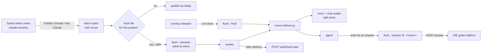

# IntelliJ live review — spec

The live review gets a third viewer, `rebased`: Rebased (IntelliJ) in agterm over the left pane, with
claude-remarks for the notes and the chat reader still visible on the right.
It is for code reviews of local checkouts first. Plans stay in plannotator by default.
No GitHub or GitLab merge-request tooling, no remote connection.

## Contents

- [Decisions](#decisions)
- [The note path](#the-note-path)
- [What a review looks like](#what-a-review-looks-like)
- [agterm-vim: the overlay](#agterm-vim-the-overlay)
  - [One pane](#one-pane)
  - [Toggle hides](#toggle-hides)
  - [Views](#views)
  - [On close](#on-close)
  - [Flags and commands](#flags-and-commands)
- [claude-remarks: the publish hook](#claude-remarks-the-publish-hook)
- [agterm-agents: launcher, flush, skill](#agterm-agents-launcher-flush-skill)
  - [Project claim](#project-claim)
  - [Launcher](#launcher)
  - [Flush](#flush)
  - [Skill](#skill)
- [agterm-annotate](#agterm-annotate)
- [New fields, events and their consumers](#new-fields-events-and-their-consumers)
- [Control API coverage](#control-api-coverage)
- [Tests by behavior](#tests-by-behavior)
- [Risks and limits](#risks-and-limits)
- [Delivery: three plans](#delivery-three-plans)

## Decisions

Settled with Sasha on 2026-10-08, one question at a time.

| Question | Answer |
|---|---|
| Layout | The IDE covers the **left pane only**. The chat reader stays visible over the right pane, as with revdiff. |
| Who writes notes | claude-remarks. |
| How notes reach the room | A **publish hook** in claude-remarks runs `agterm-review-flush` after each publish. Push, not poll. |
| Answers in the IDE | Only for a note made with "Ask Claude" (`asks for an answer`). Every answer is also in the room. |
| Plan mode | Plans stay in plannotator by default. `rebased` remains possible for a plan: plain text, no Markdown plugin. |
| Plan project root | The plan's git root, unless that root is `~/.claude`; then the plan's own folder. |
| Code view | A **range diff**: every tracked file changed between the merge base with `--base` and the working copy. |
| Viewer choice | Per mode. `AGTERM_ANNOTATE_VIEWER` keeps choosing for plans. New `AGTERM_ANNOTATE_CODE_VIEWER` chooses for `--code`. |
| How a review ends | `--on-close <command>` on the Rebased overlay. agterm runs it once when that overlay is released. |
| Toggle chord | **Hides** the overlay and keeps it, its view and its `--on-close`. The next toggle shows it again. This applies to every Rebased overlay. |
| Edited note | claude-remarks resets an edited READ remark to PENDING, so the next Publish Unread sends it. This applies everywhere. |

Why no Markdown plugin: Rebased's JBR ships no JCEF (`/Applications/Rebased.app/Contents/jbr` has no CEF
framework), so the rendered preview cannot work, and claude-remarks' preview notes
(`claude-remarks-markdown.xml`) need it. Rebased is build `262.10968.SNAPSHOT`, so a Marketplace build of
the plugin may also refuse to load.

The spec was reviewed by a Codex mate in the talk pair `Pair: ide-live-review` (msg-141936-d474,
msg-142159-277a). Every finding is folded in below.

## The note path

## What a review looks like

1. The agent runs `agterm-review-live --code <checkout> [--base <ref>]`.
   With `AGTERM_ANNOTATE_CODE_VIEWER` unset on a Mac row, the viewer is `rebased`.
2. The launcher claims the project (see [Project claim](#project-claim)), writes the room, and opens the
   reader on the right.
3. It opens `session overlay open --rebased --pane left --cwd <checkout> --diff <merge-base>.. --working-tree --on-close '<flush> <run> --final'`.
4. The open answers with the overlay id and the view request id. The launcher waits, within one
   deadline, until the read-back shows that request's view `opened` and the
   claude-remarks handshake port equals `rebased.port`. Then it marks the claim active and exits.
   On any failure it releases the claim and exits non-zero. It closes the overlay only when its own open
   succeeded, and only by that overlay id (`session overlay close --overlay <id>`), so a refused open
   or a replacement never closes somebody else's overlay.
5. Sasha reads the range diff on the left and adds remarks on the working-copy side.
   Each Publish Unread sends a batch into the room. The agent answers in the room.
6. An "Ask Claude" remark is also answered on its line: `agterm-review-flush <run> --answer <id> --nonce <nonce>`.
7. The toggle chord hides and shows the IDE. Closing the overlay releases it and runs `--final`:
   the closing message, then the claim is released.

## agterm-vim: the overlay

All of this is fork-only, like the rest of `--rebased`.

### One pane

- `session overlay open --rebased --pane left|right` covers one pane. `--pane` leaves the conflict list in
  `ControlDispatcher.overlayContent`.
- A session holds **at most one** Rebased overlay: session-wide or on one pane, never both. So the
  singular `rebasedOverlay` read-back stays, and gains `pane`.
- A pane Rebased overlay lives in the addressed pane's overlay slot, beside the program and page
  occupants. A session-wide one stays in the session slot.
  Cover predicates (`coverOverlayActive`, `overlayActive`) stay true for a session-wide occupant only.
  Pane visibility is independent of terminal focus, as other pane overlays are.
- `RebasedHost` keys visibility, geometry, pending work and dialog ownership by overlay id, with an
  explicit location (session, pane). `RebasedFrameKeeper` fits a frame to its current holder's rect, not
  to its window's last rect, and follows resize, split ratio and window moves.
- The one-frame-one-place rule stays per project. A second holder takes the frame as today.
- Pane removal: `Session.teardownPaneOverlay` releases a pane occupant; `promotePaneOverlay` moves it
  without ending it.
- Audit `DeckPaneGates`, focus and topmost-surface helpers, `DashboardCover` and the key monitor for the
  new slot behavior.
- Size: **L**. It is slot model, host ownership, focus, projection, teardown and promotion, and child
  window verification, not geometry alone.

### Toggle hides

- Today `toggleRebasedOverlay` in `AppActions+Rebased.swift` calls `store.closeOverlay`. It changes to
  hide: the overlay, its id, view and `onClose` stay; the frame is hidden through the existing `hide`
  verb. The next toggle shows the same holder.
- Read-back: `rebasedOverlay.hidden: true` while hidden.
- The palette row and the `rebased_toggle` keymap action share this path.

### Views

This builds on `--diff RANGE` from `ff7c2338` ("Rebased: --diff RANGE opens a commit range's changes",
branch `worktree-rebased-diff`), which must be on `main` before the agterm-vim plan starts. That commit
already gives: the `RebasedDiff` range grammar (`A..B`, `A...B`, `A` for `A..HEAD`), the bridge verb
`diff <base>\t<head>\t<0|1>\t<dir>` in `RangeDiff.java` through Git4Idea (`GitChangeUtils.getDiff`,
`GitHistoryUtils.getMergeBase`), the `Git4Idea` dependency and classpath, and read-back
`rebasedOverlay.diff`. The live review extends it rather than adding a second diff path.

- `--working-tree` on `--diff`: the right side is the working copy instead of the range's head
  (`GitChangeUtils.getDiffWithWorkingDir` from the range's start, the merge base for `A...`).
  claude-remarks accepts remarks on a working-copy side
  (`remarkTargetProblem` in `claude-remarks/src/main/kotlin/dev/sasha/clauderemarks/store/RemarkTarget.kt:155`).
  Without it, a HEAD-side file takes remarks only while it equals the disk copy.
  - Tracked changes only, as `git diff` shows. Deleted files are shown and take no remarks.
  - An empty range opens nothing visible and reports `opened` with detail `0`.
- In a **pane** overlay the diff must stay inside the pane, so the right reader stays visible. Today
  `RangeDiff` shows `VcsDiffUtil.showChangesDialog`, a dialog of the project frame, which can cover the
  reader. The plan's first task probes two fixes in an isolated Debug instance and keeps the one that works:
  fit the changes dialog to the holder's rect, or show the changes as an editor tab in the frame.
  A session-wide overlay keeps the dialog.
  The probe opens an actual file diff from the browser, not only the file list: every resulting diff
  window, and any error dialog, must stay inside the left pane with the reader visible. If the fitted
  dialog cannot guarantee that, pane overlays use the editor tab.
- A git error today is a modal error dialog only. It also becomes a `viewFailed` event.
- `openFile <request>\t<dir>\t<path>\t<line>`: the file in an editor, caret at the line (1-based, 0 for none).
- `port`: answers the IDE's built-in server port, which the host exposes as read-back.
- Events: `viewOpened <request>\t<detail>` once the chosen viewer for the current request is installed
  (the changes browser, or the editor tab), and for a pane overlay once it is fitted to the holder; never
  when queued. An empty range is `opened` with detail `0`;
  `viewFailed <request>\t<reason>`. `<detail>` is the changed-file count or the path.
- `RebasedHost` gives every view request a new id, stores the requested kind and target apart from the
  result, clears the previous result, and accepts events only for the current request id.
  A view request on an overlay still starting runs after `frameOpened`. It has its own deadline,
  armed when the frame is ready, and a timeout is `viewFailed`, distinct from a JVM or frame failure.

### On close

`onClose` is captured at open: the command, the environment and the cwd. It stays with the overlay entry.

- One release-once operation removes the entry and starts the command through a detached `/bin/sh -c`.
  A spawn failure is logged.
- It runs on: `session overlay close`, slot replacement, the session, workspace or window closing, pane
  destruction, the IDE project frame closing (`frameClosed`), and a confirmed clean quit.
- It does not run on: toggle hide, frame hand-back to another holder, covers, promotion, a cancelled quit.
- Quit drains every holder, starting and failed ones included. It is not inside `saveBeforeQuit`'s
  running-JVM guard.
- ⚠️ On quit the command starts detached, but its message may not reach the agent before the app is
  gone. The flush's pending record keeps it, and `--final` by hand stays the recovery. A hard-killed
  agterm runs nothing.

### Flags and commands

- On `session overlay open --rebased`:
  - `--pane left|right`;
  - `--working-tree` (with `--diff` only), and `--file <path>[:<line>]`, which excludes `--diff`;
  - `--project <dir>`: open exactly `<dir>`, without the `.git` walk in `RebasedHost.projectDirectory`
    (plan mode needs it for `~/.claude/plans`, because the walk finds `~/.claude`);
  - `--on-close <command>`.
  - An open carrying `--on-close` always needs a **fresh** holder: when the session already holds a Rebased
    overlay, it is refused before anything about that holder changes. `ff7c2338`'s reuse (a `--diff` for
    the project already shown goes to that overlay) stays for opens without `--on-close`.
  - Each of `--diff`, `--file`, `--project`, `--on-close` without `--rebased` is refused.
- A successful open or show answers `{id: <session>, overlay: <overlay id>, request: <view request id>}`.
  `agtermctl` prints the same JSON with `--json`.
- `session overlay close --overlay <id>` closes only when the slot still holds that overlay id; otherwise
  it is refused and closes nothing.
- New `session rebased show (--diff RANGE [--working-tree] | --file <path>[:<line>])` for the session's open overlay.
  The agent uses it to point Sasha at a line during a review.

## claude-remarks: the publish hook

- After `publishRemarks` writes the published file (`writePublished`), it looks for
  `~/.claude-remarks/<hash>.hook.json`, same `<hash>` (`projectIdentity` in `review/ReviewHandshake.kt`).
- Hook file shape: `{"argv": ["/abs/agterm-review-flush", "<run>", "--remarks"], "label": "Live code review: x", "owner": "<run>", "state": "opening|active", "port": <embedded IDE port>}`.
- A plugin whose built-in server port is not the hook's `port` skips the hook and publishes as today. So
  a standalone IntelliJ on the same checkout never feeds this review.
- The exact bytes of this publish (header plus body) are captured before any thread hop and written to
  the hook's **stdin**. The hook never reads the shared published file, which the next publish replaces.
- It runs the argv directly, never through a shell, on a pooled thread, with a 10 s timeout.
  stdout and stderr are drained; on timeout the process is killed.
- Exit 0 shows "Queued for <label>". Exit 3 shows "The live review is closed". Any other exit shows the
  stderr tail in a warning balloon. The publish itself (clipboard, published file, PUBLISHED status) is
  unchanged either way.
- The plugin ignores a hook file that is not owned by the user or is writable by group or others.
- `editRemark` resets a READ remark to PENDING (Sasha's decision).
- Prerequisite, manual and one time: a claude-remarks build installed into agterm's embedded plugin
  directory, `<stateDir>/rebased/plugins/` (`idea.plugins.path` in `RebasedInstall`). agterm never
  installs it. A normal IntelliJ install does not count.

## agterm-agents: launcher, flush, skill

Work in a worktree off `main`: the main checkout is shared with other sessions.

### Project claim

One live review per remarks identity at a time.

- `remarks_hash(path)` is the one owner of the hash. It mirrors `projectIdentity`: real path, then git
  top level, then the first 16 hex of SHA-256. The launcher and the flush import it.
- The verified endpoint (port and token, read from `<hash>.json` once readiness passed) is stored in the
  run, owner-only. The flush uses it and never re-reads `<hash>.json`, which another IDE on the same
  checkout can overwrite. The embedded JVM lives until agterm exits, so its token never changes during a
  review.
- `run.json` stores the IDE project dir and the remarks identity apart. For `~/.claude/plans` the IDE
  opens the folder while the identity is `~/.claude`, because REST matching compares the identity
  (`projectForPath` in `ReviewRestService.kt`).
- Claim, compare and delete of `<hash>.hook.json` happen under one lock per identity,
  `~/.claude-remarks/<hash>.hook.lock` (`flock`).
- The hook file carries a state: `opening` (launcher pid, deadline) then `active`.
  - A competing claim is refused while it is `opening` and its pid lives inside its deadline, or while it
    is `active` and its run has no `done`.
  - Otherwise it is stale and is replaced: the run has `done`, the opening deadline passed, or the
    opening pid is gone.
  - ⚠️ An `active` claim left by a hard-killed agterm stays until `--final` is run on its run by hand,
    which closes that run and releases the claim. The refusal names that command.
- A run deletes the hook file only when its `owner` is that run. A failed open rolls the claim back the
  same way.

### Launcher

`bin/agterm-review-live`:

- `VIEWERS` gains `rebased`. `pick_viewer` takes the mode: code mode reads `AGTERM_ANNOTATE_CODE_VIEWER`;
  plan mode reads `AGTERM_ANNOTATE_VIEWER` as today. The error string names all three values.
- `rebased` is Mac-local only. The default for `--code` is `rebased` when `sys.platform == "darwin"`,
  `AGTERM_REMOTE_SELF_HOST` is unset, the tree is not headless, and the `rebasedAppPath` bundle exists;
  otherwise the current default. A **named** `rebased` where it cannot run is exit 2, never a quiet switch.
- The base: with `--base`, the merge base is resolved to a commit, and a failure is an error, never the
  raw ref (today `merge_base` falls back to it). The overlay gets `--diff <merge-base>.. --working-tree`.
  Without `--base`, it gets `--diff HEAD.. --working-tree`: the uncommitted changes.
- Readiness, inside one deadline: the read-back shows this request's view `opened`, then
  `~/.claude-remarks/<hash>.json` exists and its `port` equals `rebased.port` of the addressed instance.
  The errors name the three cases: no handshake (plugin missing), a port that answers nothing (stale
  handshake), a port that is not this instance's (another IDE or another agterm holds the project).
- Plan mode with `rebased`: `--project` is the plan's git root, or the plan's folder when that root is
  `~/.claude`; the view is `--file <plan>`.
- `opening_body` gets a `rebased` branch: "Every Publish Unread sends a batch into this room; closing
  the IDE overlay ends the review. The toggle chord only hides it."
- It never calls `session split on`; `bin/agterm-chat-pane` stays its only owner.

### Flush

`bin/agterm-review-flush` gets three modes for a `rebased` run. The existing revdiff and plannotator
paths are unchanged.

- **No body parser.** A batch goes into the room as claude-remarks rendered it: ids, line ranges and
  `asks for an answer` markers included. The flush validates only the fixed header (marker, `nonce`,
  `published`, `commit`, `remarks`), the way `publishedHeaderOf` in `review/PublishedRemarks.kt` does,
  and refuses a malformed batch without acknowledging it.
- **Durable inbox.** `--remarks` reads the batch on stdin and, under the run lock, either admits it as
  `<run>/inbox/<nonce>.md` or refuses with exit 3 because closing has begun. Then it spawns the worker
  and returns.
- **Worker.** Under the lock, it delivers admitted batches not yet delivered, in admission order.
  Dedupe is by nonce. After the pointer is typed, it marks the nonce delivered.
- **Acknowledgement.** After delivery, it POSTs `published-read`
  (`{session: "agterm-review-flush:<run basename>", project: <identity>, nonce}`, with the token
  header) and checks the JSON `status`. A failed ack stays queued in the run and is retried by the next
  worker and by `--final`.
- **Repeats are possible and visible.** A batch can carry a remark an earlier batch carried: when an ack
  failed, or when two publishes overlapped before the first ack landed. The room message says that a
  repeated id is the same remark.
- **`--answer <remarkId> --nonce <nonce>`**: the answer markdown on stdin, at most 16,384 bytes, POSTed
  to `/api/claude-remarks/answer` with `session`, the token header and the nonce of the batch the agent
  answered. The nonce must belong to this run's inbox. It prints the `status` field; exit 0 only on `ok`.
  `unknown-batch` after an IDE restart or 16 later publishes (`PublishedBatchService` keeps 16, in
  memory) is a documented limit: the answer is still in the room.
- **`--final`.** Freezes admission, drains every admitted batch, retries pending acks, renders one
  closing message and releases the claim. Remarks never published stay in the IDE; the closing message
  says so. The idempotence rules of today's `--final` hold.
- The record of a finished review is the inbox itself; the closing message names `<run>/inbox/`.

### Skill

`skills/live-review/SKILL.md`:

- The `rebased` viewer, `AGTERM_ANNOTATE_CODE_VIEWER`, `--answer`, the claude-remarks prerequisite, and
  the claim refusal with its recovery.
- ⚠️ In a live review the flush acknowledges every batch. The agent answers through `--answer` and does
  **not** follow claude-remarks' "`already-read` → act on nothing" rule, which is for a session that
  claims batches itself. The agent must not run `watch-remarks.sh` for that project during a live review:
  a watcher could acknowledge a batch before the flush does.
- A repeated remark id is the same remark. Changed text, or a newly set `asks for an answer`, is an
  updated request and is handled. An unchanged repeat can be automatic or a deliberate re-ask; the batch
  cannot tell them apart, so the agent answers it briefly, pointing at its earlier answer. A documented
  limit.

## agterm-annotate

- `bin/annotate-replies.sh` refuses unknown `AGTERM_ANNOTATE_VIEWER` values with a notify. For `rebased`
  it says "rebased is a live-review viewer; this reply opens in plannotator", and uses the plannotator
  default. No other change.

## New fields, events and their consumers

agterm-vim:

| New thing | Consumers | Count |
|---|---|---|
| overlay location (session or pane) | `PaneOverlay` and `Session` slot helpers, `AppStore` open/close pane overlay, `Session.teardownPaneOverlay`, `Session.promotePaneOverlay`, `RebasedHost` (entries, visibility, dialogs, key owner), `RebasedFrameKeeper`, `RebasedSlot`, `WindowContentView+Detail` pane overlay panel, `AppStore` projection, `AppActions+Rebased` | 11 |
| read-back `rebasedOverlay.pane` | `ControlRebasedOverlayNode`, `agterm-review-live`, agterm skill | 3 |
| hidden state, read-back `rebasedOverlay.hidden` | `AppActions+Rebased` toggle, `RebasedHost` hide/show, `ControlRebasedOverlayNode`, agterm skill | 4 |
| view request (id, kind, target, state, detail, deadline) | `RebasedHost` (issue, pending, deadline, event match), `Bridge` (verbs, events), `RebasedOverlay` model, `ControlRebasedOverlayNode`, `agterm-review-live` readiness, agterm skill | 6 |
| bridge verb `diff` gains a request id and the working-tree flag; new `openFile`, `port` | `RebasedHost`, `RebasedDiff.bridgeArgument` | 2 |
| events `viewOpened`, `viewFailed` | `RebasedHost` event switch | 1 |
| read-back `rebased.port` | `RebasedStatusProvider` / top-level `rebased` node, `agterm-review-live` readiness, agterm skill | 3 |
| `onClose` | `RebasedHost` common release, session/workspace/window teardown, pane teardown, `frameClosed` handling, `AppDelegate` termination drain, read-back `rebasedOverlay.onClose` (armed: bool) | 6 |
| flags `--pane`, `--diff`, `--file`, `--project`, `--on-close` | `ControlArgs`, `ControlDispatcher.overlayContent` (conflicts), `ControlSessionOverlayOpenOptions`, `ControlActions` / `ControlServer+SessionActions` adapter, `agtermctl` parser and help, agterm skill, `agterm-review-live` | 7 |
| open/show response `overlay`, `request` | `ControlResult`, `agtermctl` output, `agterm-review-live` readiness and rollback, agterm skill | 4 |
| `session overlay close --overlay <id>` | `ControlArgs`, dispatcher, `ControlServer` close path, `agtermctl`, `agterm-review-live` rollback, agterm skill | 6 |
| command `session rebased show` | protocol catalog, dispatcher, `ControlActions`, `ControlServer`, `agtermctl`, `ForwardPolicy` and `HeadlessCatalog` (refusal), agterm skill, live-review skill | 8 |

claude-remarks and agterm-agents:

| New thing | Consumers | Count |
|---|---|---|
| `<hash>.hook.json` (argv, label, owner, state) | claude-remarks `publishRemarks` (reads), `agterm-review-live` (claims, activates, rolls back), `agterm-review-flush --final` (releases) | 3 |
| `<hash>.hook.lock` | `agterm-review-live`, `agterm-review-flush` | 2 |
| `run.json` `project`, `identity`, `hook`, `overlay`, `request` | `agterm-review-flush` `--remarks`, worker, `--answer`, `--final`; `agterm-review-live` rollback | 5 |
| run endpoint (port, token) | worker ack, `--answer`, `--final` ack retry | 3 |
| hook `port` | claude-remarks `publishRemarks` (skips a foreign hook), `agterm-review-live` (writes) | 2 |
| `<run>/inbox/` and its delivered/acked records | `--remarks` (admits), worker (delivers, acks), `--answer` (checks nonce), `--final` (drains) | 4 |
| editRemark resets READ → PENDING | `RemarkStore.editRemark`, the tool window status, claude-remarks skill text | 3 |
| viewer value `rebased` | `agterm-review-live` (`VIEWERS`, `pick_viewer`, `opening_body`, `main`), `agterm-annotate` `annotate-replies.sh`, live-review skill | 3 |
| `AGTERM_ANNOTATE_CODE_VIEWER` | `agterm-review-live` `pick_viewer`, live-review skill | 2 |

## Control API coverage

Per `CLAUDE.md` "Cross-surface contracts":

- Protocol and dispatch: the new flags on `session.overlay.open`, and `session.rebased.show`.
- `agtermctl`: the same flags and the new subcommand, with help text.
- Read-back: `rebasedOverlay: {project, state, error?, pane?, hidden?, view?: {request, kind, target, state, detail?}, onClose?}`
  and `rebased: {jvm, error?, projects, port?}`.
- Headless: `ForwardPolicy` refuses `session.rebased.show` like `--rebased`; `HeadlessCatalog` classifies it.
- Control events: none. `viewOpened` is a bridge event, read back through the tree.
- Docs: `.claude/rules/rebased-overlay.md` (Control surface, the toggle change), the agterm skill,
  `FORK-NOTES.md`, `CHANGELOG-fork.md`. Not `site/commands.html`: fork-only commands stay off it.
- `fork-merge.md`: `onClose`, the pane slot hooks and the toggle path are invisible to the gates when a
  merge drops them; offer them as `flagged` candidates when the feature lands.

## Tests by behavior

- agterm-vim: an `--on-close` open beside an existing same-project holder is refused and leaves its id, view
  and callback unchanged; CLI and protocol round-trip; dispatcher conflicts for every Rebased-only flag; pane
  projection; one Rebased overlay per session; toggle hide → show → close keeps one holder and runs
  `onClose` once; `onClose` once across overlapping release paths, failed start → close, promotion,
  quit cancellation; view request ids reject a late event from an earlier request; the working-tree diff
  opens inside the pane for added, modified, deleted, renamed and empty ranges.
- claude-remarks: two disjoint publishes before either hook runs each deliver their own bytes; the
  ownership check; timeout kill; editRemark resets READ.
- agterm-agents: refused open with an existing left-pane occupant closes nothing; a replacement before
  rollback is not closed; edited READ remark → PENDING → republish → the agent acts; a standalone IDE on
  the same checkout, before and after the review is active, never feeds it; admission refused after closing begins; worker dedupe by nonce; ack retry; `--answer`
  rejects a nonce from outside the inbox; claim refusal, stale replacement, rollback, owner-checked delete.
- End to end, in an isolated Debug instance: a left-pane IDE with the right reader visible, one publish
  reaching the room, one answer reaching the gutter, close sending the closing message.

## Risks and limits

- ⚠️ A hard-killed agterm runs no `--on-close`, and its claim stays active. The recovery is
  `agterm-review-flush <run> --final` by hand.
- Remarks written but never published are not in the closing message; they stay in the IDE store.
- A dirty worktree: the diff's right side is the working copy, so uncommitted edits show in the review,
  as with revdiff today.
- An answer to a batch older than 16 publishes, or after an IDE restart, cannot reach the gutter.
- IntelliJ at half a window is cramped. The split ratio is the lever; `--size-percent` applies only to a
  session-wide Rebased overlay.
- The first open of each repository asks "Trust project?" (`rebased-overlay.md`, Risks accepted).

## Delivery: three plans

`pair start --plan` works in one repository, so this is three plans, run in order:

1. **agterm-vim** (L), once `ff7c2338` is on `main`: the pane diff probe first; then one-pane slot, toggle hide, views, `onClose`,
   flags, `session rebased show`, read-back, docs. The other two depend on its flags.
2. **claude-remarks** (M): the publish hook with stdin bytes, its balloons, the ownership check, the
   editRemark reset, tests.
3. **agterm-agents** (M): project claim, launcher, flush modes, live-review skill; plus the
   agterm-annotate change.
