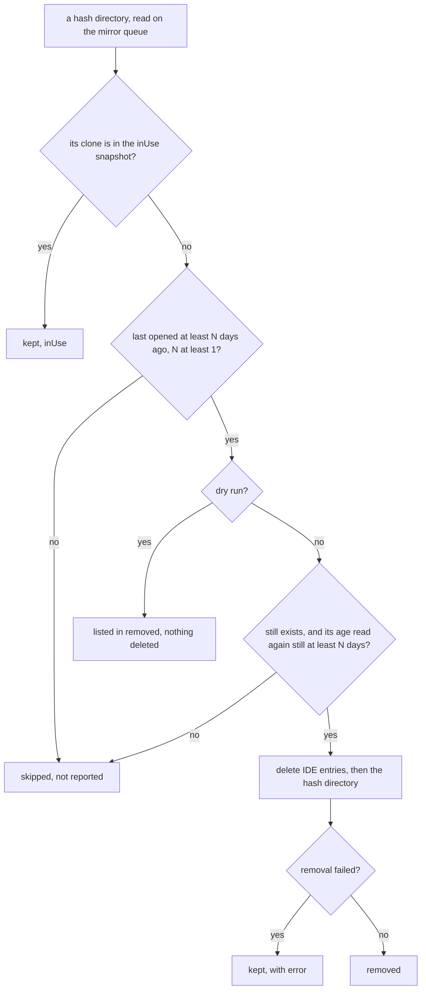

# Rebased mirror cleanup — plan

Remote rows open a `RebasedMirror`: a clone under `<stateDir>/rebased/mirrors/<host>/<hash>/<name>`.
Nothing deletes one today.
This plan removes mirrors nobody opened for N days, and the IDE's own per-project data for them.
It runs once per IDE start, before the JVM starts, and on demand through two control commands.

The plan is written on `worktree-mirror-cleanup`, based on `origin/main` `76677df5`. The code lands on the
`pair` integration branch `pair/mirror-cleanup`, cut from the same base.

## Contents

1. [What is true today](#what-is-true-today)
2. [Prior art](#prior-art)
3. [The design](#the-design)
   1. [The mirror queue](#the-mirror-queue)
   2. [The marker](#the-marker)
   3. [The IDE's per-project data](#the-ides-per-project-data)
   4. [The decision for one mirror](#the-decision-for-one-mirror)
   5. [What counts as in use](#what-counts-as-in-use)
   6. [The state lock](#the-state-lock)
   7. [The start prune](#the-start-prune)
   8. [The control commands](#the-control-commands)
   9. [The setting](#the-setting)
4. [Rejected alternatives](#rejected-alternatives)
5. [New fields and outcomes, and who reads them](#new-fields-and-outcomes-and-who-reads-them)
6. [Testing strategy](#testing-strategy)
7. [Tasks](#tasks)
8. [Final gates](#final-gates)
9. [Progress tracking](#progress-tracking)
10. [Decisions](#decisions)

## What is true today

Facts read from the code at `76677df5`.
Files this plan edits are named by construct, not by line.

- `RebasedMirror.directory(top:stateDirectory:)` builds `<stateDir>/rebased/mirrors/<host>/<hash>/<name>`.
  `<hash>` is an FNV-1a of the host's repository top. This plan calls it "the `<hash>` directory".
  It is not the IDE's hash below.
- `RebasedMirrorRefresh.run` asks the host for the repository top over ssh first, then creates the clone
  directory and runs `git init`, `git fetch`, `git checkout`. An unreachable host fails at the ssh query,
  before `createDirectory`. It writes nothing else. Its ssh query has a 30 s timeout and each git step 300 s.
  Its process runner returns a `private struct Outcome`.
- `RebasedHost.openRemote` inserts the session into `fetching` and runs the refresh through `offMain`, a
  `Task.detached`. `fetching` holds session ids, one refresh per session. Two sessions on different remote
  rows can refresh at the same time today, and two rows on the same host repository then write into the same
  git directory at once.
- `RebasedHost.mirrored` removes the session from `fetching`, then calls `open(session:)`, which records an
  `Entry` with the canonical project path and calls `start()` when the JVM is `notStarted`.
  So at `start()` the pending open's mirror is already in `entries`, and its own refresh has finished.
- `RebasedHost.start` runs `runtime.prepare` off the main actor. On success it sets `prepared`, arms the
  deadline of every starting overlay, and calls `launch`.
  `JNIRebasedRuntime.prepare` takes `RebasedStateLock.acquire` first, and keeps it for the process's life.
  A second agterm on the same state directory fails there.
- `RebasedHost.frameNumbers` holds the projects the IDE reports open now. `frameClosed` removes a project.
  Nothing records a project that was open earlier in this JVM run.
- The IDE gets `RebasedHost.canonical(path)` on `open`: `resolvingSymlinksInPath().standardizedFileURL.path`.
- The bridge plugin turns IntelliJ's "reopen last project" off when it loads
  (`agterm/Resources/rebased/src/agterm/rebased/Startup.java:19-20`). IntelliJ can reopen a project before
  that, which `Bridge.open` already handles (`agterm/Resources/rebased/src/agterm/rebased/Bridge.java:97`).
- ⚠️ `RebasedHost.stateDirectory` defaults to `PersistenceStore.defaultDirectory`, which is the LIVE
  `~/Library/Application Support/agterm` (`agtermCore/Sources/agtermCore/PersistenceStore.swift:24-28`).
  Four hosted suites build `RebasedHost()` without setting it. Three stub only `offMain`:
  `RebasedHostTests`, `ControlServerRebasedOverlayTests` and `ControlServerOverlayRedirectTests`.
  The fourth, `RebasedKeyPassThroughTests.testTheRouterConsumesIDEKeysAndPassesTheRest`, only routes keys and
  opens nothing, so it never reaches a refresh or a prune.
  ⚠️ `ControlServerOverlayRedirectTests.testRebasedOnARemoteRowFetchesTheHostsRepositoryInsteadOfRedirecting`
  opens a remote row with `offMain = { _, _ in }`, so the refresh never runs today. Once the refresh moves to
  the mirror queue, an unstubbed queue would run a real `ssh` and write under the live state directory.
- `ControlServer.waitsOnNetwork` (`nonisolated private static`) names the commands that leave the single
  accept thread for a worker. Every other command holds the accept thread until its reply is written.
- The IDE's system directory is `<stateDir>/rebased/system` (`agtermCore/Sources/agtermCore/RebasedInstall.swift:79`).
- Measured on the live state directory on 2026-10-08, one mirror (`d54f62e6`):
  - per-project entries: `projects/jackrabbit-review-chm.d54f62e6`, `editor/jackrabbit-review-chm-d54f62e6`,
    `vcs-log/jackrab_d54f62e6_78d80aa`, and in `vcs-users/` the files `d54f62e6.2`, `d54f62e6.2_i`,
    `d54f62e6.2.len` and three more. `vcs-users` was not in the brief's list.
  - shared, at depth 1 of `system/`: `caches` 157 MB, `index` 99 MB, `plugins` 75 MB, `LocalHistory`, `tmp`, `stat`.
  - the clone is 101 MB. Its per-project IDE data is about 1 MB.
  - `.git/FETCH_HEAD` is rewritten on every fetch: 21:33 against the `<hash>` directory's 19:30.
- The Java hash was checked with a port of `String.hashCode()` over UTF-16 units. The test vectors are in
  the IDE-hash task. `vcs-log`'s trailing `78d80aa` has 7 digits, so IntelliJ writes at least some hashes
  with `Integer.toHexString`, without zero padding.
- Control payloads carry times as epoch seconds in a `Double`, because `ControlProtocol.swift` imports no
  Foundation (`ControlBookmarkNode.created`, `agtermCore/Sources/agtermCore/ControlBookmark.swift:18`).
  `RebasedProjection.swift` imports no Foundation either.
- `HeadlessCoverageTests.declaredCommands` reads `Command` from source, one `case` per line
  (`agtermCore/Tests/AgtermHeadlessKitTests/HeadlessCoverageTests.swift:93-94`).
- ⚠️ The bundled skill's `description` is exactly 1024 UTF-16 units, the limit that
  `bundledSkillDescriptionFitsTheSpecLimit` pins (`agtermCore/Tests/agtermCoreTests/SkillInstallTests.swift:110-122`).
  Any word added to it fails `swift test`. See [Decisions](#decisions).
- `rebasedAppPath` already has a Settings field (`agterm/Views/SettingsView.swift:188`).
  Nothing watches `settings.json`, so a hand edit applies at the next launch.

## Prior art

One `jbcontext search` over `agtermCore/Sources` (revision `76677df5`) found only the redirect sweep below.
The rest came from grep and reading.

- `zmx.list` / `zmx.prune` are the same shape: a list that explains, and a prune that acts only on rows the
  list showed. Names, CLI layout and help text follow them
  (`agtermCore/Sources/agtermctlKit/ZmxCommands.swift:191`, `:240`;
  `agtermCore/Sources/agtermCore/ControlDispatcher+Zmx.swift:86-89`).
- `ZmxPrunePolicy` (`agtermCore/Sources/agtermCore/ZmxInventory.swift:177`) keeps the selection pure in
  core while the app owns the side effects. The mirror cleanup copies that split.
- `OverlayRedirectCommands.sweepAbandonedScriptDirectories`
  (`agtermCore/Sources/agtermctlKit/OverlayRedirectCommands.swift:276-285`) is an age sweep of directories.
  It reads `creationDate`, which Linux cannot set in a test fixture. This plan reads modification dates only.
- `OverlayRedirect` (`agtermCore/Sources/agtermctlKit/OverlayRedirectCommands.swift:12`) is the fork's own
  CLI group in its own file. `RebasedCommands.swift` follows it.

## The design

### The mirror queue

Every job that writes under `mirrors/` runs on one serial `DispatchQueue` owned by `RebasedHost`,
`com.umputun.agterm.rebased.mirrors`:

- each mirror refresh, from `openRemote`;
- the start prune;
- each on-demand prune, dry run included;
- each marker touch, when a mirror's overlay is shown (see [The marker](#the-marker)).

So two prunes, or a prune and a refresh, never run at once. No claims, no locks between them.

- The queue is a `private static let mirrorQueue = DispatchQueue(label: "com.umputun.agterm.rebased.mirrors")`.
  It cannot be a `lazy` stored property, because `@Observable` does not allow one. Static is safe: the queue
  holds no state, so the hosts the tests build share nothing through it but the order of their jobs.
- The seam is `RebasedHost.onMirrorQueue(work, done)`, shaped like `offMain`. The default builds the queued
  block as a typed `let body: @Sendable () -> Void` that runs `work` and then hops back with
  `Task { @MainActor in done() }`, and passes `body` to `queue.async(execute:)`. A closure literal written
  inline inside this `@MainActor` class would inherit main-actor isolation and abort on the queue
  (`CLAUDE.md`, "Module and callback boundaries").
- ⚠️ Nothing on the main actor may ever wait on the mirror queue. A prune job reads its snapshot with
  `DispatchQueue.main.sync` (see [What counts as in use](#what-counts-as-in-use)), so a main-actor wait on the
  queue would deadlock.
- A refresh writes its marker inside its queue job (see [The marker](#the-marker)).
- `list` does not use the queue. It only reads, and it must not wait behind a fetch. It can report a mirror in
  the middle of a refresh or a delete, and the scan tolerates files that vanish while it walks.
- Cost: refreshes no longer run in parallel. A job can wait behind one refresh for its ssh query and three git
  steps: 30 s + 3 × 300 s, about 15 minutes at worst. The gain: two rows on one repository no longer write into
  the same git directory at once, which they can today.
  One session still cannot start a second refresh, as today.

How the queue and the 1-day minimum protect a refresh, as a run:

> The user has a mirror of `p4linux:/home/s/jackrabbit` last opened 20 days ago.
> At 10:00:00 the user runs `agtermctl rebased mirror prune`. The job starts on the mirror queue, takes its `inUse`
> snapshot from main, and reads the mirror as 20 days old.
> At 10:00:01 the user opens Rebased on their p4linux row in that repository. The refresh job waits on the queue.
> At 10:00:02 the prune deletes the mirror and ends. The refresh starts, finds no clone, and makes a full
> new one. Slower, but correct: no fetch ever writes into a directory being deleted.
>
> A refresh of `p4linux:/home/s/other`, from a second row, ends at 11:00:00.000 and has written a fresh marker.
> At 11:00:00.050 a prune job starts; its snapshot does not hold that row's entry yet, because `mirrored`
> reaches the main actor at 11:00:00.100.
> The prune reads the marker: 0 days old, less than the 1-day minimum. It skips the mirror.

The minimum age is what closes that last gap. A refresh always writes the marker inside its job, and an
age of at least one day cannot match a mirror refreshed seconds ago.

### The marker

`RebasedMirrorRefresh.run` writes `<hash>/mirror.json` twice: right after `createDirectory`, before the first
git step, and again after the last step succeeds.

```json
{"source":"p4linux:/home/sasha/jackrabbit","lastOpened":"2026-10-08T19:30:12Z"}
```

- `RebasedMirrorMarker` (core) owns the format: `JSONEncoder` with `.iso8601`, written atomically.
  `read(from:)` answers nil for a missing or unreadable file.
- Why the first write: the user opens a 20-day-old mirror, and the fetch fails mid-way (the network drops, or
  a step times out). The end write never happens. Without the first write, the next prune deletes the mirror
  the user has just tried to use.
- An unreachable host fails at the ssh query, before `createDirectory`, so neither write happens and the marker
  stays as it was. The worst case is one re-clone later, when the host is back. This is accepted and recorded
  under "Risks accepted".
- A failed write does not fail the refresh.
- The write lives in `RebasedMirrorRefresh.run`, not in `RebasedHost`'s closure.
  The host tests inject a refresh whose `Copy.directory` is `/tmp`, so a host-side write would create `/mirror.json`.
- `run` gains an `execute` parameter, defaulting to today's private process runner, so a hosted test can drive
  it without ssh. `Outcome` becomes internal so the fake `execute` can build one.
- Age: `lastOpened` is the later of the marker's time and the mtime of `<name>/.git/FETCH_HEAD`. When both are
  missing, it is the mtime of `<hash>`. `source` comes from the marker only, and is nil without one.
- The marker also moves when the mirror is used, not only when it is opened. `RebasedHost.show`, once the
  frame is on the slot, queues a touch job on the mirror queue: `RebasedMirrorMarker.touch(hashDirectory:source:now:)`
  writes `{source, lastOpened: now}`.
  - Only for a mirror: the overlay has a `source`, and its project lies at
    `<stateDir>/rebased/mirrors/<host>/<hash>/<name>`, which `RebasedMirrorCleanup.hashDirectory(ofClone:stateDirectory:)`
    answers (nil for any other path, compared through `projectPath`). A local overlay never queues one.
  - At most once per hour per mirror: `RebasedHost.lastTouched: [String: Date]`, keyed by canonical project,
    read and written on the main actor. It is in memory only, so the first show after a relaunch touches again.
  - `touch` writes only into a `<hash>` directory that exists, and never creates one.
  - The clock is the seam `RebasedHost.clock: () -> Date`, default `{ Date() }`.
  - Why: an overlay kept open for weeks and only shown and hidden would otherwise keep a marker as old as its
    last refresh. The prune keeps it while it is open, then deletes it the first prune after it closes.

### The IDE's per-project data

- `RebasedMirrorCleanup.javaHash(_:)` is Java's `String.hashCode()` over UTF-16 units, printed as
  `Integer.toHexString` does. A name also matches the same value zero-padded to 8 digits.
- An entry matches when its name, split on `.`, `-` and `_`, has a part equal to the hash.
  The start and the end of the name count as delimiters, so `d54f62e6.2_i` matches.
- The walk is an allowlist of per-project directories under `system/`:
  `projects`, `editor`, `compiler`, `vcs-log`, `vcs-users` at depth 1, and `frameworks/detection` at depth 1
  below it. `index`, `caches`, `LocalHistory`, `plugins` and `compile-server` are never opened.
  `compile-server/<name>_<other-hash>` uses another hash and stays.
- One path form serves both lookups: `RebasedMirrorCleanup.projectPath(clone)`, the expression the host gives
  the IDE. The `inUse` lookup compares it, and `javaHash` hashes it. `RebasedHost.canonical` delegates to it,
  so the host's snapshot and the prune cannot disagree about `/private/tmp` against `/tmp`.
- IDE entries are removed BEFORE the clone. If the clone removal fails, the next run still finds the
  mirror and retries. In the other order a removed clone would leave its IDE entries with nothing to find them.

### The decision for one mirror

The unit is the `<hash>` directory. Each `<host>` directory is handled after all of its mirrors.



- Every path to delete must lie under `<stateDir>/rebased/mirrors/` or `<stateDir>/rebased/system/`
  after `standardizedFileURL`. A symlinked `<host>` or `<hash>` entry is skipped, never followed.
- The existence check and the second age read are part of the delete step, not of the scan. With the queue no
  refresh can run between the two reads; the second read keeps the delete correct if a writer outside the
  queue ever appears, for one file read per deleted mirror.
- After a host's mirrors, a real prune removes `<host>` with `rmdir(2)` semantics. `rmdir` fails on a
  non-empty directory, and that failure is ignored, so a `.DS_Store` or a kept mirror keeps it.
  `FileManager.removeItem` is never used on `<host>`, because it deletes recursively. A dry run never calls `rmdir`.

### What counts as in use

One snapshot, `RebasedHost.mirrorsInUse`, read when the prune job STARTS on the mirror queue:

```swift
let inUse = Thread.isMainThread
    ? MainActor.assumeIsolated { host.mirrorsInUse }
    : DispatchQueue.main.sync { MainActor.assumeIsolated { host.mirrorsInUse } }
```

The first branch serves the synchronous test seams, which run the job on the main thread; `main.sync` from the
main thread would deadlock.

The same shape, a main-queue closure entering the actor with `assumeIsolated`, already exists: the
`liveReset?.terminateIfPending()` hop in `ControlServer` (`DispatchQueue.main.async`), and the window
observers in `agterm/Rebased/RebasedSlotView.swift:72-73` (`queue: .main`). `CLAUDE.md` bans `assumeIsolated`
on the libghostty wakeup path only, where it would replace the coalesced `ghostty_app_tick`; this read is not
on that path.

1. every `Entry.project` in `RebasedHost.entries`: open overlays, the pending open at IDE start included;
2. every key of `RebasedHost.frameNumbers`: projects the IDE reports open now;
3. `RebasedHost.openedThisRun: Set<String>`: every project `frameOpened` reported in this JVM run, inserted
   by `frameOpened` and never removed. A project closed in the IDE can still have state that this JVM run
   holds and writes back under `system/`. It is empty at the first start, so it matters for the on-demand
   prune and for `list`.

An entry recorded after the snapshot can come from a refresh, which wrote a fresh marker (see
[The mirror queue](#the-mirror-queue)). The one remaining window is the prune's own run, and only for an
on-demand prune with the IDE running: if the user opens a stale mirror from the IDE's own Recent Projects menu
during the seconds the prune runs, `frameOpened` lands after the snapshot. The start prune has no such window,
because the JVM has not launched.

`list` reports `inUse` from the same snapshot, read on the main actor when the command arrives.

### The state lock

Mirrors held by a second agterm instance are not visible here, so a real prune needs `RebasedStateLock`.

- `RebasedStateLock.withLockIfFree(_ directory:, _ body:)`. When this process holds the lock, it runs `body`.
  When nobody holds it, it takes the lock, runs `body`, and releases it. When another instance holds it, it
  throws `RebasedStateLock.message` and `body` does not run.
- The take and the release run under the holder's unfair lock; `body` runs outside it, so a long prune never
  holds an `OSAllocatedUnfairLock`.
- It is called only from prune jobs on the mirror queue, so two calls never overlap.
  `JNIRebasedRuntime.prepare`'s `acquire` runs on another thread and can arrive during a body. That `acquire`
  makes the lock permanent, so the release at the end keeps it. Without this, the IDE would start with no lock.
- The state moves into `RebasedStateLock.Holder`, an instance holding the descriptor and the `permanent` flag
  behind its own `OSAllocatedUnfairLock`. The static `acquire` and `withLockIfFree` forward to `Holder.shared`.
  `lock` stays the helper with no state that every `Holder` and the tests use. A `Holder` closes its descriptor
  in `deinit`, so a test's own `Holder` releases its lock when the test ends. Tests close every descriptor that
  `lock` returns them.
- A dry run and a list never take the lock. The start prune runs after `prepare`, so the lock is already held.
- Known limit, recorded under "Risks accepted": instance B's prune holds the lock for a moment. If instance A starts its IDE in that moment,
  A's start fails with `RebasedStateLock.message`. A second open in A recovers.

### The start prune

- After `prepare` succeeds, `RebasedHost.start` queues the prune on the mirror queue. The prune job's `done`
  sets `prepared`, arms the deadline of every starting overlay, and calls `launch`, in that order.
  So the 30 s deadline never counts the prune.
- Why not run the prune beside `launch`: an IDE starting with an old config can reopen its last projects
  before the bridge plugin turns that off, and one of them can be a mirror the prune is deleting.
  With the prune first, no project is open in the IDE while mirrors go.
- The start prune is skipped when `fetching` is not empty. Another row's refresh would sit ahead of it on the
  queue, and the IDE launch would wait behind that fetch. An on-demand prune ahead on the queue costs seconds,
  and is accepted.
- `maxAgeDays == 0` skips it too. A skipped prune goes straight to the same `done` steps.
- The prune does not measure sizes. A prune error never fails the start. The start prune's job in `RebasedHost.start`
  logs the removed count, or the thrown error, through the host's `Logger`; the factory closure logs nothing.
- ⚠️ `RebasedHost.mirrorPrune` defaults to a no-op, `RebasedHost.mirrorList` to an empty list, and
  `RebasedHost.mirrorMaxAgeDays` to `{ 0 }`. Only `RebasedHost.configure` installs the real ones. This keeps a
  hosted test's `RebasedHost()` off the live state directory. Both closures are typed `@Sendable`, because they
  run on the mirror queue or through `offMain`:
  `mirrorPrune: @Sendable (RebasedMirrorCleanup.Request) throws -> RebasedMirrorCleanup.Report` and
  `mirrorList: @Sendable (URL, Set<String>) -> [RebasedMirrorRecord]`.
- Backstop: every hosted suite that builds a `RebasedHost()` and opens, lists or prunes anything also sets
  `host.stateDirectory` to its own temp directory in setup. A test that forgets a stub then reaches a temp directory, never the live one.
- The real closures come from two `nonisolated static` factories, `RebasedHost.makeMirrorPrune(withLock:)` and
  `RebasedHost.makeMirrorList()`. They are `nonisolated` because the closures they build run on the mirror queue
  and through `offMain`, never on the main actor. The prune factory's lock function is injected, so a test checks
  the wiring without touching `RebasedStateLock`. The list closure scans with `measure: true`, so `list` always
  reports `bytes`.
- The host's two entry points, which `ControlServer+RebasedMirrors.swift` calls:
  - `pruneMirrors(olderThanDays: Int, dryRun: Bool) async throws -> RebasedMirrorCleanup.Report`. The server
    resolves the default age before calling it, and a lock refusal comes back as the thrown error.
  - `listMirrors() async -> [RebasedMirrorRecord]`.

### The control commands

Names follow `zmx.list` / `zmx.prune` and the `noun.verb` form of `session.bookmark.list`.

| Protocol | CLI | Arguments |
|---|---|---|
| `rebased.mirror.list` | `agtermctl rebased mirror list` | none |
| `rebased.mirror.prune` | `agtermctl rebased mirror prune [--older-than DAYS] [--dry-run]` | `args.olderThanDays: Int?`, `args.dryRun: Bool?` |

- Dispatcher: `--older-than` below 1 answers `rebased.mirror.prune --older-than must be 1 or more`.
  The CLI's `validate()` refuses it first with the same words.
- Server: no `--older-than` uses `effectiveRebasedMirrorMaxAgeDays`.
  When that is 0, the answer is `automatic mirror pruning is off (rebasedMirrorMaxAgeDays is 0); pass --older-than DAYS`.
- `list` runs its walk through `offMain`. `prune` runs as a mirror-queue job and waits for any job ahead of it,
  a fetch included, up to about 15 minutes. `agtermctl` has no reply timeout, so the command waits too.
- Both join `ControlServer.waitsOnNetwork`, so they run on a worker thread and never hold the accept thread.
  `waitsOnNetwork` becomes `nonisolated static` (internal) so `ControlServerRebasedMirrorTests` can assert both
  cases. The doc comment widens from "awaits an ssh round trip" to "awaits an ssh round trip, walks the disk,
  or waits on the mirror queue".
- Answer: `result.rebasedMirrors`, a `ControlRebasedMirrors`:
  - list: `mirrors: [node]`.
  - prune: `removed: [node]`, `kept: [node]`, `dryRun`, `olderThanDays` (the age actually used).
  - node, `ControlRebasedMirrorNode`: `host`, `source?`, `directory` (the clone), `lastOpened` (epoch
    seconds), `bytes?`, `inUse`, `ideData?` (the IDE entries removed or to remove, prune only),
    `error?` (kept because the removal failed).
- One owner maps records into that payload: `ControlRebasedMirrors.init(mirrors:)` and `init(report:)` in
  `RebasedMirrorCleanup.swift`, which imports Foundation for the `Date` conversion. The payload types stay in
  `RebasedProjection.swift`, which imports nothing. The server only calls the two initializers.
- Human output, one line per mirror:
  `p4linux  p4linux:/home/s/jackrabbit  20 days  101 MB  /Users/…/jackrabbit`, `in use` before the
  directory when it is. A prune prints `removed` or `would remove` and `kept: in use` or `kept: <error>`.
  No mirrors prints `no mirrors`.
- Read-back is `rebased.mirror.list`, not the tree: a `tree` read must not walk the disk. This exemption
  is written into `control-api.md` beside the commands, as the cross-surface rule requires.
- No event. Nothing subscribes to a disk cleanup.
- The headless origin refuses both as `a Mac feature`: the IDE and its mirrors live on the Mac.
- `site/commands.html` stays untouched, like every fork-only command.

### The setting

`AppSettings.rebasedMirrorMaxAgeDays: Int?`, read through `effectiveRebasedMirrorMaxAgeDays`:
nil or a negative value gives 14, 0 means never prune automatically, and any other value is at least 1 by
construction. `settings.json` only, no Settings UI.

## Rejected alternatives

- **Per-host claims with a generation counter.** Replaced by the serial queue, because each fix produced a
  new race: a plain count missed a refresh that started and ended between scan and delete, and the generation
  then needed a lock that the `<host>` removal and the state lock both had to nest inside.
- **A concurrent queue with prunes as barrier jobs.** Refreshes would still run in parallel, but two rows on
  one repository would still write into one git directory at once. The serial queue removes that race too.
- **A snapshot of `fetching` as the refresh exclusion.** It holds session ids, not directories, and it is
  stale by delete time.
- **An age of 0 for "every mirror not in use".** It would reopen the gap between a refresh's end and
  `mirrored` recording its entry on main.
- **Walk every directory under `system/` except a denylist.** `system/plugins` (75 MB) and any new shared
  directory would be opened, and an 8-digit token that matches by chance would delete a shared file.
  The allowlist misses a future per-project directory instead, which costs about 1 MB per mirror.
- **Keep the state lock after an on-demand prune**, like `acquire`. A prune in an instance that never opens
  Rebased would then block the IDE in the instance that does, for the rest of that process's life.
- **Prune inside `JNIRebasedRuntime.prepare`.** The fake runtime in the host tests would never run it.
- **Prune before `prepare`.** A second agterm instance, refused later by `RebasedStateLock`, would already
  have deleted mirrors the first instance's IDE holds open.
- **Prune beside `launch`.** See [The start prune](#the-start-prune).
- **Mirror data on the tree's `rebased` node.** Every `tree` call would walk the mirrors.

## New fields and outcomes, and who reads them

**`rebasedMirrorMaxAgeDays`** — 3 consumers.
1. `AppSettings.effectiveRebasedMirrorMaxAgeDays` (the resolver; the two below read it).
2. `agterm/agtermApp.swift`, the `RebasedHost.shared.configure(…)` call: the new `maxAgeDays:` closure,
   read by `RebasedHost.start`. The parameter has no default, so no caller can leave it out.
3. `ControlServer.pruneRebasedMirrors`: the default when no `--older-than` is given.
No code writes it.

**`mirror.json`** — 2 writers, 2 readers.
- Writers: `RebasedMirrorRefresh.run`, through `RebasedMirrorMarker.write(to:)`, twice per refresh; and the
  touch job `RebasedHost.show` queues, through `RebasedMirrorMarker.touch(hashDirectory:source:now:)`.
- Readers: `RebasedMirrorCleanup.scan`, which list and prune both call, and the delete step of
  `RebasedMirrorCleanup.prune`, which reads the age again.
- The IDE never sees it: it sits beside the clone.

**`RebasedHost.onMirrorQueue`** — 4 callers: `openRemote` (the refresh), `start` (the start prune),
`pruneMirrors` (the on-demand prune), `show` (the marker touch).

**`RebasedHost.lastTouched`** — 1 writer and 1 reader, both in the touch step of `RebasedHost.show`.

**`RebasedHost.clock`** — 1 reader: the touch step of `RebasedHost.show`.

**`RebasedHost.openedThisRun`** — 1 writer, 1 reader.
- Writer: `RebasedHost.frameOpened`.
- Reader: `RebasedHost.mirrorsInUse`, used by the start prune, the on-demand prune and `list`.

**`RebasedStateLock.withLockIfFree`** — 1 caller: the closure `RebasedHost.makeMirrorPrune` builds, for a
real (not dry-run) prune. `acquire`, its existing sibling, keeps its 1 caller, `JNIRebasedRuntime.prepare`.

**The two `Command` cases** — 10 code sites, named in Tasks 5, 7 and 10.
1. `Command` in `ControlProtocol.swift`, one case per line.
2. The main switch in `ControlDispatcher.dispatch`.
3. `ControlDispatcher+RebasedMirrors.swift` (new).
4. `ControlActions` in `ControlDispatcher.swift`, plus `ControlActionsDefaults.swift`.
5. The "control dispatcher did not handle" arm in `ControlServer.swift`.
6. `ControlServer.waitsOnNetwork`.
7. `ControlServer+RebasedMirrors.swift` (new).
8. `ForwardPolicy.kind(of:)`, refused `a Mac feature`.
9. `HeadlessActions`, two `refuse(…)` methods.
10. `agtermctlKit`: `RebasedCommands.swift` (new) and the root `subcommands` list in `Commands.swift`.
Test sites: `MockControlActions`, `ForwardPolicyTests`, `HeadlessCatalogTests`, `HeadlessRequests.all`,
the new dispatcher, CLI and hosted suites.

**`ControlArgs.olderThanDays`, `ControlArgs.dryRun`** — 2 consumers: the CLI `Prune.makeRequest` writes
them, `ControlDispatcher+RebasedMirrors` reads them.

**`ControlResult.rebasedMirrors`** — 1 producer, 3 consumers.
- Producer: `ControlServer+RebasedMirrors.swift`, through the two `ControlRebasedMirrors` initializers.
- Consumers: `SocketClient.formatResponse` (a new branch calling `formatRebasedMirrors`), `--json` (raw,
  no code), the skill's `reference.md`.

**Prune outcomes** — `removed`, `kept` (in use), `kept` (with `error`), skipped (fresh, freshened, or
vanished; not reported). Consumers: `formatRebasedMirrors` prints the first three; the start prune's log line
counts `removed`.

## Testing strategy

- Core first. Selection, the hash, the token rule, the scan and the deletes are pure logic plus Foundation
  file calls, so they run in `swift test` on temp directories, on the Mac and on p4linux.
- Fixtures set ages with `setAttributes([.modificationDate:])`, never `creationDate`, so they run on Linux.
- `.iso8601` drops fractional seconds. Fixture dates are whole seconds, a "no older than the test's start"
  check compares against `floor(start)`, and no round-trip test uses `Date()`.
- Ordering is tested in the host, not in core: core functions are synchronous and never run concurrently,
  because the mirror queue is the only caller that writes. A host test injects `onMirrorQueue` as a recording
  queue and checks the order of the jobs. One more hosted test runs the real default seam with trivial jobs.
- The hourly touch limit is tested through `RebasedHost.clock`, never by waiting.
- The app target is tested through its seams: `offMain`, `onMirrorQueue`, `mirrorPrune`, `mirrorList`, the
  lock function of `makeMirrorPrune`, and the `execute` parameter of `RebasedMirrorRefresh.run`. No hosted test
  runs the shared `RebasedStateLock.Holder`, runs `ssh`, or reaches the live state directory: every suite that
  builds a `RebasedHost()` and opens, lists or prunes anything sets `host.stateDirectory` to a temp directory.
- Each task's tests are written first and seen failing. Each task runs only its own suites. The full gates
  run once, at the end.

## Tasks

Before the first task, in each agent's worktree:

- [ ] Link the ignored build artifacts into this worktree as `CLAUDE.md` says ("Worktrees and local builds"),
  checking both stamps first.
- [ ] Never execute `agterm`/`agtermctl` against the default socket, never launch or quit the app.
- [ ] The `pair` driver integrates the work (`~/dev/agterm-agents/docs/claude/pair-skill.md`). Each agent lands
  a task on the integration branch `pair/mirror-cleanup` with `pair land`, which rebases the agent's branch onto
  it. A task becomes claimable only when its `depends:` tasks have landed there, and `pair next` rebases the
  agent's branch onto `pair/mirror-cleanup` before the agent starts it.
- [ ] [Unverified] Two `scripts/test-app.sh` runs at the same time, one per worktree, each launch a test host
  with the bundle id `com.umputun.agterm.debug`. If a hosted run fails at startup while the other agent's run is
  going, retry it once that run ends before treating it as a defect.

Tasks 1 to 5 depend on nothing and can run in parallel. The chains are: 1 and 2 → 6 → 8; 5 → 7; 5 and 6 → 8;
3, 4 and 8 → 9; 9 → 10 and 11; 7, 10 and 11 → 12. No task touches a live system or anything outside the
worktree, so no task carries an owner.

### Task 1: The marker

**Files:**
- Create: `agtermCore/Sources/agtermCore/RebasedMirrorMarker.swift`
- Create: `agtermCore/Tests/agtermCoreTests/RebasedMirrorMarkerTests.swift`
- Create: `agtermTests/RebasedMirrorRefreshTests.swift`
- Modify: `agterm/Rebased/RebasedMirrorRefresh.swift`

- [x] Write `RebasedMirrorMarkerTests`: round trip on a fixed whole-second date
  (`Date(timeIntervalSince1970: 1_791_000_000)`), never `Date()`; the file's keys are exactly `source` and
  `lastOpened`, and `lastOpened` is an ISO-8601 string; corrupt JSON reads as nil; a missing file reads as nil.
- [x] Write new `agtermTests/RebasedMirrorRefreshTests`, driving `run` through a fake `execute` and a temp state
  directory:
  - a refresh whose fetch fails mid-way still leaves a marker written after `createDirectory`, with the top's
    source;
  - a refresh whose ssh query fails leaves an existing marker unchanged;
  - a successful refresh leaves a marker no older than `floor(start)`, the test's start in whole seconds.
- [x] Add `RebasedMirrorMarker.swift`: `RebasedMirrorMarker { source, lastOpened }`, `fileName = "mirror.json"`,
  `write(to hashDirectory:)`, `static read(from:)`.
- [x] `RebasedMirrorRefresh.run`: make `Outcome` internal; an `execute` parameter defaulting to the private
  runner; `write` on `directory.deletingLastPathComponent()` right after `createDirectory` and again after the
  last step, each ignoring its error.

Acceptance: `cd agtermCore && swift test --filter RebasedMirrorMarkerTests` and
`scripts/test-app.sh -only-testing:agtermTests/RebasedMirrorRefreshTests`.

### Task 2: The IDE hash and the per-project entries

**Files:**
- Create: `agtermCore/Sources/agtermCore/RebasedMirrorCleanup.swift`
- Create: `agtermCore/Tests/agtermCoreTests/RebasedMirrorCleanupTests.swift`

- [ ] Write the hash vectors in `RebasedMirrorCleanupTests`. They call `javaHash` directly, not
  `projectPath`: the paths do not exist on the test machine, and `projectPath` resolves symlinks.
  - `/Users/sasha/Library/Application Support/agterm/rebased/mirrors/p4linux/40eee01ce47c7996/jackrabbit-review-chm` → `d54f62e6`
  - `/tmp/agide-jr` → `226f9a98`
  - `/tmp/m/ec148cb48e73ca47/repo` → `a3bf390` (7 digits; the padded form `0a3bf390` also matches)
- [ ] Write the token-rule cases against the measured names: `jackrabbit-review-chm.d54f62e6`,
  `jackrabbit-review-chm-d54f62e6`, `jackrab_d54f62e6_78d80aa` and `d54f62e6.2_i.len` match;
  `xd54f62e6` and `d54f62e67` do not.
- [ ] Write the walk case: a temp `system/` with matching names inside `index`, `caches`, `LocalHistory`,
  `plugins` and `compile-server` returns none of them; `frameworks/detection/<name>.<hash>` is found.
- [ ] Write the path-form case: a clone created under `/private/tmp/…` and the same path spelled `/tmp/…` give
  one `projectPath`, so the `inUse` lookup matches and `ideEntries` finds the entries named after it.
  The `/tmp` spelling holds only on Darwin, so that assertion sits under `#if canImport(Darwin)`; Task 12 adds
  it to `headless-origin.md`'s list of Darwin-only tests.
- [ ] Add `RebasedMirrorCleanup.swift` with `javaHash(_:)`, `projectPath(_:)` and
  `ideEntries(projectPath:systemDirectory:) -> [URL]` over the allowlist.

Acceptance: `cd agtermCore && swift test --filter RebasedMirrorCleanupTests`.

### Task 3: The setting

**Files:**
- Modify: `agtermCore/Sources/agtermCore/AppSettings.swift`
- Modify: `agtermCore/Tests/agtermCoreTests/AppSettingsTests.swift`

- [ ] Write the `AppSettingsTests` cases: round trip; `{}` gives 14; `-3` gives 14; `0` stays 0; `1` stays 1.
- [ ] Add `AppSettings.rebasedMirrorMaxAgeDays`, a new last init parameter, and `effectiveRebasedMirrorMaxAgeDays`.

Acceptance: `cd agtermCore && swift test --filter AppSettingsTests`.

### Task 4: The state lock holder

**Files:**
- Modify: `agterm/Rebased/RebasedRuntime.swift`
- Create: `agtermTests/RebasedStateLockTests.swift`

- [ ] Write new `agtermTests/RebasedStateLockTests`, each case on its own `RebasedStateLock.Holder` and a temp
  directory:
  - a free lock: `withLockIfFree` runs the body, and afterwards `RebasedStateLock.lock(directory)` succeeds,
    so the lock was released;
  - a lock already taken through `RebasedStateLock.lock` on another descriptor: `withLockIfFree` throws
    `RebasedStateLock.message`, and the body does not run;
  - every descriptor `RebasedStateLock.lock` returns to a test is closed in a `defer`;
  - an `acquire` on the same `Holder` inside the body: the lock is still held after the body, which proves the
    body ran outside the holder's unfair lock;
  - a `Holder` that goes out of scope releases its lock (`deinit`).
- [ ] `RebasedRuntime.swift`: add `RebasedStateLock.Holder` (descriptor, `permanent`, its own
  `OSAllocatedUnfairLock`, `deinit` closing the descriptor). Take and release under the unfair lock; run
  `body` outside it. The static `acquire` and the new static `withLockIfFree` forward to `Holder.shared`;
  `lock` stays the stateless helper.

Acceptance: `scripts/test-app.sh -only-testing:agtermTests/RebasedStateLockTests -only-testing:agtermTests/RebasedHostTests`.

### Task 5: The protocol, dispatcher and headless refusal

**Files:**
- Modify: `agtermCore/Sources/agtermCore/ControlProtocol.swift`
- Modify: `agtermCore/Sources/agtermCore/RebasedProjection.swift`
- Modify: `agtermCore/Sources/agtermCore/ControlDispatcher.swift`
- Create: `agtermCore/Sources/agtermCore/ControlDispatcher+RebasedMirrors.swift`
- Modify: `agtermCore/Sources/agtermCore/ControlActionsDefaults.swift`
- Modify: `agtermCore/Sources/agtermCore/ForwardPolicy.swift`
- Modify: `agtermCore/Sources/AgtermHeadlessKit/HeadlessActions.swift`
- Modify: `agterm/Control/ControlServer.swift`
- Create: `agtermCore/Tests/agtermCoreTests/ControlDispatcherRebasedMirrorTests.swift`
- Modify: `agtermCore/Tests/agtermCoreTests/MockControlActions.swift`
- Modify: `agtermCore/Tests/agtermCoreTests/ForwardPolicyTests.swift`
- Modify: `agtermCore/Tests/AgtermHeadlessKitTests/HeadlessCatalogTests.swift`
- Modify: `agtermCore/Tests/AgtermHeadlessKitTests/HeadlessRequests.swift`

- [ ] Write new `ControlDispatcherRebasedMirrorTests`: routing; `--older-than 0` and `-1` refused; `dryRun`
  passed through; the JSON round trip of `ControlRebasedMirrors` and `ControlRebasedMirrorNode`.
- [ ] Extend `MockControlActions` to record both calls. Add both commands to `ForwardPolicyTests`' reason
  list, `HeadlessCatalogTests.macFeaturesAreRefused` and `HeadlessRequests.all`.
- [ ] `ControlProtocol.swift`: `case rebasedMirrorList = "rebased.mirror.list"` and
  `case rebasedMirrorPrune = "rebased.mirror.prune"`, one per line. `ControlArgs.olderThanDays`, `dryRun`,
  and `ControlResult.rebasedMirrors`, each a new LAST init parameter, so agterm-linux's labelled calls compile.
- [ ] `RebasedProjection.swift`: `ControlRebasedMirrorNode` and `ControlRebasedMirrors`, no imports. The mapping
  from records is Task 8's.
- [ ] `ControlDispatcher.swift`: two `async` `ControlActions` requirements, `listRebasedMirrors()` and
  `pruneRebasedMirrors(olderThanDays:dryRun:)`, and the switch arm. New
  `ControlDispatcher+RebasedMirrors.swift` with the validation. Defaults in `ControlActionsDefaults.swift`.
- [ ] `ForwardPolicy.kind(of:)`: both under `.refused("a Mac feature")`. `HeadlessActions`: two `refuse(…)`.
- [ ] `ControlServer.swift`: both cases join the "control dispatcher did not handle" arm, permanently, like
  `.zmxList` and `.zmxPrune`. The dispatcher always answers them, so the app never reaches that arm. Without
  this arm the app target stops compiling, which would block the other agent's hosted runs.

Acceptance: `cd agtermCore && swift test --filter "ControlDispatcherRebasedMirrorTests|ForwardPolicyTests|HeadlessCatalogTests|HeadlessCoverageTests"`
and `scripts/test-app.sh -only-testing:agtermTests/ControlServerRebasedOverlayTests`, which proves the app
target still compiles.

### Task 6: The scan

depends: 1, 2

**Files:**
- Modify: `agtermCore/Sources/agtermCore/RebasedMirrorCleanup.swift`
- Modify: `agtermCore/Tests/agtermCoreTests/RebasedMirrorCleanupTests.swift`

- [x] Write the scan cases in `RebasedMirrorCleanupTests`:
  - a fresh marker gives its time; an old marker with a fresh `FETCH_HEAD` gives `FETCH_HEAD`'s mtime;
    no marker gives `FETCH_HEAD`'s mtime with `source == nil`; neither gives `<hash>`'s mtime;
  - a symlinked `<host>` is skipped;
  - `inUse` from a path in the set, compared through `projectPath(clone)`;
  - a file removed while the walk runs does not fail the scan;
  - `measure: false` leaves `bytes` nil.
- [x] Add `RebasedMirrorCleanup.scan(stateDirectory:inUse:measure:) -> [RebasedMirrorRecord]` and the age
  function the delete step reuses. A record holds `host`, `source?`, the clone URL (the `<hash>` URL when it
  holds no clone), the `<hash>` URL, `lastOpened`, `bytes?` and `inUse`.
- [x] Size: the sum of `.fileSizeKey` over the `<hash>` tree, symlinks not followed.

Acceptance: `cd agtermCore && swift test --filter RebasedMirrorCleanupTests`.

### Task 7: The CLI

depends: 5

**Files:**
- Create: `agtermCore/Sources/agtermctlKit/RebasedCommands.swift`
- Create: `agtermCore/Tests/agtermctlKitTests/RebasedCommandsTests.swift`
- Modify: `agtermCore/Sources/agtermctlKit/Commands.swift`
- Modify: `agtermCore/Sources/agtermctlKit/SocketClient.swift`

- [ ] Write new `RebasedCommandsTests`: both requests parse through `Agtermctl.parseAsRoot` (this guards the
  registration line); `--older-than 0` fails validation; `formatResponse` renders a list, a dry run, a kept
  error, and `no mirrors`.
- [ ] Add `RebasedCommands.swift`: `Rebased` (`commandName: "rebased"`) holding `Mirror` (`"mirror"`) with
  `List` and `Prune`; help text in the style of `Zmx.List` and `Zmx.Prune`, saying that a prune waits for a
  running fetch. `formatRebasedMirrors` as a `SocketClient` extension in the same file.
- [ ] `Commands.swift`: `Rebased.self` in the root `subcommands`. `SocketClient.formatResponse`: one branch.

Acceptance: `cd agtermCore && swift test --filter RebasedCommandsTests`.

### Task 8: The prune and the payload mapping

depends: 5, 6

**Files:**
- Modify: `agtermCore/Sources/agtermCore/RebasedMirrorCleanup.swift`
- Modify: `agtermCore/Tests/agtermCoreTests/RebasedMirrorCleanupTests.swift`

- [ ] Write the prune cases in `RebasedMirrorCleanupTests`, on temp directories with three mirrors (stale,
  fresh, stale but in use):
  - a dry run deletes nothing, never calls `rmdir`, and reports the stale one with its `ideData`;
  - a real run removes the stale `<hash>` directory and its IDE entries, keeps the fresh one, reports the
    in-use one as kept, and leaves `index`, `caches`, `LocalHistory` and `compile-server` byte for byte;
  - a mirror whose marker is minutes old is skipped at `maxAgeDays: 1`;
  - a stale mirror whose marker is rewritten between the scan and its delete step is skipped (through an
    internal `beforeDelete` hook the test sets);
  - the last mirror of a host removes the `<host>` directory; a `<host>` holding another file stays;
  - a `<hash>` directory removed after the scan and before the delete is skipped, with no error;
  - a `<hash>` directory whose `<host>` parent is made read-only is kept with an `error`, and its IDE
    entries are already gone;
  - a path outside `mirrors/` or `system/` is never deleted.
- [ ] Write the mapping cases: `ControlRebasedMirrors.init(report:)` turns a `lastOpened` `Date` into epoch
  seconds and keeps `ideData` and `error`; `init(mirrors:)` keeps `bytes` and `inUse`.
- [ ] Add `RebasedMirrorCleanup.Request` with the fields `stateDirectory`, `inUse`, `maxAgeDays` (a
  precondition `maxAgeDays >= 1`) and `dryRun`, plus `now` and `measure` with the defaults `Date()` and
  `false`. Every path the prune touches is derived from `stateDirectory`. Add `Report` (`removed`,
  `kept`, each a `RebasedMirrorRecord` plus `ideData` and `error`) and `prune(_:)`, following the flowchart.
  The existence check and the second age read sit inside the delete step. `<host>` goes with `rmdir` after
  its mirrors, on a real run only.
- [ ] `RebasedMirrorCleanup.swift`: `ControlRebasedMirrors.init(mirrors:)` and `init(report:)`, the one mapping.

Acceptance: `cd agtermCore && swift test --filter RebasedMirrorCleanupTests`.

### Task 9: The host mirror queue

depends: 3, 4, 8

**Files:**
- Modify: `agterm/Rebased/RebasedHost.swift`
- Create: `agterm/Rebased/RebasedHost+Mirrors.swift`
- Modify: `agterm/agtermApp.swift`
- Modify: `agtermTests/RebasedHostTests.swift`
- Modify: `agtermTests/ControlServerRebasedOverlayTests.swift`
- Modify: `agtermTests/ControlServerOverlayRedirectTests.swift`

`RebasedHost+Mirrors.swift` is created only if `RebasedHost.swift` would pass the 800-line type limit.

- [ ] First, grep `agtermTests` for every `offMain =` on a `RebasedHost`. Each of those hosts also gets an
  `onMirrorQueue` stub, synchronous where `offMain` is synchronous and capturing where it captures, and
  `host.stateDirectory` set to the suite's temp directory:
  - `RebasedHostTests.setUp` (its temp `directory`), and the remote-row tests that capture work
    (`testARemoteRowFetchesThenOpensTheMirror`, `testAnOverlayClosedWhileFetchingStaysClosed`), which move
    their capture to `onMirrorQueue`;
  - `ControlServerRebasedOverlayTests.setUp` (its `stateDir`);
  - both tests in `ControlServerOverlayRedirectTests` that build a `RebasedHost()` (its `stateDir`). ⚠️
    `testRebasedOnARemoteRowFetchesTheHostsRepositoryInsteadOfRedirecting` gets `onMirrorQueue = { _, _ in }`,
    or its refresh would run a real `ssh` against the live state directory.
  - `RebasedKeyPassThroughTests.testTheRouterConsumesIDEKeysAndPassesTheRest` opens nothing and needs no change.
- [ ] Write the `RebasedHostTests` cases. `setUp` sets `onMirrorQueue` synchronous, like `offMain`, and a
  recording `mirrorPrune`:
  - `testTheIDEStartPrunesAfterPrepareAndBeforeLaunch`: with `host.mirrorMaxAgeDays = { 14 }`, the prune job
    runs after `prepare` and before `launch`, and its `inUse` holds the pending entry's project;
  - `testTheStartDeadlineIsArmedAfterThePrune`: with `host.mirrorMaxAgeDays = { 14 }` and the prune job
    captured, no deadline is armed until its `done` runs;
  - `testAFailedPrepareDoesNotPrune`: with `host.mirrorMaxAgeDays = { 14 }`, so the test cannot pass because
    of the `{ 0 }` default;
  - `testAZeroMaxAgeSkipsTheStartPruneAndLaunches`;
  - `testTheStartPruneIsSkippedWhileAnotherRowFetches`: with `host.mirrorMaxAgeDays = { 14 }` and a capturing
    `onMirrorQueue`, a remote row's open queues its refresh job, which the test never runs, so `fetching`
    stays non-empty. The test then opens a local overlay and asserts two things: the only captured job is that
    refresh, and `launch` ran;
  - `testARefreshAndAPruneRunOneAfterTheOther`: with `host.mirrorMaxAgeDays = { 14 }`, a recording
    `onMirrorQueue` and a recording `offMain`, a refresh queued while a prune job is pending runs only after it;
    both jobs went through `onMirrorQueue`, and neither through `offMain`;
  - `testTheDefaultMirrorQueueRunsWorkOffMainAndDoneOnMainOneAtATime`: a new `RebasedHost()` with the real
    default seam and no state directory. Job 1 records `"1 start"`, sleeps about 100 ms, and records `"1 end"`;
    job 2 records `"2 start"`. The events sit in a lock-protected box. Assert that both `work`s ran off the main
    thread, both `done`s on it, and that the events read exactly `["1 start", "1 end", "2 start"]`. The test
    waits with expectations (`fulfillment(of:)` in an `async` test), never by blocking the main thread, which
    would stop `done` from running;
  - `testAnUnconfiguredHostNeverPrunes`: a `RebasedHost()` with only `stateDirectory` set to a temp directory
    holding one seeded stale mirror. `try await host.pruneMirrors(olderThanDays: 1, dryRun: false)` leaves the
    mirror in place, and `await host.listMirrors()` answers an empty list;
  - `testAFrameOpenedProjectWithNoOverlayIsInUse`: after `frameOpened`, the overlay's release and
    `frameClosed`, `mirrorsInUse` still holds the project;
  - `testTheMirrorPruneFactoryLocksOnlyARealPrune`: one stale mirror seeded in the temp `directory` from
    `setUp`, and `Request`s whose `stateDirectory` is that directory. Each built closure is called from
    `DispatchQueue.global()`, and the test waits with an expectation each time, in this order:
    1. the dry run, built with a recording lock function: no lock call, and the mirror stays;
    2. a real prune, built with a throwing lock function: it throws its error, and the mirror stays;
    3. a real prune, built with a recording lock function: the lock is called with `<directory>/rebased`, and
       the mirror is gone;
  - `testTheMirrorListFactoryMeasuresAndMarksInUse`: the closure `makeMirrorList()` builds, called from
    `DispatchQueue.global()` with an expectation, on one mirror seeded as `<host>/<hash>/<name>` in the temp
    `directory`. With `projectPath(<name>)` in the set, the record has `bytes` not nil and `inUse` true; with
    an empty set, `inUse` is false.
- [ ] Re-run `testTheDeadlineRunsWhileLaunchIsStillPendingAndALateLaunchServesTheRetry` and keep its intent:
  the deadline is now armed in the prune job's `done`, still before `launch`.
- [ ] `RebasedHost`: the serial queue and `onMirrorQueue` (the typed `body`, the `Task { @MainActor in done() }`
  hop); the refresh in `openRemote` moves from `offMain` to `onMirrorQueue`; `mirrorMaxAgeDays` (default
  `{ 0 }`), `mirrorPrune` (`@Sendable`, throwing, no-op default), `mirrorList` (`@Sendable`, empty default),
  `openedThisRun` (inserted in `frameOpened`), `mirrorsInUse` (entries, `frameNumbers`, `openedThisRun`) and the
  job-start snapshot read (`DispatchQueue.main.sync { MainActor.assumeIsolated { … } }`, or direct on the main
  thread). The queue is the `private static let mirrorQueue`.
- [ ] `RebasedHost.start`: queue the prune after `prepare`, skipped while `fetching` is not empty or the age
  is 0; move `prepared = true`, the deadline arming and `launch` into the job's `done`.
- [ ] `listMirrors() async -> [RebasedMirrorRecord]` through `offMain`, and
  `pruneMirrors(olderThanDays: Int, dryRun: Bool) async throws -> RebasedMirrorCleanup.Report` through
  `onMirrorQueue`. `canonical` delegates to `RebasedMirrorCleanup.projectPath`.
- [ ] `RebasedHost.makeMirrorPrune(withLock:)` and `RebasedHost.makeMirrorList()`: `nonisolated static`
  factories for the real closures. The prune closure calls the lock function only when the request is not a
  dry run. The list closure scans with `measure: true`.
- [ ] `configure(…)` gains `maxAgeDays:` with no default, and installs `makeMirrorPrune(withLock:
  RebasedStateLock.withLockIfFree)` and `makeMirrorList()`. `agtermApp.swift` passes
  `{ settingsModel.settings.effectiveRebasedMirrorMaxAgeDays }`.
- [ ] If `RebasedHost.swift` passes the 800-line type limit, move the mirror methods into
  `RebasedHost+Mirrors.swift`. `mirrorsInUse` stays in the main file, because `entries` is private, and
  `ResultBox` becomes internal (it is `private` to `RebasedHost.swift` today), because the moved methods use it.

Acceptance: `scripts/test-app.sh -only-testing:agtermTests/RebasedHostTests -only-testing:agtermTests/ControlServerRebasedOverlayTests -only-testing:agtermTests/ControlServerOverlayRedirectTests`.

### Task 10: The server actions

depends: 5, 9

**Files:**
- Create: `agterm/Control/ControlServer+RebasedMirrors.swift`
- Modify: `agterm/Control/ControlServer.swift`
- Create: `agtermTests/ControlServerRebasedMirrorTests.swift`

- [ ] Write new `agtermTests/ControlServerRebasedMirrorTests.swift`. Use the setup of
  `ControlServerRebasedOverlayTests` (a `/private/tmp` state directory, `offMain` and `onMirrorQueue` both
  synchronous), plus set `host.stateDirectory` to the temp directory, and bind `mirrorPrune` / `mirrorList` to
  the core functions without the lock. Without that binding `mirrorList` answers an empty list and
  `mirrorPrune` does nothing.
  - list shows two seeded mirrors, one `inUse` because a session's overlay holds it;
  - a dry run leaves the stale mirror and its `<host>` in place; prune without it removes only the stale one;
  - no `--older-than` with `rebasedMirrorMaxAgeDays: 0` answers the refusal text exactly;
  - `ControlServer.waitsOnNetwork(.rebasedMirrorList)` and `ControlServer.waitsOnNetwork(.rebasedMirrorPrune)`
    are both true.
- [ ] Add `ControlServer+RebasedMirrors.swift`: both actions, the default from settings, the 0 refusal. It
  builds the answer only by calling `ControlRebasedMirrors.init(mirrors:)` and `init(report:)`.
- [ ] `ControlServer.waitsOnNetwork`: make it `nonisolated static` (internal), add `.rebasedMirrorList` and
  `.rebasedMirrorPrune`, and widen its doc comment to "awaits an ssh round trip, walks the disk, or waits on the
  mirror queue".

Acceptance: `scripts/test-app.sh -only-testing:agtermTests/ControlServerRebasedMirrorTests`.

### Task 11: The marker touch on show

depends: 9

**Files:**
- Modify: `agtermCore/Sources/agtermCore/RebasedMirrorMarker.swift`
- Modify: `agtermCore/Sources/agtermCore/RebasedMirrorCleanup.swift`
- Modify: `agterm/Rebased/RebasedHost.swift`
- Modify: `agterm/Rebased/RebasedHost+Mirrors.swift`
- Modify: `agtermCore/Tests/agtermCoreTests/RebasedMirrorMarkerTests.swift`
- Modify: `agtermCore/Tests/agtermCoreTests/RebasedMirrorCleanupTests.swift`
- Modify: `agtermTests/RebasedHostTests.swift`
- Modify: `.claude/rules/rebased-overlay.md`

`RebasedHost+Mirrors.swift` is modified only if Task 9 created it.

- [ ] Write the `RebasedMirrorMarkerTests` cases for `touch(hashDirectory:source:now:)`: it writes the source
  and a fixed whole-second `now` into an existing `<hash>` directory; with no such directory it writes nothing
  and creates no directory.
- [ ] Write the `RebasedMirrorCleanupTests` cases for `hashDirectory(ofClone:stateDirectory:)`. Both the clone
  and `<stateDir>/rebased/mirrors` go through `projectPath` before they are compared.
  - a clone at `<stateDir>/rebased/mirrors/<host>/<hash>/<name>` answers its `<hash>` URL;
  - `/tmp`, a path one level too shallow and a path outside `mirrors/` answer nil;
  - the same clone spelled through `/private` answers the same URL. This assertion sits under
    `#if canImport(Darwin)`, like Task 2's.
- [ ] Write the `RebasedHostTests` cases, with a capturing `onMirrorQueue`, `host.stateDirectory` set to the temp
  `directory`, and `host.clock` stepped by the test:
  - `testShowingAMirrorOverlayTouchesItsMarkerAtMostHourly`: a remote row whose fake refresh answers a
    `Copy.directory` created under `<directory>/rebased/mirrors/p4linux/<hash>/repo`. After the test runs the
    captured refresh job, the first `show` queues exactly one more job, the touch, and running it leaves a
    marker with the row's source and the clock's time. A `show` 59 minutes later queues nothing; one 61
    minutes later queues a second touch job;
  - `testARemoteRowOutsideTheMirrorsDirectoryNeverTouchesAMarker`: a remote row whose refresh answers the
    existing `mirrored` `Copy` (directory `/tmp`) queues no touch on `show`, although it has a `source`;
  - `testALocalOverlayNeverTouchesAMarker`: `show` on a local overlay on `/tmp` queues no job.
- [ ] `RebasedMirrorMarker.touch(hashDirectory:source:now:)` and `RebasedMirrorCleanup.hashDirectory(ofClone:stateDirectory:)`.
- [ ] `RebasedHost`: `clock` (default `{ Date() }`), `lastTouched`, and the touch step at the end of `show`, after
  the frame is adopted. The checks run in this order, the cheapest first:
  1. skip without a `source`;
  2. skip when the last touch of that project is less than 3600 s old;
  3. skip when `hashDirectory(ofClone:stateDirectory:)` answers nil;
  4. record the time in `lastTouched`, and queue the touch on `onMirrorQueue`.
- [ ] `.claude/rules/rebased-overlay.md`, "Remote rows": one bullet, "showing a mirror's overlay touches its
  marker, at most once an hour, so a mirror in daily use is never pruned after its overlay closes".

Acceptance: `cd agtermCore && swift test --filter "RebasedMirrorMarkerTests|RebasedMirrorCleanupTests"` and
`scripts/test-app.sh -only-testing:agtermTests/RebasedHostTests`.

### Task 12: Docs

depends: 7, 10, 11

**Files:**
- Modify: `.claude/rules/rebased-overlay.md`
- Modify: `.claude/rules/control-api.md`
- Modify: `.claude/rules/settings.md`
- Modify: `.claude/rules/headless-origin.md`
- Modify: `plugins/agterm/skills/agterm/reference.md`
- Modify: `plugins/agterm/skills/agterm/SKILL.md`
- Modify: `FORK-NOTES.md`
- Modify: `CHANGELOG-fork.md`

- [ ] `.claude/rules/rebased-overlay.md`, "Remote rows": the mirror queue, what it serializes, and the wait it
  adds (a second row's open, or a prune, waits behind a running refresh, about 15 minutes at worst); the
  marker and its two writes; the 1-day minimum; the start prune and why it runs before `launch`;
  `openedThisRun`; the allowlist; the two commands; the setting. One bullet each; the detail lives in the code.
  The touch bullet is Task 11's.
- [ ] `.claude/rules/rebased-overlay.md`, "Risks accepted", two lines:
  - "another instance's prune can hold the state lock for a moment; an IDE start in that moment fails, and a
    second open recovers";
  - "an open while the host is unreachable does not freshen the mirror's marker; at worst a prune removes it
    and the next open re-clones".
- [ ] `.claude/rules/rebased-overlay.md` `paths:` frontmatter: add `agtermCore/Sources/agtermctlKit/RebasedCommands.swift`,
  `agtermCore/Sources/agtermCore/ControlDispatcher+RebasedMirrors.swift` and
  `agterm/Control/ControlServer+RebasedMirrors.swift`. The new core `Rebased*.swift` files and
  `agterm/Rebased/RebasedHost+Mirrors.swift` already match.
- [ ] `.claude/rules/control-api.md`, "Public catalog": add `rebased.mirror.list`, `.prune` (fork only, see
  [[rebased-overlay]]). Update the paragraph under the list that says fork-only commands stay out of the bundled
  skill: name the Rebased exception. The Rebased commands are in the skill, as `--rebased` already is, and
  stay out of `site/commands.html` and `README.md`.
- [ ] `.claude/rules/control-api.md`: a short entry for the arguments, the answer, the worker thread, and the
  tree exemption.
- [ ] `.claude/rules/settings.md`: `rebasedMirrorMaxAgeDays` beside `rebasedAppPath`, settings.json only.
- [ ] `.claude/rules/headless-origin.md`, "Linux test gate": the `/private` path-form assertions from Tasks 2
  and 11 join the Darwin-only single tests.
- [ ] `plugins/agterm/skills/agterm/reference.md`: the two commands under the Rebased entry; `rebased mirror`
  in the headless refusal list (`a Mac feature`); `rebasedMirrors` in the result list.
- [ ] `plugins/agterm/skills/agterm/SKILL.md`: one clause in the Rebased paragraph of "The model", and a row
  in "Command summary". The `description` stays as it is (see [Decisions](#decisions)).
- [ ] `FORK-NOTES.md`, "Rebased in an overlay": one line, "unused remote mirrors are removed after
  `rebasedMirrorMaxAgeDays`, also on demand", pointing at `rebased-overlay.md`.
- [ ] `CHANGELOG-fork.md`, `## Unreleased` › `### Added`: what the user gets, including that a mirror in use is
  never removed, that a mirror counts as used whenever its overlay is shown, not only when it is opened, that
  a second remote row's open and a prune wait behind a running refresh (minutes at worst), and that a hand
  edit of the setting applies at the next launch.
- [ ] The commit message answers the `fork-merge.md` question from `release.md`: no new `flagged` file. Every
  new hook into an upstream file is guarded: `ControlServer.swift`'s arm and the dispatcher switch by the
  compiler, the two `waitsOnNetwork` cases by `ControlServerRebasedMirrorTests`, the CLI registration by
  `RebasedCommandsTests`, the formatter branch by its test, the setting by `AppSettingsTests`.
- `site/commands.html`, `site/docs.html`, `README.md`: untouched.

Acceptance: `cd agtermCore && swift test --filter SkillInstallTests`.

## Final gates

Run each once, at the end, after Task 12.

- [ ] `cd agtermCore && swift test`
- [ ] `make test-app`
- [ ] `make lint`
- [ ] The Linux gate on p4linux, because `agtermCore` changes. It runs on the integration branch
  `pair/mirror-cleanup`, where every task has landed. In a fresh clone under `/tmp`, never in a clone a p4linux
  session works in, without pushing the branch:
  ```sh
  git bundle create /tmp/mirror-cleanup.bundle origin/main..pair/mirror-cleanup
  scp /tmp/mirror-cleanup.bundle p4linux:/tmp/
  ssh p4linux 'set -e; rm -rf /tmp/agterm-mirror-gate
    git clone -q https://github.com/p4elkin/agterm-vim /tmp/agterm-mirror-gate
    cd /tmp/agterm-mirror-gate && git fetch -q /tmp/mirror-cleanup.bundle pair/mirror-cleanup:gate && git checkout -q gate
    . ~/.local/share/swiftly/env.sh; export PATH="$HOME/.local/share/mise/installs/node/26/bin:$PATH"
    cd agtermCore && swift test --no-parallel && swift build --product agterm-headless'
  ```
  The suite may take longer than a sub-agent's 10-minute limit; run it from the main loop.
- [ ] `lsappinfo list | grep -A4 agterm.debug` after the hosted runs, as `CLAUDE.md` asks.

## Progress tracking

- Tick each `- [ ]` item when it is done, in the commit that does it.
- One commit per task. The message names the task, for example "Rebased mirrors: the scan".
- When a task finds that the plan is wrong, fix the plan in the same commit and say what changed.
- After Task 12, the final gates. Record each gate's result here, with the commit it ran on.

## Decisions

Sasha accepted every recommendation on 2026-10-09.

- **"Last used", not only "last opened".** Showing a mirror's overlay touches its marker, as a mirror-queue job
  from `RebasedHost.show`, at most once per hour per mirror. A mirror used daily without being reopened is
  never deleted. Design in [The marker](#the-marker); work in Task 11.
- **No skill trigger.** The `description` stays at its 1024-unit limit unchanged. The Rebased paragraph and
  the command summary in `SKILL.md` carry the commands.
- **No Settings UI.** `rebasedMirrorMaxAgeDays` lives in `settings.json` only.
- **On-demand prune with the setting at 0 refuses** and asks for `--older-than`. It never falls back to 14.
- **The allowlist.** The IDE-data walk opens only `projects`, `editor`, `compiler`, `vcs-log`, `vcs-users` and
  `frameworks/detection`.
- **IDE config is left alone.** The mirror's path stays in `config/options/recentProjects.xml` and
  `config/options/trusted-paths.xml`, and its `config/workspace/<id>.xml` stays: they are small, and editing
  IDE config while it runs is not safe.
- For scale: the IDE data is about 1 MB of a 101 MB mirror, measured on the one live mirror.
  The clone is what frees the space.

<!-- plan-review: planning:plan-review 2026-10-09 findings=65 resolved -->
