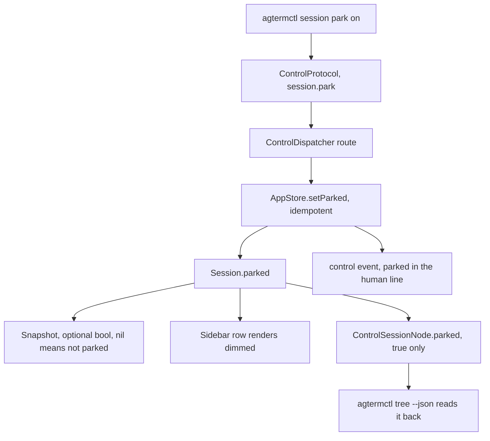

# Parked session state

A row whose agent has been killed to free memory, kept visible and marked as such.

## Contents

1. [What this adds](#what-this-adds)
2. [What it deliberately does not do](#what-it-deliberately-does-not-do)
3. [The shape](#the-shape)
4. [Where it plugs in](#where-it-plugs-in)
5. [Tasks](#tasks)
6. [Gates](#gates)
7. [Decisions worth keeping](#decisions-worth-keeping)

## What this adds

`Session.parked`, a persisted boolean, plus the four surfaces a session boolean needs in this project:
a control command, a dispatcher route, a CLI subcommand, and a read-back field. A parked row renders
dimmed in the sidebar.

The reason it exists: a Claude Code process costs 170 to 420 MB, and 56 of them were measured at
8.4 GB on this machine. `agterm-park` (in `~/dev/agterm-agents`) kills the process of a row you are
not using and restarts it later on the same conversation. Today it marks the row with a flag, a
watermark and a grey status dot, because there is nothing better. This gives it the real thing.

The whole feature is state plus rendering. agterm does not kill anything and does not know what
Claude is. The script owns the policy; the app owns the mark.

## What it deliberately does not do

Each of these was considered and rejected. A reviewer who sees them missing should read this section
rather than file them.

- **No menu item and no built-in action.** A chord that only dims a row, without killing the process
  the dim is claiming to describe, is a lie on screen. The useful chord is the script's `toggle`,
  which does both. Control and CLI only.
- **No effect on navigation, focus or reselection.** A parked row stays selectable, stays in
  `navigableSessions`, stays where it is in the tree. Touching `AppStore+Focus` or the close
  reselection would make this a behavior change rather than a mark.
- **Selecting a parked row does not clear the state.** Unparking has to type the resume line first;
  if selection cleared the mark, the row would look live while it was still an empty shell.
- **No site or README changes.** This is fork-only work. `site/commands.html`, `site/docs.html`,
  `README.md` and `CHANGELOG.md` stay untouched, the same way native zmx wrapping stays out of them.

## The shape



## Where it plugs in

`flagged` is the same shape and is the template to copy at every step: a `Bool` on `Session`, an
optional `Bool?` in `SessionSnapshot` where nil means false, a `session.flag` command with an
`on|off|toggle` argument, a `ControlSessionNode` field, and a row-rendering branch. Read how
`flagged` does each thing before writing `parked`, and follow it unless this document says otherwise.

The one deliberate difference: `session.flag` also has a `clear` mode that unflags everything and
ignores the target. `session.park` has no `clear`. Unparking every row at once would leave a screen
full of rows that look live and hold nothing.

Files, with what changes in each:

| File | Change |
|---|---|
| `agtermCore/Sources/agtermCore/Session.swift` | `public var parked: Bool = false`, next to `flagged` |
| `agtermCore/Sources/agtermCore/Snapshot.swift` | `parked: Bool?` in `SessionSnapshot`, its init, `CodingKeys` and the tolerant decode |
| `agtermCore/Sources/agtermCore/AppStore.swift` | `setParked(_:on:)`, idempotent, saves once; mirror `setFlag` |
| `agtermCore/Sources/agtermCore/ControlProtocol.swift` | `case sessionPark = "session.park"`, `parked` on `ControlSessionNode` |
| `agtermCore/Sources/agtermCore/ControlDispatcher.swift` | route `.sessionPark` beside `.sessionFlag` |
| `agtermCore/Sources/agtermctlKit/SessionCommands.swift` | `ParkCommand`, mirroring `FlagCommand` minus `clear` |
| `agterm/Views/WorkspaceSidebar+RowRendering.swift` | dim the row label and icon when parked |
| `agtermCore/Sources/agtermCore/AppStore.swift` (tree build) | pass `parked:` into the node, around line 277 |

## Tasks

Each task is one commit, red test first. Run only that task's own narrow test command; the wide gates
run once at the end.

### Task 1: the model and its persistence

`Session.parked` and `SessionSnapshot.parked`. A snapshot written with the field absent must decode
as not parked, and a round trip must preserve true. Follow the `flagged` decode, which is already
tolerant of a missing key.

Test: `agtermCore/Tests/agtermCoreTests/PersistenceTests.swift`.
Run: `cd agtermCore && swift test --filter PersistenceTests`

- [x] `Session.parked` and `SessionSnapshot.parked`, captured, restored and tolerantly decoded

### Task 2: setting it on the store

`AppStore.setParked(id:on:)`. Idempotent: setting what is already set does nothing and writes
nothing. It does not touch selection, focus, the flagged set or the sidebar mode.

Test: `agtermCore/Tests/agtermCoreTests/AppStoreTests.swift`.
Run: `cd agtermCore && swift test --filter AppStoreTests`

- [x] `AppStore.setParked(id:on:)`, idempotent, touching nothing else

### Task 3: the control command

`session.park` with an `on|off|toggle` argument, defaulting to `toggle`, validated before it mutates.
An unknown mode is a validation error, not a silent no-op. Route it in `ControlDispatcher` beside
`.sessionFlag`, and add it to the same command list at line 192 that groups the session-targeted
commands.

Test: `agtermCore/Tests/agtermCoreTests/ControlProtocolTests.swift`.
Run: `cd agtermCore && swift test --filter ControlProtocolTests`

- [x] `session.park` with a validated `on|off|toggle` argument, routed in the dispatcher

### Task 4: the read-back

`ControlSessionNode.parked`, reported true-only so an unparked row does not grow a field. Wire it in
the tree build in `AppStore.swift`.

Test: extend the tree-shape test in `ControlProtocolTests`.
Run: `cd agtermCore && swift test --filter ControlProtocolTests`

- [x] `ControlSessionNode.parked`, true-only, wired into the tree build

### Task 5: the CLI

`agtermctl session park on|off|toggle [--target]`, mirroring `FlagCommand`. Its help text says what
parking means in one line: the row is kept, its agent is not.

Run: `cd agtermCore && swift build`

- [x] `agtermctl session park on|off|toggle [--target]`

### Task 6: the event

The parked argument appears in `EventFormatter.human`, not only in the JSON payload. This is a
project rule, and every state-setting command already follows it.

Run: `cd agtermCore && swift test --filter EventFormatter`

- [x] the parked argument in `EventFormatter.human`

### Task 7: the dimmed row

In `WorkspaceSidebar+RowRendering.swift`, a parked row draws at reduced contrast: the label in
`.secondaryLabelColor` (or the equivalent alpha the row already uses for a non-selected row) and the
icon tinted to match. Keep it a rendering branch, not a new cell type.

Two things to get right, both of which the existing code already has opinions about:

- the flat flagged view and the tree view both render sessions, so the branch belongs where
  `flagged` is resolved for the icon, not in one of the two callers;
- a selected parked row must stay readable. Selection wins over the dim.

Run: `make build`, then check the row by eye is not required — the hosted test below is what proves it.

Test: `agtermTests`, asserting the rendering branch chooses the dimmed attributes for a parked
session. If the rendering is not reachable from a hosted test without a window, assert the pure
helper that decides the attributes instead, and put that helper in `agtermCore`.

- [x] a parked sidebar row draws dimmed, and selection still wins over the dim

### Task 8: the fork's own documentation

`.claude/rules/control-api.md` gains `session.park` in the catalog and one line in the state-setting
list. The bundled skill under `plugins/agterm/skills/agterm/` gains the command, because it is the
source for the installed Claude and Codex copies and the script's author reads it.

Task 6 also added an event kind, `session.parked`, so the skill's event-kind list (`SKILL.md`'s
`--kind` line and `reference.md`'s kind descriptions) needs it too.

No other documentation surface. See "What it deliberately does not do".

- [x] `session.park` in `.claude/rules/control-api.md` and in the bundled skill

## Gates

Once, at the end, from the worktree root:

```sh
cd agtermCore && swift test
make build
make test-app
make lint
```

`make test-app` is not optional here. `swift test`, `make lint` and `make build` do not compile
`agtermTests`, so a change that breaks the hosted target passes all three.

## Decisions worth keeping

- **nil means not parked** in the snapshot, so an older state file decodes without a migration and a
  row that was never parked adds no bytes.
- **No `clear` mode**, unlike `session.flag`. Explained above.
- **The app never kills anything.** If a later change makes agterm stop the process itself, the
  conversation id has to come with it, and that belongs to the script, not to `agtermCore`.
- **`agterm-park` keeps working unchanged** while this lands. It sets flag, watermark and status
  today; switching it to `session park` is a follow-up in `~/dev/agterm-agents`, not a task here.
