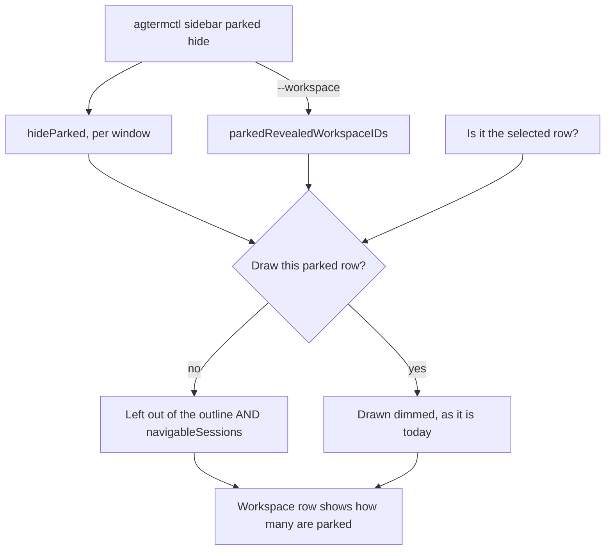

# Hiding parked rows

Parked rows optionally leave the sidebar, with the workspace saying they are there.

## Contents

1. [What this adds](#what-this-adds)
2. [Why this reverses a decision in the last plan](#why-this-reverses-a-decision-in-the-last-plan)
3. [The state, and what it copies](#the-state-and-what-it-copies)
4. [What it deliberately does not do](#what-it-deliberately-does-not-do)
5. [The shape](#the-shape)
6. [Tasks](#tasks)
7. [Gates](#gates)
8. [Traps](#traps)

## What this adds

A parked row can be hidden from the workspace tree, per window, with a per-workspace
exception. The workspace row says how many of its rows are parked whether they are hidden or
not, so nothing disappears without trace.

Twenty-seven rows are parked on this machine as this is written. That is the problem: parking
frees the memory and leaves the sidebar exactly as long as it was.

## Why this reverses a decision in the last plan

`20260814-parked-session-state.md` says, in writing, that parked has **no effect on
navigation, focus or reselection**, and that a parked row stays in `navigableSessions`. That
was right for a mark. It is wrong for a hide: a row you cannot see must not be a row `j` steps
onto. This plan changes that deliberately, and the earlier plan's line should be read as
superseded rather than as a rule this one is breaking by accident.

## The state, and what it copies

`focusEnabled` plus `focusedWorkspaceIDs` is already a per-window flag plus a persisted set of
workspace ids, with a restore that prunes ids absent from the tree and disables when the pruned
set comes back empty. `AppStore+Focus.swift` documents why: an all-stale set restores as an
enabled-but-invisible filter and the read-back lies.

This plan adds the same pair and inherits that lesson:

| New state | Mirrors | Meaning |
|---|---|---|
| `hideParked: Bool` | `focusEnabled` | is hiding on for this window |
| `parkedRevealedWorkspaceIDs: Set<UUID>` | `focusedWorkspaceIDs` | workspaces that show them anyway |

## What it deliberately does not do

- **The selected row is never hidden**, even when parked. Parking the row you are sitting in
  would otherwise make it vanish while its pane is still on screen. The flagged view does allow
  exactly that today; this does not copy it. The row leaves the tree once the selection moves
  off it.
- **No auto-hiding.** Parking does not turn hiding on. The two are separate: one frees memory,
  the other tidies the sidebar.
- **No new hidden-row concept.** Hiding is a projection over `parked`, which already exists. A
  row is not "hidden" in the model; it is parked, and the sidebar is choosing not to draw it.

## The shape



## Tasks

Each task is one commit, red test first. Run only that task's own narrow test command; the wide
gates run once at the end.

### Task 1: the window state and its persistence

- [x] `hideParked: Bool` and `parkedRevealedWorkspaceIDs: Set<UUID>` on the window state, beside
      `focusEnabled` and `focusedWorkspaceIDs`
- [x] both captured and restored in the window snapshot, absent-decodes-as-off
- [x] restore PRUNES revealed ids that name no workspace in the restored tree, the same way
      `restoreFocus` does, and a set that prunes to empty leaves `hideParked` alone — unlike
      focus, an empty exception set is a normal state, not a broken one
- [x] run `cd agtermCore && swift test --filter PersistenceTests`

### Task 2: one predicate, asked everywhere

- [x] `AppStore.isRowVisible(_ session:)`, or a name the reviewer prefers: false only when the
      session is parked, `hideParked` is on, its workspace is not in the revealed set, and it is
      not the selected session
- [x] pure and read-only; no other code may spell this rule inline
- [x] tests for each of the four clauses, including the selected-row exemption
- [x] run `cd agtermCore && swift test --filter AppStoreTests`

### Task 3: navigation stops stepping onto hidden rows

- [x] `navigableSessions` filters through the predicate from Task 2, in every mode it already
      handles: `.flagged`, the focus filter, and plain tree
- [x] `next`/`previous` wrap within the visible set, `first`/`last` hit its ends
- [x] attention navigation uses the same set, so a parked row cannot pull focus into hidden
      territory
- [x] run `cd agtermCore && swift test --filter AppStoreFocusTests`

### Task 4: the control command

- [x] `sidebar.parked show|hide|toggle`, with an optional `--workspace <id|active|all>`
- [x] no scope sets the window flag; `--workspace <id>`/`active` edits the exception set;
      `--workspace all` clears the set and applies the mode everywhere
- [x] validated before it mutates; an unknown mode or an id naming no workspace is an error, not
      a silent no-op — a phantom member is what broke the focus read-back
- [x] run `cd agtermCore && swift test --filter ControlProtocolTests`

### Task 5: the read-back

- [x] `parkedHidden` on the window node, true-only
- [x] `parkedCount` on `ControlWorkspaceNode`, omitted when zero, counting the workspace's parked
      rows whether or not they are drawn
- [x] `revealsParked` true-only on a workspace in the exception set
- [x] run `cd agtermCore && swift test --filter ControlProtocolTests`

### Task 6: the CLI

- [x] `agtermctl sidebar parked show|hide|toggle [--workspace <id|active|all>]`
- [x] run `cd agtermCore && swift build`

### Task 7: the outline leaves them out

- [x] the sidebar's session rows come from the Task 2 predicate, in tree mode and in the flat
      flagged view alike
- [x] a park or unpark reloads the affected workspace's children rather than the whole outline
- [x] the selected row survives being parked, and leaves on the next selection change
- [x] run `make build` and `./scripts/test-app.sh -only-testing:agtermTests/SidebarParkedRowTests`

### Task 8: the workspace says they are there

- [x] a workspace holding parked rows draws a dim `⏸ N` suffix after its name
- [x] keyed on the FACT, not on `hideParked` — the focused-workspace icon is keyed on membership
      alone for the same reason, so the set stays legible with the filter off
- [x] NOT the badge slot: that carries the unseen roll-up, and two numbers in one slot is a lie
      about at least one of them
- [x] run `./scripts/test-app.sh -only-testing:agtermTests/SidebarParkedRowTests`

### Task 9: the fork's own documentation

- [x] `.claude/rules/sidebar.md` gains the predicate and the state pair
- [x] `.claude/rules/control-api.md` gains `sidebar.parked` and the three read-back fields
- [x] the bundled skill under `plugins/agterm/skills/agterm/` gains the command
- [x] no `site/`, `README.md` or `CHANGELOG.md` changes — fork-only work

## Gates

Once, at the end, from the worktree root:

```sh
cd agtermCore && swift test
make build
make test-app
make lint
```

⚠️ `make test-app` is currently RED on `main` for reasons that predate this work:
`NormalModeKeyRoutingTests` and three other suites die with the host exiting code 5, and a peer
session (`testapp-red`) is investigating. Judge this branch by whether it adds failures, not by
a green run, and say which suites failed.

## Traps

- ⚠️ **`navigableSessions` is the only seam that scopes navigation.** Filtering the outline
  without filtering that list gives you `j` landing on rows that are not drawn.
- **`disableFocusIfSelectionOutsideSet` already handles "the selection left the visible set"** by
  turning the filter off. Do not add a second, different answer for parked — the selected-row
  exemption in Task 2 means the case cannot arise from parking, and an explicit cross-set select
  is still that function's business.
- **Unparking a hidden row happens from outside the sidebar** — `agterm-park`'s picker unparks by
  id. Clearing `parked` is what brings the row back; nothing here needs a special path for it.
