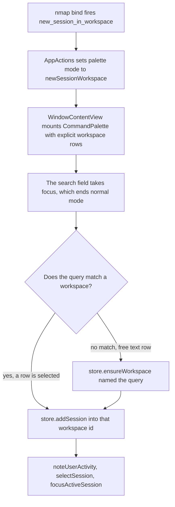

# Pick a workspace for a new session

## Overview

Today the GUI can only create a session in the *current* workspace. `AppActions.newSession()`
(`agterm/AppActions.swift:129`) reads `store.currentWorkspaceID` and never asks. So do File ▸ New Session,
⌘N, and Open Directory.

The control API already does better: `session.new` accepts `--workspace`, `--workspace-name` and
`--create-workspace`. A script can put a session anywhere. A person cannot, without switching workspaces
by hand first.

This adds one keyless built-in action, `new_session_in_workspace`, that opens a native picker listing the
workspaces. You choose one and the session is created there, selected and focused. Typing a name no
workspace has creates that workspace first.

The picker is not new machinery. `CommandPalette` (`agterm/Views/Palette.swift:96`) already renders a
caller-supplied item list with fuzzy filter, arrow keys, Return and Escape — the same seam the control
API's `pick.open` uses. This feature reuses it.

Reaching the action is a normal-mode leader sequence the user writes themselves, for example:

```
nmap space>n>w new_session_in_workspace
```

No default chord, no menu item, no command-palette row. That was the explicit decision.

## Context (from discovery)

- **Files involved**: `agtermCore/Sources/agtermCore/{BuiltinAction,PaletteCustomRow}.swift`,
  `agterm/Views/{Palette,WindowContentView}.swift`, `agterm/AppActions+Palette.swift`,
  `agterm/Commands/CustomCommandRunner.swift`.
- **Patterns to copy**: `paletteSessions()` / `paletteItem(for session:in:)`
  (`agterm/AppActions+Palette.swift:242`, `:261`) for the row builder;
  `pickPaletteOverlay` (`agterm/Views/WindowContentView.swift:658`) for the explicit-items mount;
  `toggleSessionPalette()` (`agterm/AppActions+Palette.swift:291`) for the launcher.
- **Store methods already in place**: `AppStore.addSession(toWorkspace:cwd:)` (`AppStore.swift:389`) and
  `AppStore.ensureWorkspace(named:)` (`AppStore.swift:376`) — the latter is what backs
  `session.new --workspace-name --create-workspace`, so the picker and the CLI create workspaces the
  same way.
- **Two facts that keep the ending simple**: `addSession` already calls
  `disableFocusIfSelectionOutsideSet` (`AppStore.swift:405`), so a session added into a workspace hidden by
  the sidebar workspace filter reveals it; and `currentWorkspaceID` follows the selected session's
  workspace (`AppStore.swift:221`), so no separate `selectWorkspace` call is needed.
- **Normal mode needs no special handling**: a focused `NSText` ends the mode and passes its key through
  (`.claude/rules/keymap.md`), which is exactly what the palette's search field is. The three existing
  palette launchers rely on the same thing and are not in `BuiltinAction.leavesNormalMode`.

## Development Approach

- **parallel waves**: none — the chain is build-then-use (`PaletteMode` case → the actions that open it →
  the view branch that mounts it → the keymap merge that dispatches it). The only two genuinely
  independent tasks are a few lines each, so worktree setup would cost more than it saves.
- **testing approach**: Regular (code first, then tests in the same task)
- complete each task fully before moving to the next
- make small, focused changes
- **every task includes new/updated tests** for the code it changes, except Task 2, which is view
  plumbing with no unit-testable surface — its gate is `make build` and its behavior is covered by Task 3's
  hosted tests
- **all tests must pass before starting the next task**
- run the narrow per-task command after each change; the wide gates run once, in the verify task
- maintain backward compatibility: `pickCustomRowLabel`'s existing callers keep their current output

## Testing Strategy

- **unit tests, host-free** (`cd agtermCore && swift test`): the custom-row label verb, the new
  `BuiltinAction` raw value and its nil `defaultChord`, and `nmap` parsing of the new token.
- **unit tests, hosted AppKit** (`scripts/test-app.sh -only-testing:...`): the workspace row builder, both
  create paths, the palette toggle, and the keyless `map` dispatch.
- **e2e / XCUITest**: none. `agtermUITests/ControlAPIUITests` alone is about seven minutes and tells you
  nothing the targeted hosted runs do not. A picker UI test would also need a keymap.conf written into an
  isolated state dir just to bind the keyless action, which is disproportionate here.

## Progress Tracking

- mark completed items with `[x]` immediately when done
- add newly discovered tasks with ➕ prefix
- document issues/blockers with ⚠️ prefix
- update this plan if implementation deviates from scope

## Solution Overview



Key decisions:

- **Reuse the explicit-items seam, do not add a new picker.** `CommandPalette` already takes `items:`,
  `prompt:`, `allowCustom:`, `onCustom:` and `onDismiss:`. The new `PaletteMode` case only exists to gate
  the overlay's presence; the rows come in through the parameters, exactly as a control-API pick does.
- **Do not reuse `PickController`.** `PendingPick` is `Equatable, Sendable` and carries no callback — it is
  shaped for the control API's poll-for-result contract, not for an in-app completion handler.
- **No control command to open the picker.** No existing palette has one, and the headless equivalent of
  this whole feature already exists as `session.new --workspace-name --create-workspace`. This is the
  visual-only exemption the project rules ask to be called out.

## Technical Details

- `pickCustomRowLabel(query:filteredCount:allowCustom:)` gains `verb: String = "Use"` and returns
  `"\(verb) \"\(value)\""`. The control-API picker keeps saying `Use "rele"`; this picker says
  `Create workspace "rele"`.
- `PaletteMode.newSessionWorkspace`'s arm in `CommandPalette.allItems` returns `[]` and always will: the
  mount site supplies `items:`, so `explicitItems != nil` and `allItems` is never consulted for this mode.
  The arm exists only to keep the switch exhaustive.
- The new `accessibilityID` parameter replaces the `explicitItems == nil` ternary that currently picks
  between `command-palette`/`palette-scrim` and `pick-palette`/`pick-scrim`
  (`agterm/Views/Palette.swift:220`, `:263`). Without it this picker would report as the control-API picker.
- Workspace rows: title is `workspace.name`, subtitle is the session count, source order is
  `store.workspaces` order. Filtering on the explicit-items path matches the label only
  (`agterm/Views/Palette.swift:182`), so the name is what you search and the count is display only.

## What Goes Where

- **Implementation Steps**: all code, tests and repo-doc updates.
- **Post-Completion**: the manual look at it in an isolated Debug instance.

## Implementation Steps

### Task 1: Let the picker's free-text row say "Create workspace"

**Files:**
- Modify: `agtermCore/Sources/agtermCore/PaletteCustomRow.swift` (`pickCustomRowLabel`)
- Modify: `agtermCore/Tests/agtermCoreTests/PickCustomRowTests.swift` (add cases beside the existing ones)

**Model:** haiku

- [x] add `verb: String = "Use"` as the last parameter of `pickCustomRowLabel` and build the label from it
- [x] keep the nil conditions unchanged (`allowCustom`, `filteredCount == 0`, non-blank trimmed query)
- [x] write a test that the default verb still produces `Use "foo"` for existing callers
- [x] write a test that a custom verb produces `Create workspace "foo"`
- [x] write a test that a blank or whitespace-only query still returns nil with a custom verb
- [x] run `cd agtermCore && swift test --filter PickCustomRowTests` — must pass before task 2

### Task 2: Add the palette mode and a per-picker accessibility identifier

**Files:**
- Modify: `agterm/Views/Palette.swift` (`PaletteMode`, `CommandPalette.init`, `allItems`, `placeholder`,
  the two `accessibilityIdentifier` call sites, the `pickCustomRowLabel` call in `updateFiltered`)

**Model:** sonnet

- [x] add `case newSessionWorkspace` to `PaletteMode`
- [x] add the `allItems` arm returning `[]`, with a one-line comment that the mount site supplies `items:`
- [x] add `accessibilityID: (panel: String, scrim: String)?` (or an equivalent single parameter) to
      `CommandPalette.init`, defaulting to nil, and use it in place of the two `explicitItems == nil`
      ternaries at `:220` and `:263`
- [x] add `customVerb: String = "Use"` to `CommandPalette.init` and pass it to `pickCustomRowLabel`
- [x] add the `placeholder` arm for the new mode — kept the `default:` arm as the plan prefers: the
      explicit-items early return in `placeholder` answers with the mount site's `prompt:` first, so a
      bespoke arm for this mode would be dead code
- [x] ⚠️ no unit test in this task: it is view plumbing with no testable seam. Its gate is the build, and
      Task 3's hosted tests exercise the mode it adds
- [x] run `make build` — must pass before task 3

### Task 3: Add the built-in action and the workspace create paths

**Files:**
- Modify: `agtermCore/Sources/agtermCore/BuiltinAction.swift` (add the case to the enum block ending at
  `case dashboard` / `case normalMode`, and to the nil arm of `defaultChord` listing `.normalMode,
  .overlayRedirectToggle`)
- Modify: `agterm/AppActions+Palette.swift` (add the row builder next to `paletteSessions()`, the launcher
  next to `toggleSessionPalette()`, and the new case in `paletteLessHandler(for:)`)
- Modify: `agtermCore/Tests/agtermCoreTests/BuiltinActionTests.swift` (the raw-value / default-chord
  pinning suite)
- Modify: `agtermCore/Tests/agtermCoreTests/KeymapTests.swift` (beside the existing `nmap` parsing tests)
- Modify: `agtermTests/AppActionsPaletteTests.swift` (beside the existing palette-builder tests)

**Model:** opus

- [x] add `case newSessionInWorkspace = "new_session_in_workspace"` to `BuiltinAction` and to the nil arm
      of `defaultChord`; do **not** add it to `leavesNormalMode` — the palette's text field already ends
      the mode, as it does for the three existing palette launchers
- [x] add `paletteNewSessionWorkspaces() -> [PaletteItem]` building one row per `store.workspaces` entry,
      title = name, subtitle = session count, `run` calling `newSession(inWorkspace:)`
- [x] add `newSession(inWorkspace: UUID)`: `store.addSession(toWorkspace:cwd: resolvedNewSessionCwd())`,
      then `noteUserActivity()`, `selectSession(...)`, `focusActiveSession()`, mirroring
      `AppActions.newSession()` (`agterm/AppActions.swift:129`) including its `uiActionsEnabled` guard
- [x] add `newSessionInNewWorkspace(named: String)`: `store.ensureWorkspace(named:)` then the same ending
- [x] add `toggleNewSessionWorkspacePalette()` next to `toggleSessionPalette()`
- [x] add `case .newSessionInWorkspace: return { self.toggleNewSessionWorkspacePalette() }` to
      `paletteLessHandler(for:)` — required, not optional: `AppActionsPaletteTests` partitions
      `BuiltinAction.allCases` across that function and `PaletteCommand`, so a missing case fails a test
- [x] write host-free tests: the new raw value round-trips, and `defaultChord` is nil
- [x] write a host-free test that `nmap space>n>w new_session_in_workspace` resolves to
      `KeybindTarget.builtin(.newSessionInWorkspace)`
- [x] write hosted tests: the row builder lists every workspace in store order; running a row creates a
      session in that workspace and selects it; `newSessionInNewWorkspace(named:)` creates the workspace
      and the session in it; the toggle sets and clears `palette.mode`
- [x] run `cd agtermCore && swift test --filter 'BuiltinActionTests|KeymapTests'` and
      `./scripts/test-app.sh -only-testing:agtermTests/AppActionsPaletteTests` — both must pass before
      task 4

### Task 4: Mount the picker in the window

**Files:**
- Modify: `agterm/Views/WindowContentView.swift` (`commandPaletteOverlay`, at `:648`)

**Model:** sonnet

- [x] add a branch for `palette.mode == .newSessionWorkspace` that builds `CommandPalette` with
      `items: actions.paletteNewSessionWorkspaces()`, `prompt: "New session in workspace…"`,
      `allowCustom: true`, `customVerb: "Create workspace"`,
      `onCustom: { actions.newSessionInNewWorkspace(named: $0) }`, the new accessibility identifiers
      (`new-session-workspace-palette` / `new-session-workspace-scrim`), and `onDismiss: { palette.close() }`
- [x] ⚠️ `onDismiss` is mandatory: on the explicit-items path `CommandPalette.dismiss()` does not call
      `controller.close()` itself (`agterm/Views/Palette.swift:336`), so without it the palette never closes
- [x] keep the existing `isFrontmost, pick.pending == nil` conditions on both branches
- [x] no test added: `commandPaletteOverlay` is a private `@ViewBuilder` on `WindowContentView` with no
      seam to reach the branch condition from a hosted test. Coverage is Task 3's toggle test (the mode the
      branch reads) plus the build
- [x] run `make build` and `./scripts/test-app.sh -only-testing:agtermTests/AppActionsPaletteTests` — must
      pass before task 5

### Task 5: Make a single-chord `map` on the new action actually fire

**Files:**
- Modify: `agterm/Commands/CustomCommandRunner.swift` (`rebuild()`, the block merging `keymap.equivalent(for:)`
  for `.normalMode` and `.overlayRedirectToggle`)
- Modify: `agtermTests/CustomCommandRunnerTests.swift` (beside the existing keyless-action dispatch tests)

**Model:** sonnet

- [x] ⚠️ add the third merge line for `.newSessionInWorkspace`, matching the two above it. A built-in with
      no menu item cannot be dispatched from a single-chord `map` line: it lands in `builtinOverrides` with
      nothing to fire it. The three existing palette launchers escape this only because they have Navigate
      menu items carrying the shortcut (`agterm/agtermApp+Menus.swift:314-323`). Without this line,
      `map ctrl+cmd+n new_session_in_workspace` parses cleanly and then does nothing.
      `.claude/rules/keymap.md` flags this block by name; this is the third entry it warned about
- [x] write a test that a single-chord `map` on the new action reaches its dispatch
- [x] write a test that an `nmap` bind on it still reaches dispatch with the merge line present
- [x] run `./scripts/test-app.sh -only-testing:agtermTests/CustomCommandRunnerTests` — must pass before
      task 6

### Task 6: Verify acceptance criteria

- [x] verify the picker lists every workspace in sidebar order and filters by name
- [x] verify picking a workspace creates the session there, selects it and focuses it
- [x] verify typing an unmatched name creates the workspace and the session in it
- [x] verify a blank query shows no free-text row
- [x] verify ⌘N, File ▸ New Session and Open Directory still target the current workspace —
      `agterm/AppActions.swift` is untouched by this branch, so all three still read `currentWorkspaceID`
- [x] run the full host-free suite: `cd agtermCore && swift test` — 2883 tests pass
- [x] run the full hosted suite: `make test-app` — 329 tests pass, 4 skipped
- [x] run `make lint` — zero findings required
- [x] ➕ ⚠️ fix `SocketClientTests.formatsAPipeFreeKeymapByteIdenticallyToThePreAlternativesOutput`: it pins
      the `agtermctl keymap` listing byte for byte and that listing enumerates every `BuiltinAction`, so the
      new action needs its own `new_session_in_workspace    -` line in the fixture. Only the full host-free
      run catches this; the Task 3 `--filter 'BuiltinActionTests|KeymapTests'` gate cannot

### Task 7: [Final] Update documentation

**Files:**
- Modify: `.claude/rules/keymap.md` (the keyless-action section naming the `rebuild()` merge block)
- Modify: `.claude/rules/menu-actions.md` (the palette-modes section)
- Modify: `plugins/agterm/skills/agterm/reference.md` (the bindable built-in action list)

**Model:** haiku

- [x] record the new keyless action in `.claude/rules/keymap.md` and that the `rebuild()` merge block now
      holds three entries, not two
- [x] record the new palette mode in `.claude/rules/menu-actions.md`
- [x] add the `new_session_in_workspace` token to the bindable-action list in the bundled skill
- [x] leave `CHANGELOG.md`, `README.md` and `site/` untouched — this is fork-only work
- [x] move this plan to `docs/plans/completed/`

## Post-Completion

**Manual verification** (optional, the hosted tests already cover the behavior):

Launch a separate Debug instance with isolated state, per the CLAUDE.md rules — a short `/tmp`
`AGTERM_STATE_DIR`, `mkdir -p "$AGTERM_STATE_DIR/windows"` first, and a `keymap.conf` in
`<stateDir>/config` holding `map ctrl+space normal_mode` and `nmap space>n>w new_session_in_workspace`.
Then create two or three workspaces, press the normal-mode chord followed by the leader sequence, pick a
workspace that is not the current one, and check the session lands there. Reopen and type a name no
workspace has to check the create path.

⚠️ Never point `agtermctl` at the default socket while doing this, and never quit or relaunch the deployed
app.

**Worth revisiting later**:

No menu item means nothing in the app advertises this action — it exists only for whoever writes the
`nmap` line. If the picker turns out useful, a Navigate menu item would both fix discovery and make the
Task 5 merge line unnecessary.
