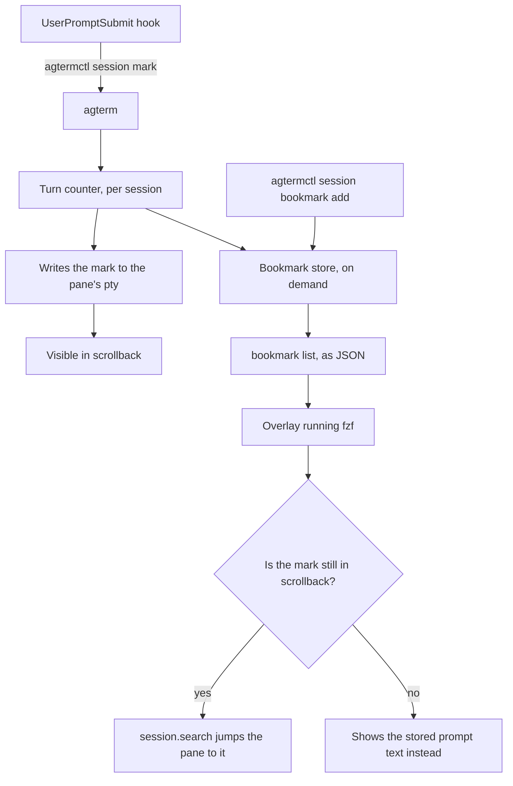

# Conversation bookmarks

## Contents

1. [Context](#1-context)
2. [What was proven by hand](#2-what-was-proven-by-hand)
3. [The shape](#3-the-shape)
4. [The turn mark](#4-the-turn-mark)
5. [The bookmark store](#5-the-bookmark-store)
6. [Commands](#6-commands)
7. [Deliberately not doing](#7-deliberately-not-doing)
8. [Tasks](#8-tasks)
9. [Verification](#9-verification)

## 1. Context

Sasha wants to mark a turn in an agent conversation — its prompt and its response — and come back to
it later without scrolling. Picking from recent turns should work too, and getting back to the live
spot in the pane is wanted if it is reachable.

It is reachable, but only one way. agterm has exactly one mechanism that moves a pane's viewport:
`session.search`, which matches visible text (`agterm/Control/ControlServer+SurfaceIO.swift:345`).
There is no API to read where the viewport currently sits and none to scroll to a coordinate — the
whole `ghostty_surface_*` C surface was checked. So a bookmark can never record "the spot". It can
only record something findable, and search for it later.

That is why the design turns on a **visible numbered mark** written into the pane at the start of
each turn. The number is unique by construction, which a prompt-text search is not: a short or
repeated prompt matches the wrong place or nothing.

Fork-only. Not offered upstream.

## 2. What was proven by hand

Two experiments were run in a live pane before this plan was written. Both results are load-bearing.

- ⚠️ **A hook cannot write to `/dev/tty`.** It fails with ENXIO, `device not configured`, because
  Claude Code detaches its children from the pane's pty. A `tty` call from the same context answers
  `not a tty`. Any design that has the hook write through the controlling terminal is dead on
  arrival.
- ✅ **Writing to the pty by absolute path works**, needs no controlling terminal, survives Claude
  Code's rendering, and lands on its own line at the turn boundary. Verified by writing
  `── turn 7 ──` to `/dev/ttys152` and reading it back out of the pane's own buffer with
  `agtermctl session text`.
- The written line came back **padded to the full terminal width**. The source of the padding was not
  established, so nothing here may depend on the mark's rendered width. The search needle is a short
  token, never the decorated line.

## 3. The shape

**agterm writes the mark, not the hook.** The hook does exactly what
`agterm/Resources/agent-status/agterm-agent-status.sh:46` already does — one `agtermctl` call with
`--target "$AGTERM_SESSION_ID"`. agterm owns the pty, the turn counter and the mark's text.

This was reconsidered mid-design. The earlier shape had the hook resolve the pty itself and write the
mark, which works but needs the hook to learn the pty path, and leaves **two turn counters that have
to agree** — the hook's and the store's. One counter in one place cannot drift.

- The stored text is what makes a missing mark survivable. Scrollback does not outlive a restart, so
  an old bookmark's mark is often gone; Sasha confirmed the text alone carries enough context.
- ⚠️ Nothing in the app knows a turn ended. Only turn STARTS are marked, so a bookmark points at the
  beginning of a turn and the response is whatever follows it.

## 4. The turn mark

Written by agterm into the pane's pty at each turn start.

- **Visible form**: `── ⟦N⟧ ──`, on its own line, preceded by a blank line.
- **Search needle**: `⟦N⟧` alone.
- ⚠️ The needle must not be the decorated line and must not be a phrase like `turn 7`. The rendered
  line reflows, and `turn 7` is ordinary prose that an agent writes by accident — while writing this
  plan a search for it matched two unrelated lines. `⟦` and `⟧` (mathematical white square brackets)
  are effectively never typed.
- The formatting and the needle live together in one host-free type in `agtermCore`, so the string
  that is written and the string that is searched for cannot drift apart. Never spell either inline.
- The counter is per session, monotonic, ephemeral (not persisted, like `unseenCount`). A restart
  resets it, and that is fine: the scrollback it would collide with is gone too.
- A failed write is not an error. The command still returns the number and the bookmark still works —
  it just loses the jump.

## 5. The bookmark store

Host-free, in `agtermCore`, persisted in its own file rather than inside the window snapshot. The
snapshot is delicate and already carries a documented all-or-nothing version reset
(`Snapshot.swift:12`); bookmarks do not belong in that blast radius.

A `Bookmark` carries: session id, turn number, the prompt text captured at mark time, and a
created-at stamp.

- **Dedup is keyed on session id plus turn number.** Bookmarking the same turn twice updates the
  existing entry instead of adding a second. Sasha asked for this explicitly, and the turn number is
  what makes it possible.
- **A session that goes away takes its bookmarks with it** — ditched, not orphaned. Drop them on
  session close.
- Scope is per session, with a cross-session listing for the hub view.

## 6. Commands

All fork-only. One new family plus one marking command.

| command | what |
|---|---|
| `session.mark` | increment the turn counter, write the mark, return the number |
| `session.bookmark add` | bookmark a turn (the current one by default) |
| `session.bookmark list` | JSON for the fzf overlay; `--all` spans sessions |
| `session.bookmark go` | search the pane for that bookmark's mark |
| `session.bookmark remove` | drop one |

Read-back: bookmark count on `ControlSessionNode`, per the cross-surface rule in CLAUDE.md. The turn
counter goes there too, since `session.mark` sets state.

**A HUD toast confirms an add.** `session.hud` already renders a caller-supplied panel and `hud.sh`
manages its own exit. ⚠️ The HUD shares the session's single overlay slot, so `openHud` answers
`overlay already open` when an overlay is up (`ControlServer+Hud.swift:26`). The toast must be
allowed to fail without failing the add. Do not use `notify` — it is a desktop notification and it
bumps the unseen badge, which the new attention pill would then display.

## 7. Deliberately not doing

- **No browsing UI in the app.** The picker is an overlay running fzf over `bookmark list --all`,
  matching the roadmap's decision that agterm owns data and commands while views are terminal
  programs in overlays. Do not build a popover, a palette entry or a sidebar mode.
- **No end-of-turn mark.** Only turn starts. A second mark per turn doubles the scrollback noise to
  answer a question nobody asked.
- **No `InterfaceElement` and no Settings entry.** Nothing here is hideable chrome.
- ⚠️ **Do NOT touch `plugins/agterm/skills/agterm/`, `site/commands.html`, `README.md` or
  `CHANGELOG.md`.** These are fork-only commands. Those surfaces describe upstream agterm and the
  bundled skill pins an upstream command count that `SkillInstallTests` checks. Fork-only work is
  documented in `.claude/rules/` only.
- ⚠️ **Never run the installed hooks or the Help ▸ Install installers during this work.** They write
  to `~/.config/agterm/`, `~/.claude/settings.json` and `~/.codex/`, which `AGTERM_STATE_DIR` does not
  isolate. Installer behavior is verified through `agtermCore` tests, never by running it.

## 8. Tasks

### Task 1: The turn mark's text and needle

**Files:**
- Create: `agtermCore/Sources/agtermCore/TurnMark.swift`
- Create: `agtermCore/Tests/agtermCoreTests/TurnMarkTests.swift`

- [x] write failing tests: the rendered line contains the needle; the needle for turn N differs from
      turn N+1 and from turn NN containing N as a substring (10 must not match 1)
- [x] create `TurnMark` with `line(for:)` and `needle(for:)`, both host-free, no AppKit
- [x] run `cd agtermCore && swift test --filter TurnMark` — must pass before task 2

### Task 2: Bookmark model and store

**Files:**
- Create: `agtermCore/Sources/agtermCore/Bookmark.swift`
- Create: `agtermCore/Sources/agtermCore/BookmarkStore.swift`
- Create: `agtermCore/Tests/agtermCoreTests/BookmarkStoreTests.swift`

- [x] write failing tests: add then list round-trips; adding the same session and turn twice updates
      rather than duplicates; removing one leaves the rest; dropping a session drops only its own
- [x] write a failing test for persistence: encode and decode restores every field
- [x] create `Bookmark` (session id, turn number, prompt text, created-at) and `BookmarkStore` with
      add, list, remove and a drop-for-session, `Codable`, no CoreGraphics types
- [x] run `cd agtermCore && swift test --filter Bookmark` — must pass before task 3

### Task 3: Persist bookmarks to their own file

**Files:**
- Create: `agtermCore/Sources/agtermCore/BookmarkPersistence.swift`
- Modify: `agtermCore/Tests/agtermCoreTests/BookmarkStoreTests.swift` (add the load/save cases beside
  the existing ones)

- [x] write failing tests: a missing file loads empty rather than throwing; a corrupt file loads
      empty rather than throwing; save then load round-trips
- [x] implement load and save against a `bookmarks.json` in the state directory, following
      `PersistenceStore.swift`'s encoder settings but NOT joining the window snapshot
- [x] run `cd agtermCore && swift test --filter Bookmark` — must pass before task 4

### Task 4: `session.mark` — count the turn and write the mark

**Files:**
- Modify: `agtermCore/Sources/agtermCore/ControlProtocol.swift` (add the `Command` case beside
  `sessionStatus`, and the turn-number field on `ControlSessionNode`)
- Modify: `agtermCore/Sources/agtermCore/ControlDispatcher.swift` (route it in
  `dispatchSessionCommand`)
- Modify: `agtermCore/Sources/agtermCore/ControlActions.swift` (the protocol method)
- Modify: `agtermCore/Sources/agtermCore/Session.swift` (an ephemeral turn counter, `@ObservationIgnored`)
- Create: `agterm/Control/ControlServer+Mark.swift`
- Modify: `agtermCore/Tests/agtermCoreTests/ControlDispatcherTests.swift` (a case beside the
  `sessionStatus` routing tests)

- [x] write failing dispatcher tests: the command routes, the counter advances, an unknown target errors
- [x] add the `Command` case, the dispatcher route and the `ControlActions` method
- [x] implement the app side: resolve the surface, read its tty with `ghostty_surface_tty_name`, write
      `TurnMark.line(for:)` to that path
- [x] a failed write still returns ok with the number — the bookmark works without the jump
- [x] expose the turn number on `ControlSessionNode` in `AppStore.controlTree`
- [x] run `cd agtermCore && swift test --filter ControlDispatcher` — must pass before task 5

### Task 5: The `session.bookmark` command family

**Files:**
- Modify: `agtermCore/Sources/agtermCore/ControlProtocol.swift` (the four `Command` cases and their
  `ControlArgs` fields)
- Modify: `agtermCore/Sources/agtermCore/ControlDispatcher.swift` (`dispatchSessionCommand`)
- Modify: `agtermCore/Sources/agtermCore/ControlActions.swift`
- Create: `agtermCore/Sources/agtermctlKit/BookmarkCommands.swift`
- Modify: `agtermCore/Sources/agtermctlKit/Commands.swift` (register the subcommand in `subcommands:`)
- Modify: `agtermCore/Tests/agtermctlKitTests/CommandsTests.swift` (parsing cases beside the session ones)

- [x] write failing CLI-parsing tests for add, list, go and remove, including `list --all`
- [x] write failing dispatcher tests for each, including `go` on a bookmark whose mark is gone
- [x] implement the four commands; `go` fires the existing `session.search` path rather than a new one
- [x] `list` emits JSON suitable for piping into fzf
- [x] expose the bookmark count on `ControlSessionNode`
- [x] run `cd agtermCore && swift test --filter Bookmark` and `--filter Commands` — must pass before task 6

### Task 6: The HUD toast on add

**Files:**
- Modify: `agterm/Control/ControlServer+Mark.swift` (the add path)
- Modify: `agtermTests/` — a new test file for the add path's toast behavior

- [x] write a failing test: an add whose toast cannot open still succeeds
- [x] open a short-lived HUD naming the turn number, reusing the existing `session.hud` path
- [x] never fail the add when the toast fails
- [x] run `./scripts/test-app.sh -only-testing:<the new class>` — must pass before task 7

### Task 7: The hook that calls `session.mark`

**Files:**
- Modify: `agterm/Resources/agent-status/agterm-agent-status.sh` (or a sibling script — decide and say
  which in the commit message)
- Modify: `agtermCore/Sources/agtermCore/AgentHooksInstall.swift` (the `claudeHooks` table at line 48)
- Modify: `agtermCore/Tests/agtermCoreTests/` — the existing agent-hooks install tests

- [x] write failing tests that the installed `UserPromptSubmit` entry now also marks the turn
- [x] wire the hook, resolving the socket and target exactly as the status hook already does
- [x] ⚠️ do NOT run the installer. Verify through `agtermCore` tests only
- [x] run `cd agtermCore && swift test --filter AgentHooks` — must pass before task 8

### Task 8: Document it as fork-only

**Files:**
- Modify: `.claude/rules/control-api.md` (the fork-only command list)

**Model:** haiku

- [x] record the commands, the mark's text and needle, and that agterm writes the mark rather than the hook
- [x] record the two proven facts: `/dev/tty` fails with ENXIO from a hook, and the pty by absolute
      path works
- [x] record that `session.search` is the only viewport mover, so a bookmark can never store a position
- [x] confirm nothing was added to `plugins/`, `site/`, `README.md` or `CHANGELOG.md`

### Task 9: Verify acceptance criteria

- [x] verify a bookmark whose mark is gone still lists and still shows its text
- [x] verify dedup: the same turn bookmarked twice yields one entry
- [x] verify closing a session drops its bookmarks
- [x] verify the diff touches no upstream-facing surface: `git diff --name-only` lists nothing under
      `plugins/`, `site/`, `README.md`, `CHANGELOG.md`
- [x] run `cd agtermCore && swift test`
- [x] run `make build`
- [x] run `make test-app`
- [x] run `make lint` — ⚠️ two `file_length` violations in `AppStore.swift` and
      `ControlDispatcher.swift` are PREEXISTING and byte-identical to `main`. Do not split them and do
      not raise the limit. Any OTHER finding is this branch's and must be fixed.

### Task 10: [Final] Update documentation

- [x] update `CLAUDE.md` only if a genuinely new pattern was discovered — nothing new: every
      discovered fact is control-API-scoped and already recorded in `.claude/rules/control-api.md`
- [x] move this plan to `docs/plans/completed/`

## 9. Verification

Per-task commands are in each task. Once, at the end: `cd agtermCore && swift test`, `make build`,
`make test-app`, `make lint`.

⚠️ Do not run a whole XCUITest suite. `agtermUITests/ControlAPIUITests` alone is 82 methods and about
7.5 minutes and tells you nothing a targeted run does not.

⚠️ Do not verify by driving the running app. agterm is the terminal Sasha works in: never run
`agterm` or `agtermctl` against the default socket, never launch or quit the app, never run the hook
installers. Behavior is proved through the tests above.

The end-to-end check is Sasha's, by hand, after the branch lands: run a few turns, confirm the marks
appear and read acceptably, bookmark one, and jump back to it from the fzf overlay.

## Post-completion, not part of this run

The fzf hub overlay itself — a script over `bookmark list --all` plus a keybinding. It lives outside
this repo per the roadmap's decision that views are terminal programs, and it needs the commands
above to exist first.
