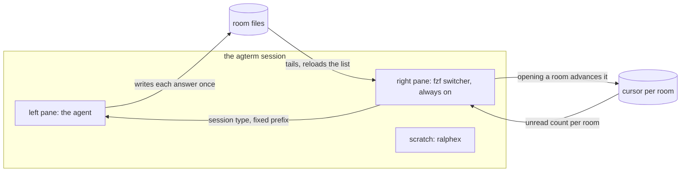

# Chat rooms for one conversation

Split a review conversation into rooms held as files, read them in a live pane, and keep the
main thread carrying one line per room instead of every answer.

## Contents

1. [Why this is worth building](#1-why-this-is-worth-building)
2. [What the design is](#2-what-the-design-is)
3. [Storage layout](#3-storage-layout)
4. [How a room gets opened](#4-how-a-room-gets-opened)
5. [Implementation steps](#5-implementation-steps)
6. [Installing it into the live setup](#6-installing-it-into-the-live-setup)
7. [Deferred: the warm Haiku summariser](#7-deferred-the-warm-haiku-summariser)
8. [Limits this design accepts](#8-limits-this-design-accepts)

## 1. Why this is worth building

Measured over the 60 largest session transcripts, 6884 real user turns, with skill preambles and
system injections filtered out.

- 552 annotation batches. 243 of them carry more than one note, which is 44%. The largest was
  9 notes in one turn.
- Notes are not being lost. Turns where Sasha comes back for a dropped point are 5 out of 6884,
  which is 0.07%.
- Each note gets a thinner answer as the batch grows. The answer per note falls from 2312
  characters when a note arrives alone to about 740 characters in a batch of six or more:

  | notes in batch | batches | answer per note |
  |---|---|---|
  | 1 | 309 | 2312 chars |
  | 2 | 117 | 1310 |
  | 3 | 64 | 1134 |
  | 5 | 17 | 781 |
  | 6+ | 16 | ~740 |

- Median tool calls per batch rise from 2 to 11 over the same range. So the work scales with the
  note count and the writing does not.

The cause is that every answer in a batch competes for one reply. The fix is to give each answer
its own destination, so the competition goes away.

## 2. What the design is

One Claude session, as now. The conversation record is what splits, not the context.



- The agent writes each answer into its room file once. The text passes through the transcript
  exactly as it would have in a chat reply, so this costs no extra tokens.
- The agent never reads a room back. The answer is already upstream in its own context, and a
  re-read would put the whole file in context a second time and carry it for the rest of the
  session.
- The viewer is a separate process reading files. It costs nothing in tokens.
- The main thread keeps one line per room, so the chat stays short without losing anything.

## 3. Storage layout

Extends the layout the `cross-agent-chat` recipe already uses, under the same `XCHAT_HOME`.

```
rooms/<claude-session>/<room-slug>.jsonl   one line per message, appended
rooms/<claude-session>/<room-slug>.cursor  byte offset the reader has seen
msgs/<msg-id>.md                           full bodies, as now
```

Rooms key on the Claude session id, never on the session name, for the reason the existing recipe
already documents: Claude Code rewrites a session's name as the work changes.

Unread count for a room is the number of lines after its cursor. Opening a room in the viewer
writes the cursor forward. That is the whole badge mechanism.

## 4. How a room gets opened

Two triggers.

- **Sasha asks.** A marker in an annotation, or a plain request.
- **The agent routes the batch.** Read every note first, then decide per note whether to answer in
  place or open a room.

The note headers the annotate recipe writes are the units to assess. They are not themselves the
trigger. Splitting on headers alone would open a room per note, and most notes do not want one: in
the session that produced this plan, a "don't want to" reply was one of six notes and deserved no
room at all. A count of headers says nothing about which answers have somewhere to go.

The test for one note: open a room when the answer will run past about a screen AND it has its own
follow-up life. A decision, a rejection or a one-paragraph answer has neither, so it stays inline.

⚠️ This puts a judgment call on the write path, so bias it toward answering in place. Guessing
wrong that way produces a long inline answer, which is what happens today. Guessing wrong the
other way produces an empty room, and a room nobody needed is worse than a paragraph nobody
wanted.

Two consequences for the implementation:

- Assess the whole batch before writing anything. The pointer text for a note that got a room
  differs from a note answered inline, so the routing has to be settled first.
- A batch that wants more than about three rooms is a signal, not a case to handle. It means the
  work should have been a plan document rather than a chat.

### Where a follow-up goes

A room is a thread with turns, not a one-shot answer. So the origin of a question decides where its
answer lands:

- Asked in the main chat, answered in the main chat. A report of work just done is short and has no
  follow-up life, so by the test above it earns no room.
- Asked inside a room, answered in that room.

Without this rule the rooms become dead ends: Sasha reads room three, asks for a change in it, and
the answer appears somewhere else. It also keeps the main chat from decaying into nothing but
pointers, because reports and decisions stay inline by default.

### What can never move to a room

Two kinds of content stay in the main chat whatever the routing says.

- **Anything interactive.** An `AskUserQuestion` option list, or a `TodoWrite` progress list, is
  rendered by the harness and answered by clicking. A room is a file, and a file cannot be clicked.
  The room's only input is the typing path, which carries free text and cannot return a selection.
  So these are conversation-level interface rather than content, and there is no mechanism to move
  them, not merely a preference against it.
- ⚠️ **The question a long answer ends in.** The argument goes to the room, because it is long and
  has its own follow-up life. The question itself stays inline as part of the pointer. Otherwise it
  sits unread in a room while the agent waits for an answer Sasha cannot see without opening it,
  which is a stalled conversation with no visible cause.

Static formatting is the opposite case and moves freely. A markdown table already survives the
viewer: `xchat-read.py:53` matches a leading `|` and line 110 passes the row through unwrapped, so
it reads as raw pipe text with no alignment. A fenced mermaid block is dimmed source. Both are
enough to skim, and opening the room in revdiff draws real tables and the diagram as box art. That
is the same two-tier read the annotate path in task 6 already relies on.

## 5. Implementation steps

The recipe is a new directory, `cookbook/chat-rooms/`, and it is self-contained. It carries its own
copy of `xchat_store.py` rather than importing from `cookbook/cross-agent-chat/`, because recipes
are copied into people's own setups one directory at a time and a cross-recipe import breaks that.
The duplication is deliberate.

There is no unit-test harness in `cookbook/`. Verification follows the pattern the
`cross-agent-chat` recipe already uses, and each task ends with its own narrow check:

- a trial script against a throwaway `XCHAT_HOME` and a fake `XCHAT_SESSIONS_DIR`
- `uvx ruff check --isolated --ignore EXE001` on the Python, and `uvx --from shellcheck-py shellcheck` on the shell
- ⚠️ never a mutating `agtermctl` call on the default socket, in a trial or anywhere else. It
  controls the live terminal. Every write goes to an isolated `AGTERM_STATE_DIR` with a short
  socket path.

### Task 1: Room storage in the store module

**Files:**
- Create: `cookbook/chat-rooms/xchat_store.py`

- [x] copy `cookbook/cross-agent-chat/xchat_store.py` as the starting point, keeping `slug()`, `alive()`, `registry()` and the identity resolution unchanged
- [x] add `rooms/<claude-session>/<room-slug>.jsonl` paths, appending one JSON line per message
- [x] add `rooms/<claude-session>/<room-slug>.cursor` holding the byte offset already read
- [x] name rooms through the existing `slug()`, so a room titled from a note survives spaces, Cyrillic and glyphs
- [x] add an unread count per room, computed as the lines after its cursor
- [x] write a trial script that opens three rooms, appends to each, and asserts the unread counts before and after advancing one cursor
- [x] write a trial case for a room whose title is Cyrillic plus a glyph, asserting the file is readable back
- [x] run the trial script and `ruff check` — both must pass before task 2

### Task 2: Write an answer into a room

**Files:**
- Create: `cookbook/chat-rooms/rooms-write.py`

- [x] add an entry point taking a room name, a body and a summary, called once per room
- [x] append the message to the room and write the full body to `msgs/<msg-id>.md`, reusing the existing id shape
- [x] return the one-line pointer for the main thread, taking the first line as the summary when none is given
- [x] write a trial that writes two rooms and asserts the pointer text and both files' contents
- [x] write a trial for the empty-summary case, asserting the first line is used
- [x] run the trial script and `ruff check` — both must pass before task 3

### Task 3: The live switcher

**Files:**
- Create: `cookbook/chat-rooms/rooms-view.sh`
- Create: `cookbook/chat-rooms/rooms-read.py`

- [x] port the renderer from `cookbook/cross-agent-chat/xchat-read.py`, keeping the ANSI-aware wrapping and the fence, table and indented-code passthrough
- [x] build the viewer as a persistent `fzf`: left list is the rooms with unread counts, preview is the room
- [x] pass `--listen` and start a background loop that watches room file modification times, sending `reload` for the list and `refresh-preview` for the open room
- [x] keep the tab separation the existing viewer relies on and never re-split on spaces, because room names contain them
- [x] ⚠️ export PATH with `$HOME/.local/bin` BEFORE `/opt/homebrew/bin` — the reverse order resolves the plain Homebrew `revdiff` 1.11.1, which has no markdown preview, and task 6 depends on the patched `revdiffm` winning
- [x] write a trial that appends to a room while the viewer runs and asserts the list count and the preview both change with no keypress
- [x] run the trial script, `shellcheck` and `ruff check` — all must pass before task 4

### Task 4: Reading a room advances its cursor

**Files:**
- Modify: `cookbook/chat-rooms/rooms-view.sh`
- Modify: `cookbook/chat-rooms/xchat_store.py`

- [x] advance the room's cursor when it is opened in the viewer
- [x] write a trial asserting the cursor file moves and the unread count drops to zero
- [x] write a trial asserting a room appended to after being read shows a count again
- [x] run the trial script, `shellcheck` and `ruff check` — all must pass before task 5

### Task 5: The inbound typing path

**Files:**
- Create: `cookbook/chat-rooms/rooms-send.sh`

- [x] send what Sasha typed into the agent's pane with `agtermctl session type --pane left --target <session>`, behind a fixed prefix
- [x] write the full text to the room first and put only the pointer on the wire, so the viewer does its own parking and needs no hook on this path
- [x] read the tree before typing and refuse when an overlay or a picker covers the pane, because real keystrokes go wherever focus is
- [x] write a trial against an isolated `AGTERM_STATE_DIR` asserting the refusal fires when an overlay is up
- [x] write a trial asserting the room holds the full text and the wire carried only the pointer
- [x] run the trial script and `shellcheck` — both must pass before task 6

### Task 6: Open a room in revdiff

**Files:**
- Modify: `cookbook/chat-rooms/rooms-view.sh`

- [x] bind a key in the viewer that opens the current room file with `revdiff --only=<room file>`
- [x] the viewer's own preview stays plain: a fenced mermaid block renders as dimmed source, which is enough for skimming
- [x] note in a comment why revdiff is the full-read path: `annotate-extract.py:179` skips every block whose type is not `text`, so a room answer written through a tool call is invisible to the annotate chord, and a room file opened directly needs no extraction at all
- [x] verify the resolved `revdiff` is the patched build, since only that one renders mermaid as box art under `P`
- [x] write a trial asserting the key resolves the right room file path for a room whose name contains a space
- [x] run the trial script and `shellcheck` — both must pass before task 7

### Task 7: The restore hook

**Files:**
- Create: `cookbook/chat-rooms/rooms-restore-hook.py`

- [x] on `SessionStart`, check whether the right pane holds the viewer and open it when it does not
- [x] fail open on every error, matching the existing hook, so a hook fault never breaks a session start
- [x] write a trial against an isolated instance with the pane absent, asserting the viewer is opened
- [x] write a trial with the pane already present, asserting nothing is opened twice
- [x] run the trial script and `ruff check` — both must pass before task 8

### Task 8: README and index row

**Files:**
- Create: `cookbook/chat-rooms/README.md`
- Modify: `cookbook/README.md`

- [x] write the six required headings in the order `cookbook/CONTRIBUTING.md` sets
- [x] document the routing rule, the follow-up rule and the never-moves rule from section 4, because nothing in code enforces any of them and the README is what teaches them
- [x] state plainly that an interactive prompt and the question a long answer ends in both stay in the main chat, since a room cannot return a selection and a question left unread in one stalls the conversation
- [x] document the one required read from section 8: a follow-up arriving in a room that has fallen out of context means reading that one room before answering, because a compact drops answers that left through tool calls
- [x] state the minimum agterm version worked out from the flags the recipe actually uses, not from the version running here, phrased as "X or later"
- [x] record the overlay PATH trap, the `tput cols` reading of 79, and that `overlay open` takes a PROGRAM and not a program plus arguments
- [x] add the index row to `cookbook/README.md` under "Agent status and workflows", alphabetically
- [x] set the executable bit per `cookbook/CONTRIBUTING.md` and leave the imported module non-executable
- [x] run the cookbook CI checks locally — layout, index both directions, kebab-case, six headings, shebangs, `shellcheck`, `ruff check`

### Task 9: Verify acceptance criteria

- [x] verify the answer-per-note problem from section 1 is addressed: a multi-note batch produces rooms only for notes that pass the test, and the rest are answered inline
- [x] verify a follow-up asked inside a room lands in that room, per section 4
- [x] verify the agent never reads a room back, per section 8
- [x] verify no trial or script ever targets the default agterm socket
- [x] run every trial script, `uvx ruff check --isolated --ignore EXE001` and `uvx --from shellcheck-py shellcheck` across the recipe
- [x] confirm `cookbook/chat-rooms/` holds only the README and the scripts, with no `__pycache__` or `.ruff_cache` left behind

### Task 10: Update documentation

- [x] update `cookbook/README.md` prose if the recipe count or the dependency summary changed
- [x] move this plan to `docs/plans/completed/`

## 6. Installing it into the live setup

Sasha lifted the hands-off constraint for the two steps below, so Claude does them rather than
handing them over. They are **not** tasks in the list above, and they are deliberately outside the
unattended run.

⚠️ **These must not run inside the ralphex loop.** Two reasons, and the second one is the hard one:

- `~/.claude/settings.json` affects every session on the machine, and an unattended loop editing it
  has no one watching when it goes wrong.
- Moving the panes means editing `~/.claude/skills/ralphex-pane/SKILL.md`, which is the skill
  orchestrating the run. A loop editing its own orchestrator mid-run is a fault waiting to happen.

Both are done in session after the tasks land, one at a time:

- **Install the `SessionStart` hook** into `~/.claude/settings.json`. Copy the file first, and check
  the result still parses as JSON before finishing.
- **Move ralphex and revmux to scratch** in `~/.claude/skills/ralphex-pane/SKILL.md`, freeing the
  right pane for the chat. A glimpse that the run is working is enough, so scratch being
  full-coverage is fine. Read the skill first: it hands the review to revmux in the same pane after
  the task loop, so both sides of that handover move together.

Not in this plan at all:

- **The chord that opens the viewer**, for when the pane was closed and no session start is due.
  Deferred by Sasha. The `SessionStart` hook covers the normal path, so this is a convenience.
- **Pointing the existing parking hook at the room files**, if the agent-to-agent path should share
  the same storage. Left open because it changes behavior that already works.

Not in this plan:

- **The chord that opens the viewer**, for when the pane was closed and no session start is due.
  Deferred by Sasha. The `SessionStart` hook covers the normal path, so this is a convenience.
- **Pointing the existing parking hook at the room files**, if the agent-to-agent path should
  share the same storage. Left open because it changes behavior that already works.

## 7. Deferred: the warm Haiku summariser

Not in this plan. The first line of a message is the summary, which is what the existing xchat
convention already does, and it costs nothing.

If it comes back later, two measurements from this session decide the shape:

- `claude -p` with Haiku took **9.2 seconds**, and most of that is CLI startup rather than
  inference. Of 1001 parked bodies, 844 are over 1500 characters, so the slow path would be the
  common path and every message would stall about nine seconds. That route is closed.
- ⚠️ A warm agterm session running Haiku fixes the startup cost and introduces a worse one. Every
  summary is a turn in that session, so the session re-reads all previous summaries to write the
  next one. Cost grows with the square of the number of summaries between resets. A daily clean
  is the wrong granularity, because a full day of messages compounds inside it. The warm session
  needs a reset per summary, not per day. With a per-summary reset it is a good option, and the
  process stays warm so the nine seconds do not come back.
- A direct API call to Haiku is about half a second and is genuinely stateless. Whether that is
  available was not checked, because reading credentials was blocked and the answer did not need
  it.

## 8. Limits this design accepts

- **One session is one attention budget.** Rooms make the record separable and let attention go to
  one thread at a time. They cannot give two answers genuinely independent reasoning. That needs
  separate sessions, and separate sessions do not hold this conversation's history, which is what
  most annotations are about.
- **The token saving is modest.** The same answer text is written once either way. The chat gains
  a short index in place of the full answers, which is a real but small saving. The win is
  attention per note. It should not be sold as a cost cut.
- **A message injected by typing has no envelope, and that is the point.** The cross-session
  socket wraps a message in `<cross-session-message from="uds:...">`, which comes from Claude Code
  itself and cannot be stripped by a hook, because the parking hook rewrites the body and never
  sees the wrapper. Typing gives full control of every character. The cost is that keystrokes go
  wherever focus is, which task 5 guards.
- **The viewer must never make the agent re-read.** If the design ever grows a step where the
  agent polls rooms to stay current, every room becomes a recurring tax on the rest of the
  session. Checking whether a room moved is fine; polling and ingesting is not.
- ⚠️ **One exception, and it is required rather than allowed.** When a follow-up arrives in a room
  whose contents are no longer in context, read that one room before answering. A compact drops
  the room answers, because they left through tool calls rather than as reply text, so without
  this the agent answers a thread it does not remember writing. It is one bounded read of one
  file on arrival of a follow-up, which is the opposite of polling: the rule above forbids reading
  to stay current, and this requires reading to stay correct.
