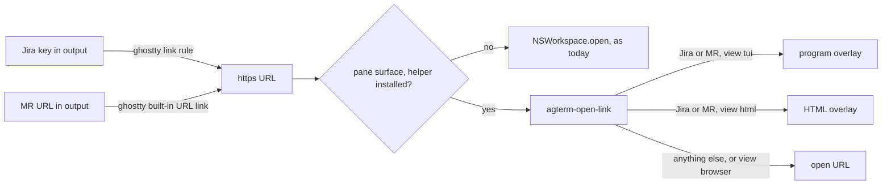

# Clickable Jira keys and GitLab MR links — spec

## Contents

- [Problem](#problem)
- [What the user does](#what-the-user-does)
- [Design](#design)
- [The helper](#the-helper)
- [Views](#views)
- [Outcomes](#outcomes)
- [Security boundary](#security-boundary)
- [Tests](#tests)
- [Out of scope](#out-of-scope)
- [Open points](#open-points)

## Problem

Agents and tools print Jira keys (`MGNLPN-823`) and GitLab merge request URLs
(`https://gitlab.magnolia-platform.com/group/proj/-/merge_requests/123`).
A Jira key is plain text, so nothing is clickable.
An MR URL is clickable, but it always opens the browser, which leaves the terminal for a quick look.

The file-path work (`docs/plans/completed/20260929-clickable-file-paths-spec.md`) already gives the shape:
the click reaches a script in agterm-agents, and the script picks the viewer.

## What the user does

1. Click a Jira key or an MR URL with the same chord as a file path (Shift+Cmd+click in agent panes).
2. By default the item opens in a terminal view in an overlay over the pane:
   the summary, status, description and comments, rendered as Markdown.
3. `q` closes the overlay. The view's last line is the item's URL; clicking it opens the browser.
4. Any other URL opens in the browser, as today.

Per kind, a config line switches the default to `browser` or `html` (a rendered page in the HTML overlay).

## Design



**Jira keys become links through ghostty config only.**
The fork's `patches/ghostty/0002-link-config.patch` supports templated rules; one line in
`~/.config/agterm/ghostty.conf` beside the xchat rule:

```
link = open:https://magnolia-cms.atlassian.net/browse/$0,\b[A-Z][A-Z0-9]+-[0-9]+\b
```

The click then arrives as an ordinary `https` URL, so Jira needs no Swift change of its own.
The pattern also matches `UTF-8` or `SHA-256` (the choice made for this spec); ghostty underlines only on hover,
and Jira answers "does not exist" for such a key (see Outcomes).
A key inside a URL is not matched twice: ghostty's built-in URL link is checked before user rules
(`.claude/rules/libghostty.md`, the `link` section).

**MR URLs are caught after the click.**
A user rule cannot claim an MR URL, since the built-in URL link wins.
So the fork routes every `http`/`https` click from a pane to the helper when it is installed.

**Swift change, in the fork.**
- `OpenLinkLaunch` in `agtermCore`, next to `OpenPathLaunch`:
  - `handles(_ url: URL) -> Bool`: true for `http` and `https` only;
  - `arguments(url:session:pane:socket:)`: `--target <session uuid> [--socket S] [--pane left|right] -- <url>`.
    No `--cwd`: nothing is resolved against a directory.
- `openLink`, the `.open(url)` case: when `handles(url)` and the surface has a session, run `agterm-open-link`
  through `runAgentHelper`; otherwise, or when the helper is not installed, `NSWorkspace.shared.open(url)`.
  `runAgentHelper` returns whether it launched, so the fallback needs no second lookup.
- `LinkPolicy` decides nothing new; its header comment says `.open` may go through the helper.

**Clicks inside a view open the browser.**
Overlay surfaces carry no session (only a pane's surface is wired to one), so a URL clicked in a TUI view
takes the no-session branch to `NSWorkspace`.
The HTML overlay handles its own link clicks and hands them to the system browser.
So a view never opens a second view, and its last line is a plain URL.

A helper that is installed but fails would leave the click with no effect.
The helper therefore wraps its whole body and runs `open <url>` on any unexpected error.

## The helper

`bin/agterm-open-link` in agterm-agents, Python like `agterm-open-path`, installed to `~/.local/bin`.

- Classifies the URL with `urlparse`; the host is `hostname` (lowercased, port and userinfo dropped),
  compared exactly:
  - **Jira**: host equals `jira.host`, path `/browse/<KEY>` with `KEY` matching `^[A-Z][A-Z0-9]+-[0-9]+$`.
  - **MR**: host in `gitlab.hosts`, path matching `^/(.+?)/-/merge_requests/([0-9]+)(/.*)?$`.
    Tabs such as `/diffs`, a query or a fragment still name the MR.
    The helper keeps only the host, the project path and the number, and rebuilds the canonical URL from them.
  - **Other**: everything else.
- Config `~/.config/agterm/open-link.conf`, `key = value` lines:
  ```
  jira.host = magnolia-cms.atlassian.net
  jira.view = tui
  gitlab.hosts = gitlab.magnolia-platform.com
  gitlab.view = tui
  ```
  Missing file or key: the defaults above. `view` is `tui`, `html` or `browser`; any other value means `tui`.
- Reuses the `agterm-open-path` pattern: `ctl()` with `--socket`, the HUD with `--hide-after 4`,
  and a one-shot wrapper script under `~/.local/state/agterm-open-link/` handed to `session overlay open`.
- Every fetch runs in the helper, before the overlay opens, with a 10 second timeout.
  A HUD `Fetching <item>…` is up meanwhile; the helper closes it before opening the view or falling back.
- Each view is written to a file under `~/.local/state/agterm-open-link/`; on start the helper deletes files there
  older than one day.
- Remote panes: `acli` and `glab` run on the Mac, whatever the pane is attached to, and both overlay opens
  pass `--resolved`, so a mirrored row's overlay redirect never runs the local wrapper over ssh.
- View and pandoc input files are unique per run (`mkstemp`, stem capped at 100 characters): two clicks can run
  at once, and `safe_name` folds `group/sub-proj` and `group-sub/proj` into one stem.

## Views

**Browser.** `open <url>`.

**TUI, MR.** `glab mr view <url>` reads the current directory's git remotes before the URL, and fails
outside a GitLab checkout (measured: "None of the git remotes configured for this repository point to a known
GitLab host"). The helper therefore passes the parts:
`glab mr view <number> -R https://<host>/<project> --comments` (measured working from a non-GitLab directory).
The URL form matters: glab reads a bare `<host>/<project>` as a gitlab.com group when it is not logged in to
`<host>`.
The helper runs it itself with `GLAB_PAGER=cat` and the timeout, so a 404, a missing glab or a timeout reaches
the Outcomes table like any Jira failure.
It strips control bytes from the output, appends the canonical URL, writes the view file,
and the overlay runs `less -R <file>`, which stays up until `q`.

**TUI, Jira.** `acli jira workitem view KEY` in plain mode drops the comments
(measured on `MGNLPN-823`: the description shows, its 6 comments do not), and its `--json` carries them.
So the helper fetches `--json` with `summary,status,assignee,description,comment`,
converts the ADF description and comments to Markdown itself, writes a temp `.md`,
and the overlay runs `glow -p <file>` with `PAGER='less -R'`.
The ADF converter covers paragraphs, headings, bullet and ordered lists, code blocks, block quotes,
links, mentions, and the inline marks `strong`, `em`, `code`, `strike`; any other node falls back to its text.
The file ends with the browse URL.

**HTML.** The same Markdown (Jira), or for an MR the `glab mr view … -F json` fields (title, state, author,
description) plus the `--comments` text, converted with
`pandoc --standalone` reading Markdown with raw HTML and every attribute syntax off
(`-raw_html-raw_attribute-bracketed_spans-fenced_divs-header_attributes-link_attributes-inline_code_attributes-fenced_code_attributes-yaml_metadata_block`),
with a header carrying
`<meta http-equiv="Content-Security-Policy" content="default-src 'none'; style-src 'unsafe-inline'">`,
and shown with `session overlay open --html <file>`.
A live Jira or GitLab page in the overlay is not possible:
the overlay's web view is `.nonPersistent()` (no login cookies) and cancels the cross-origin redirects SSO needs.

## Outcomes

| case | result |
|---|---|
| Jira or MR, view `tui` or `html` | the view in an overlay over the clicked pane |
| view `browser`, or any other URL | the browser |
| Jira key Jira does not know (`UTF-8`) | HUD `Not in Jira, or no access: UTF-8`, hides after 4 s |
| MR that does not exist | HUD `No such merge request: <project>!<n>`, hides after 4 s |
| either not-found HUD refused (a program overlay holds the slot) | the browser |
| `acli` / `glab` not installed | the browser, plus a HUD naming the tool |
| fetch fails otherwise (auth, network, timeout) | the browser |
| helper not installed, or the click came from an overlay | the browser, from Swift |
| helper crashes | the browser, from the helper's catch-all |

Measured failure shapes, used by the tests:
- `acli jira workitem view UTF-8 --json` and `… ZZZQX-1 --json`: exit 1, stderr
  `✗ Error: Issue does not exist or you do not have permission to see it.`
  Jira gives the same answer for a missing key and a hidden one, so the HUD says both.
- `glab mr view 99999 -R https://<host>/<project>`, with `-F json` and with `--comments`: exit 1, stderr contains
  `404 Not Found`.
- The HTML MR view makes two glab calls, so its worst case waits twice the timeout.

## Security boundary

- The URL is terminal output, so it is untrusted.
  Swift passes it as one argv element after `--`, never through a shell, as with file paths.
- The helper only ever hands the browser an `http`/`https` URL; it re-checks the scheme before `open`.
- `acli` gets the key only after the anchored key pattern.
  `glab` gets the number, and a project path that matched the pattern, only for a host in `gitlab.hosts`.
  A URL on any other host never reaches either tool.
- The overlay command is a shell line, so every value in it is built with `shlex.quote`.
- Fetched text is untrusted too:
  - every fetched text, the Jira converter's output and the captured glab output alike, is stripped of C0
    control characters except newline and tab, and of all C1 controls;
    this matters because `less -R` (version 668 here) passes colour and OSC 8 hyperlink sequences, so unstripped
    text could draw fake links or reach OSC 52 through the pager;
  - pandoc reads Markdown with raw HTML, attribute syntax and YAML metadata off, so a description cannot inject
    frames, refreshes, `style=`/`on…=` attributes (`[x]{style=…}` would otherwise draw a fake panel), or a
    metadata block that swallows the text after a `---` line;
  - the page's Content-Security-Policy `default-src 'none'` stops Markdown images and any other subresource
    from loading, since the overlay's navigation policy only rules on page loads;
    the page is shown without `--js`.

## Tests

- Fork, `agtermCore`: `OpenLinkLaunch.handles` (http, https, mailto, ftp) and its argv (plain, split pane,
  socket), in the style of `OpenPathLaunch`'s tests.
- Fork, app: the helper-or-`NSWorkspace` choice in `openLink`; checked by hand in a Debug instance.
- agterm-agents, `tests/test_agterm_open_link.py`, stubs for `agtermctl`, `acli`, `glab`, `glow`, `pandoc`, `open`
  as in `test_agterm_open_path.py`:
  - URL classification, host spoofing (`user@host`, `:port`, upper case, a lookalike host) and the canonical MR URL;
  - each view per kind builds the expected overlay or `open` call;
  - ADF to Markdown on a fixture trimmed from a real `acli --json` answer, including control-byte stripping;
  - control bytes in stubbed glab output do not reach the MR view file;
  - pandoc called with raw HTML off and the CSP header;
  - the fetching HUD is closed on every path; old view files are removed;
  - not found, tool missing, fetch failure and timeout outcomes, using the measured failure shapes.

## Out of scope

- GitLab issues, pipelines and commits; Jira filters and boards. The classifier is the extension point.
- The MR diff (`glab mr diff`).
- Any upstream agterm change: this is fork plus agterm-agents only.

## Open points

- The generic key pattern underlines `UTF-8`, `SHA-256` and `GPT-4` on hover.
  If that is noisy in practice, the rule switches to a list of project keys; nothing else changes.
- Whether `glab mr view` styles comments as Markdown is unverified; if not, the MR TUI view could use the
  same JSON-to-Markdown-to-`glow` route as Jira.
- Every web link now starts Python before the browser opens; Task 6 of the plan measures the delay.
