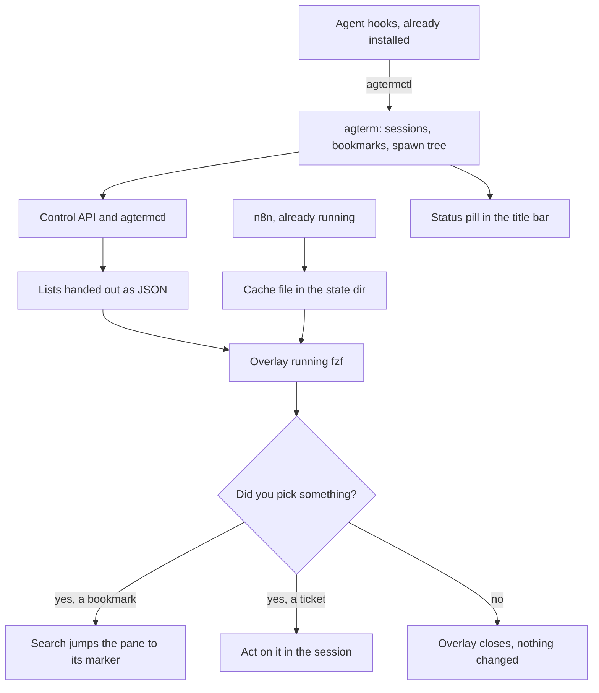

# agterm fork — roadmap for five features

## Contents

1. [Context](#1-context)
2. [The decision that reshaped this roadmap](#2-the-decision-that-reshaped-this-roadmap)
3. [What the code already gives us](#3-what-the-code-already-gives-us)
4. [The five ideas, resized](#4-the-five-ideas-resized)
5. [Status pill: replacing the bell](#5-status-pill-replacing-the-bell)
6. [Bookmarks: the turn marker solves three problems at once](#6-bookmarks-the-turn-marker-solves-three-problems-at-once)
7. [Session spawn tree: park it and trace it](#7-session-spawn-tree-park-it-and-trace-it)
8. [Jira and GitLab: n8n writes, an overlay reads](#8-jira-and-gitlab-n8n-writes-an-overlay-reads)
9. [The shared gap: identifying the calling session](#9-the-shared-gap-identifying-the-calling-session)
10. [Recommended order](#10-recommended-order)
11. [Rebase and documentation cost](#11-rebase-and-documentation-cost)
12. [Still open](#12-still-open)
13. [What happens next](#13-what-happens-next)

## 1. Context

Five ideas for the fork: a status summary shown when the sidebar is collapsed (raised as a top bar
status, and settled in section 5 as a pill beside the existing ones instead),
conversation bookmarks, a session spawn tree, a Jira widget, and a GitLab merge request widget.

This document settles their real size and their order after one round of review. It is the
roadmap only. Each feature still gets its own spec, its own plan, and its own execution run.

## 2. The decision that reshaped this roadmap

You answered "which chrome?" with **a command and an overlay**, and answered the bookmark picker
with **an overlay, a hub fzf view**. That is not a detail. It is the architecture, and it changes
what most of this work even is.

The model: **agterm owns the data and the commands. The views are terminal programs opened in
overlays.** It is exactly how you already use `revdiff`, `fzf` and `htop` in overlays today.

What follows from it:

- Jira and GitLab need **no new app UI at all**. No file watcher, no titlebar pill, no popover.
  n8n writes a cache, a script reads it, `agtermctl session overlay open` shows it in fzf.
- Browsing bookmarks needs no app UI either. It needs a command that lists bookmarks as JSON. The
  overlay does the rest.
- The earlier draft's biggest item — a Jira widget as a new Swift subsystem with network,
  credentials and a scheduler — is gone. So is the Option A / Option B argument that filled a
  section.

⚠️ The honest consequence: **most of the Jira and GitLab work does not belong in this repo.** It
is an n8n workflow and a shell script. That is good news for the fork's rebase burden and it means
those two ideas stop being the expensive ones.

- The app never crosses a process boundary of its own. n8n reaches the network, the hooks reach
  the app, and the app hands out lists.
- ⚠️ n8n is yours to keep alive. Nothing in the repo will tell you the cache stopped updating, so
  the cache file needs to carry its own timestamp and whatever reads it has to show staleness.

## 3. What the code already gives us

- **The attention bell exists and you have already ruled it out.** It is opt-in and off by default
  (`settings.attentionButtonEnabled ?? false`, `agterm/SettingsModel.swift:670`), which is why you
  could not find it. It is three states with no count
  (`agterm/Views/WindowContentView+RecentSessions.swift:118`). You said the bell is noise in
  collapsed-sidebar mode, so the requirement for the pill is now pinned rather than guessed.

- ⚠️ **The pills are no longer in the title bar, and the "sidebar is collapsed" behavior already
  exists.** `chromePills` is still defined in `WindowContentView+Titlebar.swift:165`, but nothing
  in the title bar renders it any more. It renders in the sidebar footer while the sidebar is up
  (`agterm/Views/WindowContentView.swift:681`), and as `floatingPillsLayer` in the bottom-trailing
  corner over the terminal whenever it is not
  (`agterm/Views/WindowContentView.swift:429-434`). So a status pill that joins `chromePills`
  inherits exactly the behavior you asked for, for free. See section 5 — this changes where the
  feature appears.

- **The right predicate is `sidebarOnScreen`, not `sidebarVisible`.** Zoom and the dashboard leave
  the footer row mounted but invisible, and `floatingPillsLayer` takes over there. The code
  comment at `agterm/Views/WindowContentView.swift:676-679` says gating both on the one predicate
  is what keeps exactly one copy of each pill in the view tree.

- **The aggregate behind it is solid and reusable.** `AppStore.attentionSessions`
  (`agtermCore/Sources/agtermCore/AppStore+Status.swift:58`) spans every workspace in the window,
  deliberately ignores the sidebar filter, and sorts blocked → active → completed then newest
  first. The pill can read it unchanged. Nothing anywhere counts the statuses separately.

- **Turn boundaries already reach agterm.** The installed Claude Code hooks fire on
  `UserPromptSubmit`, `PostToolUse`, `Stop` and permission prompts
  (`agtermCore/Sources/agtermCore/AgentHooksInstall.swift:49-53`); Codex has its own six (line
  58-65). Every hook script already addresses the right session by reading its own environment and
  passing `--target "$AGTERM_SESSION_ID"`
  (`agterm/Resources/agent-status/agterm-agent-status.sh:46`).

- **Scrollback is readable and searchable from the control API.** `session.text` returns a pane's
  buffer, screen or screen plus scrollback (`agterm/Control/ControlServer+SurfaceIO.swift:215`),
  and `session.search` drives libghostty's real search with step to next and previous
  (`agterm/Control/ControlServer+SurfaceIO.swift:345`).

- **"Park" already has a verb.** `session.background`
  (`agtermCore/Sources/agtermCore/ControlProtocol.swift:29`) is the existing state, so parking a
  subtree means applying an existing command across a set, not inventing a new state.

- **The HUD is the toast mechanism.** `session.hud.*` renders a caller-supplied panel and
  `hud.sh` manages its own lifetime and exit, so a panel that shows for a second and leaves is
  what the helper already does. ⚠️ It shares the session's single overlay slot, so `openHud`
  answers `overlay already open` when an overlay is up
  (`agterm/Control/ControlServer+Hud.swift:26`). For a confirmation toast that is acceptable — it
  fails harmlessly — but the bookmark command must not depend on the toast succeeding.

- **`notify` is the wrong tool for the toast.** It is a desktop notification and it bumps the
  session's unseen badge (`agtermCore/Sources/agtermCore/ControlProtocol.swift:68`, `:612`).
  Confirming a bookmark should not mark the session unseen.

- **Only two code paths build a `Session`.** `AppStore.addSession`
  (`agtermCore/Sources/agtermCore/AppStore.swift:400`) and snapshot restore
  (`agtermCore/Sources/agtermCore/AppStore+Snapshot.swift:66`). Split, scratch and overlay are
  extra surfaces on the same session. So a spawn tree has exactly one place to record a parent,
  and snapshot persistence already absorbs new optional fields through its lossy custom decoder,
  so no migration is needed.

- **The fork is 106 commits, 169 files, +17160 / -381**, with three whole-subsystem precedents:
  normal mode, overlay redirect, and native zmx wrapping. All three put host-free logic in its own
  `agtermCore` file and keep the app target a thin adapter.

## 4. The five ideas, resized

| idea | needs Swift | size |
|---|---|---|
| Status pill | yes, all of it | small, and fully specified now |
| Bookmarks | capture, store, dedup, list command, toast | medium; browsing is an overlay |
| Spawn tree | parent field, park-subtree action | small; tracing view is an overlay |
| Jira | almost none | n8n workflow plus a script |
| GitLab | almost none | the same, second source |

## 5. Status pill: replacing the bell

⚠️ **Settled: it will not be in the top bar.** The chrome pills left the title bar in the landed
`chrome-pills-to-sidebar-footer` work. Today they sit in the sidebar footer, and float in the
bottom-right corner over the terminal when the sidebar is not on screen. The status pill joins
`chromePills` and appears bottom-right, next to NORMAL and OVERLAY, in exactly the case this
feature is for. Despite the idea's original name, nothing goes in the top bar.

Your answers pin every other open question except one.

- **It replaces the bell.** The bell may stay available on demand behind its existing
  `attentionButtonEnabled` setting, so nothing is taken away from anyone who wants it.
- **It shows counts**, which is the thing the bell never had.
- **Gating follows the overlay-redirect pill**, not a new `InterfaceElement` and Settings entry.
  That pill's own comment explains the principle: it needs no toggle because it is already gated
  on the one condition that makes it mean anything. Here that condition is the sidebar being
  hidden.
- Still open: window-scoped like `attentionSessions`, or app-wide like the Dock badge. See
  section 12.

Nothing new is needed in `agtermCore` beyond one computed property that counts by status. The
view is one more pill inside `chromePills` (`agterm/Views/WindowContentView+Titlebar.swift:165`),
copying `overlayRedirectPill` at lines 200-217 of the same file — including its `TimelineView`
clock, if the pill ever needs to react to time rather than to state.

Because `chromePills` is already gated on `sidebarOnScreen` at both of its render sites, "show
this only when the sidebar is not on screen" needs no new condition at all. The pill is either
always in the group, or it carries its own extra predicate on top.

## 6. Bookmarks: the turn marker solves three problems at once

You proposed writing a marker at the start of every turn. That single idea answers the three
things this feature was missing.

1. **The anchor.** The earlier draft's one real risk was that search matches text, not turns, and
   a prompt's first line is not unique. A marker written at turn start is unique by construction,
   so `session.search` can jump straight to it.
2. **Dedup.** You asked for it, and the marker is the identity that makes it possible. Bookmarking
   the same turn twice resolves to the same marker, so the second call updates instead of adding.
3. **Choosing from recent turns.** A ring of markers per session is the list you pick from.

You also said the captured text is always enough context on its own. That demotes the search jump
from a requirement to a bonus: if scrollback has rolled past the marker, the bookmark still shows
its stored text and nothing is lost.

Settled by your review:

- **Scope: per session**, with a hub view that browses across sessions and a shortcut that jumps
  to the current session's bookmarks.
- **Persistence: yes.** Bookmarks live beside the existing snapshots.
- **Picker: an overlay**, running fzf over a list the control API hands out.
- **A session that goes away takes its bookmarks with it.** Ditched, not orphaned.
- **A brief HUD toast confirms the add.**

⚠️ The one open design question is how the marker physically gets into the pane. A Claude Code
`UserPromptSubmit` hook's stdout goes to the agent's context, not to the terminal, so the marker
needs a deliberate route — writing to the tty, or a control command that records the position
without printing anything visible. The invisible option is better if it works, because a visible
marker on every single turn is scrollback noise forever. This is the first thing the bookmarks
brainstorm has to settle.

## 7. Session spawn tree: park it and trace it

You named two uses, and they are enough to justify the field.

- **Park a whole tree or subtree.** `session.background` already exists as the state, so this is
  one new action that walks the tree and applies an existing command. This is the concrete payoff.
- **Visualise it, to trace the history of actions.** Consistent with section 2, the tracing view
  is an overlay reading the tree from the control API, not new app UI. The tree is already exposed
  through `tree --json`; it just needs the parent field added to `ControlSessionNode`.

The `offload-session` flow, which already launches peer sessions into the same workspace, is the
first consumer.

Still open: what happens to a child when its parent closes. See section 12.

## 8. Jira and GitLab: n8n writes, an overlay reads

**The writer is n8n.** It already runs and already talks to the agterm API, so its scheduling and
retry are somebody else's problem.

**Relevance is a mention in a session, plus an action on it.** A ticket key appearing in a
session's output makes that ticket relevant to that session. `session.text --all` reads the buffer
the rule needs, so the scan can live in the n8n workflow with no app change at all.

**A second relevance signal: the Jira pages you actually visited.** Reading browser history for
Jira and GitLab URLs would catch tickets you looked at but never typed. Chrome keeps this in a
local SQLite file that n8n can read directly, so try that before building a Chrome extension — an
extension is a whole separate artifact to install, sign and maintain, and the history file may
answer the same question for nothing.

**GitLab shows two ways.** Merge requests linked from a Jira item appear on that item; the merge
requests you have been working on also get their own list. Both are views over the same cache, and
which one you reach for is a keybinding, not an architecture.

⚠️ There is no app work here at all beyond possibly a keymap entry. If that holds after the
brainstorm, these two ideas leave this repo entirely and become an n8n workflow plus a script in
your own tooling.

## 9. The shared gap: identifying the calling session

The convention exists but is not automatic. Every shipped hook script reads `AGTERM_SESSION_ID`
and passes `--target` explicitly, while `agtermctl` itself never reads that variable
(`agtermCore/Sources/agtermctlKit/Commands.swift:17-53`) and the socket does no peer-credential
lookup. A caller that forgets `--target` silently addresses the active session instead of its own,
a failure the bundled skill already documents
(`plugins/agterm/skills/agterm/troubleshooting.md:164-174`).

The choice in one line: make `--target` default to `$AGTERM_SESSION_ID`, or add a separate origin
field that never changes existing behavior.

- Defaulting `--target` fixes the forgetting problem everywhere at once, and changes what every
  existing command does when called from inside a session with no target — today the active
  session, tomorrow the calling one. That is a behavior change across the whole command surface,
  in a fork that must survive rebases onto an upstream that did not make it.
- An origin field changes nothing that works today. `agtermctl` stamps the value as metadata, a
  feature reads it where it wants it, and every command that ignores it behaves as before.

⚠️ Recommendation: **the origin field**, on the principle that new information should arrive as an
addition and never as a changed default in a codebase whose upstream we do not control.

It matters most for the spawn tree, which cannot infer a parent and can only be handed one.

## 10. Recommended order

1. **Status pill.** Smallest, and the only one whose requirements are fully pinned. Replaces the
   bell, shows counts, appears when the sidebar is hidden.
2. **Bookmarks.** The marker route has to be settled first, but everything downstream of it is
   ordinary.
3. **Origin field on the control request.** Small, and it unblocks the next item.
4. **Session spawn tree.** Parent field, park-subtree action, parent exposed in `tree --json`.
5. **Jira, then GitLab.** Mostly or entirely outside this repo. Start with the n8n workflow and
   the mention-scan, and only come back to the fork if something genuinely needs app support.

The pill moved back ahead of bookmarks because your review turned its requirements from unknown
into known. Bookmarks still carries one unsolved design question, and building the known thing
first is cheaper than building around an open one.

## 11. Rebase and documentation cost

- Fork-only commands stay out of the bundled skill, `site/commands.html` and `README.md`. The
  skill pins an upstream command count that `SkillInstallTests` checks, so adding a fork command
  there breaks the test. These features get their own `.claude/rules/*.md` instead, following
  `overlay-redirect.md` and `zmx.md`.
- The files that collide most on rebase, per `.claude/rules/fork-rebase.md` and the fork
  diffstat: `ControlProtocol.swift`, `ControlDispatcher.swift`, `AppStore.swift`, and
  `WindowContentView+Titlebar.swift`. Each remaining feature touches at least one.
- So keep every feature's logic in its own new `agtermCore` file, the way `OverlayRedirect.swift`
  and `NormalModeState.swift` did. Then a rebase conflict lands on a small shared edit and never
  on the body of the feature.
- Section 2 is worth a second look here: the more of this that lives in n8n and scripts, the less
  of it can ever conflict.

## 12. Still open

Two questions, both small enough to settle at the start of their own brainstorm rather than now.

- **Status pill scope**: window-scoped like `attentionSessions`, or app-wide like the Dock badge?
  Window-scoped is the cheaper answer and matches the aggregate that already exists.
- **Orphaned children in the spawn tree**: when a parent closes, does a child get re-parented,
  orphaned, or closed with it? Note that "park the subtree" works under any of the three, so this
  does not block the main use case.

And one question carried forward as the first task of the bookmarks brainstorm: how the turn
marker gets into the pane without becoming permanent scrollback noise.

## 13. What happens next

This roadmap is not an implementation plan and nothing here is ready to execute.

Next step: brainstorm the status pill on its own, produce its spec, then its plan, then hand it to
ralphex.

The other four stay in this document until their turn comes.

Verification for this step is only that the roadmap is committed and readable: no code changes,
no gates to run.
